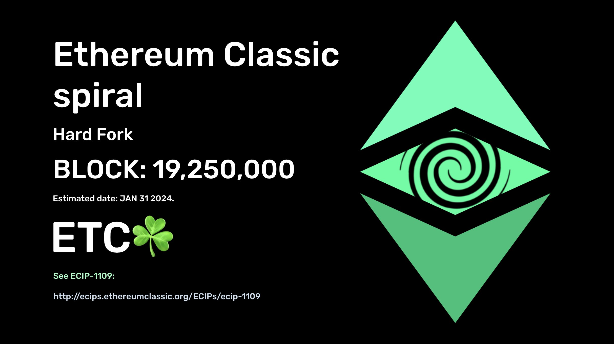

In a recent [community call](https://www.youtube.com/watch?v=psEzr2SmUpo) on [Discord](https://ethereumclassic.org/discord), developers from [Ethereum Classic Cooperative](https://etccooperative.org/) announced the activation block for Ethereum Classic's upcoming [Spiral Hard Fork](https://ecips.ethereumclassic.org/ECIPs/ecip-1109). 

The Spiral Upgrade will be activated on **block 19,250,000**, which is estimated to arrive **January 31st 2024**. 

**Miners, exchanges and all node operators are encouraged to keep their software updated to the [latest version](https://github.com/etclabscore/core-geth/releases/) of core-geth *before* the activation block to ensure a smooth transition.**

A service has been published to monitor adoption of the new client software at https://etcnodes.org/fork/spiral.

Similar to previous upgrades on Ethereum Classic, the Spiral Hard Fork is a compatibility update that includes technical changes to a number of OPCODEs relevant to the network. The Spiral Upgrade will bring the ETC Network to parity with upstream EVM standards, facilitating contract development and migration.

[MESS (ECBP1100)](https://ecips.ethereumclassic.org/ECIPs/ecip-1100) is also scheduled to deactivate coincidentally with the Spiral hard fork.

The technical specification of Spiral can be found at https://ecips.ethereumclassic.org/ECIPs/ecip-1109.
