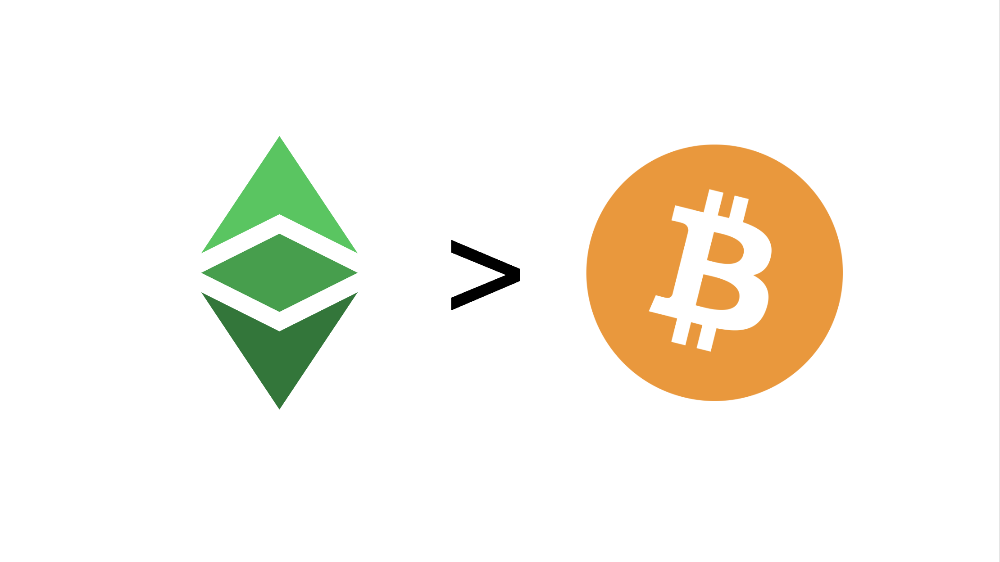

---
**You can listen to or watch this video here:**

<iframe width="560" height="315" src="https://www.youtube.com/embed/tpdWrqj6_Z0?si=2TpJE1ij2uHXBgg-" title="YouTube video player" frameborder="0" allow="accelerometer; autoplay; clipboard-write; encrypted-media; gyroscope; picture-in-picture; web-share" allowfullscreen></iframe>

---

There is a new smart contract technology called BitVM that [claims](https://blog.bitfinex.com/education/is-bitvm-the-next-evolution-for-smart-contracts-on-bitcoin/) to run smart contracts on Bitcoin (BTC) but it doesn’t.

The suffix “VM” refers to “virtual machine” to imitate the name of the analogous technology in Ethereum (ETH) and Ethereum Classic (ETC) called the “Ethereum Virtual Machine” also known as the EVM.

There have been several attempts at falsely claiming to add smart contracts or other features to Bitcoin via what are called “layer 2” systems. Some of these were [Rootstock](https://rootstock.io/), [Liquid](https://liquid.net/), [Stacks](https://www.stacks.co/), and [Lightning Network](https://lightning.network/). All largely unused systems by the public.

In this post we will explain why layer 2 (L2) systems in Bitcoin, that claim to add programmability to it, will never be as secure as smart contracts in ETC.

## What Are Layer 2 Systems?

BitVM promoters and explainers commit the fallacy that this system enables people to “run complex contracts on Bitcoin” or that the dapps are “[secured by Bitcoin](https://twitter.com/chainway_xyz/status/1707824233017962761)”. So, they are basically spreading a similar falsehood as when proof of stake (POS) promoters say that POS is as secure or more than proof of work (POW)!

Just as proof of stake will never be as secure as proof of work, smart contract layer 2 systems on Bitcoin will never be as secure as layer 1 (L1) smart contracts as in ETC.

But, what are layer 2 systems?

The first clarification is that layer 1 systems are the base network itself, in this case Bitcoin or ETC. Anything outside is not L1, it may be L2, L3, L4, etc.

As Bitcoin is not programmable inside its highly secure proof of work system because of particular problems in its design, then these external mechanisms, known as layer 2’s, must be created to add features to it. 

Some features may be programmability through smart contracts and others may be just more transaction output per unit of time, also called scalability.

It is precisely because these systems are not inside Bitcoin that they are not secure.

To truly add smart contracts to Bitcoin, the only way is to do a complete reformation of the system and to transform it into Ethereum Classic!

## How Do L2 Systems Add Smart Contracts to Bitcoin?

If we include the innovation of BitVM we could say there are currently 3 types of layer 2 systems that may execute software programs outside of Bitcoin and then move funds inside BTC.

**Merged Mining:** Rootstock (RSK), for example, is a parallel smart contracts network to Bitcoin, where some miners in Bitcoin also mine the blocks of RSK. In this system users may send BTC to an account held by miners in Bitcoin and then they will issue a token inside RSK called RBTC that represents the bitcoins held in custody. However, this system needs the subjective agreement of these miners, which are a subset of the mining base of Bitcoin, to keep maintaining the system and to return the coins back on the Bitcoin network when users wish to withdraw them.

**Federations:** Liquid, on the other hand, is also a parallel smart contracts network that uses a similar system with trusted third parties who have agreed to maintain it. In this case they are not miners but a set of trusted entities such as exchanges, trading desks, infrastructure companies, game developers, and more. This federation of trusted third parties move BTC from the Bitcoin network to Liquid and back in the same way as miners in RSK. The BTC backed token issued inside the Liquid network is called L-BTC.

**Channels:** BitVM and Lightning Network use what are called “channels” (BitVM doesn’t call them that, but they are) which are external pairings of participants who agree to deposit a set amount of BTC inside Bitcoin and then they deal off the network, transacting between themselves off-band, and every now and then they may send a transaction to the Bitcoin blockchain to withdraw their coins. In the case of BitVM they do it to power smart contracts in their system and in the case of Lightning Network they do it to increase scalability.

In all cases above, all these smart contracts and scaling features are outside of Bitcoin, meaning that they are not secured by the Bitcoin blockchain itself. Therefore, they have to use risky connections and contraptions to associate their systems and money to BTC, making them orders of magnitude less secure.

## How Do Smart Contracts Work in Ethereum Classic?

The difference of Ethereum Classic is that the accounts and balances, the digital gold, the smart contracts, and the EVM are all inside the secure environment of the ETC blockchain!

It is as simple as that. 

Users do not have to create channels, federations, merged mining contraptions, or make deposits in different chains, relying on insecure connections, to use applications on ETC.

On top of this, ETC is a proof of work blockchain which makes it truly decentralized. All other external systems are centralized an capturable one way or another.

## In the End, Layer 2 Systems Could be Just Cloud Services

Upon further analysis, the fact that Bitcoin does not support smart contracts means that any type of software application will always have to reside outside its highly secure proof of work environment.

In the end, this is very similar to just using cloud services. In fact, cloud services, being centralized, scalable, and highly performant, (and that things can be easily fixed if they go wrong) may be better alternatives than the attempts described in this post to “add smart contracts to Bitcoin”.

As the L2 external systems are as capturable and centralized as corporate data centers, but at the same time less efficient, it is only natural that people will continue to use cloud services. 

## Why Are ETC Smart Contracts Better than Bitcoin Smart Contracts?

The security of Ethereum Classic is unrivaled because all the components to run decentralized applications are inside its highly secure proof of work system.

On top of that, any system that is divided in layers and separated components cannot be composable. 

Composability, the ability to execute multi-application transactions in one execution, is a major advantage of an integrated system as ETC.

Composability reduces settlement times, frictional costs, and further reduces risks in the use of any kind of application.

## Applications in ETC Are the Most Secure Apps in the World

In summary, Ethereum Classic is the environment where the most secure applications in the world will exist.

This is because it is a proof of work blockchain, it has a fixed monetary policy, and it is programmable with smart contracts. 

These components combined in the same system, and the fact that it is the largest blockchain in the world with this design, provide the highest level of decentralization, thus trust minimization, thus security for any app or the Web3.

For this kind of high security function, users will use their hardware wallets to interact with high security apps in ETC, and the apps will be simple user interfaces, probably locally hosted in personal computers or mobile devices.

## Challenges for the ETC Community

Bitcoin will never have the combination of features and benefits that ETC has unless it is completely reformed.

ETC will still have its niche that it needs to grow into (which is taking the community a long time to accomplish and requires a lot of work and capital to defend).

That hype is building around Bitcoin EVM style programmability, and that possibly the Ethereum ecosystem will migrate to Bitcoin, is as a threat and a delay and costly to ETC as the hype around programmable proof of stake chains has been for the last seven years.

The dishonest promoters of supposed Bitcoin VM systems will say that they are "as secure" as Bitcoin. This will be yet another heavy burden to overcome as it has been a heavy burden to explain ETC, its value proposition, and to rebuke the falsehoods of the proof of stake dishonest promoters. 

That Bitcoin would eventually have programmable L2's was always the assumption, but that it is probably happening fast, and before ETC could grow into its niche is not a welcome development, in our opinion. 

The community needs to have a clear view of the competitive landscape, the threats, the opportunities, and have a clear and effective way of communicating the points we explain above in ETC's competitive advantage.

---

**Thank you for reading this article!**

To learn more about ETC please go to: https://ethereumclassic.org
