---
**You can listen to or watch this video here:**

<iframe width="560" height="315" src="https://www.youtube.com/embed/rqftsYWh87s?si=Kw10FpaZYgOBzX7_" title="YouTube video player" frameborder="0" allow="accelerometer; autoplay; clipboard-write; encrypted-media; gyroscope; picture-in-picture; web-share" allowfullscreen></iframe>

---

## What Is a Block Explorer?

Block explorers are websites that run full archival nodes of the various blockchains, index the information of the networks’ databases, and show the information to the public.

This is a new level of transparency in the world of finance, not only because the information is available, but because ordinary users can use these third-party services to track and audit the blockchains. In banking all this information is a black box.

The data on these websites may be organized by block, by transactions, or address, and often have more statistics and charts that are useful to analyze the activity in the networks.

## What Is Blockscout?

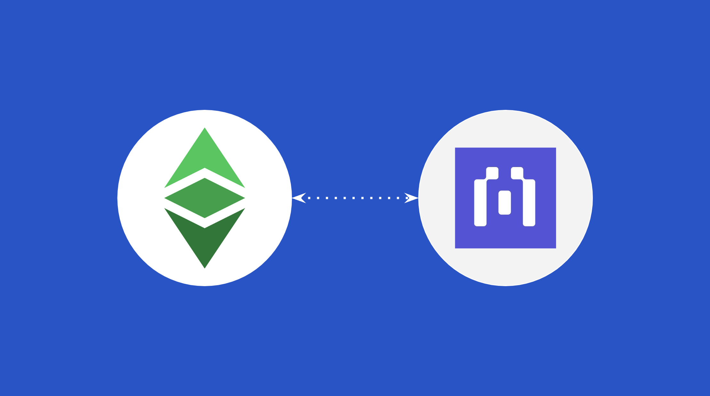

Blockscout in the most used block explorer for the Ethereum Classic (ETC) blockchain.

Their block explorer supports the Ethereum Classic mainnet and the Mordor testnet.

The link to see the ETC network statistics is the following:

https://etc.blockscout.com

The link to the Mordor testnet is the following:

https://etc-mordor.blockscout.com/

## Using the New Blockscout User Interface

Blockscout updated their user interfaces for both the ETC mainnet and Mordor testnet and [launched them](https://youtu.be/azpngtXYces) at the POW Summit which was held in Prague in September of this year.

In the next few sections we will show a guide of how to use their new block explorer user interface for the ETC mainnet. 

### 1. Go to the New URL

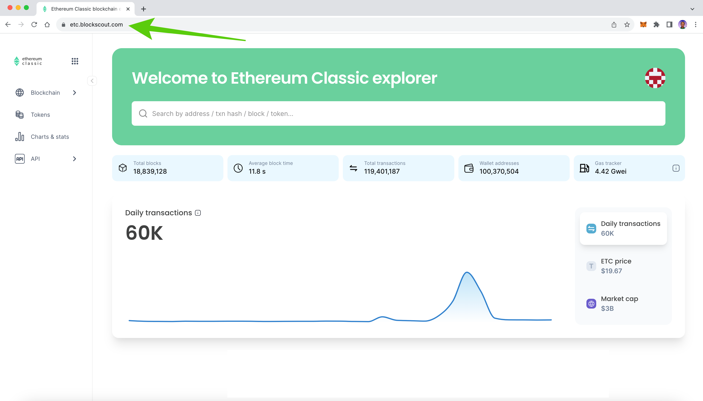

The old URL for the ETC Blockscout instance was https://blockscout.com/etc/mainnet, now the new URL is https://etc.blockscout.com, type it on your browser and go there.

### 2. Open the Main Menu and See the Options

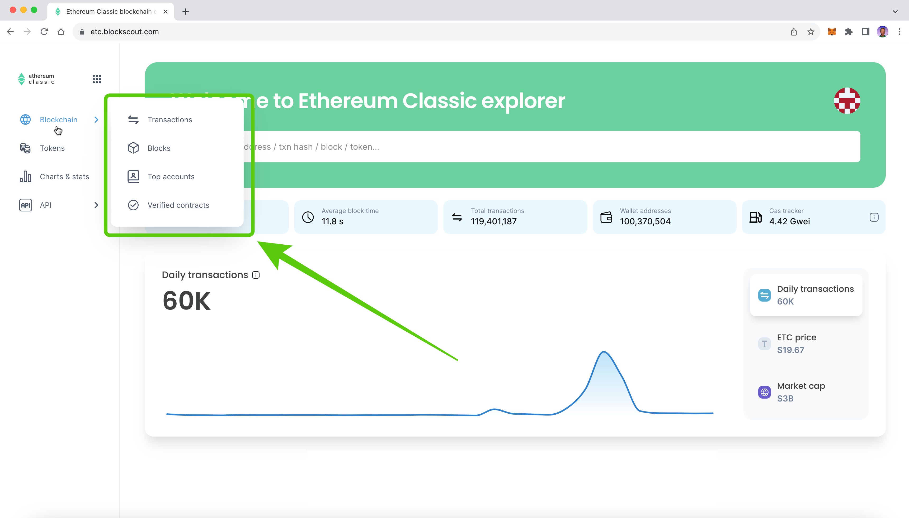

When you get to the Blockscout ETC explorer home, you will see a chart with the ETC transaction count and a box at the top to enter addresses, transaction hashes, block numbers, or token symbols. If you click on the “Blockchain” tap on the left menu, you will see four explorer options: Transactions, Blocks, Top accounts, and Verified contracts.

### 3. See Transactions

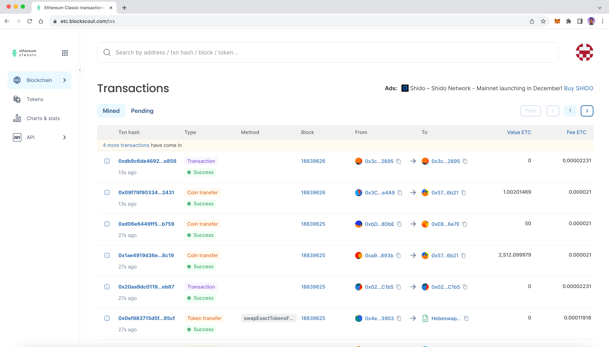

If you click on the “Transactions” link on the “Blockchain” tab, you will go to the “Transactions” page with the list of transactions in the ETC blockchain. The information will be organized by transaction hash, type, method, block number, the from and to addresses, the value in ETC, and the fee paid.

### 4. See Blocks

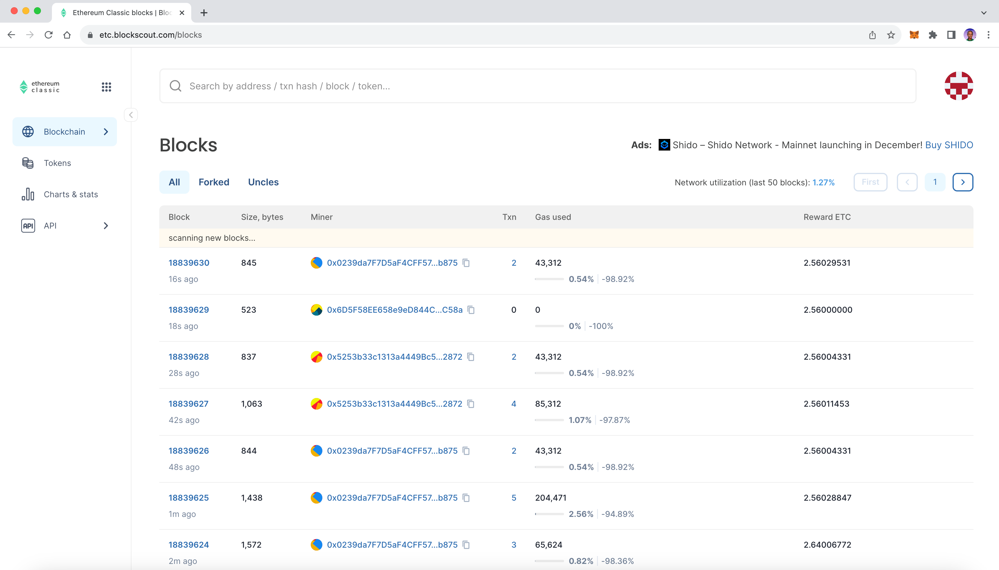

If you click on the “Blocks” link on the “Blockchain” tab, then you will go to the “Blocks” page. In it you will see all the blocks of ETC organized chronologically. The information of the blocks will be organize by block number, size in bytes, which was that miner that mined it, the number of transactions, the gas used, and the rewards.

### 5. See Top Accounts

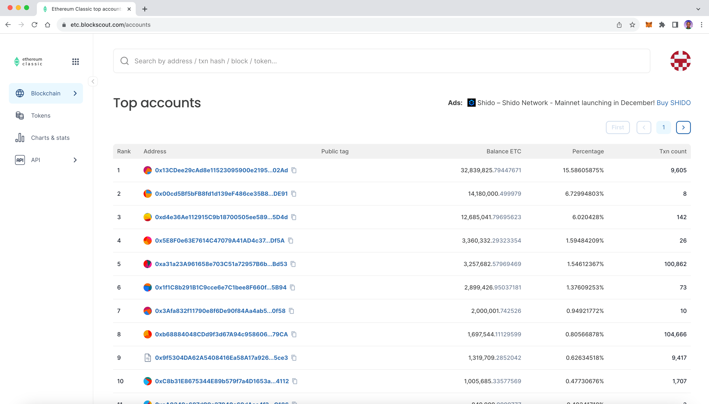

If you click on the “Top accounts” link in the “Blockchain” tab, you will be directed to the “Top accounts” page. In it you will see the top accounts in ETC ordered by size. 

### 6. See Verified Contracts

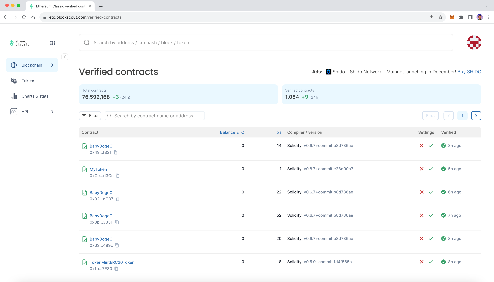

If you click on the “Verified contracts” link in the “Blockchain” tab, you will be directed to the “Verified contracts” page. In it you will see the verified smart contracts in ETC. Verified smart contracts are those whose byte code in the blockchain match the expected source code created by the developer teams.

### 7. Address Lookup

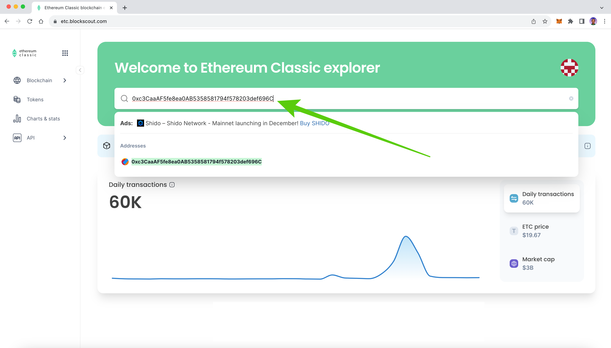

To look up the state of and address in ETC, you need to go to the home of the Blockscout ETC explorer and enter the desired address on the corresponding field on the top box and press enter.

### 8. Address Details

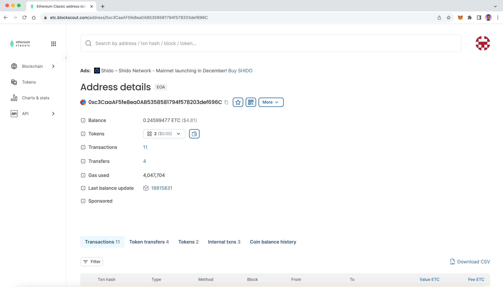

When you press enter, you will be taken to that address’s profile page which will contain all its relevant data.

### 9. Explore the Tokens Tab

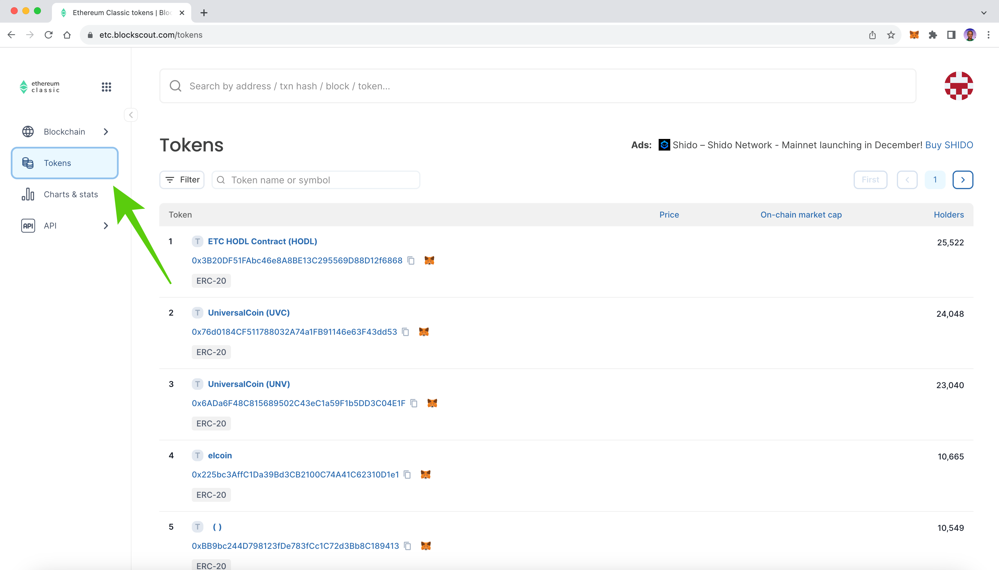

If you click on the “Tokens” tab on the left menu, you will be taken to the “Tokens” page. In it you will see tokens on ETC ordered by number of holders. 

### 10. Explore the Charts & Stats Tab 

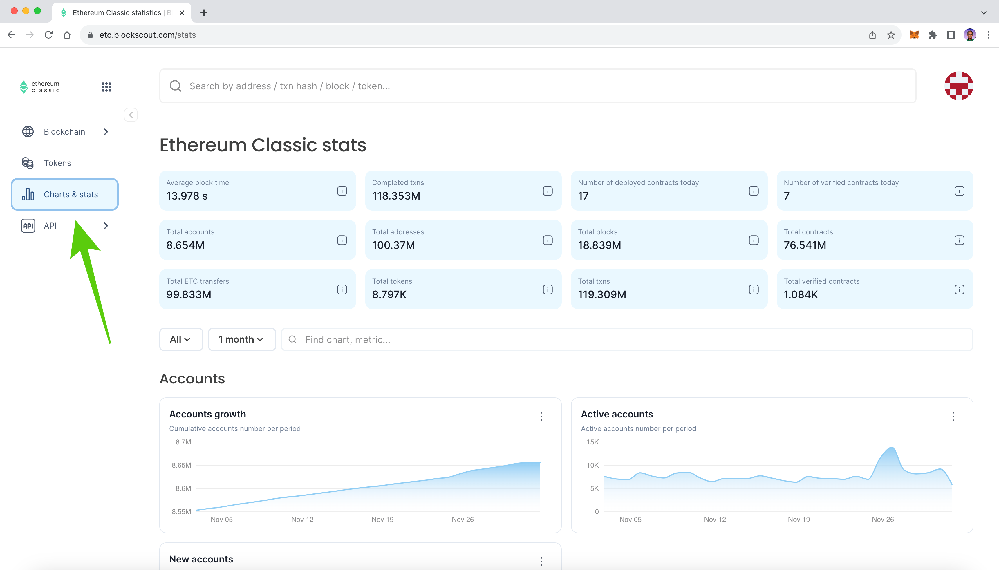

If you click on the “Charts & stats” tab on the left menu, you will be taken to the “Ethereum Classic stats” page. In it you will see many useful statistics of the ETC network, including the average block time, total transactions, accounts growth, etc.

### 11. For Developers: Explore the API Tab

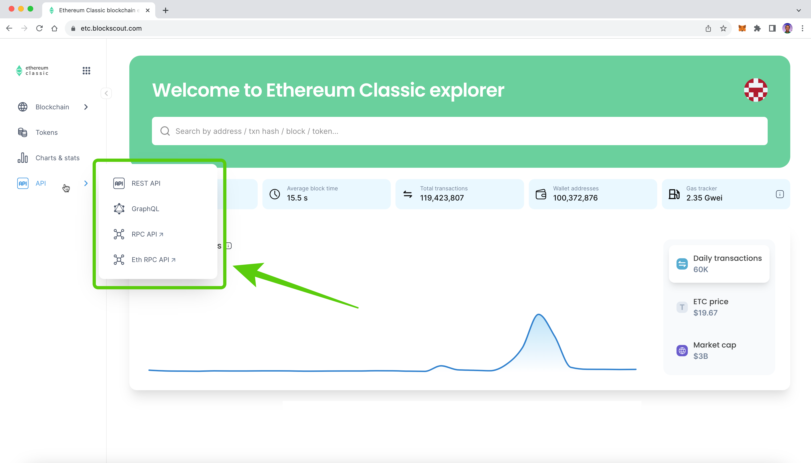

If developers wish to use the Blockscout ETC API’s, then they can explore the “API” tab on the left menu. In it they will see four options: REST API, GraphQL, RPC API, and Eth RPC API.

---

**Thank you for reading this article!**

To learn more about ETC please go to: https://ethereumclassic.org
