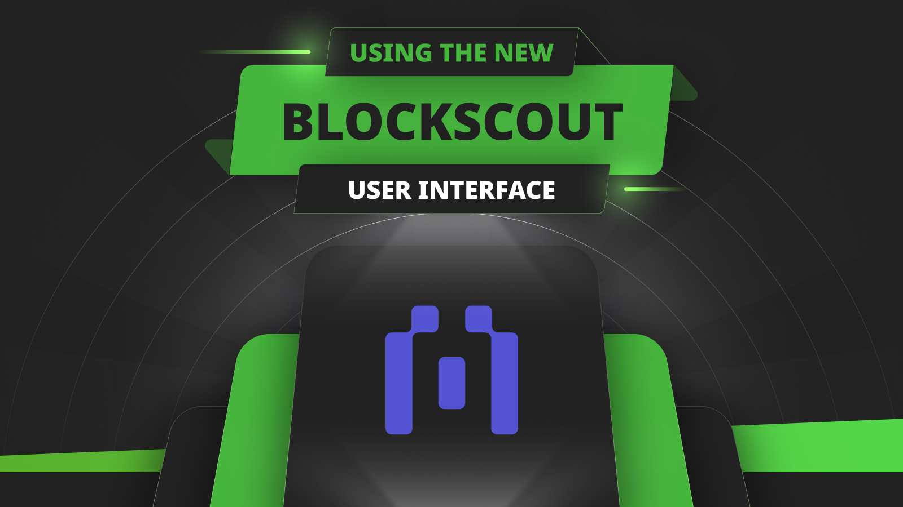

---
**您可以由此观看本期内容:**

<iframe width="560" height="315" src="https://www.youtube.com/embed/rqftsYWh87s?si=Kw10FpaZYgOBzX7_" title="YouTube video player" frameborder="0" allow="accelerometer; autoplay; clipboard-write; encrypted-media; gyroscope; picture-in-picture; web-share" allowfullscreen></iframe>

---

## 什么是区块链浏览器？

区块链浏览器是运行各种区块链的完整归档节点的网站，索引网络数据库的信息，并向公众展示这些信息。

这是金融世界中的新透明度水平，不仅因为信息是可用的，而且普通用户可以使用这些第三方服务来跟踪和审计区块链。在银行业，所有这些信息都是一个黑盒。

这些网站上的数据可以按区块、交易或地址组织，并且通常还有更多有用的统计数据和图表，用于分析网络中的活动。

## 什么是Blockscout？

Blockscout是用于Ethereum Classic（ETC）区块链的最常用的区块浏览器。

他们的区块浏览器支持Ethereum Classic主网和Mordor测试网。

查看ETC网络统计信息的链接如下：

https://etc.blockscout.com

Mordor测试网的链接如下：

https://etc-mordor.blockscout.com/

## 使用新的Blockscout用户界面

Blockscout为ETC主网和Mordor测试网更新了它们的用户界面，并在今年9月在布拉格举行的POW峰会上[推出了它们](https://youtu.be/azpngtXYces)。

在接下来的几个部分中，我们将展示如何使用他们的新区块浏览器用户界面来为ETC主网提供指南。

### 1. 转到新的URL

ETC Blockscout实例的旧URL为https://blockscout.com/etc/mainnet，现在新的URL是https://etc.blockscout.com，请在浏览器中输入并转到该地址。

### 2. 打开主菜单并查看选项

当您进入Blockscout ETC浏览器主页时，您将看到一个图表，显示ETC交易计数，并在顶部有一个框用于输入地址、交易哈希、区块号或代币符号。如果您在左侧菜单上点击“Blockchain”标签，您将看到四个浏览器选项：Transactions（交易）、Blocks（区块）、Top accounts（热门账户）和Verified contracts（已验证的合约）。

### 3. 查看交易

如果您在“Blockchain”标签上点击“Transactions”链接，将进入ETC区块链上的“Transactions”页面，该页面列出了ETC区块链上的所有交易。信息将按交易哈希、类型、方法、区块号、发送方和接收方地址、以太币价值以及支付的费用进行组织。

### 4. 查看区块

如果您在“Blockchain”标签上点击“Blocks”链接，将进入“Blocks”页面。您将看到按时间顺序组织的所有ETC区块。区块信息将按区块号、字节大小、挖掘该区块的矿工、交易数量、使用的燃气以及奖励进行组织。

### 5. 查看热门账户

如果您在“Blockchain”标签中点击“Top accounts”链接，将进入“Top accounts”页面。您将看到按大小排序的ETC中的热门账户。

### 6. 查看已验证的合约

如果您在“Blockchain”标签中点击“Verified contracts”链接，将进入“Verified contracts”页面。您将看到在ETC中已验证的智能合约。已验证的智能合约是区块链中的字节码与开发团队创建的预期源代码相匹配的合约。

### 7. 地址查找

要查找ETC中地址的状态，您需要转到Blockscout ETC浏览器的主页，输入所需地址并按Enter键。

### 8. 地址详细信息

按下Enter键后，您将进入该地址的个人资料页面，其中包含所有相关数据。

### 9. 浏览代币标签

如果您在左侧菜单上点击“Tokens”标签，将进入“Tokens”页面。您将看到按持有者数量排序的ETC上的代币。

### 10. 浏览图表和统计标签

如果您在左侧菜单上点击“Charts & stats”标签，将进入“Ethereum Classic stats”页面。您将看到ETC网络的许多有用统计信息，包括平均区块时间、总交易数、账户增长等。

### 11. 对于开发人员：浏览API标签

如果开发人员希望使用Blockscout ETC API，他们可以在左侧菜单中探索“API”标签。在其中，他们将看到四个选项：REST API、GraphQL、RPC API和Eth RPC API。

---

**感谢您阅读本期文章!**

了解更多有关ETC: https://ethereumclassic.org
