---
**您可以由此收听本期内容:**

<iframe width="560" height="315" src="https://www.youtube.com/embed/VozNYab5p3o?si=uvGAXecj0TIPzfLM" title="YouTube video player" frameborder="0" allow="accelerometer; autoplay; clipboard-write; encrypted-media; gyroscope; picture-in-picture; web-share" allowfullscreen></iframe>

---

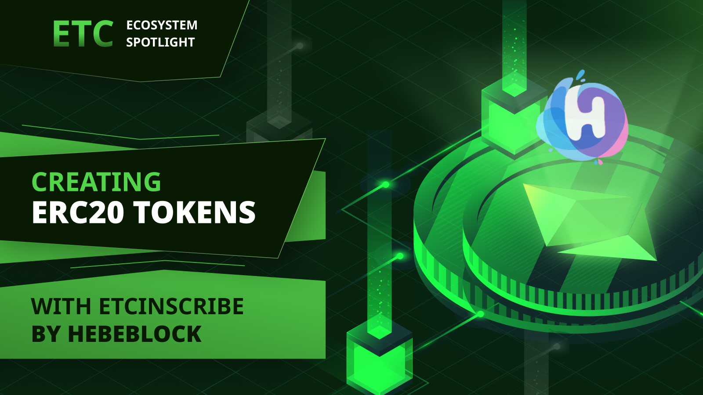

ETCInscribe是中国一家名为HebeBlock的DApp开发团队推出的新产品。他们还创建了HebeSwap，一个热门的ETC去中心化交易所，Hens，一个基于ETC的域名服务，以及ETCScan，一个ETC区块浏览器。

ETCInscribe是一款DApp，允许用户以所谓的公平启动方式创建和铸造ERC-20代币。

代币的公平启动意味着没有开发团队预挖矿，没有风险投资预售，公众可以在每个地址的每次交易中获得预设数量的代币。

以下是我对HebeBlock团队负责人张提出的一系列关于该服务的问题。

**Donald McIntyre（DM）：在ETCInscribe中，“公平启动”是什么意思，为什么它是“公平的”，而不仅仅是普通的创建ERC-20代币？**

*张（ZG）：在ETCInscribe中，“公平启动”是指创建ERC-20代币的一个公平和公正的过程，确保在初始分发阶段没有个人或团队在获取代币时获得不当优势。这种公平体现在以下几个方面：*

*平等机会：每个人在初始分发阶段都有平等的机会参与代币的创建和获取。*

*透明度：代币的创建和分发过程是公开展示的，确保信息对所有人可访问。*

*无预挖矿或预售：在启动阶段没有代币的预挖矿或预售，以防止任何特定实体在启动阶段积累大量代币。*

通过实施公平启动，ETCInscribe旨在建立一个公正、开放和包容的代币创建环境，使更多人能够参与并分享代币的增长和潜力。

**DM：这些行的含义是什么：“Number of Maxs”和“Mint Limit”？**

*ZG：Number of Maxs表示您总共可以铸造多少次。Mint Limit表示每次铸造可以获得多少ERC-20代币。因此，Number of Maxs x Mint Limit = ERC-20代币的总供应量。*

**DM：我不能只是创建一个代币，例如10,000,000个代币，名为“TokenName”和符号“TKX”就完事了吗？**

*ZG：在普通的ERC-20代币中，您自己创建代币，设置总数量，然后将代币发送到您的地址。这不是ETCInscribe的目标。我们在另一个DApp上实现了普通的ERC-20代币，网址是https://easy.hebeswap.com/*

**DM：这些是什么类型的代币？人们可以通过合约创建它们吗？**

*ZG：它仍然是一个智能合约，只是模仿了在比特币铭文中实现的功能机制。*

**DM：ETCInscribe是用来做什么的？**

*ZG：起初，我只是在思考是否有可能将比特币铭文的模型复制到ETC上，希望能够吸引更多人关注ETC。事实上，它确实引起了注意。与BTC的铭文相比，我使用智能合约在不到一周的时间内完成了它，这提供了更快、更安全的方法。*

**DM：所以，似乎有一个ERC-20代币创建者，然后人们可以进行铸造？**

*ZG：是的。在ETCInscribe上免费铸造，关键是要识别有意义且有价值的项目。通过这样做，您可以避免产生不必要的燃气费用。*

**DM：什么是“铭文”？**

*ZG：ETCInscribe中“铭文”的概念源自比特币中最新的BRC-20概念。众所周知，比特币没有智能合约功能。因此，他们采用在UTXO交易中添加注释的方法，例如：*
```
{"p":"brc-20","op":"mint","tick":"bank","amt":"1000"} 
```
*...然后，建立索引以实现ERC-20标准。然而，这种方法非常不安全，因为用户在发送BTC时可能会意外发送UTXO上的铭文。在ETCInscribe中，我们从BTC铭文模型中学到了经验，并使用智能合约进行了实现。目前，我们仅实现了ERC-20功能，并计划在未来支持NFT，用户可以将图像或文本上传到ETC区块中。*

## ETCInscribe如何工作？

在以下部分，我们将解释如何使用ETCInscribe在ETC上创建自己的公平启动ERC-20代币。

### 1. 转到ETCInscribe.com

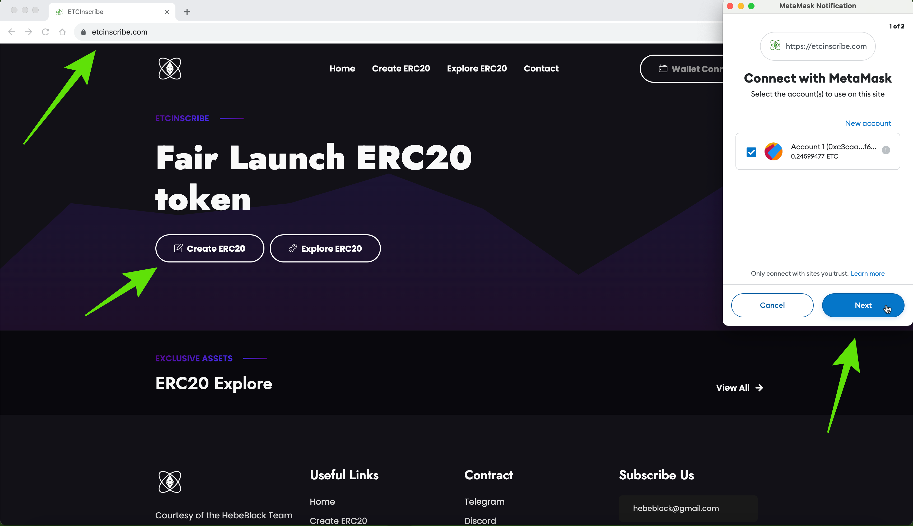

使用ETCInscribe在ETC上创建公平启动ERC-20代币的第一步是访问他们的网站https://etcinscribe.com。一旦进入，请连接您的钱包并单击“创建ERC20”按钮。

### 2. 查看ERC-20代币创建表单

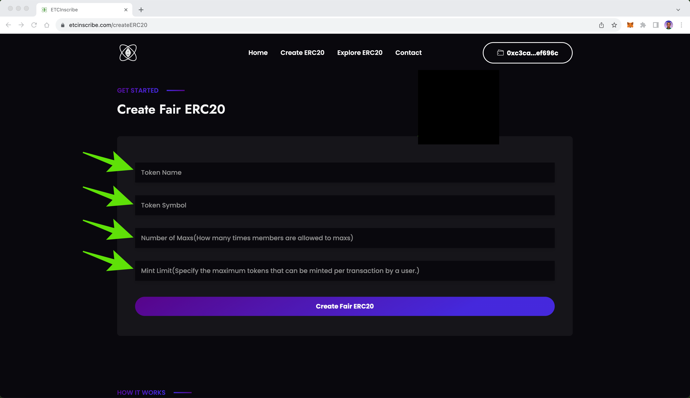

在接下来的屏幕上，您将看到公平ERC-20代币创建表单，其中包括“Token Name”、“Token Symbol”、“Number of Maxs”和“Mint Limit”字段。

### 3. 输入参数并创建公平ERC-20代币启动

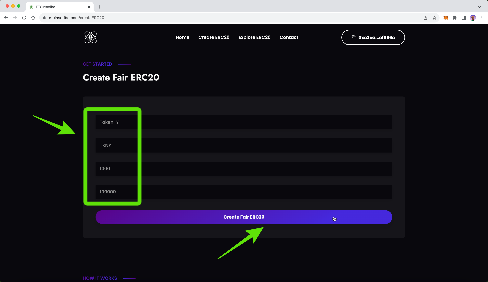

现在，您可以输入有关新公平代币启动的参数和首选项。在我们的案例中，我们使用了示例名称“Token-Y”、符号“TKNY”、最大铸造次数1,000，每次铸造的限制为100,000个代币。输入完您的首选项后，按“创建公平ERC20”按钮。

### 4. 在您的钱包上确认交易

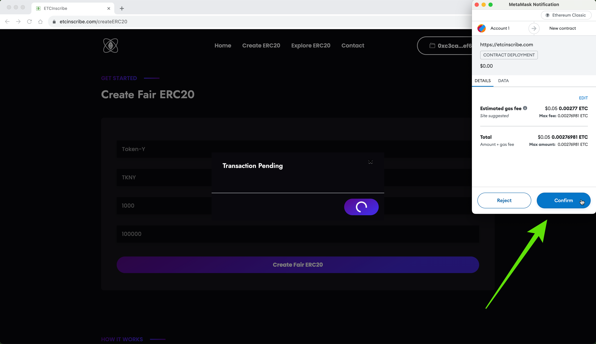

在接下来的步骤中，ETCInscribe将在您的ETC钱包上生成交易。在您的钱包上按“确认”以执行创建公平ERC-20代币的交易。

### 5. 等待交易确认

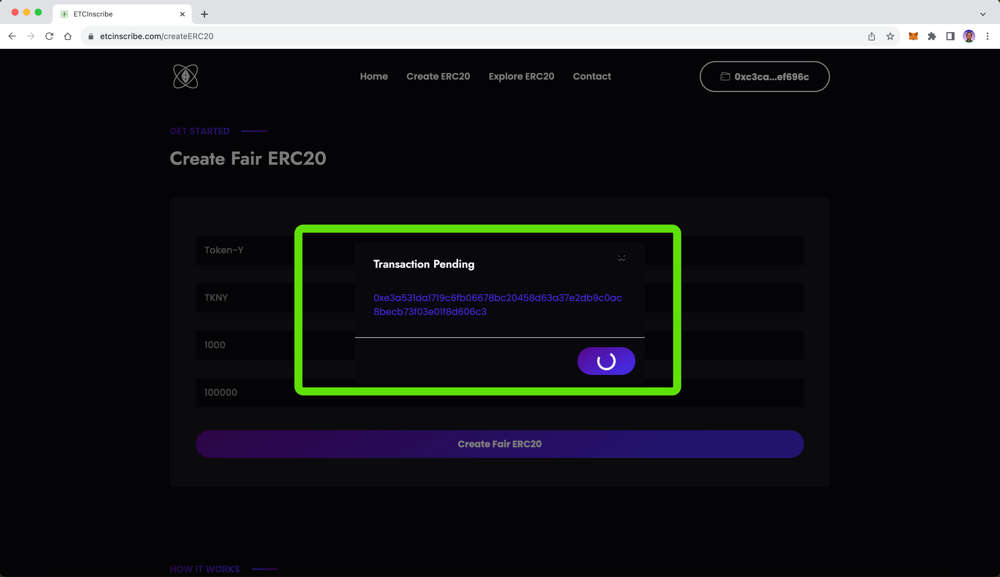

由于ETC网络需要大约13至26秒的时间来确认交易，您需要等待一小段时间以查看您的交易执行情况。

### 6. 创建公平ERC-20代币：将代币添加到您的钱包

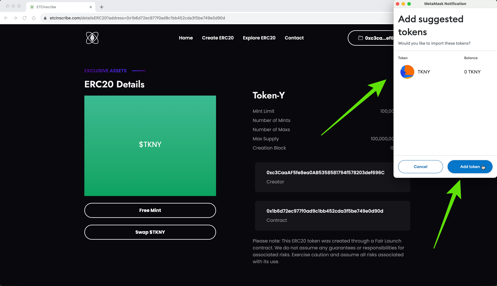

当ETC网络确认您的公平启动ERC-20智能合约创建时，您的钱包将询问您是否希望导入该代币。在您的钱包上按“添加代币”以稍后查看您的余额。

### 7. 查看您新代币的配置文件页面！

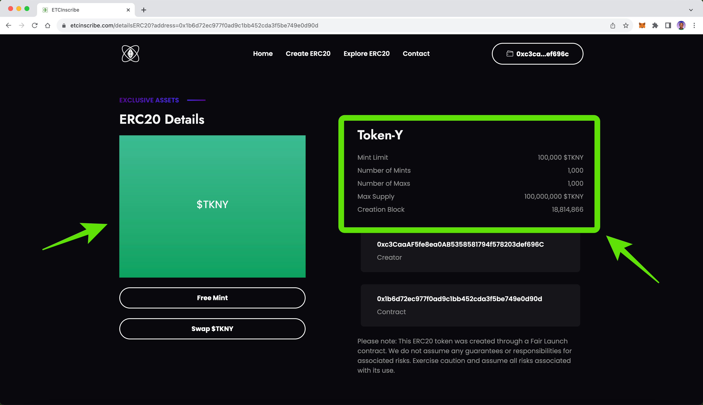

一旦将代币添加到您的钱包，窗口将关闭，您将看到您新公平ERC-20代币的配置文件页面！在我们的案例中，因为我们指定了1,000次铸造限制和每次铸造的最大数量为100,000个代币，如果用户将它们全部铸造，那么ERC-20代币的总供应量将为100,000,000。

### 8. 为自己铸造公平ERC-20代币！

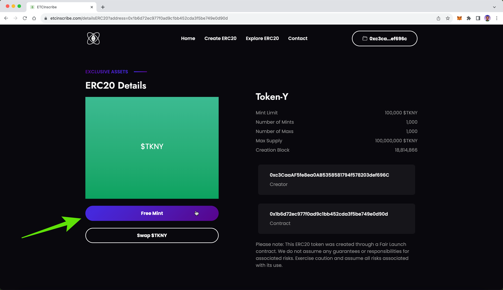

现在，您已经创建了新的公平ERC-20代币，可以为自己铸造代币！要做到这一点，请单击“免费铸币”按钮。

### 9. 在您的钱包上确认铸币交易

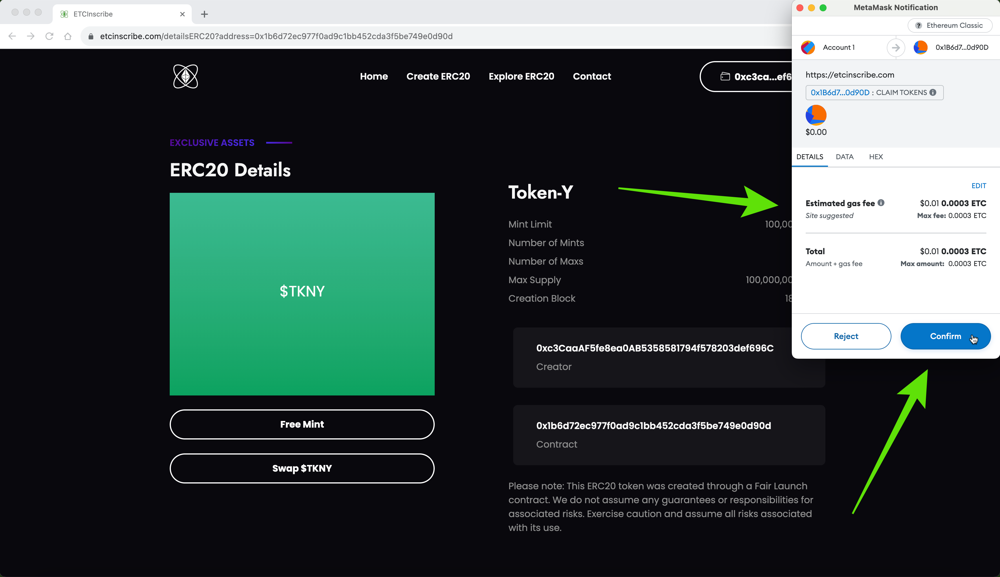

在接下来的步骤中，ETCInscribe将向您的钱包发送交易。要执行交易，请在您的ETC钱包上点击“确认”按钮。

### 10. 等待交易执行

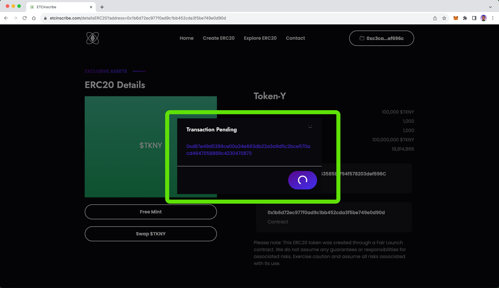

现在，您需要再次等待几秒钟，直到铸币执行。

### 11. 您的总铸币数减少

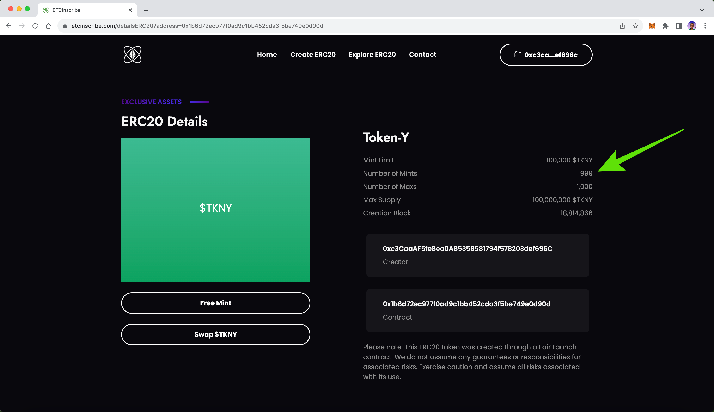

一旦铸币交易执行，您将再次看到您的公平ERC-20代币配置文件页面，但您将看到您的代币上有一个较少的铸币机会（在我们的案例中，从1,000减少到999），因为您进行了第一次铸币。当用户铸造您的代币时，该数字将减少，直到减少到零为止。

### 12. 在您的钱包上检查您的公平ERC-20代币余额！

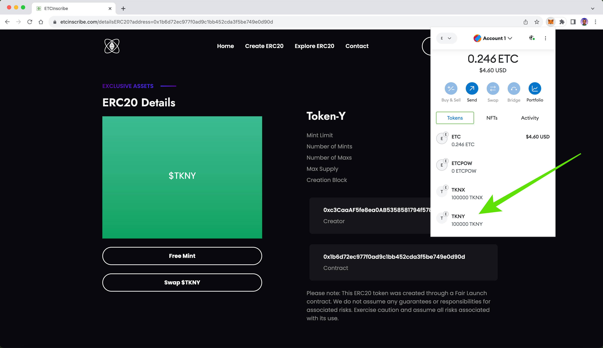

如果您打开钱包查看余额，您将看到您现在有一个新创建的公平ERC-20代币的余额！在我们的案例中，我们的余额是100,000 $TKNY，因为这是我们在代币创建过程中定义的金额。

---

**感谢您阅读本期文章!**

了解更多有关ETC: https://ethereumclassic.org
