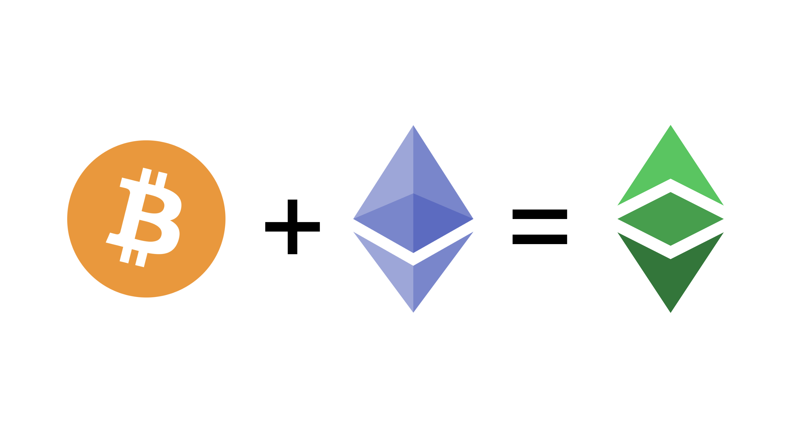

---
**You can listen to or watch this video here:**

<iframe width="560" height="315" src="https://www.youtube.com/embed/wcBmYWDlc7k?si=kApH47fbN7AfC1eV" title="YouTube video player" frameborder="0" allow="accelerometer; autoplay; clipboard-write; encrypted-media; gyroscope; picture-in-picture; web-share" allowfullscreen></iframe>

---

From classes 1 through 5 of this course, we have explained how POW works in detail. 

The benefits of POW to Ethereum Classic (ETC) are:

- Decentralization
- Hard money
- Permissionlessness
- Censorship resistance

In this class, 6, we will explain the benefits and the great advantages of Ethereum Classic with regards to Bitcoin (BTC) and Ethereum (ETH).

## Satoshi Nakamoto Actually Planned Smart Contracts for Bitcoin

Satoshi Nakamoto had envisioned programmability for Bitcoin as seen in his comment of June of 2010 below:

*“The design supports a tremendous variety of possible transaction types that I designed years ago.  Escrow transactions, bonded contracts, third party arbitration, multi-party signature, etc.  If Bitcoin catches on in a big way, these are things we'll want to explore in the future, but they all had to be designed at the beginning to make sure they would be possible later.”*

– Satoshi Nakamoto

BitcoinTalk: https://bitcointalk.org/index.php?topic=195.msg1611#msg1611

This is actually one of the clues that Mr. Nakamoto was a cypherpunk, as these topics of money, Bit Gold, and smart contracts were developed only in those circles. 

## But Smart Contracts Didn’t Work on Bitcoin

However, because of technical problems with its design, Bitcoin did not support smart contracts inside its highly secure environment.

Bitcoin has a very limited scripting language and its model of handling addresses and transactions, called the “Unspent Transaction Output” model or “UTXO”, presented barriers to programmability.

Following Bitcoin’s invention, there were several attempts at adding  programmability to it, for example projects such as “[Colored Coins](https://en.bitcoin.it/wiki/Colored_Coins)” and “[MasterCoin](https://cryptochainuni.com/wp-content/uploads/Mastercoin-2nd-Bitcoin-Whitepaper.pdf)”, but they gained little traction and ran into the same problems as described above.

In essence, Bitcoin was to stay as a plain vanilla cryptocurrency.

## The Invention of Ethereum Classic

This is why Vitalik Buterin invented Ethereum Classic, which is the original Ethereum, to be a POW blockchain, with digital gold, and that it could be programmable. 

Smart contracts are the second most important invention of the blockchain industry, Nakamoto Consensus being the first.

Mr. Buterin solved the smart contract problem by creating a totally new blockchain and adding to it the following components:

- The account system instead of the UTXO model
- A virtual machine (the Ethereum Virtual Machine)
- The ability to read and execute special programming languages
- The GAS system that creates a payment system for miners to execute programs and avoids spam and the halting problem

## In 2016 Ethereum Separated From Ethereum Classic

The reason why today we have two blockchains named “Ethereum”, namely “Ethereum Classic” and “Ethereum”, is that in July 20 of 2016 Ethereum separated from the original chain due to a crisis with a specific application inside the system.

The application was called “TheDAO”, it had accumulated more than $150 million in deposits in ether from the community, but it was hacked in June of 2016.

The hacker stole more or less $50 million at the time, and the Ethereum community decided to return the money from the hacker to the original investors by manually reversing transactions in the blockchain.

Because this broke the main ethos of immutability and security in a blockchain, a small portion of the community decided to keep maintaining the original Ethereum network and called it Ethereum Classic.

This is why ETC is the original untampered and secure chain.

## In 2022 Ethereum Migrated to Proof of Stake

Continuing with a philosophy of scalability and to “save the trees”, the Ethereum community decided to migrate from the highly secure proof of work consensus mechanism (Nakamoto Consensus) to a less secure but less electricity consuming format called proof of stake.

When Ethereum migrated to proof of stake on September 15 2022, ETC became the largest proof of work smart contracts blockchain in the world.

It’s hashrate, the amount of computing power that a proof of work network has, increased from 25 TH/s to more than 200 TH/s, to stabilize today at around 150 TH/s. 

## Ethereum Classic Is Bitcoin Philosophy With Ethereum Technology 

If we take into account that Ethereum Classic is a proof of work blockchain like Bitcoin, that it has a fixed monetary policy, making it digital gold, and that it is programmable like Ethereum, which makes it programmable digital gold, then we can say that ETC is Bitcoin’s philosophy with Ethereum’s technology.

In other words, ETC is the best of both worlds.

## Ethereum Classic’s Key Advantages

In summary, Ethereum Classic has 7 key advantages that neither Bitcoin nor Ethereum hold completely:

**1. POW:** ETC is proof of work, Bitcoin is too but it is not programmable.

**2. Programmable:** ETC is programmable, Ethereum is too but it is not proof of work.

**3. Digital gold:** ETC is digital gold like Bitcoin, but Ethereum is just a fiat community token.

**4. Fully replicated:** ETC is a fully replicated blockchain as both Bitcoin and Ethereum are.

**5. Composable:** ETC is composable, but Bitcoin isn’t. Ethereum is, but they have plans to divide it through layer 2 systems.

**6. The largest one:** ETC is the largest POW smart contracts blockchain in the world, Bitcoin and Ethereum are not.

**7. The most secure apps:** Because of the complete combination of features above, unlike Bitcoin and Ethereum, apps in ETC are the most secure software applications in the world.

Based on this analysis, we can confidently state that ETC is the best blockchain in the market.

---

**Thank you for reading this article!**

To learn more about ETC please go to: https://ethereumclassic.org
