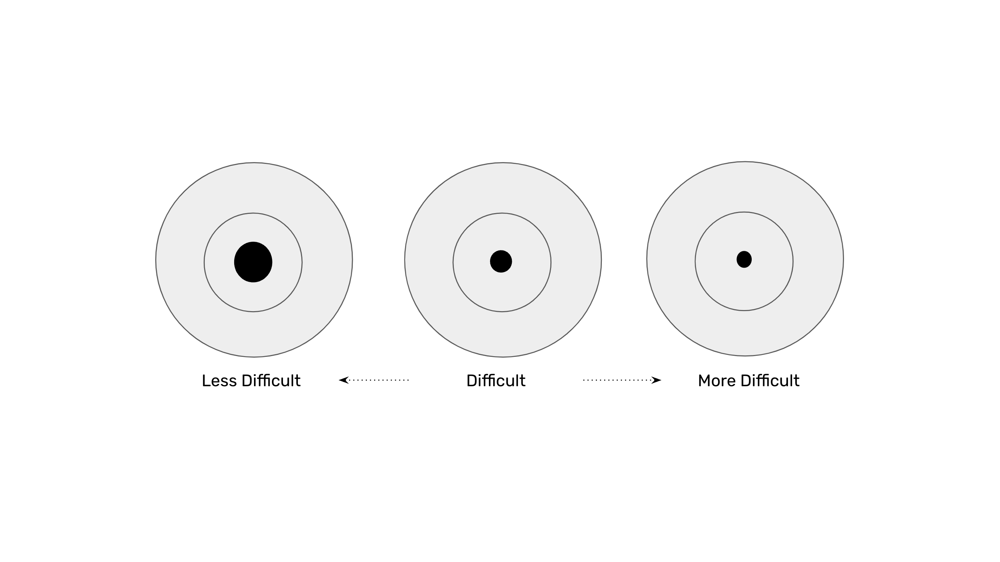
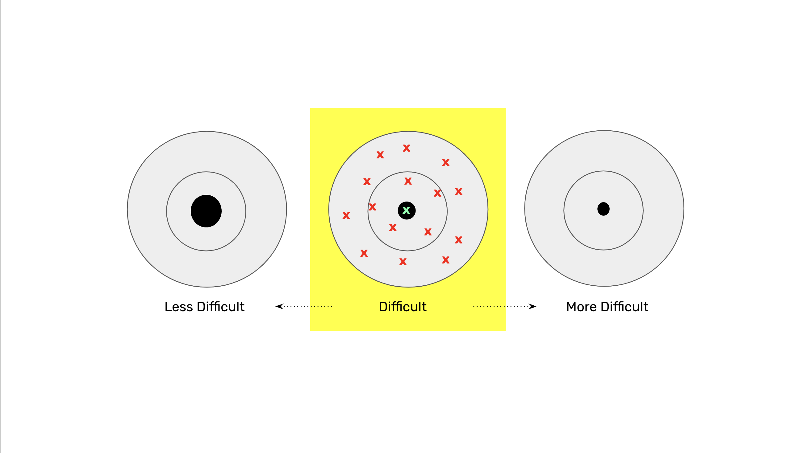
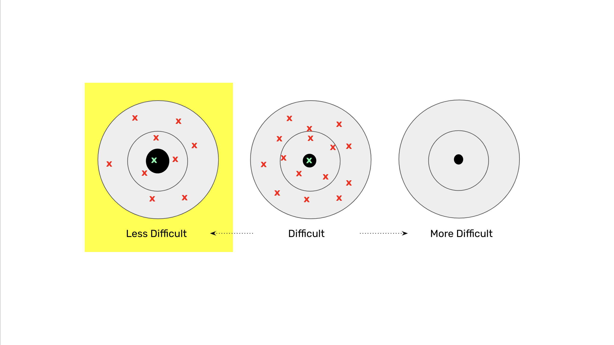
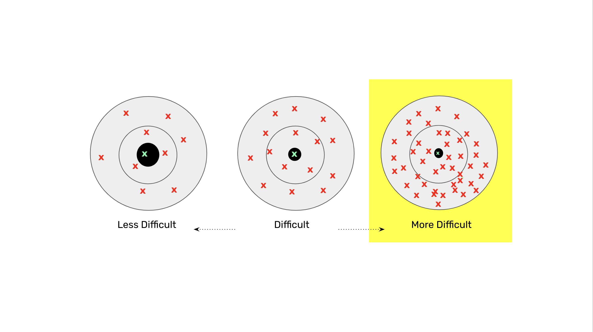

---
**You can listen to or watch this video here:**

<iframe width="560" height="315" src="https://www.youtube.com/embed/zsm_DSjuOIk?si=4fXk_0XljVHHQNfm" title="YouTube video player" frameborder="0" allow="accelerometer; autoplay; clipboard-write; encrypted-media; gyroscope; picture-in-picture; web-share" allowfullscreen></iframe>

---

In the previous class, 4, we explained the broader Nakamoto Consensus design, each of its steps, and its features and benefits.

One of the most controversial parts of the proof of work (POW) method is the difficulty adjustment system. 

Nick Szabo [expressed concerns](https://unenumerated.blogspot.com/2011/05/bitcoin-what-took-ye-so-long.html) about it as it is a manipulable parameter, just like the monetary policy of POW coins, and not a completely objective and work based way of regulating the supply of the digital asset as is Bit Gold.

On the other hand, Saifedean Ammous, the author of The Bitcoin Standard, The Fiat Standard, and Principles of Economics, [praised the difficulty adjustment](https://academy.saifedean.com/podcast/the-bitcoin-standard-podcast-seminar-september-10-2020/) as one of the most important components of Nakamoto Consensus because it regulates the supply of the cryptocurrency.

In this post we will explain how the POW difficulty adjustment works, and what are its benefits.

## What Is the Difficulty Adjustment?

The difficulty adjustment basically regulates the timing of the supply of coins in POW blockchains as it enlarges or reduces the target to hit to determine the cryptographic stamp per block so that blocks can be created more or less constantly at the stipulated time intervals in each network, thus printing the coins at a steady pace. 

For example, the difficulty adjustment keeps Bitcoin’s block creation at 10 minute intervals on average, ETC at 13 seconds, and Litecoin at 2 1/2 minutes. 

This ensures that the printing of the coins is not too fast or too slow when miners increase or decrease hashrate in each network due to market conditions.

## How Does the Difficulty Adjustment Work?

As miners need to hit a target range of numbers when creating the cryptographic stamp per block, the target can be enlarged or reduced depending on the speed of the blocks. The speed of the blocks increases or decreases if the total computing power held by miners increases or decreases.

In the next sections we will explain states and options of the difficulty adjustment system.

## 1. Stable Difficulty State

In a stable difficulty state, miners will take, on average, a certain time to hit the target for each block. In these conditions, that time is 10 minutes per block in Bitcoin, 13 seconds in ETC, and 2 ½ minutes for Litecoin. 

Note in the diagram, that in the stable difficulty state, it takes a number of attempts (red crosses mean failed attempts) to hit the target (green cross).

## 2. Reducing Difficulty

If, for example, miners reduce the hashing power because the coin market is down, then the time that it would take to find a block would increase, slowing the creation of coins. To solve this and adjust the time back to the desired average, the target range will be enlarged, making it less difficult to hit.

Note, as indicated in the diagram in this section, that less difficulty takes less attempts to hit the target.

## 3. Increasing Difficulty

If miners were to increase the hashing power because the coin market is up, then the time that would take to find a block would decrease, creating more coins faster. To solve this and adjust the time back to the desired average, the target range will be reduced, making it more difficult to hit.

Note, as indicated in the diagram in this section, that more difficulty takes more attempts to hit the target.

## Benefits of the Difficulty Adjustment in Proof of Work Blockchains

The difficulty adjustment in Bitcoin avoided the problems that Satoshi had when he created it. 

There was no market inside the network to exchange the Bit Gold for coins, and there was no technology available yet to create these tokens backed by Bit Gold.

The difficulty adjustment simplified the mechanism by just creating coins in exchange for the work of the miners, but the Bit Gold itself was not used and has been buried in proof of work blockchains ever since.

The end result is that the difficulty adjustment regulates supply of these coins by regulating blocktimes, therefore stabilizing the blockchains in terms of their monetary policies, hashrates, transaction velocities, confirmation times, settlement times, etc.

## Putting it all Together for Ethereum Classic

From classes 1 through 5 of this course, we have explained how POW works in detail. 

The benefits of POW to ETC are:

- Decentralization
- Permissionlessness
- Hard money
- Censorship resistance

In the next class, 6, we will explain the benefits and the great advantages of ETC with regards to Bitcoin and Ethereum.

---

**Thank you for reading this article!**

To learn more about ETC please go to: https://ethereumclassic.org
