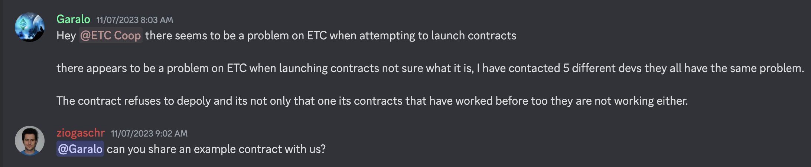
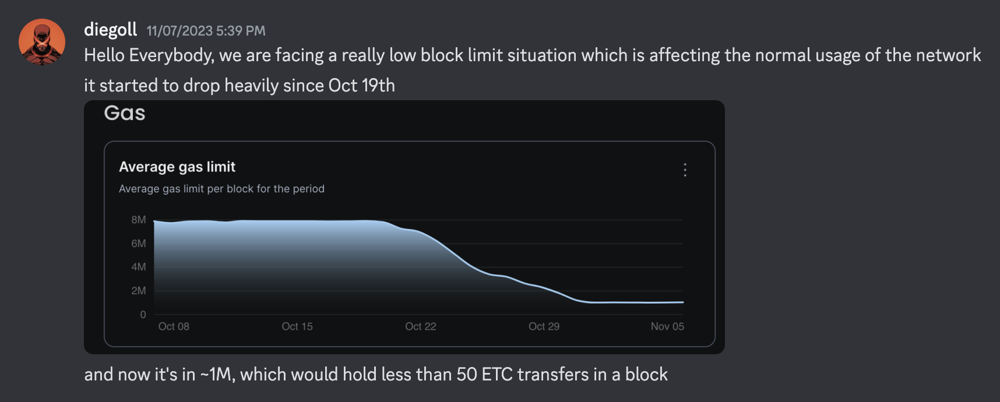
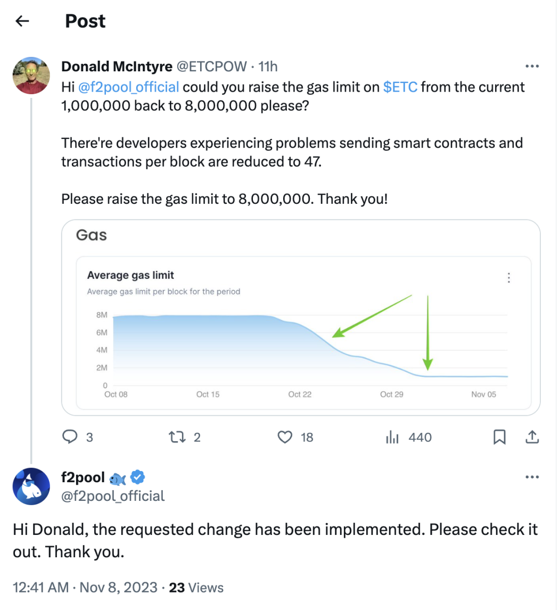
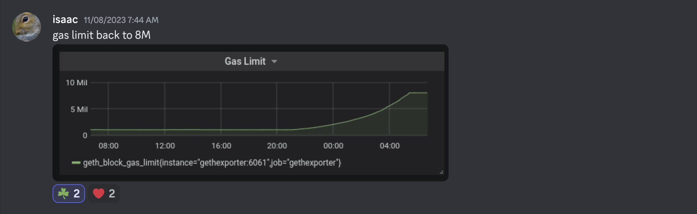
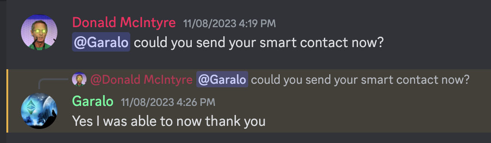
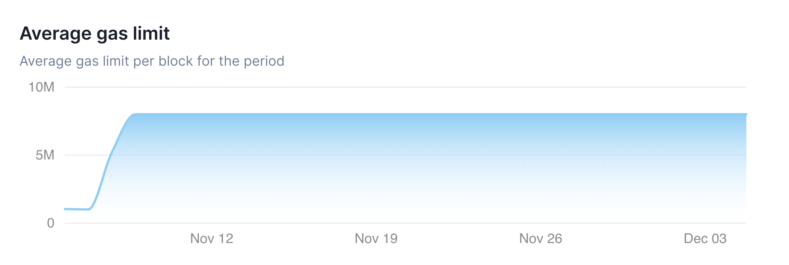
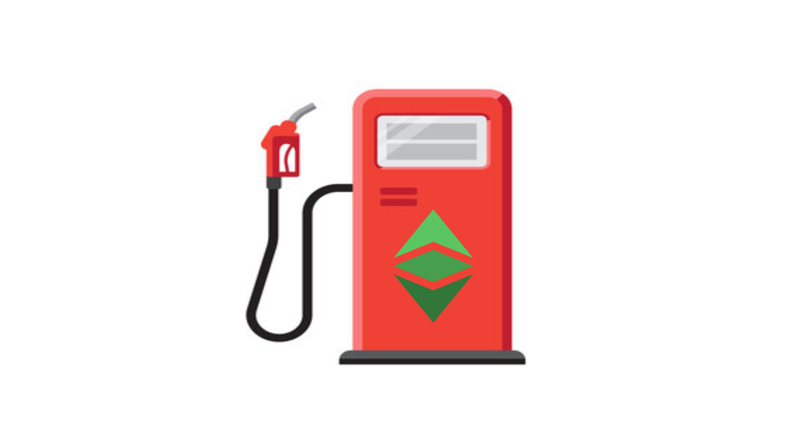

---
**由此收听本期内容:**

<iframe width="560" height="315" src="https://www.youtube.com/embed/0iBaEfb54mA?si=Pj6C_nuWylVCg0e4" title="YouTube video player" frameborder="0" allow="accelerometer; autoplay; clipboard-write; encrypted-media; gyroscope; picture-in-picture; web-share" allowfullscreen></iframe>

---

在2023年11月7日，以太经典（ETC）开发者和社区成员Garalo在[ETC Discord服务器](https://ethereumclassic.org/discord)上报告说，他尝试启动智能合约时遇到了问题。他还报告说其他开发者也遇到了同样的问题。

当时，ETC核心开发者Chris Ziogas回应了这个问题，并开始努力查找和解决问题。

大约9小时后，ETC核心开发者Diego López León报告说，问题在于以太经典网络中每个区块的燃气限制已被矿工从通常的800万燃气降低到每个区块的100万燃气。

燃气限制规定了一个区块中可以使用的燃气的最大数量，因此确定了区块本身的大小，因此可以容纳的交易和智能合约的数量。

解决方案是联系矿池和矿工，请求他们将燃气限制再次提高到800万的水平。

ETC区块链中最大的矿池F2pool在几小时内[回应](https://twitter.com/f2pool_official/status/1722142321377206441)说，已经实施了将每个区块的燃气限制更改回800万的操作。

次日，燃气限制恢复到800万标记，由ETC核心开发者Isaac Ardis报告。

同一天晚些时候，开发者和社区成员Garalo报告说，他的问题已经解决，他可以再次发送智能合约到ETC。

截至我们撰写本文时，我们可以[看到](https://etc.blockscout.com/stats)，ETC的燃气限制自那时以来一直维持在每个区块的正常平均水平800万。

异常的燃气限制波动持续了从2023年10月19日到11月8日。

目前不清楚在这一事件中是哪些矿工或出于何种原因降低了燃气限制，但有可能这只是一个参数设置错误。也有人认为，这可能是矿工试图通过限制区块空间来增加费用收入的尝试。

## 矿工为什么以及如何改变燃气限制？

在工作量证明区块链中，权力是如何平衡的：核心开发者提出协议的设计，矿工生成区块，节点运营者验证区块。

如果开发者为系统提出荒谬的规则，矿工和节点运营者可以拒绝它们或分裂；如果矿工提出不诚实的区块，节点运营者可以拒绝它们；如果节点运营者开始运行未经共识同意的新规则的软件客户端，那么开发者和矿工可以指责他们。

考虑到这种平衡，当以太坊网络在2014年和2015年创建时，最初的设计者认为区块大小的设置应该留给自由市场的矿工。矿工应该能够根据需要提高或降低燃气限制，以适应网络的交易量条件。

据此推理，开发者将不会拥有太多权力，系统中的不同参与者之间将会有更好的平衡。

由于以太经典是原始的以太坊区块链，并且仍然采用工作量证明共识机制，因此继承了这一特性。

矿工可以增加或减少每个区块的燃气限制，通过在每个区块的基础上调整一个简单的参数。

ETC中的每个区块包含构建它的矿工使用的燃气限制。在ETC中，每个区块的历史平均燃气限制约为800万燃气。

如果矿工想要增加或减少燃气限制，以增加或减少区块大小，以响应交易量的增加或减少，他们可以在每个区块上报告燃气限制的增加或减少。

但是，他们只能提出相对于前一个区块燃气限制的1/1024的增量。

例如，如果上一个被挖掘的区块的燃气限制由上一个矿工设定为800万，那么下一个区块的燃气限制不能超过800万812燃气（7812是800万的1/1024）。

这意味着燃气限制只能以这些小的增量增加，这可以称为区块燃气限制变化率，即每个区块0.0976%（1/1024 x 100）。

这也意味着在ETC上要发生区块大小的显著增加或减少，需要建立几千个区块。这就是为什么在2023年10月至11月间，ETC的燃气限制波动需要几小时或几天的原因。

由于ETC区块平均每13秒创建一个，因此每天产生6646个区块，足以产生前一部分中所看

到的恢复。

## 在ETC中是否应该固定燃气限制以避免这些情况发生？

观察比特币的经验，该区块链在2009年开始时没有区块限制。从含蓄的角度来看，这意味着矿工可以根据需要填充每个区块的更多或更少的交易，根据他们的意愿占用更多或更少的空间。

然而，为了防止垃圾邮件或不诚实的行为者创建大区块来膨胀网络，2010年Satoshi Nakamoto将区块大小固定为1兆字节。

Satoshi Nakamoto可以被认为是区块链中的核心开发团队的类比。这意味着区块大小限制是通过硬编码并由核心开发者确定的。

由于比特币是历史上第一个且最成功的区块链，我们可以说，模仿其模型，因此消除由矿工确定的区块燃气限制并将其固定在任意水平（例如800万燃气）可能是一个好主意。

---

**感谢您阅读本期文章!**

了解更多有关ETC，欢迎访问: https://ethereumclassic.org
