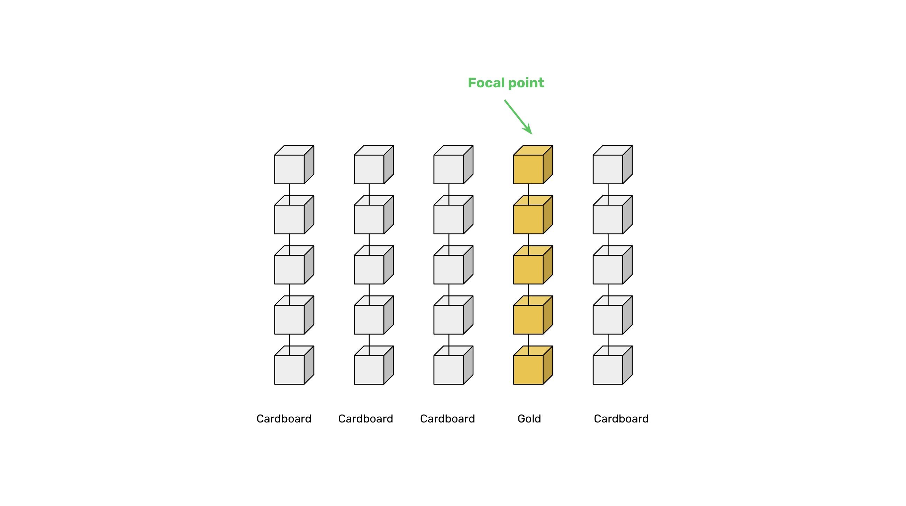

---
**You can listen to or watch this video here:**

<iframe width="560" height="315" src="https://www.youtube.com/embed/y-tA0WKV7PY?si=76iqXIHcxPi44p-A" title="YouTube video player" frameborder="0" allow="accelerometer; autoplay; clipboard-write; encrypted-media; gyroscope; picture-in-picture; web-share" allowfullscreen></iframe>

---

From classes 1 through 5 of this course, we have explained how proof of work (POW) works in detail. 

In class 6, we explained the great advantages of Ethereum Classic (ETC) with regards to Bitcoin (BTC) and Ethereum (ETH).

In this class, 7, we will go over what were the revolutionary benefits of the proof of work based Nakamoto Consensus.

We will explain that it enables consensus between all computers in the system, it provides a focal point for all participants, protects the history of transactions, and creates hard money.

The fruits of these benefits are decentralization, permissionlessness, censorship resistance, and trust minimization.

## 1. How Proof of Work Enables Consensus

Proof of work enables consensus between all computers in the network because the only block that will be accepted as the latest block by all nodes in the network will be the one that has all the work done. 

It is very easy for all nodes to decide on the same exact block in every round because any alternative block sent by imposters that did not do the work will always be rejected.

An analogy of this method could be to think of someone who receives many boxes but needs to decide which is the most valuable box in every round. 

Of all the boxes that he receives in every round, most are made of cardboard except one which is made of gold. Because the gold box is very easy to differentiate from the cardboard boxes and is the most valuable, then it is very easy to know which is the correct one in each round.

## 2. How Proof of Work Provides a Focal Point

Proof of work provides a focal point for any computer in the world to enter, exit, or reenter the network as the same information; the great amount of work done by miners; that assures perfect consensus every round between all machines of the system, is the same information that may be used by any new entrant, or any machine that leaves and wants to enter again, to know which is the correct chain of blocks to join just by verifying that the work was done. 

Any proposed imposter chains that did not do the work will always be rejected.

For example, if someone downloads and starts running the ETC software client, that node will start communicating with existing nodes in the blockchain and receiving from them the blocks of the whole history.

Because all the blocks have the accumulated work done in all of ETC’s history, then it is practically impossible for any malicious actor to trick this node into joining a alternative nefarious chain.

## 3. How Proof of Work Provides Protection of Transaction History

Proof of work provides protection of all the history of transactions because for any transaction that has been sent and included in a block, to be reversed, the same amount of work that was done for its inclusion must be done all over again, including all the blocks that were added on top. 

This deters attackers from reversing past transactions, and the older a transaction gets, the more difficult it is to reverse.

For example, if each block in Bitcoin costs $300,000 in capital and electricity to build, and someone wants to reverse a transaction that happened 1,000 blocks in the past, then it would cost them $300,000,000 in capital and electricity to be able to accomplish that. If the transaction were 2,000 blocks away, then it would cost $600,000,000, and so on.

## 4. How Proof of Work Creates Digital Gold

Proof of work creates digital gold because the cost of creating the blocks is equal to the cost of creating the currency as the rewards are paid to miners only if they do the work required to hash or stamp the blocks.

Additionally, blockchains such as Bitcoin and ETC have fixed monetary policies with capped supplies. This means that Bitcoin will have a total supply in its history of 21,000,000 coins and ETC of 210,700,000 coins. 

This scarcity and unforgeable costliness of the cryptocurrencies make them similar in valuation as gold in the real world.

## The Revolutionary Benefits of Proof of Work

The four benefits explained in the previous sections together form the most decentralized, permissionless, censorship resistant, and trust minimized, thus secure kind of network known to man. 

This is what was revolutionary about proof of work.

## Proof of Work and Basic Rights

Now that we know how POW works, its 4 revolutionary benefits, and the fruits of these benefits, which are decentralization, permissionlessness, censorship resistance, and trust minimization, we can study what are the implications for the entire world of this technology.

In our next class, 8, we will talk about how POW promotes basic rights on a global scale.

---

**Thank you for reading this article!**

To learn more about ETC please go to: https://ethereumclassic.org
