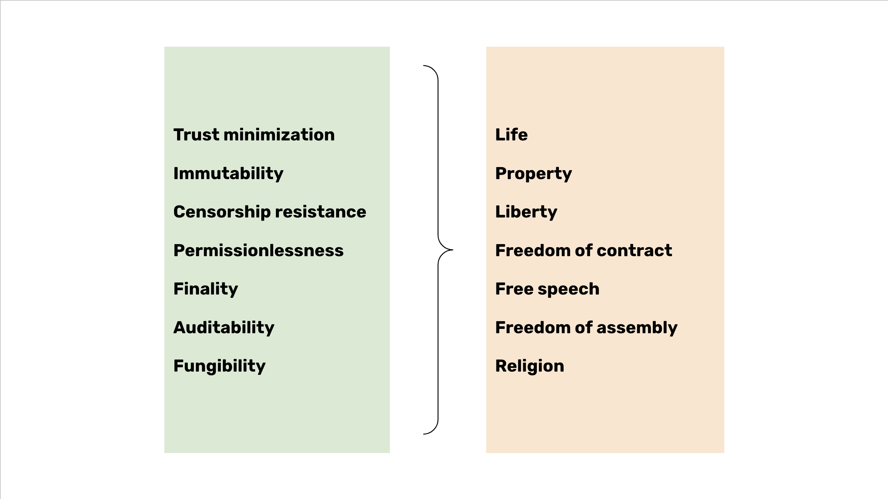

---
**由此收听或观看本期内容:**

<iframe width="560" height="315" src="https://www.youtube.com/embed/-PihVFWCAvk?si=0S17Idezb6LNQzxv" title="YouTube video player" frameborder="0" allow="accelerometer; autoplay; clipboard-write; encrypted-media; gyroscope; picture-in-picture; web-share" allowfullscreen></iframe>

---

在这门课的前七堂课中，我们学到了工作证明（POW）的工作原理，它的四个革命性好处，这些好处的成果；它们是去中心化、无需许可、抗审查和最小化信任；以及这些加上可编程性如何使以太经典（ETC）相对于比特币（BTC）和以太坊（ETH）变得如此有价值。

有了这些知识，我们现在可以研究基于POW的中本聪共识对整个世界的影响。

在第8课中，我们将探讨POW如何在全球范围内促进基本权利。

## POW区块链上基本权利的前提条件

在一个社会中使基本权利得以实现的最基本特征是对这些权利的执行。在权利颁布后，有必要通过使用武力来建立和保持它们。这意味着违反规则的人必须违背他们的意愿受到惩罚。

在区块链上，这些事情通过纯粹的密码学和系统设计平稳运作。

构成区块链上基本权利前提条件及其执行的组件有：

**工作证明：** 逆转账户和余额所需的工作量是如此之大，以至于使这类违规行为几乎不可能。此外，POW的信息是保持系统去中心化的关键。

**稳健货币：** 很少有人理解这一点，但硬货币不会随时间流逝而贬值，这保护了人们储蓄的价值，从而保护了财产权。

**可编程性：** 在诸如以太经典之类的区块链中，可编程性是增强基本权利的关键，因为除了货币之外，还可以在其高度安全的环境中实现更多样化的用例。

**全复制：** POW区块链的分类账和智能合约完全复制的事实使得账户和余额在世界各地的许多服务器上都是冗余的，几乎不可能被破坏、篡改或被人为或自然灾害摧毁。

**可组合性：** 可组合性意味着由于可编程性启用的所有应用程序都位于同一系统内，因此它们同样安全，并且能够在单一复杂的交易中相互交互。这种集成增强了安全性并降低了成本，应用程序通过增加的网络效应互相强化。

**规模：** 区块链的规模越大，即使是在其类别中最大的情况下，系统也会变得更加安全。

## 在POW区块链上启用基本权利的组件

账户和余额以及智能合约是在工作证明区块链上启用基本权利的组件。

**账户和余额：** 在比特币和ETC等区块链中，地址和账户是实际的财产登记簿。这些带有其余额和其他分配给它们的资产的账户使用户通过私钥独占地控制他们的财富和应用程序。

**去中心化应用程序（Dapps）：** 由于智能合约是无法停止的并提供了一般的可编程性，Dapps（这是这些去中心化系统中的应用程序名称）使更多数量的很难篡改、攻击、中断或干预的权利得以实现。

## 这些组件的安全属性

前面部分提到的所有前提条件和组件的结合在POW区块链中提供了前所未有的安全级别。

**最小信任：** 因为它们真正去中心化，意味着节点可以在任何时候，从世界任何地方自行隔离地加入和离开系统，那么对受信任第三方的依赖，因此风险，会大大减少。

**不可变性：** 由于通过私钥用户是唯一能够控制他们的地址、余额、Dapps和附加资产的人，而受信任的第三方在这些系统中几乎被消除，因此这些网络中的分类账是不可变的。

**抗审查：** 随着对受信任的第三方的实际消除，以及因为密码学使得无法访问系统内的地址，这些区块链几乎不可能被审查。

**无需许可：** 随着对受信任的第三方的实际消除，并因为POW实现了对系统的自由访问，这些区块链非常难以被控制和限制访问。

**最终性：** 由于交易在一定数量的确认后几乎是最终的且难以逆转，POW区块链的可靠性远高于传统系统。

**可审计性：** 由于软件复杂且可能存在错误或故障，并为了减少这些系统的核心程序员造成欺诈的可能性，其透明性和可审计性是增强安全性的关键特征。

**同质性：** 如果硬货币直接影响财产权利，那么货币单位的同质性是增强其质量的关键特征。同质性保证任何单位的价值都与其他单位相同，最小化了贬值的风险，同时增强了货币的价值和可用性。

## 如何维护基本权利

总的来说，基本权利通过具有账户、余额、资产和智能合约的分类账在POW区块链上得以体现，这些权利跨越所有边界，无论人们的国家、文化、意识形态、信仰、性别、种族或任何其他人类条件如何，都能够触及世界上的每个人。

要保护这些基本权利，区块链的公共链和其扩展生态系统中必须存在像最小信任、不可变性、抗审查和无需许可性这样的稳健区块链原则，以确保它们的完整性和延续性。

不仅这些网络的内部系统必须保护这些基本权利，而且它们周围的生态系统还通过拒绝邪恶的提案和更改来自然地支持它们。这是POW区块链激励的一个标志。

## 由POW维护的基本权利

POW区块链全球范围内启用和分发的一些基本权利包括：

**生命：** 通过保护货币、余额、地址和应用程序，用户可以保存他们努力工作的成果，进行商业交易，并通过为自己和亲人提供更少的不确定性来保护他们的生命。

**财产：** 通过硬货币，并通过保护带有附加余额和资产的地址，区块链充当财产登记和所有权记录，其安全性和透明度比传统系统高出数个数量级。

**自由：** 由于人们的货币和应用程序是抗审查和无需许可的，因此用户在POW区块链上具有一种在中心化系统中不可能实现的自由和使用水平。

**合同自由：** 因为POW区块链如ETC是可编程的，所以这些系统内可以存在复杂的合同。这些合同可以是从客户与供应商之间的公司合同，到雇员条款和条件，再到债务或权益证券等等。

**言论自由：** 如果任何类型的应用程序都可以存在于可编程的POW区块链中，那么社交媒体和通信应用程序可以在其上构建。这些应用程序将比传统科技公司的应用程序具有更高的言论自由保障。

**集会自由：** 如果这些系统中存在合同自由和言论自由，并且在全球范围内分布，那么协会自由、集会自由（至少在线）、请愿权在全球范围内得到加强。

**宗教自由：** 如果协会自由和言论自由存在，那么宗教自由是一个自然的结果。

---

**感谢您阅读本文！**

要了解更多关于ETC的信息，请访问：https://ethereumclassic.org
