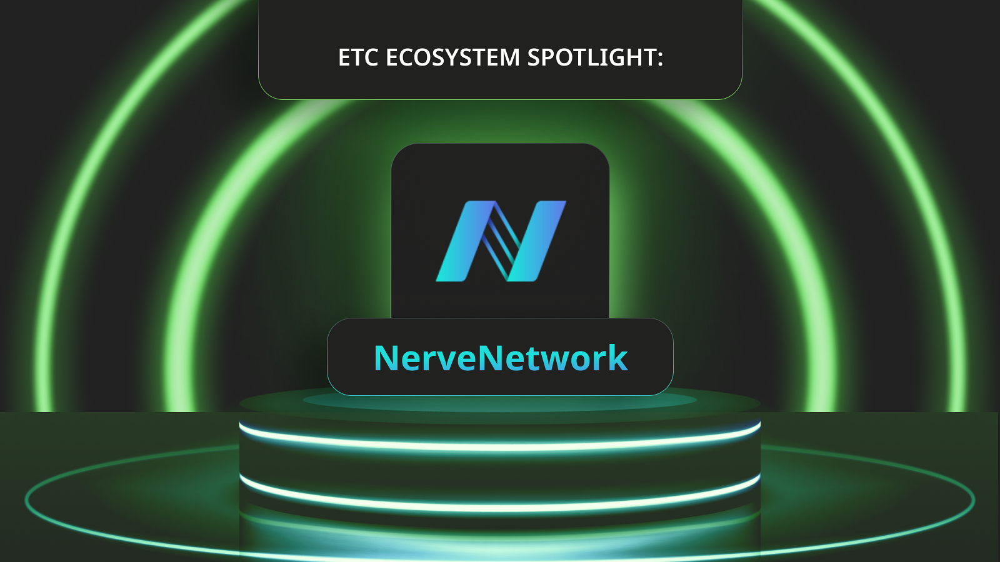
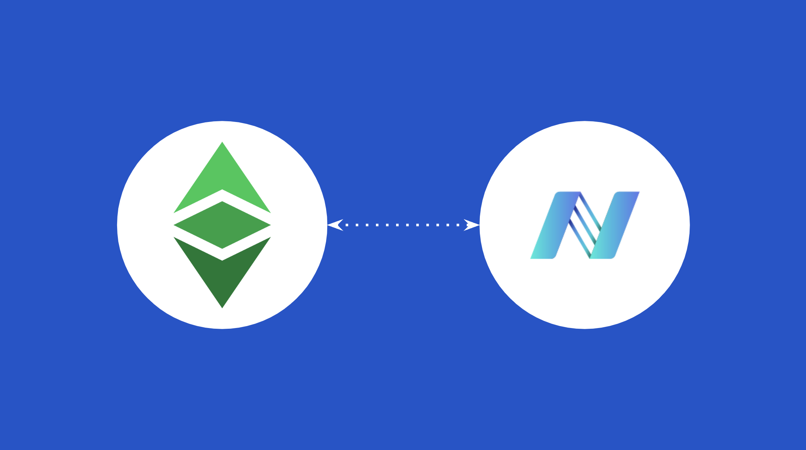
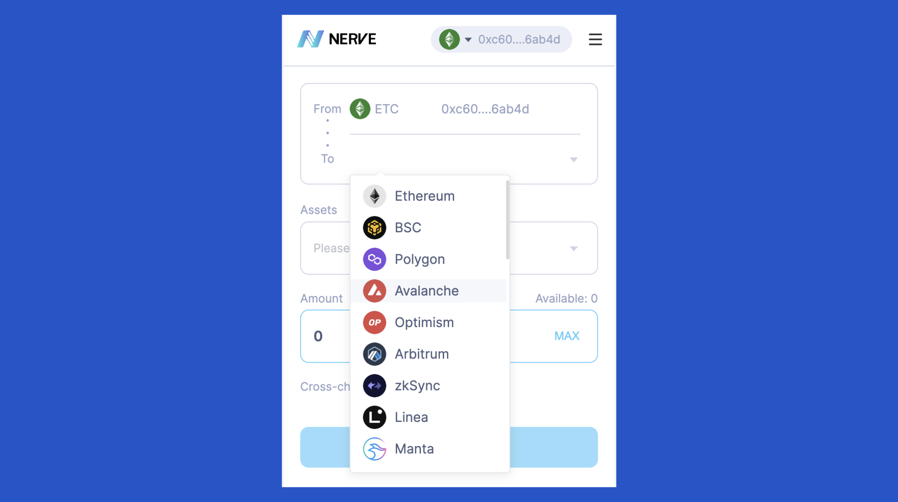
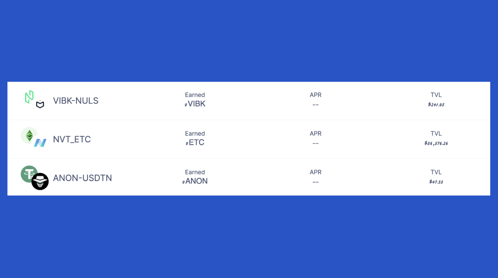
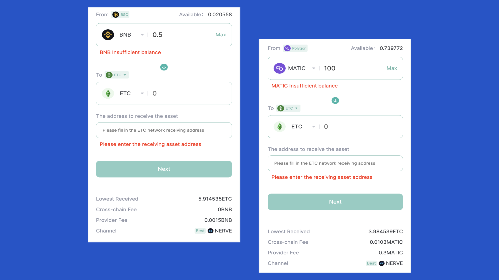
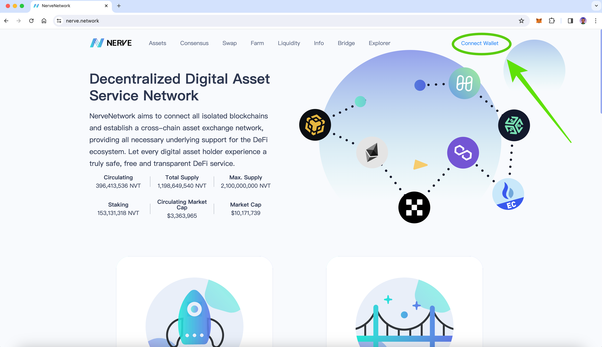
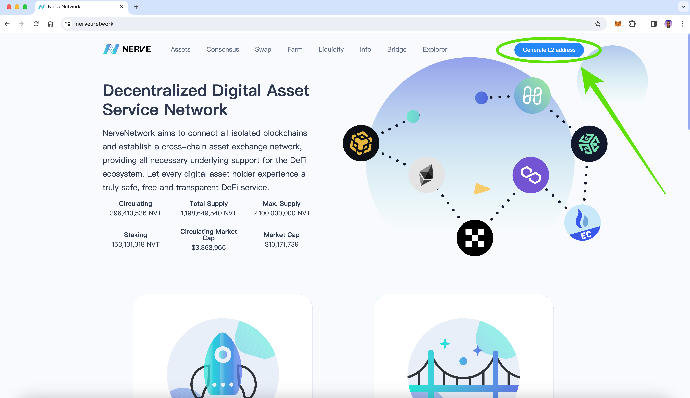

---
**You can listen to or watch this video here:**

<iframe width="560" height="315" src="https://www.youtube.com/embed/UcvpcuECGmA?si=2UDUvopFtoYx576w" title="YouTube video player" frameborder="0" allow="accelerometer; autoplay; clipboard-write; encrypted-media; gyroscope; picture-in-picture; web-share" allowfullscreen></iframe>

---

NerveNetwork [is one of the winners](https://etccooperative.org/posts/2023-08-03-presenting-first-round-etc-grants-dao-winner-nervenetwork-en) of the first round of the ETC Grants DAO, which happened in the first half of 2023. 

The team earned a $20,000 grant to connect Ethereum Classic (ETC) to its system.

Their services have been up for a few months, so in this post we will describe their apps. In the following sections we will explain:

- What Is NerveNetwork?
- What Is the NerveBridge?
- What Is NerveFarm?
- What Is NerveSwap?
- Connecting Your Wallet to NerveNetwork
- Generating an L2 Address on the NerveNetwork

## What Is NerveNetwork?

NerveNetwork is a layer 2 (L2) blockchain system that provides several services to connect various blockchains in the industry.

As of this writing they have integrated their technology with over 30 chains.

On September 3rd 2023, NerveNetwork officially announced the integration for Ethereum Classic as a result of the grant they got from the ETC Grants DAO. 

When consulted for this post, the team has responded that they are happy to be a part of the ETC community and provide cross-chain services to the ecosystem.

## What Is the NerveBridge?

NerveBridge is the core product of NerveNetwork. 

It is a system of bridges that connects ETC to over 30 supported networks, making cross-chain assets simple. 

The way it works is by locking ETC or other assets on the Ethereum Classic blockchain and then issuing ERC-20 tokens (or equivalents) on other networks as wrapped tokens.

NerveBridge helps any ETC ecosystem project transfer value to other supported networks within a few simple steps. 

## What Is the NerveFarm?

NerveFarm is the yield farming feature of NerveNetwork. The ETC-NVT farm is currently live and users may stake in the ETC-NVT liquidity pool (LP) to “mine” ETC assets. “NVT” is the native token of the NerveNetwork blockchain.

## What Is NerveSwap?

NerveSwap is a backend technology that enables the exchange of native tokens, or any other assets, from the different blockchains NerveNetwork supports.

There is a wallet app called [SwapBox](https://swapbox.nabox.io/swap), which is a multichain liquidity aggregator, developed by Nabox Wallet, that supports swapping routes from the NerveSwap service. This is the only DEX that aggregates NerveSwap liquidity. 

To make the most of NerveNetwork, the team suggests that users use SwapBox for their swapping needs.

This is the link: https://swapbox.nabox.io/swap 

Users can move ETC assets back and forth from many supported networks.

## Connecting Your Wallet and Using The NerveNetwork Products

To start using the services of NerveNetwork, you need to go to https://nerve.network/. There you will be asked to connect your web3 wallet, for example MetaMask. 

## Generating an L2 Address

Once you have your wallet connected, then NerveNetwork will suggest to generate an L2 address on their network so you can start moving assets, farming, or swapping.

---

**Thank you for reading this article!**

To learn more about ETC please go to: https://ethereumclassic.org
