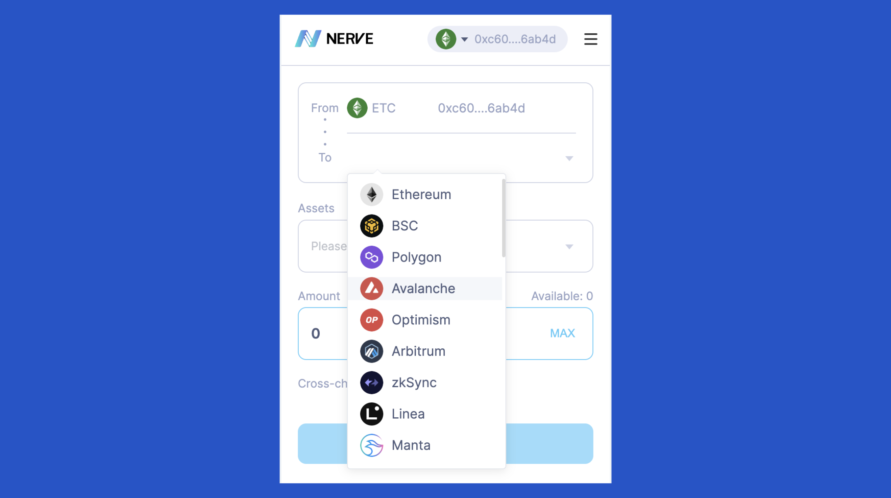
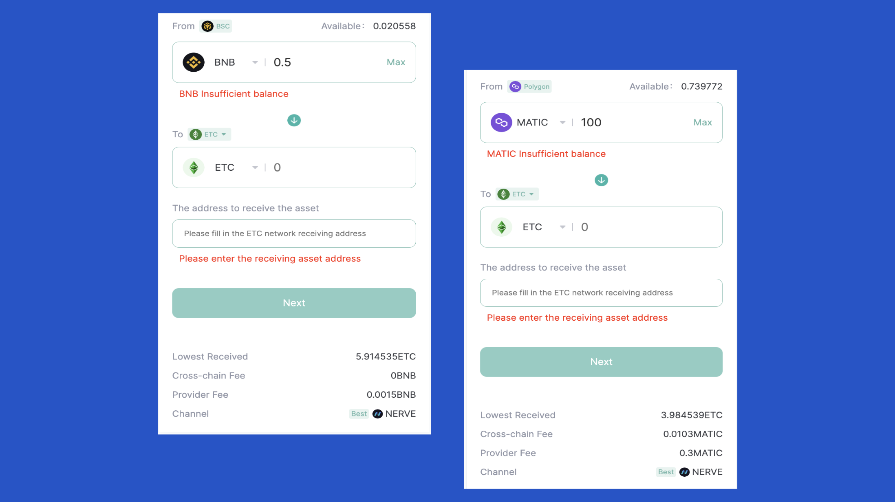
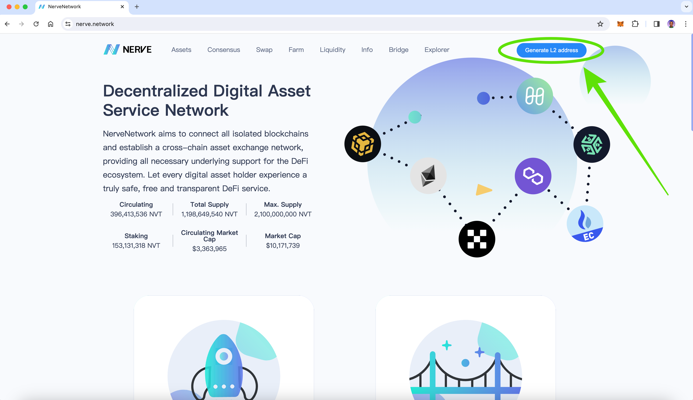

---
**由此收听或观看本期内容:**

<iframe width="560" height="315" src="https://www.youtube.com/embed/UcvpcuECGmA?si=2UDUvopFtoYx576w" title="YouTube video player" frameborder="0" allow="accelerometer; autoplay; clipboard-write; encrypted-media; gyroscope; picture-in-picture; web-share" allowfullscreen></iframe>

---

NerveNetwork [是ETC Grants DAO第一轮](https://etccooperative.org/posts/2023-08-03-presenting-first-round-etc-grants-dao-winner-nervenetwork-en)的获奖者之一，该DAO活动发生在2023年上半年。该团队获得了2万美元的资助，以将以太坊经典（ETC）连接到其系统中。

他们的服务已经上线几个月，因此在这篇文章中，我们将描述他们的应用程序。在接下来的章节中，我们将解释：

- 什么是NerveNetwork？
- 什么是NerveBridge？
- 什么是NerveFarm？
- 什么是NerveSwap？
- 将您的钱包连接到NerveNetwork
- 在NerveNetwork上生成L2地址

## 什么是NerveNetwork？

NerveNetwork是一个提供多项服务的第二层（L2）区块链系统，用于连接行业中的各种区块链。

截至本文撰写时，他们已将其技术与30多个链集成在一起。

2023年9月3日，NerveNetwork正式宣布与以太坊经典的集成，这是他们从ETC Grants DAO获得的资助的结果。

在为本文提供咨询时，团队回应表示，他们很高兴成为ETC社区的一部分，并为生态系统提供跨链服务。

## 什么是NerveBridge？

NerveBridge是NerveNetwork的核心产品。

这是一个桥梁系统，将ETC与30多个支持的网络连接在一起，使跨链资产变得简单。

它的工作原理是在以太坊经典区块链上锁定ETC或其他资产，然后在其他网络上发行ERC-20代币（或等值的代币）作为封装代币。

NerveBridge帮助任何ETC生态系统项目在几个简单步骤内将价值转移到其他支持的网络。

## 什么是NerveFarm？

NerveFarm是NerveNetwork的挖矿功能。ETC-NVT挖矿目前已经启动，用户可以在ETC-NVT流动性池（LP）中进行质押以“挖矿”ETC资产。“NVT”是NerveNetwork区块链的原生代币。

## 什么是NerveSwap？

NerveSwap是一种后端技术，使NerveNetwork支持的不同区块链的原生代币或任何其他资产可以进行交换。

有一个名为[SwapBox](https://swapbox.nabox.io/swap)的钱包应用，这是Nabox Wallet开发的一个多链流动性聚合器，支持从NerveSwap服务中获取交换路径。这是唯一聚合NerveSwap流动性的去中心化交易所（DEX）。

为了充分利用NerveNetwork，团队建议用户在进行交换时使用SwapBox。

这是链接：https://swapbox.nabox.io/swap

用户可以在许多支持的网络之间自由转移ETC资产。

## 连接您的钱包并使用NerveNetwork产品

要开始使用NerveNetwork的服务，您需要访问https://nerve.network/。在那里，您将被要求连接您的Web3钱包，例如MetaMask。

## 生成L2地址

一旦您的钱包连接好，然后NerveNetwork将建议在其网络上生成L2地址，以便您可以开始移动资产、挖矿或交换。

---

**感谢您阅读本文！**

了解有关ETC的更多信息，请访问：https://ethereumclassic.org
