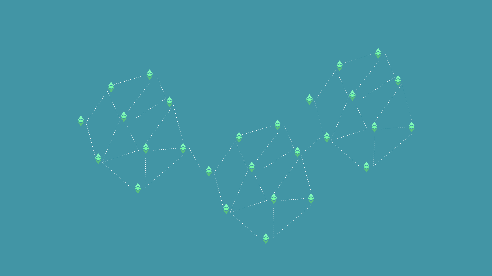

---
**You can listen to or watch this video here:**

<iframe width="560" height="315" src="https://www.youtube.com/embed/9yRQz7ZFU6U?si=ErQyBy0g7eayIP6e" title="YouTube video player" frameborder="0" allow="accelerometer; autoplay; clipboard-write; encrypted-media; gyroscope; picture-in-picture; web-share" allowfullscreen></iframe>

---

## What Is Security in Ethereum Classic?

Security in Ethereum Classic (ETC) and any blockchain that is well designed is to depend as least as possible on trusted third parties.

Trusted third parties are security holes because they hold our wealth and they hold our information, but they can make mistakes, commit fraud, be controlled by tyrannic governments, or abuse their position of trust.

The most effective way humans have found to reduce the risk of trusted third parties in history has been to divide their power and to distribute their functions and responsibilities in as many parts as possible.

This is at the heart of the purpose of blockchains such as ETC.

## The Security of Full Replication

In the case of Ethereum Classic this distribution is done by having the same database; which contains users’ accounts, balances, and dapps; copied identically in as many participating nodes as possible.

This full replication of the blockchain is the essence of the security model of a proof of work (POW) blockchain.

When the accounts, balances, and decentralized applications are replicated in more nodes, then the data is more redundant, and the more redundant the data is, the less likely it is that it will be corrupted or destroyed by man or nature.

Indeed, the full replication of ETC makes it even resistant to nuclear war!

## Common Mistakes in the Industry

Many think that proof of work blockchains are only protected by miners. This can’t be further from the truth because POW is just one part of the security model. The complete security model includes proof of work, full replication, verification by nodes, and the coordination problem of the social layer.

However, only proof of work blockchains as ETC can have this complete set of security guarantees.

Thinking that only “the community” or the social layer provides security is another gross error in the industry. 

As explained above, the lack of coordination ability by the ecosystem is only one of the security components, and the weakest one at that.

When blockchain designers have this confusion, then they introduce false security models such as proof of stake or proof of authority, which depend solely on the “honesty” of the social layer, thus re-centralizing their systems in trusted third parties all over again!

## Each Additional Node Subtracts a Fraction of Risk

If you think of it mathematically, then each additional node in a blockchain that has a replicated copy of the whole history of the chain adds an additional fraction of security or, said another way, subtracts a fraction of risk.

If there is only one computer in the system, then all the risk is resting on that computer. This can be described as having a risk of 1, which is the highest risk.

If there are two computers in the system, then the system will halve the risk, or the risk will be resting in two nodes instead of only one. This can be described as having a risk of 1/2.

If we keep adding nodes, for example, then three will lower the risk to 1/3, four to 1/4, five to 1/5, and so on, until the risk will tend to zero.

This is why blockchains such as ETC are so secure, because many nodes around the world have replicated its database. 

## The Importance of Globality

We will emphasize the term “around the world” above because if all the nodes of a blockchain were operated or held in the same place, then they would all count as one because one or very few people would controle them, thus bringing back the high dependency on trusted third parties.

The key is to have the nodes distributed in as many people, countries, regions, cultures, religions, languages, and jurisdictions as possible. 

This reduces even more the risk of coordination of the social layer and creates a physical redundancy that protects the system against natural disasters and also man made disasters such as tyranny, wars, excessive regulation, etc.

## Security at the Individual Level

Security is also enhanced individually by running a node in ETC.

When people use wallets, exchanges, dapps, and other services to process their transactions, manage their smart contracts, and check their balances all their activity goes through ETC blockchain nodes.

If these nodes belong to third parties, then users are depending on these entities as to the veracity of the information.

The most secure setup to use a blockchain is to run your own node and to verify by yourself all information and to process all transactions safely.

## Security at the Network Level

Unfortunately, there is no way to force, dictate, or to incentivize node operators safely to run more nodes in as many countries, regions, cultures, religions, languages, and jurisdictions as possible. Many have proposed some economic models or even are paying tokens to node operators to run more nodes, but these ideas usually have hidden risks.

The way blockchains gain nodes is by the individual incentives described in the previous section. Usually high value economic nodes, such as popular wallets, exchanges, institutional investors, high networth individuals, banks, custodians, and others, tend to run several nodes each because of the value at risk that they manage in blockchains such as ETC.

The more value at risk, the more node operators will want to run their own nodes, thus the more nodes will exist on the blockchain. This is one of the reasons why the increase in market capitalization of a POW cryptocurrency is so important and central to its design.

## The Purpose of Proof of Work Was Always Full Replication

The main goal of Cypherpunks when designing systems for a cryptocurrency was to have what they called [secure property titles with ownership authority](https://nakamotoinstitute.org/secure-property-titles/). And, the main security model was to replicate the data in as many nodes, in as many places as possible.

Proof of work was the solution that provided the consensus mechanism so that all nodes could agree on the same replicated database, but it was a means to the end of full replication.

As secondary benefits, POW provides hard money because the cost of creating the blocks in the blockchain is the same as creating the money; and a barrier to reverse the chain because the work will have to be done all over again to change past transactions.

These were additional benefits, but what was sought was full replication in as many nodes, in as many places as possible.

---

**Thank you for reading this article!**

To learn more about ETC please go to: https://ethereumclassic.org
