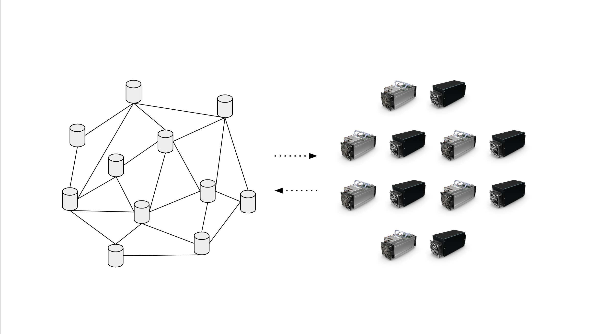

---
**You can listen to or watch this video here:**

<iframe width="560" height="315" src="https://www.youtube.com/embed/c7YjTRkwTqw?si=uXNDD9M_0zfu84BV" title="YouTube video player" frameborder="0" allow="accelerometer; autoplay; clipboard-write; encrypted-media; gyroscope; picture-in-picture; web-share" allowfullscreen></iframe>

---

There seems to be a lot confusion of what is the basic structure of a blockchain as Ethereum Classic (ETC) and what are nodes or what are miners.

Very frequently we hear people referring to “nodes” as “miners”, or even interchanging the terms “miner” and “staker” with “liquidity provider” and “yield harvester”.

In this post we will clarify some of these things by explaining the following topics:

- The structure of ETC
- What are nodes?
- What are miners?
- Why nodes and miners are the complete security model in a proof of work (POW)  blockchain
- Defining “mining”, “staking”, “LPs”, and “yield harvesters”

## The Structure of ETC

A blockchain such as ETC is essentially a global network that replicates a database, called a blockchain, in all participating computers in the network.

These computers constantly receive new transactions from users. 

When transactions are received by any machine, they immediately send them to the rest of the machines in the network so all may have a copy of the information. 

Some of these machines have the role of creating blocks of new data to add to the database, hence the term “blockchain”.

The rest of the computers in the network that don’t create blocks constantly receive and redistribute new transactions, as said above, and do the same with the new blocks that are built by the miners.

## What Are Nodes?

The participating computers in Ethereum Classic that don’t create blocks, but constantly receive and redistribute new transactions and do the same with the new blocks, are what are called “nodes”.

Nodes run the Core Geth ETC software client with all the protocol rules. These machines redistribute transactions and blocks, and keep a copy of the whole chain of blocks, or blockchain, in their local disk drive.

Nodes are located everywhere in the world and have the essential role of constantly verifying that transactions and blocks are correct and true.

The other essential role of nodes is to create a global level of redundancy in the blockchain of ETC; which contains the accounts, balances, and smart contracts of all users; so that it becomes practically impossible to take down or attack the network because it is replicated in so many places. 

## What Are Miners?

The computers in ETC that have the role of creating blocks of new transactions to add to the database are what are called “miners”.

Miners have that name because they use a lot of computing power, spending a lot of electricity, to build the blocks of data for ETC, and they get paid in ETC for this work. 

Because this work is so intense and they get paid in ETC coins, they resemble gold miners in the real world, and the coins resemble gold, hence the common term for ETC of “digital gold”.

The essential roles of miners are to secure the network by using a lot of work to build blocks, thus creating a barrier for attackers to hack it; to enable consensus between all computers in the network to know which is the correct block in every round; and make ETC hard money as the cost of creating the coins is equal to the cost of creating the blocks. 

## Why Nodes and Miners Are the Complete Security Model

The interesting thing about the essential roles of nodes and miners in Ethereum Classic is that, together, they complement each other and enable an extremely safe and complete security model.

As nodes receive new transactions, they replicate them across the whole network globally. As miners receive these transactions, they group them in batches, do a lot of work, and build blocks. When these blocks are created, they are immediately sent to the nodes for verification, to make sure that the miners were honest in their work and that the transactions were correct. When all these steps are completed, then the blocks are included in the database as the latest blocks in the chain and ETC coins are paid to the miners.

All this process combined creates the most secure operating and storage environment in the world, where the ETC cryptocurrency and its applications are hosted. 

## Defining “Mining”, “Staking”, “LPs”, and “Yield Harvesters”

Now that we know what are nodes and miners in ETC we can clarify the confusions.

The first thing to understand is that nodes and miners are the only participating computers in the base ETC blockchain. There is no other type.

The second thing to understand is that decentralized applications, or dapps, that are deployed in ETC and provide services to users are not nodes, miners, nor part of the blockchain network itself. They are really software applications that are hosted in Ethereum Classic, but not part of it.

When dapps such as swapping decentralized exchanges use liquidity providers and pay fees to them for their service, that is not mining nor staking. That is just providing liquidity and getting a return for it.

When users deposit their ETC in dapps that constantly look for the best yields or fees to be earned in various DeFi applications, that is not mining nor staking. That is yield harvesting by moving money from dapp to dapp depending on the returns they offer.

When hardware node products create tokens to pay people who run their nodes, that is not mining. That is just issuing an arbitrary token to pay for a service.

Finally, there is no such thing as “staking” in Ethereum Classic. ETC is a proof of work blockchain, therefore it only has mining and miners.

“Staking” is a low security method that enables consensus in proof of stake networks such as Ethereum that has participants who deposit money, hence “stake”, in special accounts for which they are given the right to create blocks and earn coins for that function.

---

**Thank you for reading this article!**

To learn more about ETC please go to: https://ethereumclassic.org
