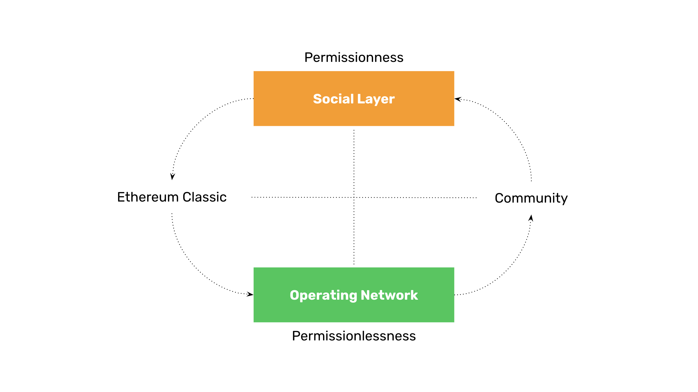

---
**由此收听或观看本期内容:**

<iframe width="560" height="315" src="https://www.youtube.com/embed/qEx0iPgY6WY?si=d2lEx8Hhko2fF-5z" title="YouTube video player" frameborder="0" allow="accelerometer; autoplay; clipboard-write; encrypted-media; gyroscope; picture-in-picture; web-share" allowfullscreen></iframe>

---

在上一堂课（第9课）中，我们讨论了在工作量证明（POW）区块链中不可变性的含义。

我们解释了不可变性的哲学如何保护用户的账户、余额以及去中心化应用（DApps）的过去和未来历史。

在公共POW区块链中，另一个强烈的原则是无需许可。

然而，在本课程（第10课）中，我们将解释在POW区块链中无需许可的范式存在悖论。

与预期相反，无需许可并非在所有情况下都是好事！

## 什么是无需许可？

无需许可意味着世界上任何人都可以自由运行节点、进行挖矿、拥有账户和余额，并自由使用工作量证明区块链，如以太经典（ETC）和比特币（BTC），而无需得到任何人、实体或政府的同意或批准。

相反，传统银行系统是需要许可的：因为我们的资金由银行保管，所以唯一访问它的方式是通过它们专有的网站、应用程序或分支机构，并且我们必须证明我们的身份，以便他们允许我们提取或转移我们自己的货币。

在POW区块链中，在原始层面上，只需下载软件，来自世界各地的任何人都可以加入系统，开始发送和接收资金。

## 无需许可的悖论

然而，POW区块链的无需许可存在一个悖论。

POW网络中的无需许可悖论是这样的：

**为了最大程度地提高POW区块链的无需许可性，您必须在最大程度地减少对其最大程度影响的人群的无需许可性。**

换句话说，POW区块链的社交层不应该是无需许可的。

在POW操作网络中，许可的访问是不好的。在POW区块链社区中，有许可的访问是好的。

## 什么是有许可性？

与无需许可相反，有许可性意味着必须对人们进行审查，并仅在他们分享系统价值观的情况下允许他们参与POW区块链社区。

如果他们不同意原则，或者如果他们口头上表示同意但在实践中没有一贯的行为，那么他们应该被排除在社区之外。

例如，如果ETC的核心原则之一是不可变性，那么任何提出逆转链或因任何原因进行非正常状态更改的人都应该被禁止参与社区的任何资产。

通过“社区资产”指的是社区成员用来表达他们的意见或为所涉及的区块链工作的公共论坛。

## POW区块链中的安全是什么？

POW区块链中的安全性在于尽可能少地依赖受信任的第三方。

受信任的第三方是安全隐患，因为它们掌握着我们的财富和信息，但它们可能犯错、实施欺诈、受到专制政府的控制，或滥用其信任的位置。

在工作量证明网络中，最影响系统的人群是某种程度上的受信任的第三方，因为他们是维护协议、提出新规则并影响区块链发展方向的人。

这就是为什么在接纳社区成员时必须特别注意和小心的原因。

## 什么是操作网络安全？

为了解释这种方法的合理性，值得解释一下POW区块链的安全模型。

区块链是由人拥有并操作的节点和矿工组成的。实际的网络本身，其中计算机运行软件协议，可以称为操作网络。

这是由POW共识机制保护的环境，它持有包含账户、余额和DApps的数据库，称为“区块链”。

代表操作网络的物理层是向全球所有人提供区块链服务的平台，这应该是无需许可的，并且可以免费使用。

## 什么是社交层安全？

区块链的社交层包括拥有节点和矿工的所有人、管理基本协议的开发人员、构建DApps的企业家、支持系统的任何非营利组织，以及每天积极参与支持和维护网络的许多科学家和志愿者。

由于节点和矿工分布在世界各地，他们是必须运行带有系统规则的软件来实施和部署更改的人，因此很难在大规模上接受可能损害或降低系统的任何有争议的更改。这就是所谓的协调问题。

然而，更为专注的核心社区是社交层中最具影响力的部分。从这个群体中可能引入不良更改。

## 社交层的威胁是什么？

想一想这个问题：如果ETC的核心原则之一是无需许可，那么为什么提出新规则的人，其规则将减少或消除无需许可，应该被禁止参与社区的任何资产呢？

你看到悖论了吗？

然而，这个看似无法解决的问题实际上在我们意识到，有许可性规则只适用于社交层时得到解决，而在那里人类往往存在分歧，通常在竞争控制权时会试图欺骗对方。

威胁在于通过这个层引入可能使系统中心化的不良更改。

## 许可性如何降低社交层的风险？

在POW区块链中，更改应该是缓慢的，对新规则的决策过程应该是漫长且经过深入辩论的。

比特币和ETC等系统不是我们手机上的Web应用程序或有趣的技术小玩意。而高度安全的公共区块链的目标不是创新。

这些平台是一个全球规模的、供全球任何人使用的货币、财产、协议和基本权利的系统，无论他们的人类状况如何。

当由于缺乏了解或坚持损害和降低系统的不良行为的人提出更改时，从核心社区中排除这些个体会减少这些攻击的频率，从而降低了不良更改传播到操作网络的风险。

---

**感谢阅读本文！**

要了解有关ETC的更多信息，请访问：https://ethereumclassic.org
