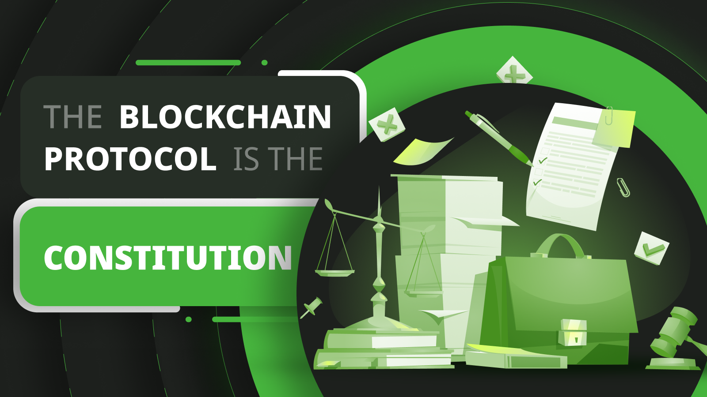
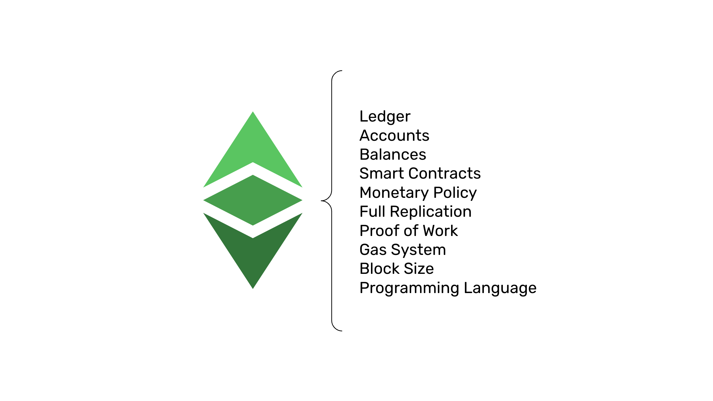

---
**You can listen to or watch this video here:**

<iframe width="560" height="315" src="https://www.youtube.com/embed/Y6qcNnmB5TI?si=Sq4m8kDko_5fQG3m" title="YouTube video player" frameborder="0" allow="accelerometer; autoplay; clipboard-write; encrypted-media; gyroscope; picture-in-picture; web-share" allowfullscreen></iframe>

---

## My Anecdote With Nick Szabo

In 2016, when Nick Szabo, a blockchain pioneer, an I were working on some projects in common, I suggested him that maybe the best thing to organize the Bitcoin community would be to create a constitution, that constitutions had worked well for countries, and therefore one should work well for Bitcoin.

His response was a short and strong rebuke!

From then on I understood that anything to do with traditional systems, our notions of organized society, or group relations and decision making processes were diametrically opposite of how they should work on blockchains.

After all these years of experience in the industry, much thought, and observing the natural behavior of industry participants and their biases, I will explain in this post my views about governance of blockchain systems.

## The Bias to Create Governance Systems

Because in modern society we are used to living in cities, districts, states, provinces, and countries, then we have developed a notion that those organizational models must be good, as we can see their results in our own societies.

The model of the American constitution and how it has proliferated around the world, promoting the benefits of “The Republic” and “Democracy” in many places, has influenced crypto communities to think of constitutions, later called governance systems, for blockchains.

Many of these have been implemented, especially in proof of stake or proof of authority networks, where the social layer really has total control of the systems.

However, this bias has not escaped participants of proof of work blockchains as well.

## Governance Transfers Power Back to People

The problem is that constitutions or governance systems for blockchains actually transfer power back to people, again.

See, the whole purpose of blockchains is to actually take out power from people. Blockchains are systems specifically designed to reduce the dependency on trusted third parties.

Trusted third parties are security holes because they manage our wealth and information, but they frequently make mistakes, incur in bad or irresponsible behavior, and many times abuse their position of trust.

Blockchain communities and ecosystems may be considered trusted third parties, and they would be especially risky if formal governance were to be implemented.

## The Paradigm Is Exactly the Opposite: Ungovernance

This is why the central focus of blockchains, especially proof of work networks, has been what is called “trust minimization”, which is to depend the least possible on these trusted third parties.

Indeed, the paradigm in proof of work blockchains such as Ethereum Classic (ETC), is exactly the opposite of governance or constitutions, the model followed by these systems is “ungovernance”, a term coined by Nick Szabo himself!

Ungovernance means that the community that is closest to the blockchain system, and influences its future direction the most, has no rules of how to make decisions. They just respond to their notions of what is better for them and the system at large.

## In Societies Conflict Is Bad, in Blockchains Conflict Is Good

Indeed, in societies it is absolutely natural and necessary to develop governance systems because the alternative is physical violence, and physical violence is very costly and detrimental to all participants.

However, with regard to proof of work blockchain systems, these technologies actually eliminate physical violence from the equation because all participants are spread globally in a decentralized manner, and they just collaborate on a set of rules, called the protocol, that is protected and enforced by math and power in the form of electricity.

Nevertheless, the lack of governance in blockchains does create a lot of social friction as to the direction and future changes of the systems (thus the bias to create governance structures).

But, because they are decentralized, and change and innovation may bring back the risk of centralization, then the fact that they may encounter conflict at the social layer is actually good because it reduces these risks.

## Blockchains Are Not About Innovation or Change

The consequence of community conflict in blockchains with no governance or ruled by ungovernance, is that decision making becomes very cumbersome and slow.

However, as said above, this is good in the case of blockchains that purport to be stable and secure. The more complex a computer system is, the more attack surface it will have. 

Similarly, the more change and new rules are introduced, the more argument surface there will be, and more argument surface means a higher chance of bad rules being integrated into the system.

The goals of blockchains are stability and security, not innovation and change. This has always been a difficult thing to understand for most blockchain participants. 

## Blockchains Are About Stability

Stability does not mean mere slowness for the sake of no change. Blockchains are ledgers that hold the accounts, balances, and smart contracts of people around the world. 

These components mean a lot to these users, and in many case are the most basic rights they can count on. These may be as basic as just preserving the value of their saving, being able to protect and keep their property, or even protect their lives and livelihoods.

Consequently, stability and security mean certainty that their assets and applications will be there reliably and consistently. This is why the core principles of a blockchain as ETC are decentralization, immutability, censorship resistance, and permissionlessness. 

## The Blockchain Protocol Is the Constitution

Because the blockchain protocol, or the set of rules that keep it working in a decentralized manner, is stable and secure, then it provides the most value to users, operators, and miners on a global scale.

Because users, operators, and miners wish to maintain this stability and security, then the set of rules of the protocol implicitly becomes the rules that govern the behaviors of all participants.

In game theory and economics they call these things “incentives”. 

When a set of rules creates incentives that sustain a system, providing value in the long term, then that set of rules becomes more certain and resilient as the incentives of participants are to preserve and follow it, becoming, in effect, their “constitution” for that particular system.

---

**Thank you for reading this article!**

To learn more about ETC please go to: https://ethereumclassic.org
