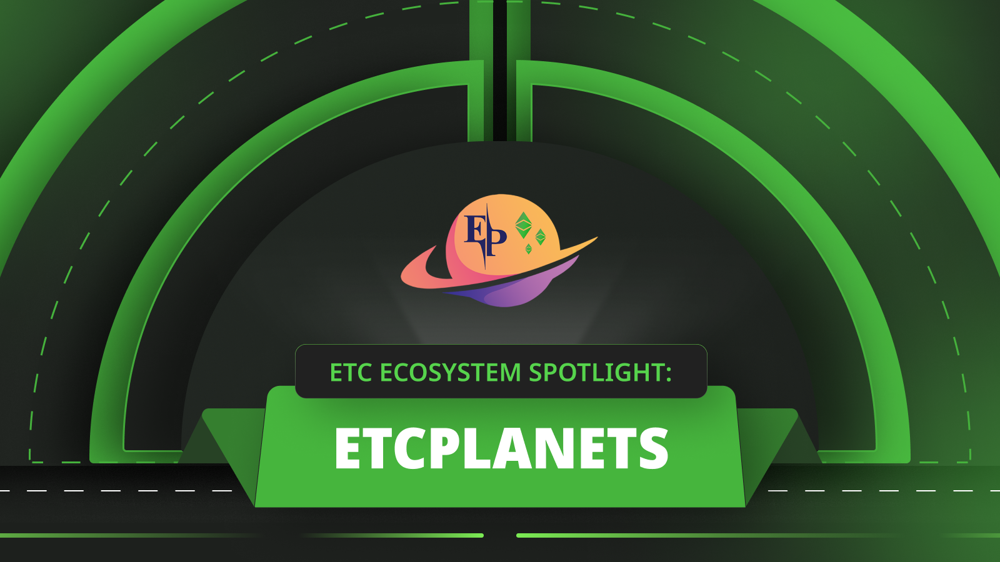
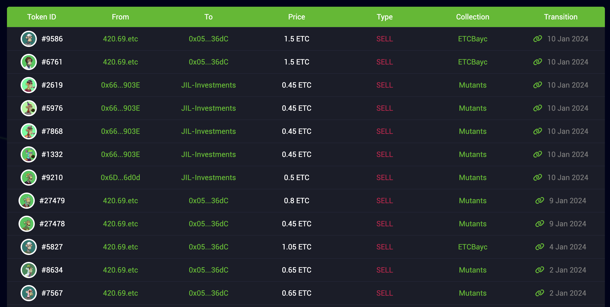
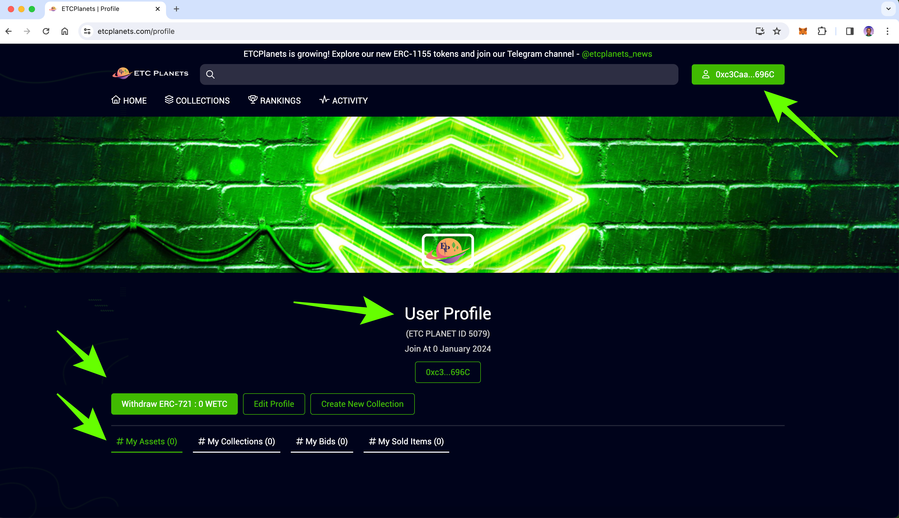
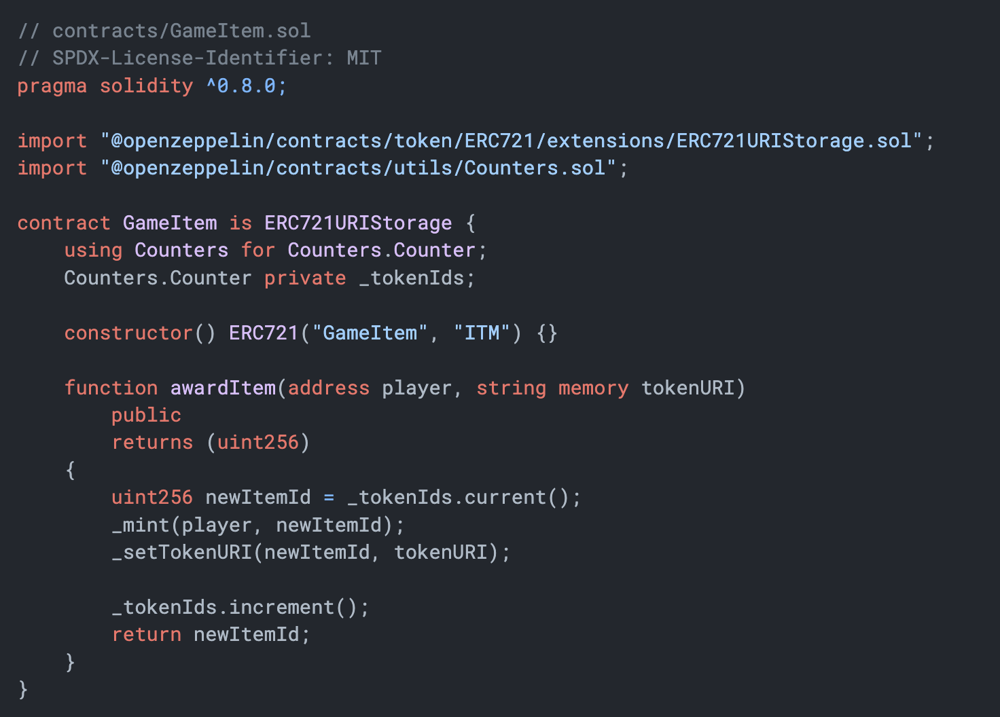
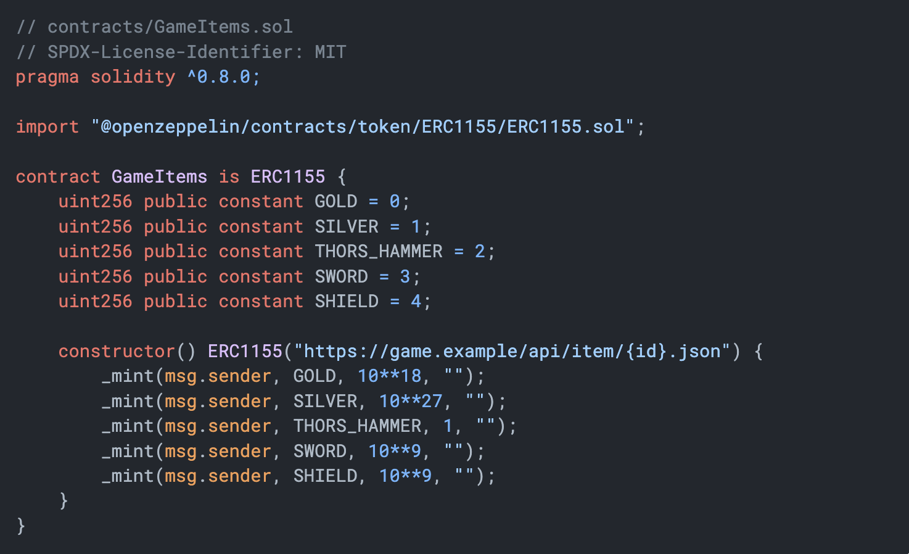
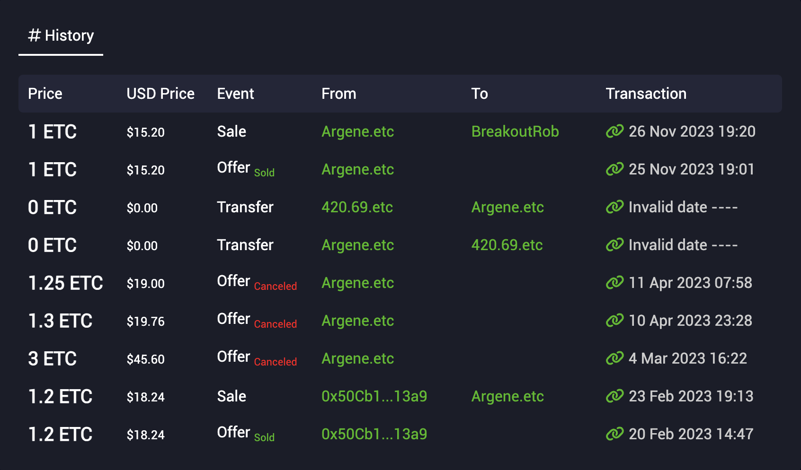
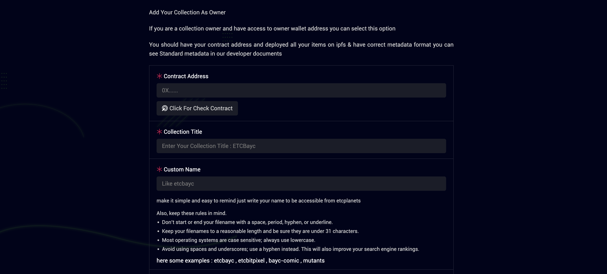
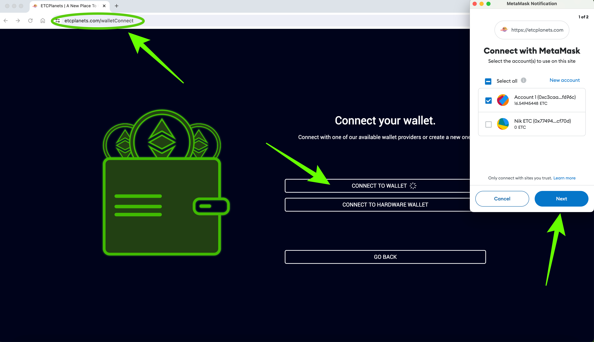

---
**由此收听或观看本期内容:**

<iframe width="560" height="315" src="https://www.youtube.com/embed/onfa9_z2G00?si=4k-jJRNKQDyaN8Wi" title="YouTube video player" frameborder="0" allow="accelerometer; autoplay; clipboard-write; encrypted-media; gyroscope; picture-in-picture; web-share" allowfullscreen></iframe>

---

## 什么是ETCPlanets？

ETCPlanets是由[DiakoLabs团队](https://diakolabs.org/)在以太坊经典（ETC）上创建的去中心化应用程序（DApp）。

它是一个NFT市场，汇聚了ETC中最受欢迎的NFT收藏品。

NFT收藏通常是由同一团队或艺术家创建的一系列NFT，以数字收藏品的形式在ETC上出售，然后可以在二级市场上作为单个单位进行交易。

ETCPlanets是一个专业设计和构建的市场，作为许多NFT的二级市场。

## 什么是NFT市场？

NFT市场基本上汇聚了许多NFT创作者的收藏品，并为收藏家（需求方）和创作者（供应方）提供更简化和高效的用户体验。

每个NFT在交易所中都是独立列出的，可以在收藏家之间交易。

该市场不仅提供汇聚，还提供价格发现透明度、交易效率和便捷的NFT交易结算。

类似ETCPlanets的NFT平台甚至可能是除了原始收藏市场之外，还能实现许多其他类别的NFT交易的基础设施。

这些平台可能汇聚房地产、汽车等外部资产交易，因为这些资产在诸如ETC的区块链上以NFT形式表示。

## 对于收藏家的特点是什么？

术语“收藏家”通常用于描述购买和交易NFT的买家，他们投资并维护NFT的投资组合。

收藏家可以在ETCPlanets上拥有一个带有其所有NFT清单的个人资料页面，并可以通过收藏对它们进行分类和划分。

收藏家还可以通过资产、收藏、在市场上放置的竞标以及已售出的物品来跟踪其投资组合活动。

ETCPlanets的交易区域允许收藏家为NFT提出竞标和报价。

随着NFT市场的进一步发展，公众将能够通过这些市场购买和销售公寓、房屋、汽车、船只等外部资产。

## 什么是ERC-721智能合约？

NFT代表“非同质化代币”，它们是在可编程区块链（如ETC）上的智能合约。

使用的智能合约标准称为[ERC-721](https://ethereumclassic.org/blog/2023-09-21-ethereum-classic-course-35-non-fungible-tokens-nfts)。与[ERC-20](https://ethereumclassic.org/blog/2023-06-08-ethereum-classic-course-25-what-are-erc-20-tokens)标准可替代单位不同，它们是区块链上的非同质化或独特对象。

NFT可以与物理或数字对象相关联，例如汽车、房地产、数字图像或在线文件，通过元数据。

这类非同质对象的重要特点是它们是可转让的，可以买卖，并且区块链充当财产登记处。

## 什么是ERC-1155智能合约？

ERC-1155智能合约是将ERC-20用于可替代代币的智能合约与将ERC-721用于非同质化代币的智能合约结合起来的标准。

通过这样做，创作者可以在同一个智能合约中提供可替代和非同质化代币。

此外，他们可以在同一个DApp中提供多种类型的ERC-20样式代币和ERC-721样式代币，因此这使得它们具有更大的灵活性，并为用户节省了大量的燃气费用。

例如，ERC-1155标准非常适合游戏行业。

ETCPlanets支持在平台上交易的ERC-721和ERC-1155代币。

## 什么是NFT历史功能？

ETCPlanets具有一个很酷的功能，随着它们在其NFT交易DApp上汇聚收藏品，它们还汇聚了平台上每个资产的历史信息。

例如，对于一个NFT，他们可能显示其价格历史、销售历史、报价和转移历史，进行交易的用户以及交易日期。

这些信息对公众开放。

## “创建收藏”功能是用于什么的？

如果您是NFT创作者，并希望在ETCPlanets上列出在ETC区块链上部署的NFT，那么您将使用“[创建收藏](https://etcplanets.com/collection/create)”功能。

当您单击它时，您将看到一个表格，填写您的收藏或要列出的资产的所有数据。

一旦创建了您的收藏，它将显示为ETCPlanets平台上可交易的收藏之一。

在未来，房地产开发商和汽车公司也将以相同的方式处理房屋、公寓、汽车和卡车。

NFT标准也可能用于这些资产的租赁。

## ETC用户如何开始使用ETCPLanets？

要开始使用ETCPlanets，您只需要一个ETC钱包。

首先，您需要访问：

https://etcplanets.com/walletConnect

然后，按照上图所示连接您的钱包。

一旦将您的钱包与DApp关联，您就可以开始使用其作为创作者或收藏家的所有功能。

---

**感谢阅读本文！**

要了解更多关于ETC的信息，请访问：https://ethereumclassic.org
