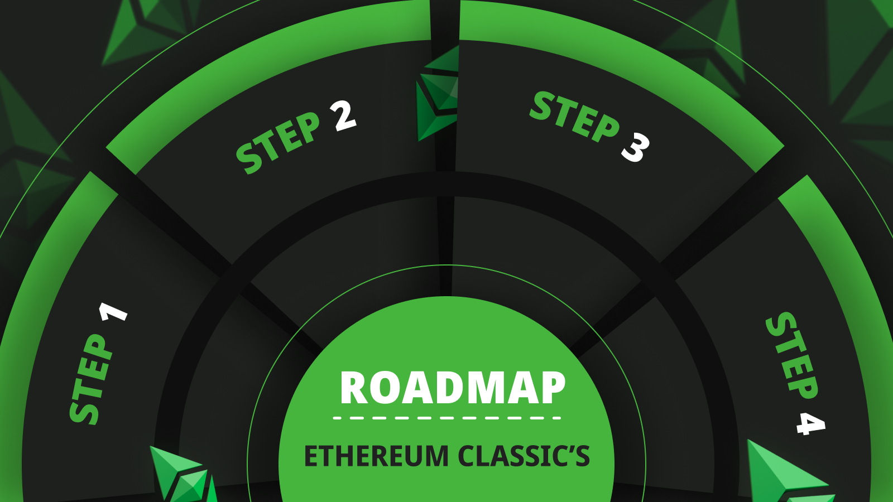
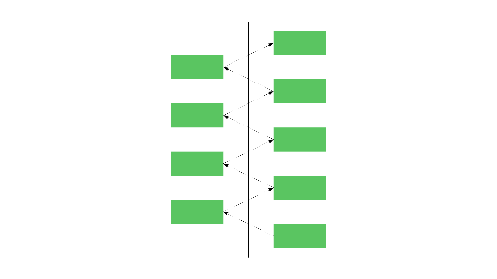

---
**由此收听或观看本期内容:**

<iframe width="560" height="315" src="https://www.youtube.com/embed/zuJGfrp7kGw?si=pQhwEj-GDJkuVwOh" title="YouTube video player" frameborder="0" allow="accelerometer; autoplay; clipboard-write; encrypted-media; gyroscope; picture-in-picture; web-share" allowfullscreen></iframe>

---

在2023年4月8日，以太坊经典（ETC）的重要贡献者之一Istora发表了他的文章“Roadmaps and Pathways”（[文章链接](https://ethereumclassic.org/blog/2023-04-08-roadmaps-and-pathways)），解释了ETC的性质，即其是分散的，并且由于这种分散性，它自然不具备正式的路线图。

在区块链行业存在一个误解，即区块链项目必须有清晰、精心制定、市场推广和专业建立的路线图。然而，事实并非如此。

Istora非常好地解释了这一点，并提出了他认为ETC生态系统在不久的将来应该解决的一些建议性工作。

在这篇文章中，我将表达我对Istora的认同，加上我的观点，并提出我认为ETC应首先进行的一些项目。

## 去中心化项目无法拥有路线图

认为项目需要路线图才有价值的观念是错误的，是由浅薄的思维交易者和骗子推动的，他们在假装分散的伪装下推销由中心化ICO和风险投资支持的项目。

事实上，拥有专业而周密的路线图正是他们欺骗的揭示。去中心化项目无法拥有路线图，因为没有权威来制定和确定路线图！

Istora最好地表达了这一点：

*“相反，ETC拥有‘去中心化路线图’，该路线图不断开放进行辩论、质疑，并且随着时间的推移不可避免地发生变化。通过拒绝采用传统路线图的想法，该项目简单地接受了这样一个事实，即拥有固定计划与去中心化背景不相容。”*

## 什么是粗糙共识？

真正去中心化的项目没有路线图，因为很难就任何事情达成一致。变化是通过所谓的“[粗糙共识](https://en.wikipedia.org/wiki/Rough_consensus)”来决定的。

在去中心化区块链中，粗糙共识意味着每个节点操作员、矿工、开发者和用户都将做自己想做的事情，并且当有人有一个好主意时，大多数人会接受它。当大多数人接受一个想法时，它通常会在整个系统中得以实施。就是这么简单。

在这种范式下，新想法的涌现必然是非结构化和混乱的。

这带我想到另一个相关的主题，即“毒性”的主题：在无中央权威强加秩序的混乱、去中心化的系统中，总会存在分歧，而唯一强加自己意愿的方式就是通过毒性。这是去中心化的标志。

## 什么是ECIP过程？

重要的是要注意，ETC将[永远是](https://ethereumclassic.org/blog/2023-04-04-ethereum-classic-will-always-be-state-of-the-art-technology)尖端技术。这正是去中心化路线图（或者更准确地说，没有路线图）的产物。

以太坊经典是EVM标准的一部分，那里有许多科学家和开发者不断解决问题并提出新的想法。

ETC将始终采纳新的变化：

a) 使其与EVM标准保持一致，并

b) 对ETC的[去中心主义](https://ethereumclassic.org/why-classic/decentralism)哲学最为有利的变化。

ECIP过程（以太坊经典改进提案过程）是用于所有ETC生态系统参与者提出新想法和变化的方法。

通过这个过程，其[独立的网站](https://ecips.ethereumclassic.org/)上的所有新想法都在进行辩论和决策。

通过观察ECIP提案列表，可以了解到ETC的去中心化“路径”，正如Istora所描述的那样。

## 没有路线图的优势

传统的路线图是少数人类头脑的产物，他们聚在一起试图猜测世界需要什么。

像ETC这样的技术的去中心化路径具有全球的意见，只有最好的想法才能占据主导地位。

Istora总结得很好：去中心化的路径具有：

- 更大的灵活性和适应性，
- 由社区驱动的决策制定，
- 减少中心化风险和抵御社会攻击的能力，以及
- 从其他项目的经验中学习的优势。

## 没有路线图的缺点

然而，Istora列举了一些对没有正式路线图的认知上的缺点。他是对的，这些是“认知上”的缺点，因为它们并不是真实存在的。只有具有中心主义世界观的人才会有这些认知。

我个人认为像ETC这样高度安全的区块链采用去中心化路径是没有缺点的，甚至比特币也是如此。

有人认为存在不确定性，实际上却是确定性。由委员会和开发团队制定的正式路线图实际上代表了值得信赖的第三方风险，而真正安全的区块链正是要摆脱这种风险！

“缓慢”或“没有创新”也是骗子们散布的虚假观点，他们宣传自己的项目是“好”的，因为它们变化很大。但是，深思熟虑的观察者会发现，快速创新实际上是中心化的另一个标志。

## 2024年的建议性路线图

关于我为ETC提出的建议，以下是我对2024年的一些建议：

**1. 取消MESS：** 我很高兴报告，在Spiral硬分叉的ETC节点软件中，[这已经完成](https://github.com/orgs/ethereumclassic/discussions/522)！

**2. 将核心Geth移至以太坊经典社区仓库：** 这将恢复社区对节点客户端软件的主权。

**3. 解决与账户和EVM[版本控制](https://etherplan.com/2019/10/26/backward-compatibility-what-is-account-versioning-in-ethereum-classic/9440/)系统的向后兼容性：** 这将解决每次硬分叉时智能合约破裂的风险。

**4. 开发工具以轻松审计ETC的真实供应量：** 这将为ETC的正确供应量提供确定性。

**5. 将区块大小设置为800万气体：** 这将使矿工失去更改区块大小的能力，就像[最近发生的](https://ethereumclassic.org/blog/2023-12-20-how-do-miners-change-the-gas-limit-in-ethereum-classic)那样。

---

**感谢阅读本文！**

要了解有关ETC的更多信息，请访问：https://ethereumclassic.org
