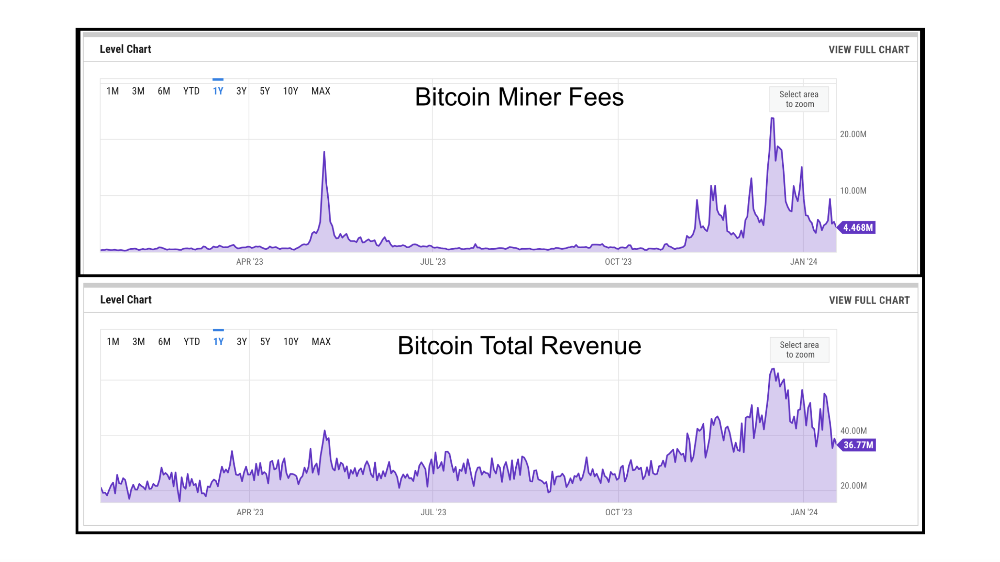

---
**You can listen to or watch this video here:**

<iframe width="560" height="315" src="https://www.youtube.com/embed/XdORWyiTKhs?si=azLA-atOpaYUbt3M" title="YouTube video player" frameborder="0" allow="accelerometer; autoplay; clipboard-write; encrypted-media; gyroscope; picture-in-picture; web-share" allowfullscreen></iframe>

---

In the previous class, 11, we talked about how Ethereum (ETH) and Ethereum Classic (ETC) could complement each other by taking advantage and combining proof of stake’s (POS’s) scalability with proof of work’s (POW’s) security.

POW blockchains pay miners for their important function in two ways; the first is by creating coins in every block that are deposited in miners’ accounts, and the second is that miners collect the fees all users pay to process their transactions.

In this class, 12, we will explain an interesting occurrence that happened in 2020 in the Ethereum blockchain, when it was a POW network, which is that it proved, even before Bitcoin (BTC), that the POW fee model will work!

## The Perceived Threat of Proof of Work Blockchains

This occurrence in Ethereum was very important because for a long time many in the crypto community had been questioning if, in the future, fees alone would be enough to pay for the important role miners fulfill as the decreasing block reward schedule of BTC would diminish as per its monetary policy.

The theory went, as Paul Sztorc wrote in 2019 in his widely read essay “[Security Budget in the Long Term](http://www.truthcoin.info/blog/security-budget/)”, that when Bitcoin blocks were to be filled, transaction fees would go up in price and, consequently, users would stop using Bitcoin and start sending their transactions through other blockchains with cheaper fees.

As this disintermediation happened the value of BTC would go down, and, with it, the hash rate of the network, therefore Bitcoin would become insecure and economically infeasible.

## My Response to Paul Sztorc

Shortly after Mr. Sztorc’s essay I published my response titled “[Why the Bitcoin Fee Model Will Work](https://etherplan.com/2019/05/17/why-the-bitcoin-fee-model-will-work/7587/)” where I gave the following reasons why POW blockchains would be viable in the long term through fees.

**1. There will be very few large POW blockchains in the future:** Because of network effects and an aversion to risk, the market will eventually select very few, perhaps only 3 or 4, very large blockchains to be the base layer of the whole industry. There will be no cheap alternatives for users to send their transactions, except for layer 2 systems that will work on Bitcoin, ETC, and other POW chains.

**2. Security costs:** It is not the same to move value through BTC than through any other cheap chain. Security, permissionlessness, and censorship resistance cost money and people will pay for it. This is the whole point of POW blockchains!

**3. Exchange costs:** When moving value, if users were to sell the expensive POW blockchain coins with the high fees and then buy another coin, send the money through this other chain, and then sell the other coin to buy back the original POW blockchain coins, these frictional costs, which include the risks of doing all these steps, would cancel whatever savings people would have by not using the expensive blockchain.

In the essay I explained more reasons in more detail. To read my whole rationale I recommend the reader to read the post I linked above.

## My Email to Vitalik Buterin in September of 2020

This is an email I sent to Vitalik Buterin on September 18th 2020: 

*"Hi Vitalik,*

*[The] latest ETH stats are impressive and, I think, a significant undeniable achievement:*

*- 1.4m daily transactions*

*– $17m in transaction fees*

*– Average fee per transaction $12*

*– $5.14m in rewards*

*– Market cap of ETH: $43 billion*

*– Market cap of ERC20 tokens: $50 billion*

*– Wrapped Bitcoin inside Ethereum: $800m*

*– Hash rate: 245 TH/s*

*I think the evolution and development of Ethereum in the last five years, although you know I completely disagree with many policies and decisions that have been made, are proof of the high value of the current [POW] model."*

## How Ethereum Proved that POW Fees Will Work

What I was referring to was that the block size limit in Ethereum at the time, as a POW blockchain, with its scarce space and low transaction count, was generating fees that were higher than the block rewards for miners. 

As I pointed out in the email, in the previous day, the fees paid to miners were $17 million and the block rewards were $5.14 million. This was proof, as I had anticipated, that fees would finance security in the long term for POW blockchains.

The second way Ethereum proved that people would not move value through competing chains just to avoid higher fees was that ETH had very high fees for a long time between 2020 and 2021 and few migrated to ETC, for example, which had very low fees during the same time period, just to send money through a cheaper chain.

## Ethereum Fees to Miners in the Press

The event that fees were higher than miner block rewards in Ethereum was important enough that it was covered by the press at the time. For example in the following article on The Block:

“[First time in Ethereum’s history, miners made more from fees than from block rewards](https://finance.yahoo.com/news/first-time-ethereum-history-miners-125143799.html)”.

This was big news at the time precisely because of the fear that fees would never cover for miner rewards when those diminished. 

## Bitcoin Has Been Increasing Fees to Miners

On May 8 2023 Decrypt published the article titled  “[Bitcoin Transaction Fees Surpass Block Rewards for the First Time Since 2017](https://decrypt.co/139345/bitcoin-transaction-fees-surpass-block-rewards)”. 

This was important because although Ethereum had proven the model, BTC had only briefly during the 2017 bubble paid miners more fees than block rewards.

However, Bitcoin has been generating increasing fees per day during 2023 as seen in the charts in this section.

The reason is not only that there is more demand for the coin, but there are some new dapps that are using block space to “imprint” NFTs. 

However, with the enormous value Bitcoin’ security has, transaction fees are likely to continue to climb higher.

As Ethereum proved, it is only a matter of time until the fees surpass block rewards persistently and turn into the main financing method of security. 

## Nakamoto Consensus Is a Sound Consensus and Security System

In summary, Nakamoto Consensus is a sound consensus and security system because of the following reasons: 

1. It provides consensus through the sheer work miners do to produce blocks
2. It is truly decentralized because this consensus mechanism does not need for nodes to check with trusted third parties which is the correct block in each round
3. It creates a barrier to reverse transactions because to change past blocks the work has to be done all over again  
4. It provides sound money because the cost of creating the money is equal to the cost of creating the blocks
5. It is economically feasible because fees have and will pay for future security

---

**Thank you for reading this article!**

To learn more about ETC please go to: https://ethereumclassic.org
