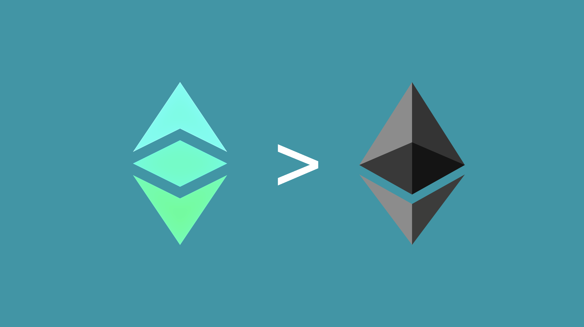

---
**欢迎收听或观看本期内容:**

<iframe width="560" height="315" src="https://www.youtube.com/embed/d58UxyXsLVw?si=JsH4XGWTA86QglHm" title="YouTube video player" frameborder="0" allow="accelerometer; autoplay; clipboard-write; encrypted-media; gyroscope; picture-in-picture; web-share" allowfullscreen></iframe>

---

## 以太坊和以太经典的故事

当最初的智能合约区块链于2015年推出时，以太经典（ETC）和以太坊（ETH）曾经是同一条链。

然后，在2016年，一个名为“TheDAO”的dapp被黑客攻击，社区的大部分成员决定违反不可变性，从黑客那里夺回资金。

硬分叉以扭转链的决定是在2016年7月20日进行的。在那一刻，少数反对违反网络原则的社区成员决定继续运行原始、未经篡改的链，并将其称为“以太经典”。

从那时起，以太经典和以太坊一直是两个完全不同的区块链，具有两种截然不同的哲学观点。

这些差异的根本原因是为什么ETC的智能合约优于ETH的智能合约。

## 什么是智能合约

但在我们解释为什么ETC的智能合约优于ETH的智能合约之前，让我们首先解释[什么是智能合约](https://ethereumclassic.org/blog/2023-03-23-ethereum-classic-course-14-what-are-smart-contracts)。

智能合约是区块链中的软件程序，可以根据发送给它们的指令，在地址之间移动加密货币和其他资产。

智能合约是所谓的“去中心化应用程序”或“[dapps](https://ethereumclassic.org/blog/2023-03-30-ethereum-classic-course-15-what-are-dapps)”的后端代码，并将是[Web3](https://ethereumclassic.org/blog/2023-11-14-ethereum-classic-and-the-web3)的主要技术。

## 以太坊和以太经典中的智能合约工作原理

以太坊和以太经典中的智能合约工作方式完全相同。

当dapp开发者将软件程序发送到ETC或ETH时，它会在全球系统的所有节点中复制。

这种复制使得dapps去中心化，因为它们在世界各地的许多计算机上都是冗余的，使它们非常难以被摧毁或受到自然或人为的干扰。

一旦在ETH和ETC中部署了智能合约，用户可以向它们发送交易以使用其提供的服务。

智能合约可用于去中心化交易所、域名服务、财产登记、NFT市场等。

## 什么是共识机制

然而，以太经典和以太坊之间的重大区别在于它们使用不同的共识机制。

共识机制是一种让全球网络中的所有计算机在同一时间保持一致的方法。这是在比特币发明之前缺失的组成部分。

由于ETH和ETC最初是相同的，但后来分裂并采用了不同的哲学观点，其中一个以太坊决定更改其共识机制。

ETC使用原始的“工作证明（POW）”系统，而ETH迁移到了称为“权益证明（POS）”的不同系统。

## 权益证明是集中的

以太坊的哲学被称为“[社会共识](https://ethereum.org/developers/docs/consensus-mechanisms/pos/faqs#is-pos-secure)”，整个系统的设计都朝着这个原则发展。

社会共识意味着每当系统发生故障或任何不受系统控制的事情时，他们将聚集起来，通过多数投票决定如何解决问题或更改系统规则。

这适用于他们不喜欢的账户和人的账户余额、他们认为不合适的dapps、货币政策或任何其他元素或功能。

权益证明有利于这一点，因为它是一个易于[集中](https://ethereumclassic.org/blog/2023-12-27-ethereum-classic-at-scale-is-decentralized-ethereum-is-centralized)的系统。

社会共识在POS中是不可避免的，并且是一种捕获的开放大门，因为默认情况下它建立了一个决定解决问题、链分裂和未来更改的一群人，就像他们决定在TheDAO事件中扭转资金一样！

## 工作证明是去中心化的

相比之下，以太经典的哲学是“[法律即代码](https://ethereumclassic.org/why-classic/code-is-law)”，这不仅是一种理想，也是一种实际情况，因为系统的设计遵循这个理念。

POW是真正去中心化、[安全和完整的](https://etherplan.com/2020/03/21/why-proof-of-work-based-nakamoto-consensus-is-secure-and-complete/10509/)，因为它在不依赖信任的第三方的情况下实现共识。

这使得系统中的每个节点和矿工都是绝对独立和自由的，没有任何精英群体可以随意更改区块链中的任何内容。

这意味着账户、余额和dapps是不可变的，不可能被篡改，因此有“法律即代码”的说法。

## 因此，在以太经典中智能合约更优秀

如果区块链技术的整体目标是尽可能减少对受信任第三方的依赖；那么，POS受到受信任的第三方意愿的影响，他们可以随意更改事物；但是POW是不可改变的；因此，从逻辑上讲，在以太经典中智能合约必须优于以太坊的智能合约。

在ETC中，dapps是不可变的，而在ETH中它们是可变的。

在ETC中，货币政策是固定和上限的，而在ETH中，货币政策可以随时更改。

在ETC中，只有拥有私钥的所有者才能更改账户和余额，在ETH中，控制精英可以没收和控制地址和资金。

## 在ETC中的应用是世界上最安全的dapps

此外，以太经典是世界上最安全应用程序存在的环境。

这是因为它是一个工作证明的区块链，它有一个固定的货币政策，并且可以通过智能合约进行编程。

这些组件在同一系统中结合在一起，以及它是世界上设计最大的具有这种设计的区块链，为任何dapp或Web3提供了最高级别的去中心化、信任最小化和安全性。

---

**感谢阅读本文！**

要了解有关ETC的更多信息，请访问：https://ethereumclassic.org
