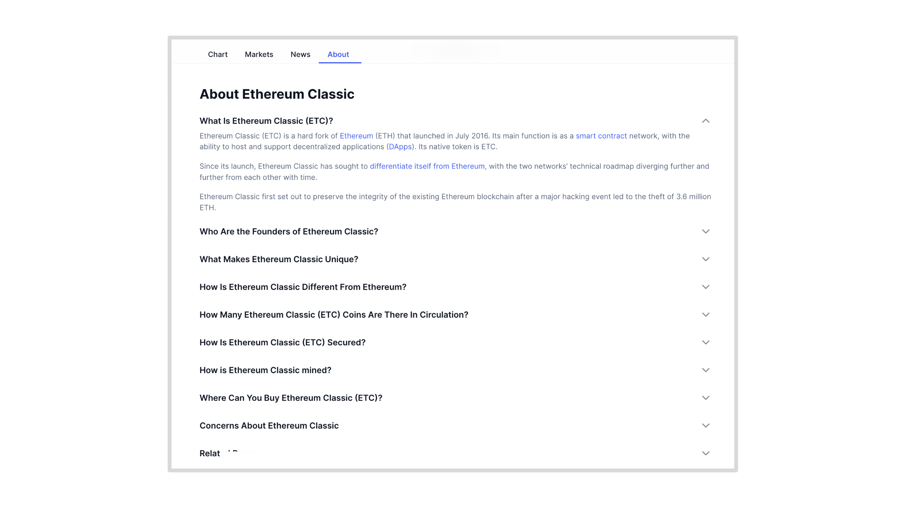

CoinMarketCap (CMC) has an “About” section in the profile page of Ethereum Classic (ETC) in the following link:

https://coinmarketcap.com/currencies/ethereum-classic/#About

The About page has 9 sections, several of which have mistakes in the information.

In the following sections we will point out in which section each mistake is, we will propose corrected phrases, and add our rationale for each correction.

## Section: What Is Ethereum Classic (ETC)?

**CMC Statement:**

Ethereum Classic (ETC) is a hard fork of [Ethereum](https://coinmarketcap.com/currencies/ethereum/) (ETH) that launched in July 2016. Its main function is as a [smart contract](https://coinmarketcap.com/alexandria/glossary/smart-contract) network, with the ability to host and support decentralized applications ([DApps](https://coinmarketcap.com/alexandria/glossary/decentralized-applications-dapps)). Its native token is ETC.

Since its launch, Ethereum Classic has sought to  [differentiate itself from Ethereum](https://coinmarketcap.com/alexandria/article/ethereum-vs-ethereum-classic), with the two networks’ technical roadmap diverging further and further from each other with time.

**Our Correction:**

Ethereum Classic (ETC) is the original [Ethereum](https://coinmarketcap.com/currencies/ethereum/) (ETH) blockchain that launched in July 2015. Its main function is as a [smart contract](https://coinmarketcap.com/alexandria/glossary/smart-contract) network, with the ability to host and support decentralized applications ([DApps](https://coinmarketcap.com/alexandria/glossary/decentralized-applications-dapps)). Its native token is ETC.

Since its launch, Ethereum Classic has sought to uphold its original values of immutability, censorship resistance, and permissionlessness. However, ETC’s technology is on parity with the EVM (Ethereum Virtual machine Standard) as it seeks to be up-to-date with state of the art technology.

**Rationale:**

To state that ETC is a fork is an old error in the market and it is the responsibility of a service at CMC to correct these fallacies.

ETC does not diverge from the EVM roadmap, to the contrary ETC constantly performs hard forks to be on parity with Ethereum, except the upgrades that are detrimental to immutability, e.g. EIP-1559 or Proof of Stake.

## Section: Who Are the Founders of Ethereum Classic?

**CMC Statement:**

Ethereum Classic is in fact the legacy chain of Ethereum, and its true creators are therefore the original Ethereum developers — Vitalik Buterin and Gavin Wood.

**Our Correction:**

Ethereum Classic is in fact the legacy chain of Ethereum, and its true creator is therefore the original Ethereum founder — Vitalik Buterin.

**Rationale:**

Ethereum and Ethereum Classic have only one founder and that is Vitalik Buterin. All the rest are persons who joined after Vitalik’s invention and added their work and contribution around the core design by Vitalik. Therefore, the founder of ETC is Vitalik Buterin.

The rest of the paragraphs are fine.

## Section: What Makes Ethereum Classic Unique?

**CMC Statement:**

Ethereum Classic’s main aim is to preserve the Ethereum blockchain as it originally was, without artificially countering the DAO hack.

Its appeal was first to those who disagreed with Ethereum’s response, but the legacy network has since gained a wider fan base, which include major investors such as Barry Silbert, CEO of investment firm Grayscale.

As a voluntary organization, the developers of ETC do not aim to turn the network into a for-profit entity. Users pay transaction fees as with Ethereum, and miners collect them based on work done as per the [proof-of-work](https://coinmarketcap.com/alexandria/article/proof-of-work-vs-proof-of-stake) (PoW) mining algorithm.

Unlike Ethereum, Ethereum Classic has no plans to convert to a proof-of-stake (PoS) mining algorithm, while multiple developers continue to work on future improvements such as scaling solutions.

**Our Correction:**

Ethereum Classic’s unique attributes are a combination of the following features:

**Proof-of-Work:** ETC is a will remain as a [proof-of-work](https://coinmarketcap.com/alexandria/article/proof-of-work-vs-proof-of-stake) blockchain which is the most secure consensus mechanism known to man.

**Sound money:** ETC is digital gold because it is a proof of work blockchain, thus the cost ti produce the money is the same as the cost to produce the blocks, and it has a fixed monetary policy with a supply cap of 210,700,000.

**Programmability:** ETC is programmable with smart contracts making it much more versatile and useful than other simpler cryptocurrency chains such as Bitcoin or Litecoin.

**Full replication:** ETC is most secure because it is fully replicated across all nodes of the network. Where other smart contract blockchains are implementing “sharding”, “parachains”, or “sidechains” that reduce security, ETC will remain fully replicated.

**Composability:** Composability in ETC means that all the applications enabled by programmability are inside the same system, thus making them equally secure and also able to interact with each other in single complex transactions.

**Size:** The larger a blockchains is, and even more if it is the largest in its category, makes the system eve more secure. ETC is the largest smart contracts blockchain that is proof of work and has a fixed monetary policy.

All the above unique features combined make ETC dapps the most secure daps in the world.

**Rationale:**

Ethereum Classic has its own incredibly valuable positioning in the market. The fact that Ethereum moved to proof of stake enforces this positioning even more.

Past events such as who liked it or not, and who are the current developers is irrelevant. 

What is relevant is what ETC represents, which is that it is the largest and most secure smart contracts blockchain in the world.

All other networks that seem larger because they have higher market caps are less secure, therefore ETC has a unique value proposition that needs to be highlighted by CMC.

## Section: How Is Ethereum Classic Different From Ethereum?

**CMC Statement:**

Another key difference between the two is their development roadmap. Ethereum is focused on transitioning from a Proof-of-Work consensus algorithm to a proof-of-stake (PoS) algorithm after The Merge. Ethereum Classic, on the other hand, has focused on maintaining its original PoW algorithm and staying true to its decentralized philosophy.

**Our Correction:**

Another key difference between the two is their development roadmap. Ethereum has transitioned from a Proof-of-Work (POW) consensus algorithm to a Proof-of-Stake (PoS) algorithm after The Merge in September 2022. Ethereum Classic, on the other hand, has focused on maintaining its original PoW algorithm and staying true to its decentralized philosophy.

**Rationale:**

This section in CMC is excellent, we only rephrased the last paragraph to show that Ethereum already transitioned to POS.

## Section: How Many Ethereum Classic (ETC) Coins Are There In Circulation?

**CMC Statement:**

ETC began in a very similar technical state to ETH, with the exception of how the DAO hack transactions were handled.

Since launch, however, changes in [tokenomics](https://coinmarketcap.com/alexandria/article/what-is-tokenomics) have occurred, with participants voting to cap the supply of ETC in December 2017. The maximum supply is thus 210,700,000 ETC, roughly ten times that of [Bitcoin](https://coinmarketcap.com/currencies/bitcoin/) (BTC), while ETH has no cap.

ETC uses a PoW mining algorithm, which functions like  [Bitcoin](https://coinmarketcap.com/currencies/bitcoin/)  — miners are rewarded with new coins for validating the blockchain in competition with each other. The ETC block reward decreases with time, with the next drop due at block 15,000,000, roughly in April 2022 — from 3.2 ETC to 2.56 ETC per block.

**Our Correction:**

ETC began in a very similar technical state to ETH, with the exception of how the DAO hack transactions were handled.

Since launch, however, changes in [tokenomics](https://coinmarketcap.com/alexandria/article/what-is-tokenomics) have occurred, with Ethereum Classic establishing a cap to the supply in December 2017. The maximum supply is thus 210,700,000 ETC, roughly ten times that of [Bitcoin](https://coinmarketcap.com/currencies/bitcoin/) (BTC), while ETH has no cap.

ETC uses a PoW mining algorithm, which functions like [Bitcoin](https://coinmarketcap.com/currencies/bitcoin/) — miners are rewarded with new coins for building blocks in competition with each other. The ETC block reward decreases with time at a rate of 20% every two years or 5 million blocks, with the next drop due at block 20,000,000, roughly in June 2024 — from 2.56 ETC to 2.048 ETC per block.

**Rationale:**

We updated supply information above and removed “participants voting” because ETC decides changes by consensus, not by voting. We changed the term "validating" with "building blocks" and added the frequency of the discount to miners in the block rewards.

## Section: How Is Ethereum Classic (ETC) Secured?

**CMC Statement:**

Ethereum Classic uses the [Proof-of-Work](https://coinmarketcap.com/alexandria/glossary/proof-of-work-pow) (PoW) consensus algorithm. By resolving computationally challenging riddles to create and validate blocks of transactions, Ethereum Classic miners protect the network.

In this process, the state of all the data on the blockchain is recorded. The network moves on to the next block as long as every miner or node agrees on the order in which the blocks are created. This process is referred to as consensus.

As a minority chain, it has suffered regular attacks itself. These include several 51% attacks to gain control of mining hashrate and execute spurious transactions and double spend coins, the most recent of which occurred in August 2020.

Following a series of 51% attacks on the Ethereum Classic network in 2020, the underlying Ethash mining algorithm was changed. The event was called Thanos upgrade.

**Our Correction:**

When ETC was a minority chain, it suffered some attacks. These included 51% attacks to gain control of mining hashrate and execute spurious transactions and double spend coins, the most recent of which occurred in August 2020.

Ethereum Classic uses the [Proof-of-Work](https://coinmarketcap.com/alexandria/glossary/proof-of-work-pow) (PoW) consensus algorithm. By resolving computationally intensive puzzles to create and validate blocks of transactions, Ethereum Classic miners protect the network.

The ETC blockchain is also fully replicated, which makes it redundant across the world making it it practically impossible to take down or tamper with by nature or man.

Now that it is the largest proof of work smart contracts blockchain in the world its security levels have significantly increased to the point that developers have removed the safety features they added after the 51% attacks of 2020.

**Rationale:**

We added a more accurate description of the POW security mechanism and that the other security method is full replication. We also updated the information to show that the safety features that were added while ETC was a minority chain were removed because now it is the majority chain.

## Section: How is Ethereum Classic Mined?

**CMC Statement:**

Miners use their hardware to solve complex mathematical equations and validate transactions on the Ethereum Classic network. The first miner to solve the equation and validate a new block receives a block reward in the form of ETC.

Miners use their hardware to solve complex mathematical equations and validate transactions on the Ethereum Classic network. The first miner to solve the equation and validate a new block receives a block reward in the form of ETC.

The network automatically adjusts the difficulty of mining Ethereum Classic every two weeks to maintain a stable block production rate. The difficulty is based on the total computational power of the network, and it becomes more challenging to mine ETC as more miners join the network.

**Our Correction:**

A subgroup of the nodes of the Ethereum Classic blockchain are miners. These miners group transactions in batches, add to them a time stamp, the previous block cryptographic stamp or hash, and a random iterating number called a nonce. 

Once they do this, they create a new cryptographic stamp for this new block specifically and immediately check if it hit a specific target that the protocol determines. If it didn’t hit the target, then the miners go back, change the random iterating number as soon as possible and try again. If they didn’t hit the target again, then they try again, and again, and again, until one of the miners hits the target. 

They may do this trillions of times per second, and this is what uses up so much energy and is referred to as “proof of work” because only by working in trying so many times, using so much computing power and electricity, is that, statistically, one of the miners will hit the target within the range of the standard block time, which is 13 seconds in ETC.

**Rationale:**

The CMC explanation has two paragraphs repeated and does not explain POW and how it works. In POW, miners do not “validate” transactions, that is done by the nodes and what they do is to “verify” transactions. We give here a straightforward explanation of how ETC is mined.

## Section: Where Can You Buy Ethereum Classic (ETC)?

**CMC Statement:**

ETC is a major market cap cryptocurrency and is freely tradable on a large number of major exchanges.

Pairs are available against stablecoins, other cryptocurrencies and fiat currencies, while derivatives and institutional investment vehicles also exist. Exchanges that let you [buy Ethereum Classic](https://www.binance.com/en/buy-Ethereum-Classic) include [Binance](https://coinmarketcap.com/exchanges/binance/), [OKEx](https://coinmarketcap.com/exchanges/okex/) and [Huobi Global](https://coinmarketcap.com/exchanges/huobi-global/).

Crypto newbie? Read our [easy guide](https://coinmarketcap.com/how-to-buy-bitcoin/) to buying Bitcoin and any other cryptocurrency.

**Our Correction:**

ETC is a major market cap cryptocurrency and is freely tradable on a large number of major exchanges.

Pairs are available against stablecoins, other cryptocurrencies and fiat currencies, while derivatives and institutional investment vehicles also exist. Exchanges that let you [buy Ethereum Classic](https://www.binance.com/en/buy-Ethereum-Classic)  include  [Binance](https://coinmarketcap.com/exchanges/binance/),  [OKEx](https://coinmarketcap.com/exchanges/okex/)  and  [Huobi Global](https://coinmarketcap.com/exchanges/huobi-global/), and [Coinbase](https://coinmarketcap.com/exchanges/coinbase-exchange/)

Crypto newbie? Read our [easy guide](https://coinmarketcap.com/how-to-buy-bitcoin/) to buying Bitcoin and any other cryptocurrency.

**Rationale:**

This section is fine, we just added Coinbase in the list of exchanges available to buy ETC.

## Section: Concerns About Ethereum Classic

**CMC Statement:**

Ethereum has grown in popularity as the more trustworthy one of the two networks, even though Ethereum Classic and Ethereum both offer [smart contracts](https://coinmarketcap.com/alexandria/glossary/smart-contract) and compete for the same market.

The possible scalability constraints of Ethereum Classic are one of its main worries. The network can typically support 15 [transactions per second](https://coinmarketcap.com/alexandria/glossary/transactions-per-second) ([TPS](https://coinmarketcap.com/alexandria/glossary/transactions-per-second)), which is significantly lower than payment networks like Visa, which support more than 1,000 transactions per second. Although Ethereum Classic has undergone numerous software improvements, one of its largest problems moving ahead will continue to be the scalability of its payment systems.

**Our Correction:**

Ethereum has grown in popularity due to network effects and more developer and user activity, even though Ethereum Classic and Ethereum both offer [smart contracts](https://coinmarketcap.com/alexandria/glossary/smart-contract) and compete for the same market.

The main concerns of ETC are scalability, bloat, and backward compatibility. These are constraints shared by all layer 1 smart contracts blockchains. Both Ethereum and Ethereum Classic will be scalable through layer 2 systems.

Backward compatibility will be solved when “Account Versioning” and “EVM versioning” are implemented in the EVM standard in general. Bloating is a work in progress and depends more on client efficiencies and advances.

**Rationale:**

Ethereum is not more trustworthy because it is less secure as it is a POS blockchain. We added scalability, bloat, and backward compatibility as the real concerns of a blockchain such as Ethereum Classic, but we presented the solution that will ameliorate these constraints.

---

**Thank you for reading this article!**

To learn more about ETC please go to: https://ethereumclassic.org
