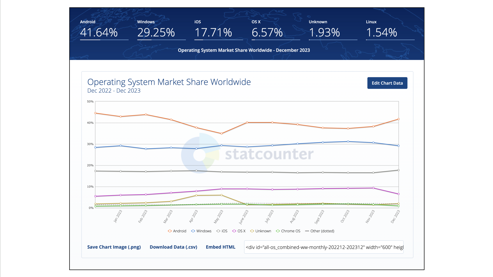
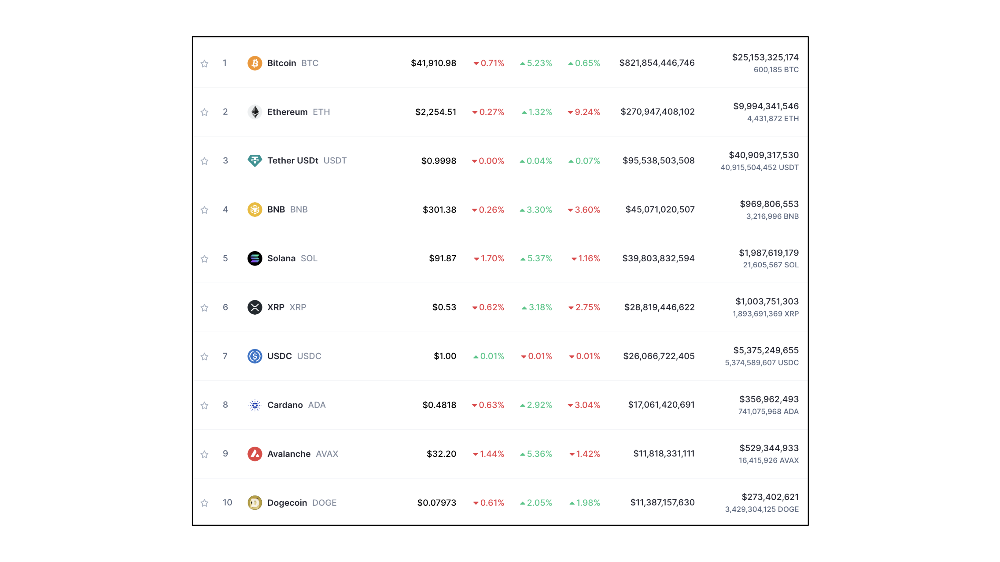
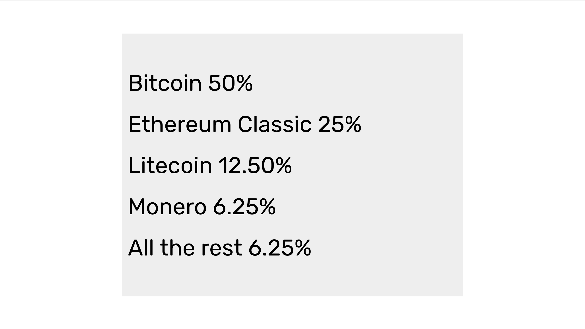

---
**You can listen to or watch this video here:**

<iframe width="560" height="315" src="https://www.youtube.com/embed/-D20HZhwmFc?si=yFYFrweD-DD26QnJ" title="YouTube video player" frameborder="0" allow="accelerometer; autoplay; clipboard-write; encrypted-media; gyroscope; picture-in-picture; web-share" allowfullscreen></iframe>

---

In the previous class, 12, we explained an interesting occurrence that happened in 2020 in the Ethereum (ETH) blockchain, when it was a Proof of Work (POW) network, which is that it proved, even before Bitcoin (BTC), that the POW fee model will work!

The thesis that supports the idea is that not only did fees surpass the block reward in both ETH and BTC several times, but that because of network effects and the pursuit of security, users will gladly pay high fees to use these valuable networks.

Similarly, in this class, 13, we will see how network effects and security will determine the number of and market share of each of the leading POW blockchains in the industry.

## Blockchains Are Like Operating Systems

As blockchains are like operating systems they will likely behave and be positioned as such.

Operating systems are software code that associate the parts of the hardware in which they are installed to the applications used in those devices.

As such, they represent standards that developers of multiple applications and providers can rely on to build their apps so they can be compatible with each other and familiar to all users.

Similarly, blockchains, especially programmable ones, are software systems that represent standards of how accounts, balances, and opcodes must be used by developers for their dapps to interact with each other and for users to find familiar and useful.

Given this status as operating systems but on global peer-to-peer networks, blockchains will likely evolve as such.

## Network Effects And Security Will Determine Their Market Shares

It doesn’t matter what bells and whistles new competing entrants may have, the big blockchain players will overwhelm the rest with their network effects. It is more important for users to find other users on these platforms than better features or even better user experiences.

In terms of security, network effects and scale produce more safety in these systems.

Safety and security in the blockchain industry means less dependence on trusted third parties, which means censorship resistance and permissionlessness globally.

Therefore, users will tradeoff the cheapness and low security of fiat and Proof of Stake (POS) systems for the popularity and safety of POW blockchains.

## The Global Operating System Market has 3 or 4 Large Players

Given that the global operating system market on all devices has 3 or 4 very large players (Linux is the winner in a small enterprise server niche), we may deduce that the Proof of Work blockchain segment of the industry will also have 3 or 4 large players as well. The rest will likely be insignificant.

## This Trend Is Already Observable in the Blockchain Industry

In aggregate, the trends mentioned in this post are already observable in the blockchain industry. Bitcoin has consistently had a share of around 50% of the whole market for a long time. Ethereum, as the second largest chain, has had a share of around 25%, and from there on the rest tend to be much smaller, or insignificant.

## Therefore, It Is Likely That There Will Be 3 or 4 Large POW Blockchains

Given that blockchains will likely behave as operating systems, that they usually have 3 or 4 large players, and that these trends are already observable in the market, we may deduce that the Proof of Work blockchain segment of the industry will have 3 or 4 large players as well, and that the rest will likely be insignificant.

Consistent with this view, we estimate that Bitcoin will continue to command a 50% market share in the POW segment, then Ethereum Classic, as a programmable digital gold system, will likely rise to around a 25% share, then another system, probably Litecoin, will have around a 12.5% share, then maybe Monero, because of its privacy positioning, a 6.25% share, and the rest will follow but with less significant sizes.

In our next two classes we will make the same analogies but with global fiat currencies and we will explain how these things will play out with regard to the layers of the blockchain industry.

---

**Thank you for reading this article!**

To learn more about ETC please go to: https://ethereumclassic.org
