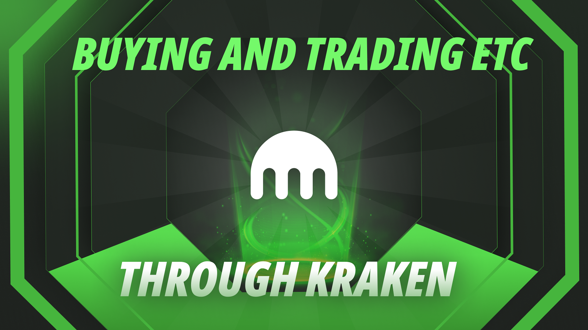
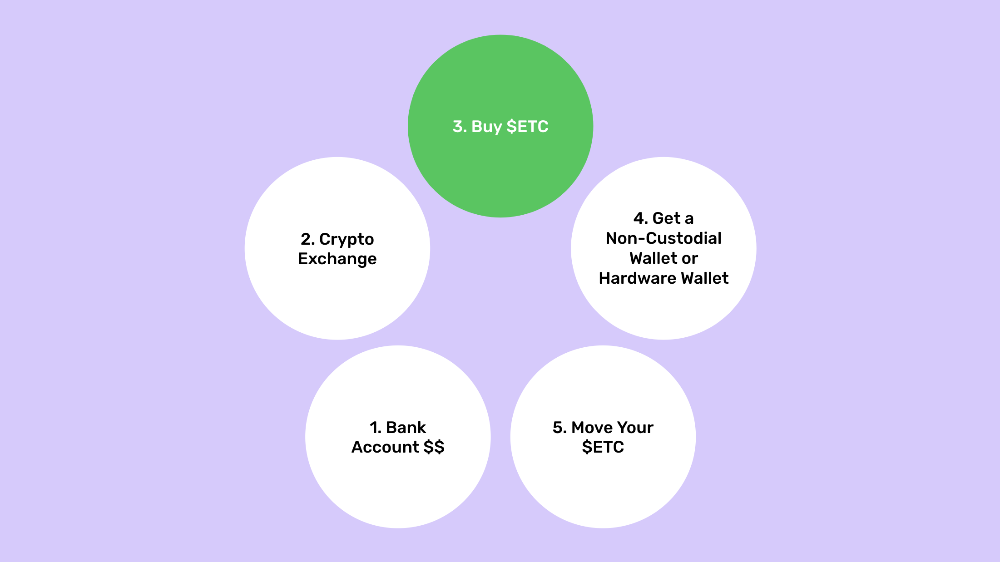
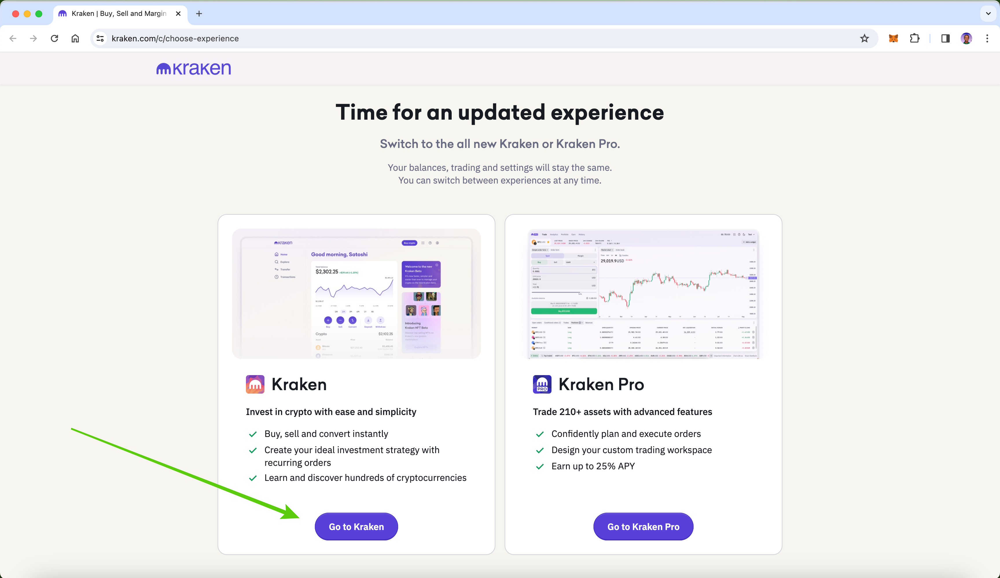
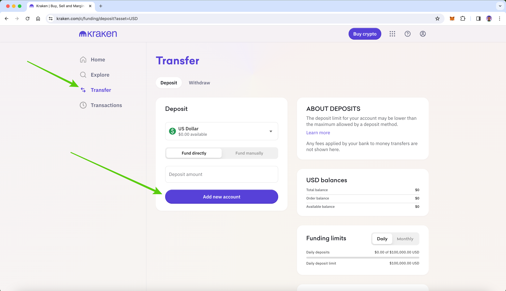
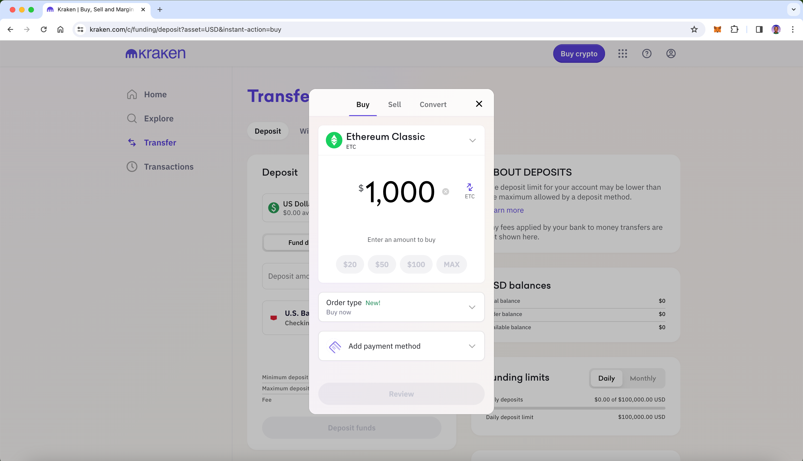
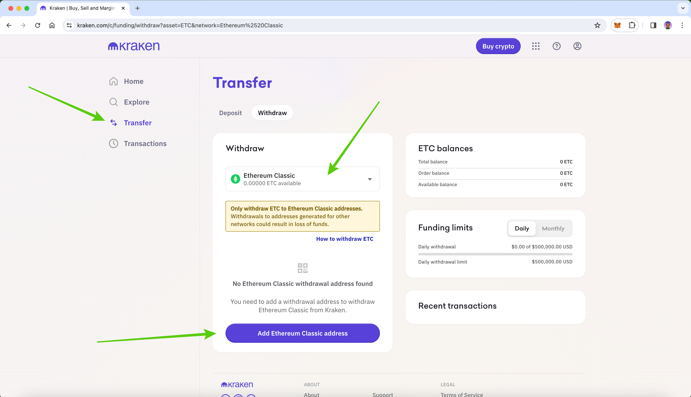
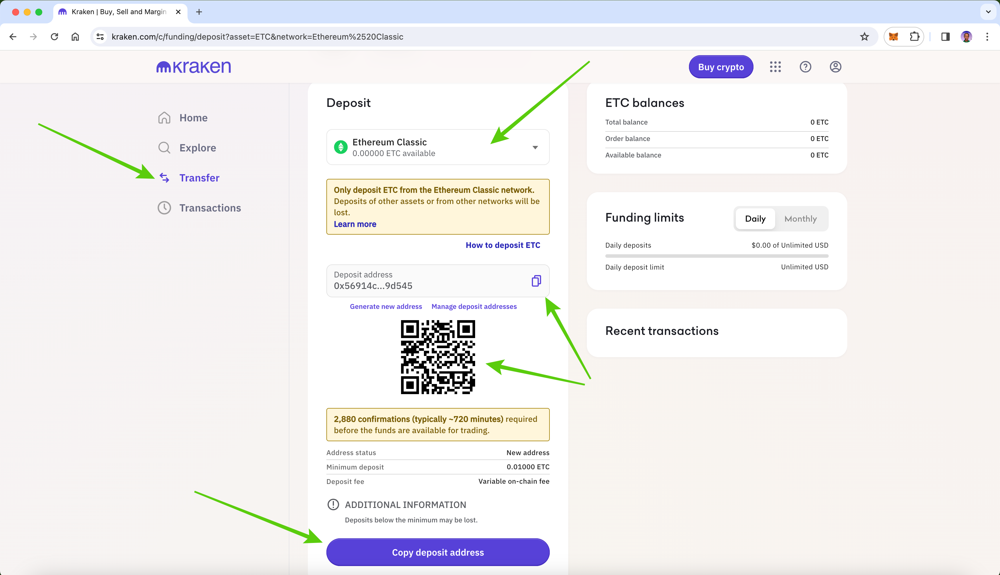
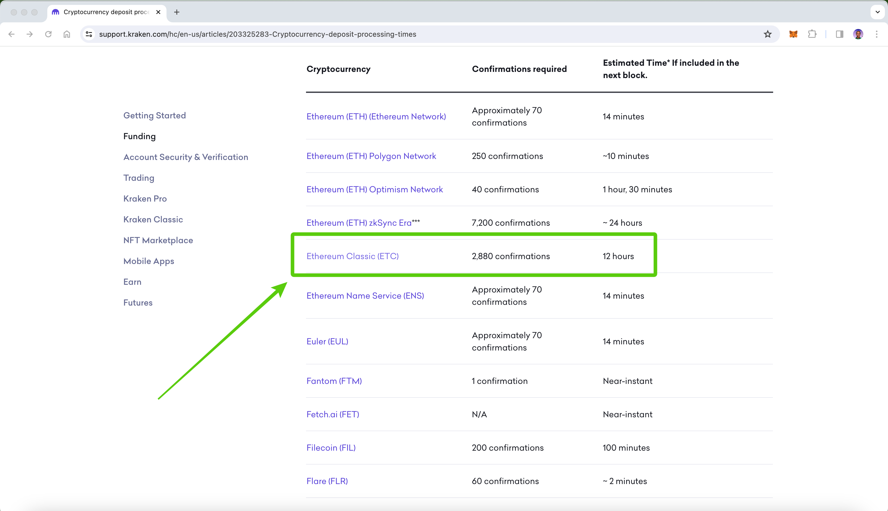

---
**You can listen to or watch this video here:**

<iframe width="560" height="315" src="https://www.youtube.com/embed/YzurlIbyNLo?si=0YJu97L96fNEKSz9" title="YouTube video player" frameborder="0" allow="accelerometer; autoplay; clipboard-write; encrypted-media; gyroscope; picture-in-picture; web-share" allowfullscreen></iframe>

---

## What Is Kraken?

Kraken is a centralized cryptocurrency exchange.

A centralized cryptocurrency exchange (CEX) is a virtual location on the internet that serves as a meeting point for trading crypto assets such as Bitcoin (BTC) and Ethereum Classic (ETC).

Kraken provides its servers over the internet for its customers to open accounts, send money, and start exchanging BTC, ETC, Ethereum (ETH), and other tokens.

CEXs must follow regulations, so they may be very restrictive, demanding customers to present evidence of identity and residence, performing background checks, and asking what is the source of their funds.

Among the risks of centralized exchanges is that they may go bankrupt and customers may lose their deposits and assets.

Kraken in particular is one of the largest cryptocurrency exchanges in the US and the world, it started operations in the United States in 2011, and now has an international presence.

## Moving Your ETC to Non-Custodial Wallets

Although you may be using a centralized cryptocurrency exchange for buying and trading in Ethereum Classic, the best way to [manage your ETC](https://ethereumclassic.org/blog/2023-05-31-how-to-start-using-etc-from-scratch) is to buy them in the centralized exchanges but then moving them to [non-custodial wallets](https://ethereumclassic.org/blog/2023-05-04-ethereum-classic-course-20-what-are-custodial-and-non-custodial-wallets) that you control.

The steps are as follows:

1. You start with your cash in your bank account
2. You move your cash to the crypto exchange
3. You buy ETC at the crypto exchange
4. You get a non-custodial wallet or hardware wallet
5. You move all your ETC to your non-custodial wallet

The above method is the most secure method because you end up with your ETC on the blockchain directly, under your own control with your private keys, rather than at the centralized exchange, under their control.

In other words, it is more trust minimized.

## Opening a Kraken Account

The first step to create your account on Kraken will be to go to [Kraken.com](https://www.kraken.com/), then press on the “Sign up” button, and select the type of user you are, “Personal” or “Business”, and then proceed to the following stages. For this post we will use the “Personal” user path.

As an individual, you need to enter your email and select a strong password. Then Kraken will ask you to verify your email.

After this, Kraken will ask you if you are new to crypto, if you own some crypto, or if you are experienced. We will choose the “I am new to crypto” option. 

Kraken will also ask you for your cell phone number and to add your personal information, which will include your name, your address, government ID, and other government documentation depending on your country.

Kraken uses identity verification in order to comply with Know Your Customer (KYC) laws. This means you will need to get an identity document, such as drivers license or passport, take photos of it, and submit them to Kraken through your computer or your Kraken phone app. They also may ask to upload or take a photo of yourself to verify the ID document.

## Kraken or Kraken Pro?

When you go through the process above, you will notice that one of the steps is to select whether you want to use Kraken or Kraken Pro.

Kraken is a basic service with a centralized wallet where you can see your balances, send and receive dollars, send and receive crypto, and easily buy and sell crypto.

Kraken Pro is for traders, professionals, or large volume investors.

For this example, which is for new users, we will choose “Kraken”.

## Connecting a Bank Account and Depositing Money

After creating your account on Kraken, you can connect a bank account to your Kraken profile. This is to move fiat money to your Kraken account and then be able to buy ETC.

The payment methods available to connect in the United States are bank accounts and debit cards, but you may have other options in your country. We will use the bank account method in this post.

To connect your bank account click on the “Transfer” link on the left menu and then select the “Add new account” button.

After you do this, you can proceed to add money to your Kraken account.

## Buying ETC on Kraken

Once you are all set with an account and transferred fiat money to your Kraken account, you will be ready to buy ETC.

There are two ways of buying ETC, the first one is the more rudimentary, which is to click on the “Buy crypto” button on the top right of the Kraken website or on your app. This method is just to buy and leave your ETC in your account, or to transfer them to your non-custodial wallet.

The second way, as explained before, is to use “Kraken Pro”, which is a professional trading platform for traders or large volume customers. We did not choose this method for this post.

In both cases the commissions may vary according to your trading volume or the way you trade. But, they hover around 1.5% for medium and small trades on the regular service, or as low as 0.10% when trading on the Pro service.

Once you buy your ETC, they will be credited to your account and stay there until you move them or sell them again.

## Sending ETC

When you buy ETC on Kraken they will probably become available to withdraw after a few days so you will be able to send them to your non-custodial wallet or other destinations.

It may take a few days because your cash from the bank actually takes several days to move from your bank to Kraken. However, if you live in a jurisdiction that has instant bank transfers or other fast money transfer systems, you may have your purchased ETC available for withdrawal sooner.

The way to send your ETC to your non-custodial wallet or to any other destination is by clicking on the “Transfer” tab again on the left menu, and then on the “Withdraw” link on the horizontal menu on the website or on your app.

In the next step, select ETC and you can put the ETC address of your non-custodial wallet by clicking on the “Add Ethereum Classic address” button, or you can send to any other address.

## Receiving ETC

To receive ETC, you need to go again to the “Transfer” tab on the left menu, and then click on the “Deposit” button on the horizontal menu.

In the next step, select ETC as the asset you want to receive, and then copy the address to send it to others, to paste on your own non-custodial wallet if you are sending ETC to your own Kraken account, or just show the QR code to others to send you ETC.

## Kraken Has Lowered the Confirmation Times on ETC!

After 51% attacks in 2019 and 2020 in ETC, many exchanges raised their confirmation times to very high levels.

It could take several days to deposit ETC in some exchanges. This was due to the risk of double spends or 51% attacks if thieves wanted to commit fraud by reversing the chain.

Now that ETC is the leading proof of work smart contracts blockchain in the world many exchanges have lowered these restrictions.

Kraken had raised their confirmation times to 40,000 blocks for a long time, which meant that users had to wait up to 6 days to have their ETC free to trade!

Now Kraken, like many other exchanges, has lowered the waiting period to only 12 hours or 2,880 confirmations!

## Who Uses Kraken for Buying and Selling ETC?

**Investors:** ETC is an excellent long term investment alternative. This has attracted many investors who use exchanges such as Kraken to transfer their fiat money to exchange it for Ethereum Classic. However, these ETC buyers should think of moving their holdings to non-custodial wallets as explained before, so their assets may be more secure.

**Miners:** A segment that uses exchanges frequently to trade ETC are miners. Ethereum Classic miners earn an average of 17,000 ETC per day, but they have to pay for their operations, which include payroll, data center costs, and electricity costs. For this they usually liquidate some of their daily earnings on exchanges such as Kraken to transform them into cash to pay for their bills.

**Speculators:** Trading volumes on ETC are relatively high globally and much of this is by speculators who trade daily on exchanges such as Kraken. These participants are beneficial to the ecosystem as they provide liquidity to all other buyers and sellers.

**Merchants:** Although still small, the use of ETC for buying a selling things in the broader economy is growing. Merchants who let their customers purchase items with ETC will use centralized exchanges as Kraken to liquidate their holdings for paying for their business expenses.

---

**Thank you for reading this article!**

To learn more about ETC please go to: https://ethereumclassic.org
