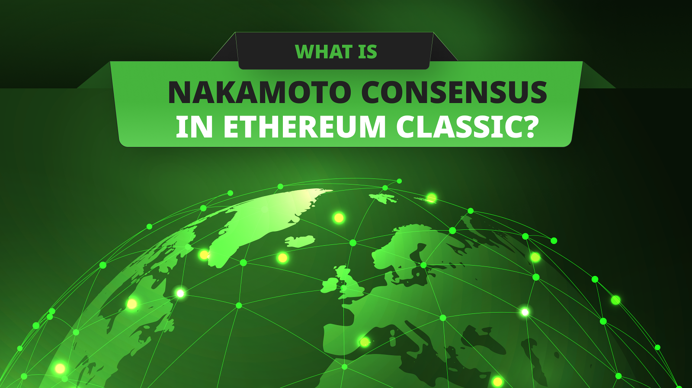

---
**You can listen to or watch this video here:**

https://youtu.be/WO_SVeDUnN4

---

## “Proof of Work” or “Nakamoto Consensus”?

One of the things that we most emphasize in this blog is that Ethereum Classic (ETC) [is a proof of work](https://ethereumclassic.org/blog/2023-10-17-ethereum-classic-is-a-proof-of-work-cryptocurrency-blockchain) (POW) blockchain. This is because POW is the most secure computer network consensus mechanism known to man, so it is worth mentioning this about ETC!

Indeed, Bitcoin (BTC), the largest and most secure blockchain in the world is a POW blockchain as well. POW, and its effects on consensus, was the [major invention](https://ethereumclassic.org/blog/2023-11-16-etc-proof-of-work-course-2-what-didnt-exist-was-a-secure-consensus-mechanism) of Bitcoin.

Ethereum (ETH) used to be a POW blockchain but now it controversially migrated to proof of stake (POS) which is presenting [many problems](https://ethereumclassic.org/blog/2023-02-22-ethereum-classic-is-censorship-resistant-ethereum-is-not) to that ecosystem.

However, ETC and BTC are not really “proof of work” blockchains! That is the wrong name of the system.

The term “proof of work” is really the name of a technology that uses cryptographic functions to create proofs that computers did a certain amount of work. 

The computers that do the work are “the provers” and the computers that verify the proofs are the “verifiers”, two important concepts in proof of work blockchains that we will explain later.

The consensus mechanism that ETC and BTC use is popularly called “proof of work” for simplicity but the real name of the system is “Nakamoto Consensus”.

## Proof of Work Is Only One of the Steps

The history of how proof of work ended up inside Bitcoin and then in Ethereum Classic starts when Adam Back created a technology called [HashCash](http://www.hashcash.org/) to prevent email spam between servers. 

When Nick Szabo saw the mechanics of HashCash he immediately realized that the proof of work and the computational work that computers had to do to create them was analogous to gold, hence [Bit Gold](https://nakamotoinstitute.org/bit-gold/). 

In the the real world a unit of gold is like a proof that a gold miner did a lot of work to find it, this is the reason for the use of the term “mining” in proof of work blockchains.

However, POW is not the consensus mechanism itself, as we explained in the previous section, it is just one of the steps, albeit the most critical one, in Nakamoto Consensus.

## The Four Steps of Nakamoto Consensus

Nakamoto Consensus consists of four steps that enable computers in peer-to-peer networks reach consensus in a decentralized way on the information they manage. 

The steps are as follows:

**1. Nodes in the network receive new transactions:** For anyone to send a transaction to ETC or BTC they need to do it through a node of the network. ETC and BTC nodes are receiving new transactions constantly.

**2. Nodes in the network distribute the transactions:** When nodes in ETC and BTC receive the new transactions they immediately retransmit them over the internet to the rest of the machines in the system. Consequently, transactions are full replicated in all computers of the blockchain.

**3. Miners build blocks:** A subgroup of the machines in ETC and BTC are what are called “miners”. These computers group the new transactions in batches and then do the proof of work to stamp them with a cryptographic proof. When batches of transactions are stamped they are called “blocks”. These stamps are very costly to create and are what use up so much computing power and electricity in POW blockchains.

**4. Blocks are verified by the rest of the nodes:** When miners create the new blocks of transactions they are the “provers” that we mentioned before because they need to send the blocks to the rest of the network so the other machines can verify that they did the work! This is why the rest of the nodes are called “verifiers”. When they verify the blocks, then they add them to the database, also called “blockchain”, and pay the miners block rewards in ETC or BTC.

## Why Is Nakamoto Consensus Secure and Complete?

The amazing thing about using proof of work as the heart of the Nakamoto Consensus mechanism is that the cryptographic proofs themselves are the information that all the machines need to know that each new block is the correct one.

The security assumption is that there will always be attackers trying to corrupt any valuable blockchain, or peer-to-peer network for that matter. However, when nodes in ETC and BTC receive new blocks from miners, they know they are the correct ones precisely because they invested so much work and electricity building them. POW is like a barrier for dishonest participants to corrupt the network because they would have to do a larger amount of work to be able to send fraudulent blocks.

This feature makes Nakamoto Consensus secure but also complete because POW not only serves as the consensus information, but also does it in a completely decentralized way.

Nodes actually can join and leave the network, without consulting with anyone, just by checking the POW of the blocks. They can also know which is the correct chain in case of splits just by checking the one with most work done on it. 

All these features combined create a system that is censorship resistant and permissionless because there are no managers or administrators, corporations, presidents, or kings dictating what the rest must do. Everyone just joins and leaves as they please with no possibility of control!

Finally, POW is also valuable because its original use case as digital gold is also true. The proofs are so difficult to build by the miners that they are considered scarce and valuable just like gold in the real world.

## How Does Nakamoto Consensus Work in ETC?

ETC’s Nakamoto Consensus design is practically identical to that of Bitcoin’s but it has some distinctions.

The first distinction is that instead of using Bitcoin’s cryptographic function called [SHA-256](https://en.bitcoin.it/wiki/SHA-256), it uses a particular one for ETC which is called [ETCHash](https://ecips.ethereumclassic.org/ECIPs/ecip-1099).

This differentiation is key because ETC is now the largest blockchain in its hashing function which means that it becomes very difficult to attack by whoever would want to do so because they would need to build the computing base from scratch rather than easily borrowing it from other chains.

The second distinction is that as Bitcoin receives transactions just to move BTC from one address to another, ETC is programmable so its transactions are much more complex.

ETC receives transactions to move ETC from one address to another and also to change the state of smart contracts, which are decentralized applications, also known as dapps, inside its highly secure environment.

The fact that ETC does this enables something called composability which is extremely valuable as complex multi-dapp transactions can be executed in single executions making ETC even more secure, convenient, and cost effective.

Indeed, Ethereum Classic, as the largest proof of work smart contracts blockchain in the world is the system where applications are the most secure on the planet.

There is no other system on earth, either private, public, or military that is more secure that Ethereum Classic.

---

**Thank you for reading this article!**

To learn more about ETC please go to: https://ethereumclassic.org
