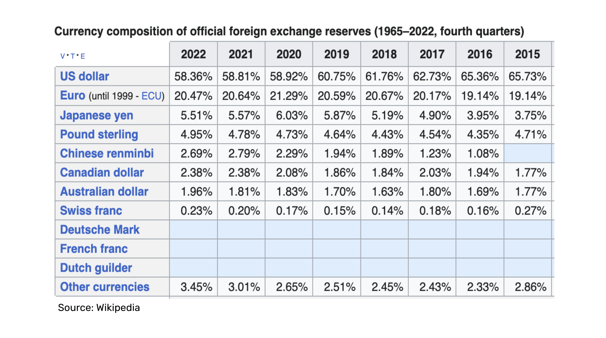
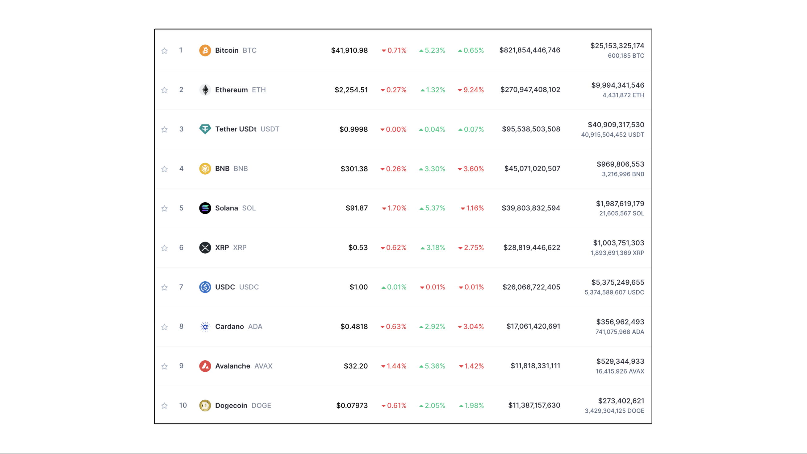
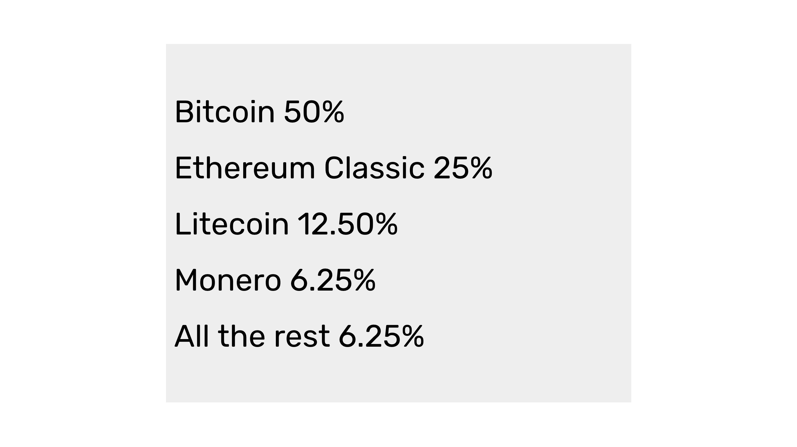

---
**You can listen to or watch this video here:**

https://youtu.be/wb7yyWTa_24

---

In the previous class, 13, we explained why in the future there will likely be only 3 or 4 winning proof of work (POW) blockchains in the world. 

The reasons revolve around network effects, standards, and that these things tend to induce the market to use very few leading formats.

Because POW blockchains, especially Ethereum Classic (ETC), behave as operating systems, then the analogy with the current worldwide market for computer operating systems is justified: There are 4 large players; Android, Windows, iOS, and OS X; and the rest are insignificant.

In this class, 14, we will continue this analysis but we will compare POW blockchains with global reserve currencies and see how the similarities also hold.

## What Is a Reserve Currency?

The traditional description of money in economics is that it is a product that must be scarce, durable, portable, divisible, fungible, and transferable. When the market in a given economy adopts a certain form of money, it usually turns into the main or only form in that particular environment.

An additional definition of money by Nick Szabo, which applies to POW cryptocurrencies, is that they need to be costly to create. This “unforgeable costliness” given by POW  guarantees one of the main attributes, which is scarcity.

On a global scale, when multiple economies are interconnected, usually there is one or few of the currencies in one or some of the participating economies that are adopted as the reserve currencies.

Reserve currencies are the ones that promise scarcity so they can give certainty to the market that they will preserve their value.

## Why Do Reserve Currencies Emerge?

Once one or a few forms of money become reserve currencies, then governments, central banks, and private organizations globally tend to adopt them as stores of value.

The status of reserve currency makes a form of money more demanded, it becomes the unit of account, and it is used to denominate the majority of international transactions, contracts, and debt obligations. 

Governments and market players make these choices that result in very few global reserve currencies because of the following reasons:

**Mental costs:** If multiple economies, lenders, debtors, traders, exporters, importers, and other economic agents were to adopt many currencies, then the mental cost of tracking and processing trade would be very high and finances and payments would become risky and unmanageable.

**Coordination costs:** If multiple economies, lenders, debtors, traders, exporters, importers, and other economic agents were to adopt many currencies, then the cost of coordination between all these players would skyrocket and commerce and contracts would shrink as they become cumbersome and onerous.

**Simplification of prices:** Related to mental costs, if many currencies were adopted by the global economy, then there would need to be many prices for each product making the system confusing and difficult to grasp.

**Network effects:** Once a critical mass of economic agents adopt a currency to simplify their life and do commerce and contracting more efficiently, then that currency becomes more valuable for other agents who want to participate in the global economy. The more peoples use a currency worldwide the more valuable it becomes for other peoples.

For all of the reasons above, global reserve currencies inexorably emerge.

## What Are the Current Reserve Currencies in the World?

For those who may say that blockchains are not operating systems, as we described in the previous class, but are reserve currencies, we can say exactly the same for reserve currencies anyway. 

Global reserve currencies have the same network effects and there are 3 or 4 winners in that segment as well.

As may be seen in the chart in this section, the first 4 top global reserve currencies; the US dollar, the euro, the yen, and the pound sterling; have a combined share of 89.29%. This follows the same pattern as with operating systems. 

Note the distribution in global reserve currencies that the largest is very large, and then the rest fall steeply, and after the fourth player the rest are practically insignificant.

All this affirms the thesis that there will be 3 or 4 very large POW blockchains in the future as they follow both the pattern of operating systems and global reserve currencies.

## Why Bitcoin, ETC, and Other Cryptocurrencies Will Prevail

If we can conclude that there will be very few winning cryptocurrency platform that will command the largest market share globally, then we can analyze how these will not only dominate within the blockchain industry but will do so in other segments of the economy as well.

Just as Gold, Silver, copper, and other metals were the money and reserve currencies for centuries in the past, it is very likely that Bitcoin, ETC and other cryptocurrencies, such as Litecoin and Monero, will also occupy that space.

The shelflife left for fiat money is very short. It may take only two or three more decades for hard money cryptocurrency coins to take over as reserve currencies globally.

The main attraction of these forms of money are not only their hard coded scarcity but that they are trust minimized, so no hegemonic powers can control the financial affairs of other countries at their will.

## These Trends Are Already Observable in the Blockchain Industry

As we mentioned in the previous class, in aggregate, the trends mentioned in these posts are already observable in the blockchain industry. Bitcoin has consistently had a share of around 50% of the whole market for a long time. Ethereum, as the second largest chain, has had a share of around 25%, and from there on the rest tend to be much smaller, or insignificant.

## Conclusion

Given that blockchains will likely behave as operating systems and reserve currencies, that these segments usually have 3 or 4 large players, and that these trends are already observable in the current market, we may deduce that the Proof of Work blockchain layer of the industry will have 3 or 4 large players as well, and that the rest will likely be insignificant.

Consistent with this view, we estimate that Bitcoin will continue to command a 50% share in the POW segment, then Ethereum Classic, as a programmable digital gold system, will likely rise to around a 25% share, then another system, probably Litecoin, will have around a 12.5% share, then maybe Monero, because of its privacy positioning, a 6.25% share, and the rest will follow but with less significant sizes.

In our next class we will explain how these things will play out with regard to the layers of the blockchain industry.

---

**Thank you for reading this article!**

To learn more about ETC please go to: https://ethereumclassic.org
