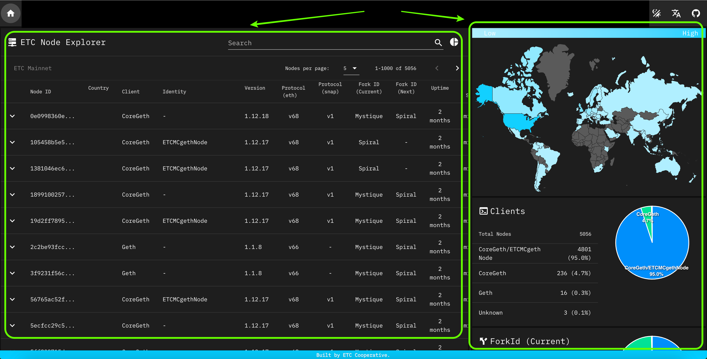
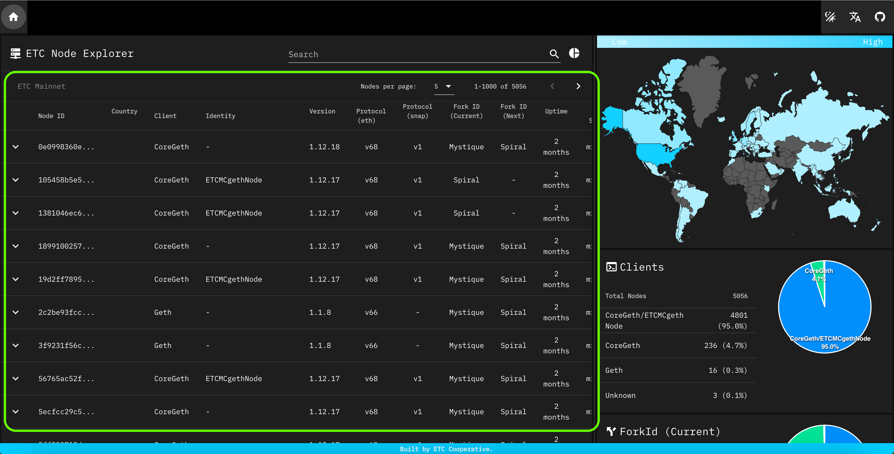
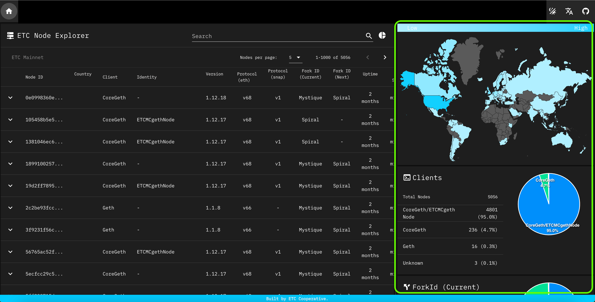

---
**You can listen to or watch this video here:**

https://youtu.be/PJqTELf20IY

---

Node count is very important for any blockchain because the more nodes a cryptocurrency network has, the [more secure](https://ethereumclassic.org/blog/2024-01-16-why-more-nodes-makes-ethereum-classic-more-secure) it is.

The way to keep track of Ethereum Classic’s (ETC’s) node count is by going to [etcnodes.org](https://etcnodes.org/) and checking the statistics there.

In this post we will explain how to read those statistics.

The ETCNodes website is divided in two sections: 

- The main section with a node by node list and statistics,
- and the side section on the right that shows aggregate statistics with visualizations.

In the following sections we will explain each statistic.

## Main Section

The main section shows every single node found in the ETC blockchain and shows the statistics in columns for each one.

The columns are as follows:

**Node ID:** Each node in ETC has a hexadecimal number that is its unique identifier. The first column in the main section lists the IDs of all the nodes.

**Country:** Each node in ETC may be located geographically using its IP address. This column lists the country in which each node is located.

**Client:** To run an ETC node, anyone in the world may download an ETC client software node and do it. However, at any time there may be more than one client brand. This column lists each node by client brand.

**Identity:** Sometimes the same node client software may be associated with different services. For example, in ETC there are [Core Geth](https://ethereumclassic.org/blog/2022-12-27-core-geth-explained) clients that are integrated in products such as [ETCMC](https://ethereumclassic.org/blog/2023-09-05-etc-spotlight-etcmc-ethereum-classic-plug-and-play-node-part-i) or [DappNode](https://ethereumclassic.org/blog/2023-04-26-how-run-an-ethereum-classic-node-using-dappnode) hardware nodes. To identify these variations, this column lists each one of them

**Version:** The software clients to run ETC nodes may be from different dates. As the core developers upgrade the software, they go changing the version number for each one. This column lists the nodes by version.

**Protocol (eth):** Nodes use protocols to communicate with each other and these have versions as well. 'eth' is a protocol that facilitates exchange of Ethereum blockchain information between the nodes. The latest version is v68. 

**Protocol (Snap):** The ‘snap’ protocol is another communications method between nodes and it facilitates the exchange of Ethereum state snapshots between peers. This feature is optional, and this column shows which node has it activated and what version it is using.

**Fork ID:** As blockchains go through upgrades, which are also called “forks”, there may be nodes with older software operating in the network. This column shows in which fork each node is operating.

**Uptime:** The ‘uptime’ column indicates since when each node has been connected to the network.

**Last Seen:** As the way to detect nodes by the ETCNodes website is by running its own nodes, then it can track the moment it last connected with each peer in the network. This columns shows this information.

## Side Section

The side section is a vertical list of aggregate statistics that also shows them in visual form.

The subsections in this part of the website are as follows:

**Map:** As each node may be located geographically, then they are shown in the map at the top of the section. Each country is colour coded to indicate the magnitude of the quantity of nodes that are hosted there, including the specific number of nodes.

**Clients:** This subsection shows a pie chart that indicates the distribution of nodes by client software brand.

**Fork ID (Current):** This subsection shows a pie chart that with the distribution of nodes by the current fork ID that are currently operating in the system.

**Fork ID (Next):** If there is a pending new version to upgrade the network through a fork, then this chart shows how many of the nodes in the system are ready for the next upgrade.

**Protocol (eth):** This subsection shows a pie chart that indicates the distribution of nodes by ‘eth’ protocol version.

**Protocol (snap):** This subsection shows a pie chart that indicates the distribution of nodes by ‘snap’ protocol and version for those who opted to use it.

---

**Thank you for reading this article!**

To learn more about ETC please go to: https://ethereumclassic.org
