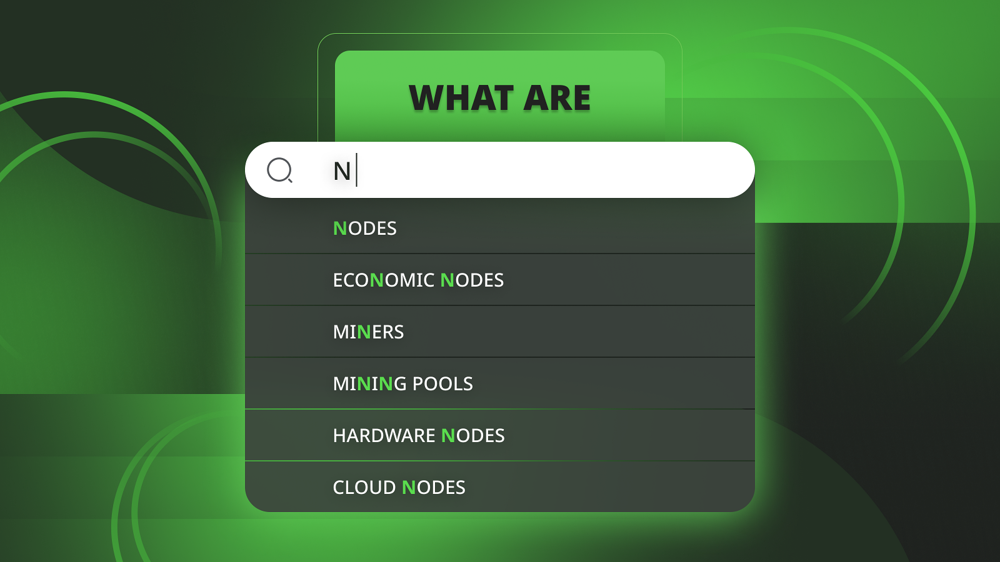
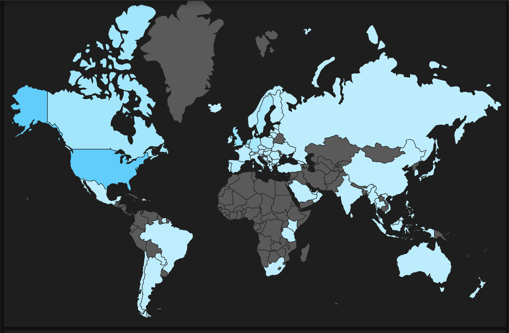

---
**You can listen to or watch this video here:**

<iframe width="560" height="315" src="https://www.youtube.com/embed/W9y2BrwOMZU" title="YouTube video player" frameborder="0" allow="accelerometer; autoplay; clipboard-write; encrypted-media; gyroscope; picture-in-picture; web-share" allowfullscreen></iframe>

---

Recently we wrote an article on why [more nodes](https://ethereumclassic.org/blog/2024-01-16-why-more-nodes-makes-ethereum-classic-more-secure) makes Ethereum Classic (ETC) more secure.

We also wrote an article on the difference between [nodes and miners](https://ethereumclassic.org/blog/2024-01-17-the-difference-between-nodes-and-miners-in-ethereum-classic) in ETC noting that there was some additional confusion with regard to mining, staking, liquidity providers, and yield harvesting, while clarifying these concepts.

And, finally, we wrote a post to help users understand the ETC [node count](https://ethereumclassic.org/blog/2024-02-20-understanding-the-ethereum-classic-node-count-on-etcnodes-org) and statistics on [ETCNodes.org](https://etcnodes.org/).

But, many may be asking, what are nodes? And, what are the different kinds of participants in the network?

In this post we will go over what are nodes, economic nodes, miners, mining pools, hardware nodes, and cloud nodes.

## What Are Nodes in Ethereum Classic?

Blockchains are peer to peer networks and each participating machine in the system is called a node.

For a machine to be a node it needs to run a software application that contains the set of rules of the protocol of that particular network. In ETC the most popular software client is [Core Geth](https://ethereumclassic.org/blog/2022-12-27-core-geth-explained).

The participating computers in Ethereum Classic that don’t create blocks, but constantly receive and redistribute new transactions, and do the same with new blocks, are what are called “nodes”.

These machines redistribute transactions and blocks, and keep a copy of the whole chain of blocks, also known as a ‘blockchain’, in their local disk drive.

Nodes are located everywhere in the world and have the essential role of constantly verifying that transactions and blocks are correct and true.

The other essential role of nodes is to create a global level of redundancy in the blockchain of ETC; which contains the accounts, balances, and smart contracts of all users; so that it becomes practically impossible to take down or attack the network because it is replicated in so many places. 

## What Are Economic Nodes?

At the time of this writing there were 5,063 ETC nodes worldwide. A subgroup of those nodes are what are called ‘economic nodes’.

Economic nodes are financially significant nodes ran by key business players in the ecosystem that tend to process large financial capital volumes and large numbers of transactions per day.

For example, centralized exchanges such as [Coinbase](https://ethereumclassic.org/blog/2023-10-04-buying-and-trading-etc-through-coinbase), [Kraken](https://ethereumclassic.org/blog/2024-02-13-buying-and-trading-etc-through-kraken), and [Binance](https://www.binance.com/en/how-to-buy/ethereum-classic) run their own nodes to verify incoming transactions, check balances, hold custody of their customer’s funds, and to send transactions to the system.

These kinds of node operators manage massive volumes of transactions, hold billions of dollars in custody, and are critical at the time of network upgrades.

Other kinds of economic nodes may be wallet operators and block explorers.

## What Are Miners in Ethereum Classic?

Aside from the stock of visible nodes in ETC there is an additional stock of machines, of which many are not visible, that are miners.

Miners receive transactions from common nodes, group them in batches, stamp them with a cryptographic hash doing a lot of work (hence ‘[proof of work](https://ethereumclassic.org/blog/2023-02-23-ethereum-classic-course-10-proof-of-work-explained)’), and then send the finished blocks back to the rest of the network for verification.

Miners are critical to Ethereum Classic because their work fulfills several roles:

1. It enables consensus between all participants worldwide
2. It protects the history of the ledger from tampering
3. It enables computers in the network to unify back in case of splits

## What Are Mining Pools?

The reason that there are a large number of mining machines not visible as common nodes in the ETC network is that a large portion of them work through mining pools.

Mining pools run their own ETC nodes, and are yet another important kind of economic node.

Mining pools gather large amounts of hashrate from many mining machines across the world and present themselves to the network as a single visible large player with enormous amounts of computing power.

This benefits miners because by pooling their resources they gain a higher probability of winning blocks and they get paid more frequently rather than sporadically.

Mining pools make money by charging miners a percentage of the mining rewards they earn through them.

Some important mining pools in ETC are [F2pool](https://ethereumclassic.org/blog/2023-09-13-mining-ethereum-classic-through-f2pool) and [2miners](https://ethereumclassic.org/blog/2023-03-14-mining-ethereum-classic-with-an-ipollo-asic-through-2miners-pool).

## What Are Hardware Nodes in Ethereum Classic?

One of the most important principles in the blockchain industry is that as many people as possible should run their own nodes.

This is because, by running a node, users can verify balances by themselves and send transactions directly to the blockchain rather than depending on trusted third parties.

One of the ways of doing this practically is to buy what are called ‘hardware nodes’.

Hardware nodes are dedicated machines that run ETC nodes, usually using the Core Geth software client.

People and businesses may install these devices in their homes or offices and use them to send transactions, verify their balances, and support the blockchain at large by verifying blocks and holding a copy of the full database.

The two important brands doing this in ETC are [Dappnode](https://ethereumclassic.org/blog/2023-04-26-how-run-an-ethereum-classic-node-using-dappnode) and [ETCMC](https://ethereumclassic.org/blog/2023-09-05-etc-spotlight-etcmc-ethereum-classic-plug-and-play-node-part-i).

## What Are Cloud Nodes?

As not everyone follows the principle of running their own node as explained in the previous section, there are private services that offer what are called RPC endpoints so that users, or even wallets operators, may send transactions and check their balances.

This setup is not very secure because users must trust these third parties for the correct management of their transactions and information.

Nevertheless, these services may be considered critical infrastructure in blockchains such as ETC and consequently also have an important role at the time of network upgrades.

A list of public RPC endpoints for ETC may be found [on the ETC community website](https://ethereumclassic.org/network/endpoints).

---

**Thank you for reading this article!**

To learn more about ETC please go to: https://ethereumclassic.org
