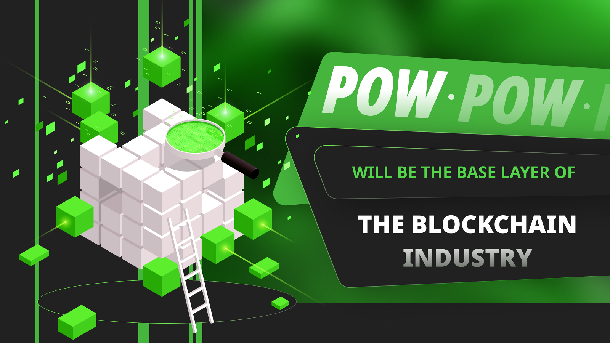
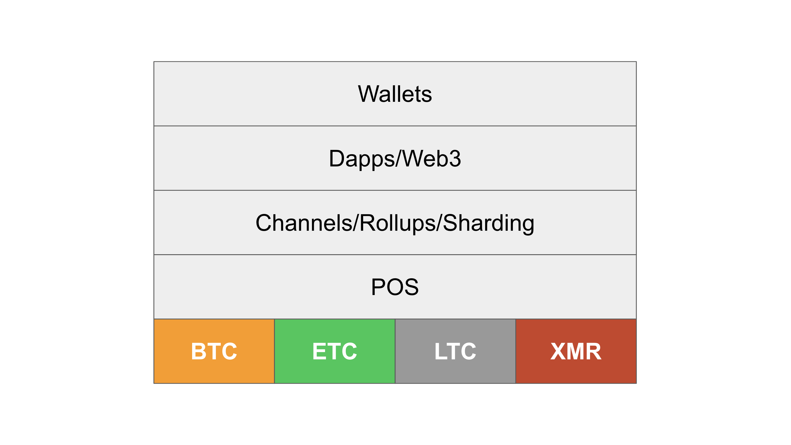
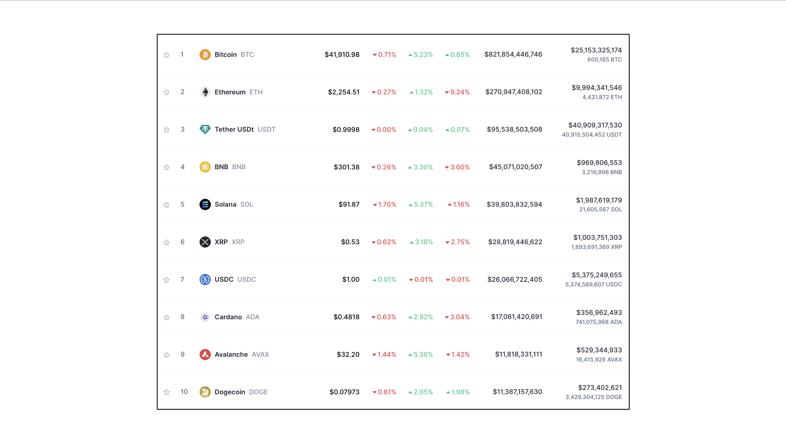

---
**由此收听或观看本期内容:**

<iframe width="560" height="315" src="https://www.youtube.com/embed/OaU2KJ2j8YQ" title="YouTube video player" frameborder="0" allow="accelerometer; autoplay; clipboard-write; encrypted-media; gyroscope; picture-in-picture; web-share" allowfullscreen></iframe>

---

在上一堂课，第14堂课，我们解释了什么是储备货币，以及工作证明（POW）加密货币，如比特币（BTC）和以太坊经典（ETC），将取代当前的法定储备货币，成为未来主要的货币形式。

在这堂课，第15堂课，我们将再次讨论POW区块链如何作为操作系统行为，并可能成为全球储备货币的类比，并解释这些事物将导致这些网络成为行业的基础层，或第一层（L1）加密货币。

随后，我们将论述为什么我们认为它们将取得可能的份额，并说明这已经在当前市场中发生。

## POW区块链作为操作系统

正如我们在第13堂课中解释的，操作系统是与其安装的硬件部分相关联的软件代码，用于这些设备中使用的应用程序。

因此，它们代表了开发多个应用程序和提供商可以依赖以构建其应用程序，使其与彼此兼容并对所有用户熟悉的标准。

同样，区块链，特别是可编程的区块链，是代表开发人员必须如何使用账户、余额和操作码的软件系统的标准，以便他们的dapp相互交互，并使用户感到熟悉和有用。

鉴于这种作为全球点对点网络操作系统的地位，区块链很可能会演变成这样。

## POW区块链作为储备货币

正如我们在第14堂课中解释的，储备货币是一小组被广泛持有的受信任货币，由政府财政部、中央银行、企业和普通人作为价值储备。

正如金、银、铜和其他金属在过去几个世纪中是货币和储备货币一样，比特币、ETC和其他加密货币，如莱特币（LTC）和门罗币（XMR），也很可能占据这个空间。

法定货币的寿命非常短，因为它们由各国政府不负责任地管理，不断贬值，并且完全受到可信赖的第三方的控制。

硬通货币加密货币很可能在未来二三十年内取代世界储备货币。

这些货币的主要吸引力不仅在于它们的硬编码稀缺性，还在于它们是最小化信任的，因此没有霸权国家可以随意控制其他国家和人民的财务事务。

## 区块链行业的层次结构

正如任何技术堆栈都分为层次和组件一样，区块链行业将分为层次和组件。

随着管理的交易量和技术需求的增加，对当前堆栈施加压力，将创建越来越多的层次和组件来解决可能出现的各种问题。

这些问题将涉及处理大量交易、为这些交易提供足够的安全性，包括底层的账户、余额、分散应用程序和面临重大风险的显著价值。

这些压力将导致一个复杂的生态系统，其中每个组件都将通过在其他地方提供其他地方无法提供的价值来相辅相成。

正如在行业中已经可以看到的，正在崛起的主要层次包括基础层区块链、股权证明网络、通道、rollups和位于其上的分片技术，然后是dapp和web 3层，最后是通常是非托管钱包的用户界面。

## 为什么POW将成为基础层或第一层

POW区块链将成为行业基础层或第一层的原因是，金融系统技术堆栈通常按照安全性和可扩展性水平进行组织。

像黄金、银、现金等价值高度安全的对象通常存储在金库等技术中。然后，在其上创建分类帐和交易通信系统，以便人们和企业可以通过更高层的轨道转让这些资产的所有权。这些轨道通常能够处理更大量的交易，但安全性较低。

因为POW区块链，作为数字黄金，是最安全和有价值的，但不可扩展，所以所有其他系统将在其上构建，以提供可扩展性给基础层。

## 最大的POW区块链的规模将是多大

为了简化，并遵循前面课程中解释的操作系统和储备货币的模式，我们可以说最大的POW硬币，可能是BTC，将在该细分市场中占据约50%的市场份额，其次是第二个，可能是ETC，其份额的1/2，或25%，接下来，可能是LTC，12.50%，第四个可能是XMR，6.25%，而所有其余的则剩下6.25%。

这些非常庞大、不可扩展、但非常安全的基础层区块链将成为世界的储备货币和操作系统，并作为整个行业的锚点。

在这些系统之上，权益证明网络可能创建更具可扩展性和多样性的服务，作为锚定POW的第二层；然后是通道、分片和rollups作为第三层；然后是dapps和web3应用程序；最后是非托管钱包等接口与最终用户接触。

## 这些趋势已经在区块链行业中可观察到

正如我们在前几堂课中提到的，总体而言，这些帖子中提到的趋势已经在区块链行业中可观察到。比特币一直在整个市场中保持着约50%的份额。作为第二大链的以太坊，市场份额约为25%，然后其他通常较小或无关紧要。

---

**感谢阅读本文！**

要了解有关ETC的更多信息，请访问：https://ethereumclassic.org
