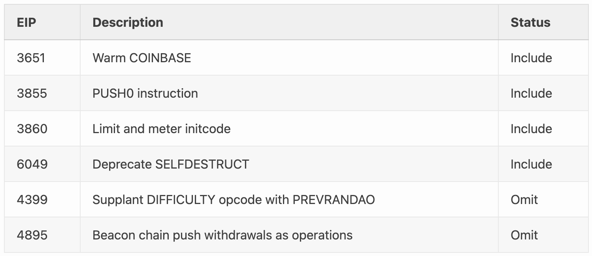

---
**You can listen to or watch this video here:**

<iframe width="560" height="315" src="https://www.youtube.com/embed/XXX" title="YouTube video player" frameborder="0" allow="accelerometer; autoplay; clipboard-write; encrypted-media; gyroscope; picture-in-picture; web-share" allowfullscreen></iframe>

---

We are pleased to announce that the Ethereum Classic (ETC) Spiral upgrade was a success!

The purpose of Spiral was to bring ETC up to parity with the Ethereum Virtual Machine standard and the Ethereum network. It accomplished this by enabling the outstanding Ethereum Foundation Shanghai network protocol upgrades on ETC.

Spiral added support for a subset of protocol-impacting changes introduced in Shanghai. 

The changes for Ethereum Classic included the following:

To learn more about the Spiral upgrade please refer to the corresponding ECIP: https://ecips.ethereumclassic.org/ECIPs/ecip-1109

Spiral was activated network wide on block 19,250,000 which occurred on February 5 2024 at 1:34:37 hours UTC.

---

**Thank you for reading this article!**

To learn more about ETC please go to: https://ethereumclassic.org
