---
**You can listen to or watch this video here:**

<iframe width="560" height="315" src="https://www.youtube.com/embed/gCoMipvQJtY" title="YouTube video player" frameborder="0" allow="accelerometer; autoplay; clipboard-write; encrypted-media; gyroscope; picture-in-picture; web-share" allowfullscreen></iframe>

---

In this post we will explain how to use Ethereum Classic with Ledger Nano S Plus; the hardware wallet and the desktop app; how to add the Ethereum Classic (ETC) blockchain app to it, and how to create your first ETC address.

## The Ledger Hardware and Software Components

Ledger Nano S Plus is a hardware wallet, so to use it you need to have your Ledger Nano S Plus device and install the Ledger Live app on your computer. You will also need a card to write your secret passphrase, as will be explained later.

In this tutorial we will explain how to set up your Ledger Nano S Plus and to add Ethereum Classic to it and on your computer.

We will show the parallel actions on your Ledger Nanos S Plus and on your computer where appropriate.

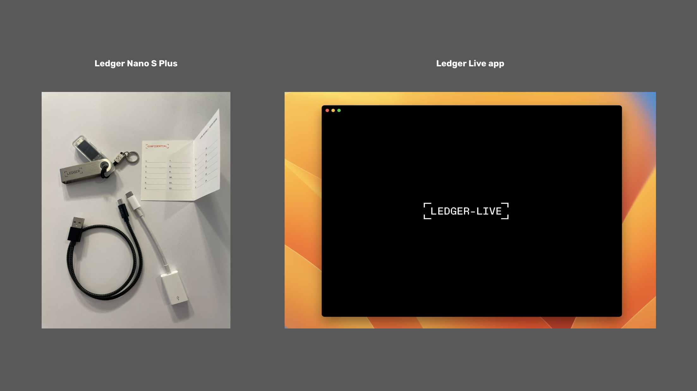

## 1. Install the Ledger Live App on Your Computer

Everything starts with the hardware wallet and the Ledger Live app on your computer. To download the app you need to go to:

https://www.ledger.com/start

Then, open it on your computer and press the “Get started” button.

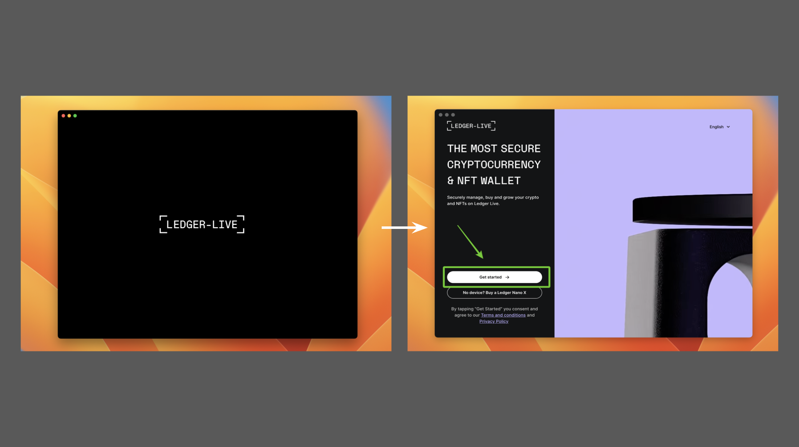

## 2. Select Device and Setup Style

In the next few steps Ledger Live will ask you which device model you own, if you are setting it up for the first time, or if you already have a recovery phrase from before. Since this post is for Ledger Nano S Plus and a new setup, then press “Select” on the Ledger Nano S Plus model and then click the “SETUP NEW NANO S PLUS” link.

After this, the app will show you a short educational message. When you finished reading it, then press “Let’s do this”.

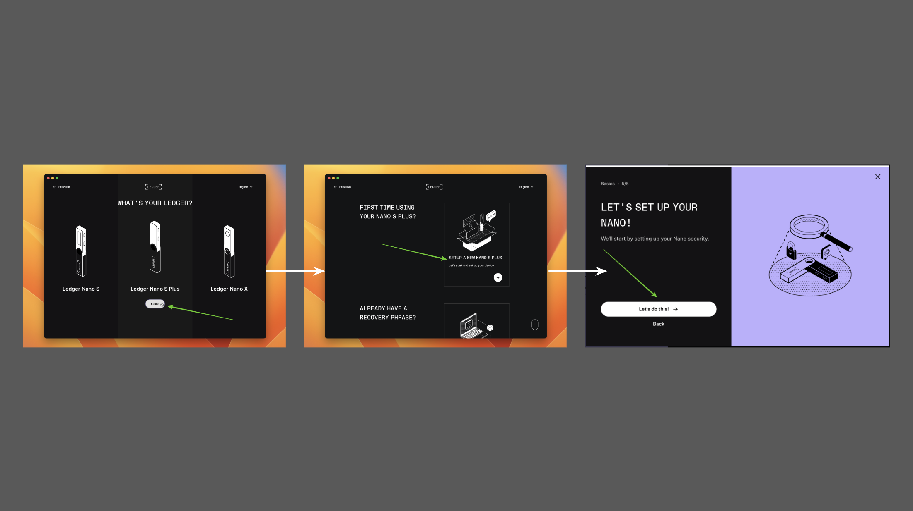

## 3. Prepare to Set Up Your Device and Turn it On

In the next screen, Ledger Live on your computer will explain how the process will work and how long it will take. When you finish reading press on the “OK I’m ready!” button. After this, it will tell you to connect your Ledger Nano S Plus to your computer (see the next screen for parallel actions on your Ledger Nano S Plus device) and to follow the steps until you get to the message “Set up as new device”.

Press “Next step” on the Ledger Live app on your computer and on your Ledger Nano S Plus device initiate “Set up as new device” by pressing both buttons at the top of the device at the same time.

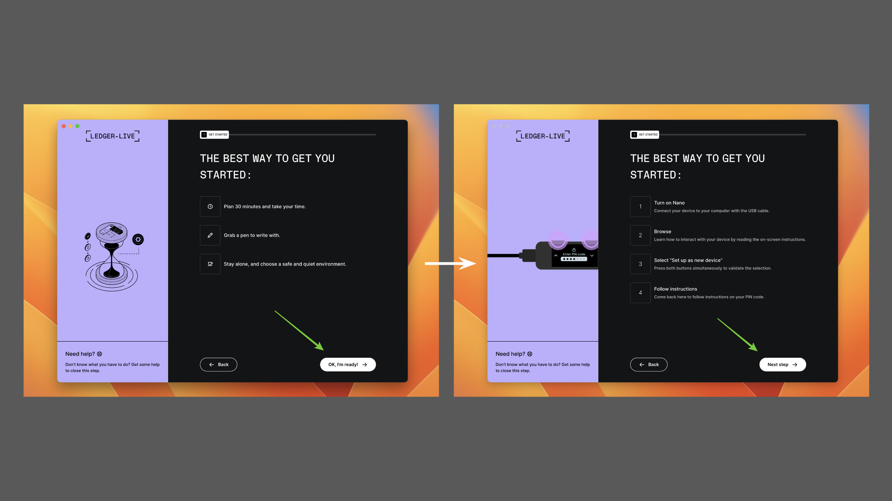

### Connect Your Ledger Nano S Plus and Set Up as New Device In Parallel

As you follow the steps on your computer app, connect your Ledger Nano S Plus device to your computer and follow the steps and instructions on it.

When you get to the point where it says “Set up as new device”, then press both menu buttons at the top of your device at the same time as shown in the image on the right.

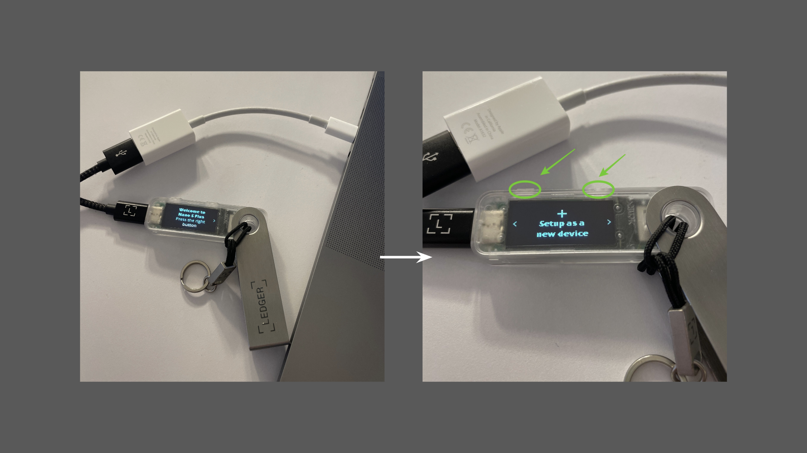

## 4. Set Up the Device Pin Code

In the next step, Ledger Live on your computer will tell you that you need to select a four to eight digit PIN CODE for your device.

In parallel, you will see on your device the message “Choose PIN”. Press both menu buttons to select your PIN.

When you have selected and re-confirmed your PIN number on your Ledger Nano S Plus device, it will go to the next step. Press “Next step” on your Ledger Live on your computer as well, read the guide about your PIN code, and then press “Get started”.

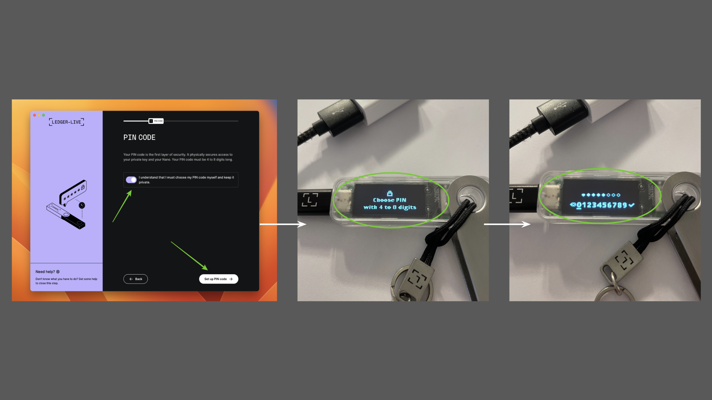

## 5. Write Down Your Recovery Phrase

In the next step, Ledger Live on your computer will ask you to check and write down your 24 word recovery phrase. On your device, you will need to press the right menu button to start the process. After a few instructions, you will see “word #1” first, then “word #2” next, and so on until you reached the 24th word. Write them all down in a card provided in the box of your Ledger Nano S Plus.

You got up to three cards, so you may copy the passphrase up to three times so you may put them in different safe places as a backup.

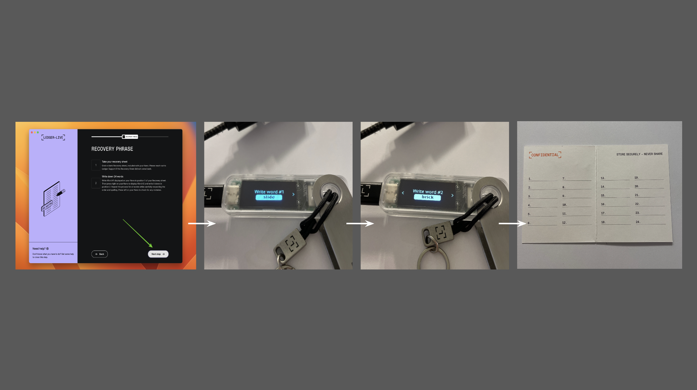

## 6. Confirm Your Recovery Phrase

To make sure that you copied the 24 word passphrase correctly and in the right order, Ledger Live on your computer will ask you to confirm each word.

In parallel, on your Ledger Nano S Plus device, you will see each word again as you press the right menu button. Several of them will be wrong on purpose, so you need to scroll right or left with the menu buttons to search for the correct words, and confirming them by pressing both menu buttons.

When you confirm all 24 words, then your Ledger Nano S Plus will tell you that your recovery phrase is set.

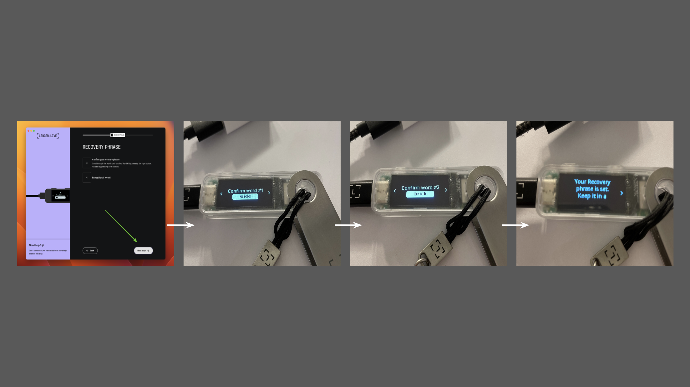

## 7. Hide Recovery Phrase and Perform Genuine Check

In the next screen, Ledger Live will ask you to hide your recovery phrase in a safe place, or several places if you made more copies. After this, it will greet you and ask you a few questions to see if you understood the security features of the system. Then, it will ask you to perform a “GENUINE CHECK” to make sure that the device you are using is real and from the original equipment manufacturer.

After the genuine check is approved and confirmed, press “Continue”.

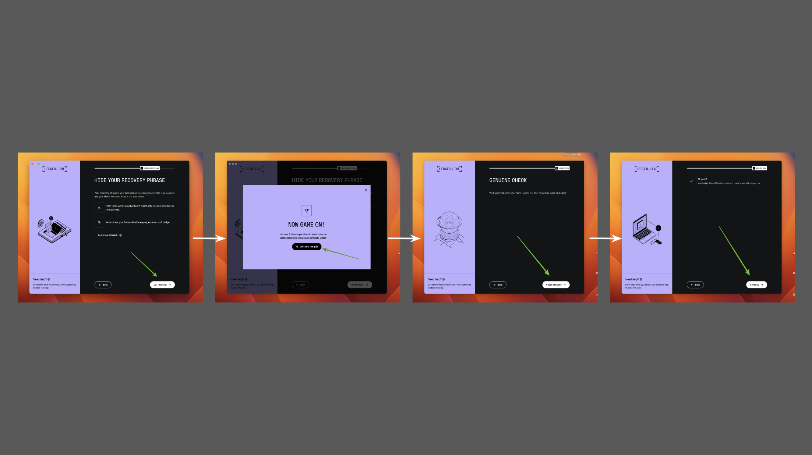

## 8. Add the Ethereum Classic App to Your Ledger Nano S Plus

In the next step, you will see the homepage of your Ledger Live app on your computer. To add Ethereum Classic, we need to add the ETC app both inside the Ledger Live on your computer and on your Ledger Nano S Plus device.

To add ETC, search for “Ethereum Classic” in the field provided. When “Ethereum Classic (ETC)” appears, click the “Install” button on its right. In the next screen Ledger Live will report that it will install both the Ethereum and the Ethereum Classic apps for technical reasons. Press “Install apps”. In the next screen, Ledger Live will show you that the ETC app is installed. In parallel to this process you may see the installation of ETC on your Ledger Nano s Plus as well.

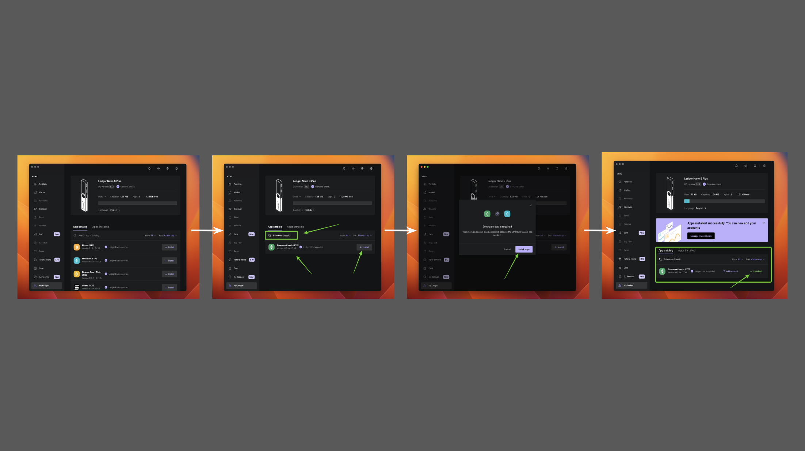

## 9. Add Your First ETC Account to Your Ledger Nano S Plus

To add your first ETC address to your Ledger nano S Plus, you need to press the “Manage my accounts” button in the screen where we left in the previous section. Then, we need to open the Ethereum Classic app that we installed in our Ledger Nano S Plus device by pressing on both top buttons at the same time.

In the next screen, Ledger Live will show you on your computer that the device and the app on your computer are “Synchronizing” to set up an ETC account.

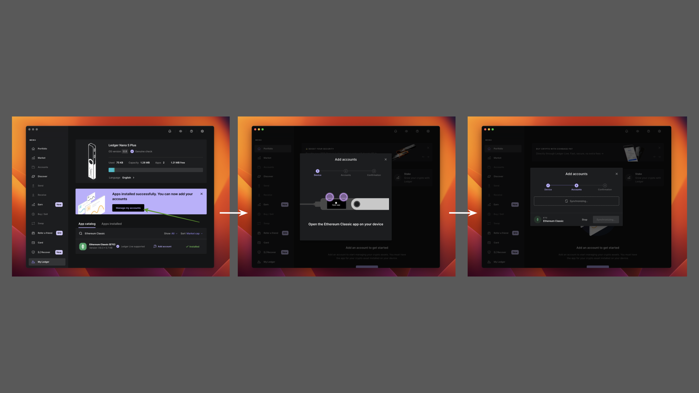

After a few second, your Ledger Live on your computer will show you an Ethereum Classic address to add as a new account. Press the “Add account” button to add it. The default name on it will be “Ethereum Classic 1”  but you may change it.

In the next screen, Ledger Live will report that the account was added successfully. To continue, press “Done”.

Finally, by clicking on the left vertical menu on the “Accounts” tab, you will be taken to the ETC profile page on Ledger Live and you will see the ETC address “Ethereum Classic 1” as the first account at the top.

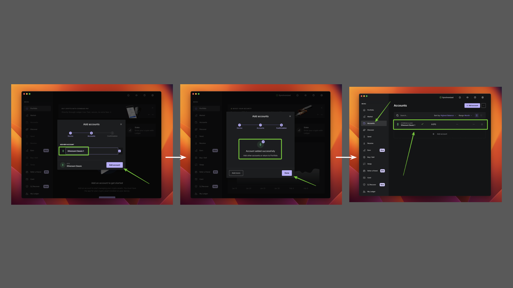

---

**Thank you for reading this article!**

To learn more about ETC please go to: https://ethereumclassic.org
