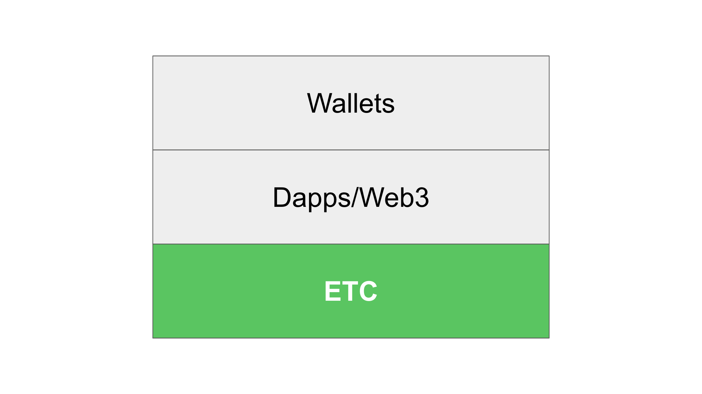

---
**You can listen to or watch this video here:**

<iframe width="560" height="315" src="https://www.youtube.com/embed/9D5bCiEA_rQ" title="YouTube video player" frameborder="0" allow="accelerometer; autoplay; clipboard-write; encrypted-media; gyroscope; picture-in-picture; web-share" allowfullscreen></iframe>

---

In previous posts we have explained the many parts of Ethereum Classic (ETC), such as what are nodes, economic nodes, miners, mining pools, hardware nodes, and cloud nodes. We have also explained the importance of these things and how to follow their statistics.

However, there are still confusions about the layers of a blockchain system such as ETC. 

Some people still confuse the blockchain itself with applications that run on it, and even have difficulty differentiating what are tokens vs the base coins in these systems.

In this post in particular we will explain the difference between ETC and dapps in ETC. In a future article and video we will explain the differences between the coin and the tokens, which is a related topic!

## What Is Ethereum Classic?

To explain, then, the difference between ETC and dapps inside ETC, it is important to explain what is Ethereum Classic in the first place.

ETC is a global network of computers that run the Ethereum Classic software client. 

The Ethereum Classic software client is a set of rules that enables the machines that run it to host the ETC blockchain, which is the database that contains the ledger with all the accounts and balances of ETC, and all the decentralized software programs that are hosted in it.

All the computers as a whole function as if they were a single machine that every 13 seconds updates the state of the system to exactly the same point in its history in all computers on a global scale.

## Ethereum Classic as an Operating System

ETC is like a cloud service, but decentralized and works as an operating system, more or less like Android, Windows, macOS, or iOS.

Operating systems are software code that associate the parts of the hardware in which they are installed to the applications used in those devices.

As such, they represent standards that developers of multiple applications and providers can rely on to build their apps so they can be compatible with each other and familiar to all users.

Similarly, Ethereum Classic, as a programmable blockchain, is a software system that represents standards of how accounts, balances, and opcodes must be used by developers for their applications to interact with each other and for ETC users to find familiar and useful.

## What Are Smart Contracts?

So, we have mentioned “dapps” and “applications” inside ETC, but how do these things work?

As we said, Ethereum Classic is a programmable blockchain. This means that it may host what are called “smart contracts”.

Smart contracts are nothing more than software programs! 

The unique aspect of these software programs in ETC is that they are hosted in all the machines of the network and, therefore, become decentralized when they are sent to it. 

This is because they get multiplied and replicated in all computers of the system globally.

## What Are Dapps?

These software programs can power what we usually call “applications”, but because they are in the ETC database or ledger, we call them “decentralized applications” or “dapps” for short.

Again, dapps are simply smart contracts or software programs that become decentralized because they are stored in the blockchain, which is identically replicated in all the computers of the system.

These dapps may do whatever they are programmed to do. For example, they may be decentralized exchanges, yield farming services, domain name services, NFTs, insurance products, or property registries.

In the future there will be hundreds or thousands of kinds applications in ETC. 

## Dapps are as Apps on Operating Systems but on Ethereum Classic

So, here is where the distinction comes in: That ETC is a software that is run in all the computers of the system to host the database which contains all the smart contracts, does not mean that the smart contracts are ETC itself!

ETC is just the operating system as Android may be the operating system of your phone.

In your phone you can download the app of your bank, Facebook, Instagram, an app to edit photos, YouTube, or even your favorite music app.

Just as these apps are not Android itself, dapps in ETC are not ETC itself. They are just applications that developers have deployed to provide services through this blockchain, which happens to be the most secure in the world for decentralized applications!

## What Is the Web3?

So, now that we know the difference between the Ethereum Classic blockchain as an operating system and decentralized applications as mere apps that run on it, we can explain how dapps will change the landscape of the web.

The concept of the web3 is that the current web runs in centralized servers and data centers controlled by corporations or governments. 

With blockchains such as ETC, all these web services could be transformed into decentralized web services, also known as the “web3”, and, therefore, would become impossible to censor, a problem that has plagued the traditional web.

This will be a major paradigm change in the world, and ETC will be one of the main motors driving it.

## How We Use Ethereum Classic and Its Dapps Through Wallets

Speaking of layers, if Ethereum Classic may be considered a base layer of the blockchain industry because it functions as a highly secure operating system for smart contracts, then the dapps may be considered a second layer on top of ETC or layer 2 (L2).

If dapps and the web3 are essentially the same thing, then the web3 in itself may be considered an L2 as well.

Finally, the user interfaces that will be the tools utilized by the public and businesses to send transactions and use all the dapps and manage their assets in ETC will be what we call the wallets, primarily non-custodial wallets such as Metamask, Trust Wallet, Emerald, Ledger, or Trezor. These will be our windows to dapps and the web3.

---

**Thank you for reading this article!**

To learn more about ETC please go to: https://ethereumclassic.org
