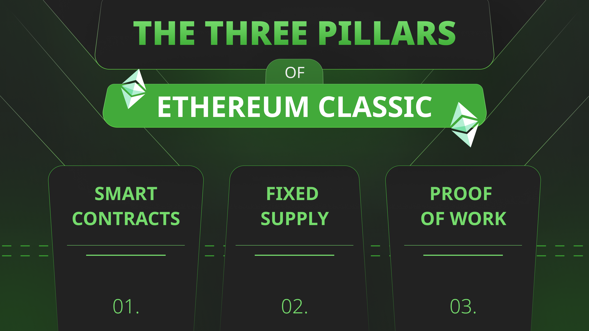
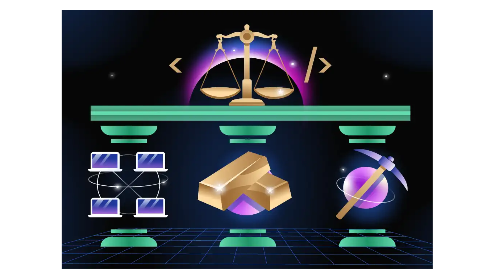

---
**由此收听或观看本期内容:**

<iframe width="560" height="315" src="https://www.youtube.com/embed/xxsdDcjxWuU" title="YouTube video player" frameborder="0" allow="accelerometer; autoplay; clipboard-write; encrypted-media; gyroscope; picture-in-picture; web-share" allowfullscreen></iframe>

---

在上一课，第15课中，我们解释了工作证明（POW）区块链，如比特币（BTC）和以太坊经典（ETC），将成为区块链行业的基础层，因为它们具有数字黄金的安全性和品质。

然而，ETC具有独特的属性组合，因为它不仅是一个工作证明区块链，具有固定的货币政策，而且还可以通过智能合约进行编程。

这种独特的ETC定位已使其成为全球最大的POW智能合约区块链，并且在所有POW区块链中排名第五。

这三个支柱使得“代码即法律”和“不可阻挡”的概念成为可能。

在第16课中，我们将解释ETC的三个支柱：POW、固定供应和智能合约；以及为什么它们使“代码即法律”和“不可阻挡”的真正概念成为可能。

## 支柱1：以太坊经典是工作证明区块链

工作证明是世界上点对点计算机网络最安全的共识机制。人类已知没有其他系统能与之相比。

这意味着网络中的所有参与计算机都可以以完全去中心化的方式每13秒就“共识”（因此称为“共识”）数据库的确切状态，也称为“区块链”，没有任何审查或受特殊利益控制的可能性。

在这个上下文中，“安全性”意味着去中心化，而去中心化则意味着信任最小化，是[以太坊经典](https://ethereumclassic.org/blog/2023-03-08-ethereum-classics-focus-on-trust-minimization)等区块链的主要目标。

实质上，POW使ETC成为全球最安全的智能合约区块链。

## 支柱2：以太坊经典有固定供应

就像信任最小化是以太坊经典的主要目标一样，健全的货币同样重要。

ETC币是健全的货币，因为它稀缺、耐用、制造成本高、便携、可分割、可互换和可转移。

ETC之所以稀缺，是因为它的协议中集成了一项货币政策，通过每2年将奖励矿工的区块奖励减少20%的方式减少发行的硬币。这确定了ETC在其历史中将存在的[总供应](https://ethereumclassic.org/blog/2023-10-18-ethereum-classic-has-a-supply-cap-like-bitcoin)为210,700,000。

ETC的制造成本高，因为作为POW区块链，为了向矿工支付构建区块的硬币，他们必须进行大量的工作，类似于现实世界中的黄金矿工，因此有“数字黄金”这个术语来描述它。

## 支柱3：以太坊经典具有智能合约

当中本聪创建比特币时，[他设想其中有智能合约](https://ethereumclassic.org/blog/2023-12-14-etc-proof-of-work-course-6-etc-is-btc-philosophy-with-eth-technology)使其可编程。

然而，由于其设计的技术问题，比特币不支持在其高度安全的环境中部署智能合约。

这就是为什么Vitalik Buterin发明了以太坊经典，它是[最初的以太坊](https://ethereumclassic.org/blog/2023-01-26-ethereum-classic-course-6-ethereum-classic-is-the-original-chain)区块链，是一个POW区块链，具有数字黄金，并且它可以进行编程。

因此，ETC是比特币的哲学与以太坊的技术的结合。换句话说，是两者兼得。

通过智能合约的可编程性，ETC成为了全球最多才多艺且安全的区块链。

## 这些支柱如何使“代码即法律”成为可能？

在以太坊经典中，“代码即法律”的哲学意味着一旦在其中部署了由智能合约驱动的去中心化应用程序（dapps），它们就变得不可变且无法更改。

在ETC的高度安全环境中，“代码即法律”类似于物理法则，而不是人的法律。

在现实世界外，人们可能发生争议，并通过他们的法律体系寻求解决这些问题。

然而，在ETC内部，正是POW、固定供应和智能合约的结合使得全球范围内的应用程序变得不可变。

## 它们如何使“不可阻挡”成为可能？

同样，ETC的三个支柱使得dapps、账户和余额变得不可阻挡。

一旦世界上的任何人向ETC发送交易，只要根据协议规则正确接收并形成，它就会被系统处理和执行。

这包括dapps的执行，它以完全去中心化和无许可的方式在全球范围内进行。

“不可阻挡”意味着确保人们通过自己的私钥，将长期独占地控制他们在以太坊经典中的资产和dapps的确定性，而不会受到任何第三方或特殊利益的干扰风险。

## 以太坊经典中的应用程序是世界上最安全的应用程序

为什么ETC的三个支柱如此重要呢？

总而言之，以太坊经典是全球最安全的应用程序存在的环境，因为它是一个POW区块链，因此真正去中心化；它具有固定的货币政策，因此是健全的货币；而且它是可编程的，因此比其他替代品更加多才多艺和安全。

除了这些品质之外，ETC是一个完全复制的区块链，这增加了它的安全性；它是可组合的，这减少了风险和结算成本；而且是具有这种组合设计的全球最大的区块链！

在同一集成系统中，这些属性为其中托管的任何应用程序提供了最高级别的去中心化，从而实现了最高水平的信任最小化和安全性。

---

**感谢您阅读本文！**

要了解更多关于ETC的信息，请访问：https://ethereumclassic.org
