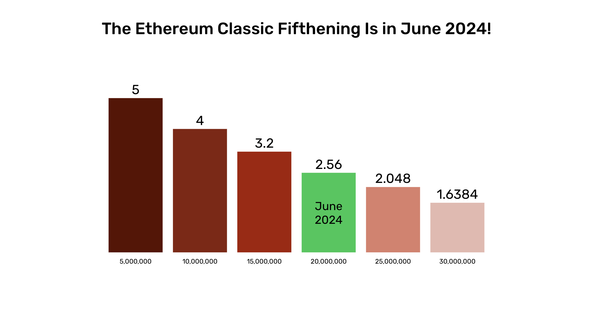
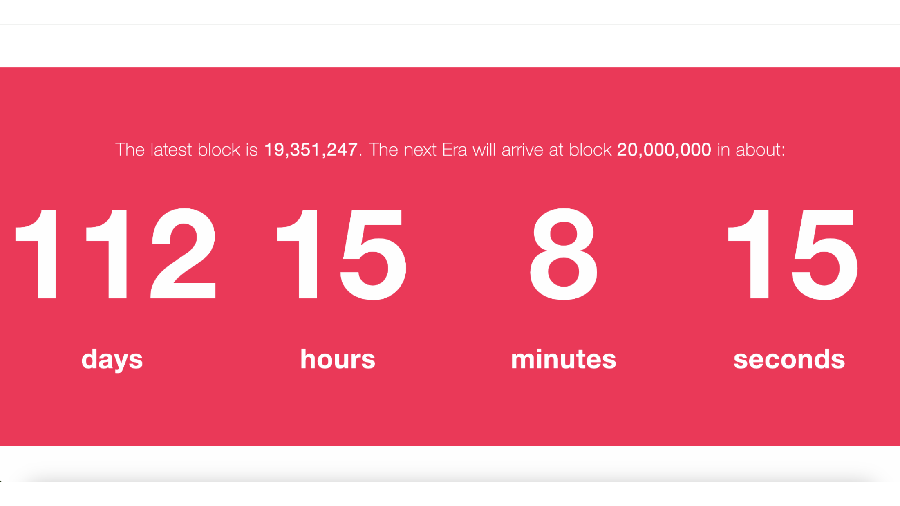

---
**You can listen to or watch this video here:**

<iframe width="560" height="315" src="https://www.youtube.com/embed/h4e7QYI8L8A" title="YouTube video player" frameborder="0" allow="accelerometer; autoplay; clipboard-write; encrypted-media; gyroscope; picture-in-picture; web-share" allowfullscreen></iframe>

---

Just as Bitcoin (BTC) has the “halving” event every four years, Ethereum Classic (ETC) has the “fifthening” event every two years. 

Also, like Bitcoin, it is an important event in the history of ETC each time there is a fifthening because it brings the issuance rate lower, and a lower issuance rate means harder money.

ETC has recently successfully gone through a very important event, which was the [Spiral hard fork](https://ethereumclassic.org/blog/2024-01-16-announcement-upgrade-your-nodes-for-the-ethereum-classic-spiral-upgrade-on-block-19250000). The next exciting moment will be the day of the fifthening which is estimated to be between May 27 and June 11 of 2024.

The inflation rate of ETC is currently running at 4.26%. After the next fifthening it will go down to 3.41%. This is good news for ETC investors and savers.

## What Is the Fifthenning?

When Satoshi Nakamoto set the supply schedule of BTC, he determined that every 210,000 blocks, or 4 years, the payment to miners was going to be reduced by 50%, hence the “halving”. This payment schedule will reduce the issuance of BTC until it reaches zero. This will determine a total supply of BTC that will ever exist of 21,000,000.

Similarly, when the ETC community set the supply schedule of ETC [in 2017](https://ecips.ethereumclassic.org/ECIPs/ecip-1017), it determined that every 5,000,000 blocks, or 2 years, the payment to miners was going to be reduced by 20%, hence the “fifthening”. This payment schedule will also reduce the issuance of ETC until it reaches zero. This will determine a total supply of ETC that will ever exist of 210,700,000.

## How Do You Track the Fifthenning?

The easiest way to track the Ethereum Classic schedule of fifthenings is to go to [etcis.money](https://etcis.money/) and check there how many days are left until the next 20% discount to miners.

As may be seen in the image in this section, at the time of this writing, February 20 2024, we are on block 19,351,247 and the next fifthening happens on block 20,000,000.

As block 20,000,000 is estimated to happen in 112 days and 15 hours, then the current date plus 112 days and 15 hours will be June 11 2024.

The [etcis.money](https://etcis.money/) website has other interesting data points and information about ETC, such as its features and a comparison chart between ETC, BTC, and ETH.

## How Do You Calculate the Fifthenning?

Historically ETC has had block times between 13 and 15 seconds, so below we are going to go through the processes of calculating the remaining days to the next fifthening using 13 and 15 second estimates.

To estimate when the next ETC fifthening will happen we need to know how many blocks are left until the next fifthening. 

Then, we need to multiply that number of blocks by the average block time of the network in seconds (we will use 13 and 15 seconds). 

This will give us the number of seconds left until the next fifthening. If we transform that amount into days, then we will be able to add the result to the current date and determine when the next fifthening will happen.

How Do You Calculate the Fifthenning?

### Following the above logic, using 15 seconds, we will do the following calculation:

Current ETC block at the time of this writing: 19,351,247

Next fifthening block number: 20,000,000

Blocks left until the next fifthening: 20,000,000 - 19,351,247 = 648,753

Seconds left until the next fifthening: 648,753 x 15 = 9,731,295

Days left until the next fifthening: 9,731,295 / 60 / 60 / 24 = 112.63

Current date at the time of this writing: February 20 2024

**Current date + 112.63 days = June 11 2024**

### Now, we will use 13 seconds:

Current ETC block at the time of this writing: 19,351,247

Next fifthening block number: 20,000,000

Blocks left until the next fifthening: 20,000,000 - 19,351,247 = 648,753

Seconds left until the next fifthening: 648,753 x 13 = 8,433,789

Days left until the next fifthening: 8,433,789 / 60 / 60 / 24 = 97.61

Current date at the time of this writing: February 20 2023

**Current date + 97.61 days = May 27 2024**

The above estimates mean that the next ETC fifthening will happen between May 27 and June 11 2024.

## ETC Is Programmable Digital Gold

The most important goals of blockchains are trust minimization and sound money. In the case of ETC, it is sound money with smart contracts, which makes it programmable sound money.

Because ETC has this fixed monetary policy explained in this article, it is hard money as its new issuance will continue to  diminish until inflation will reach zero.

Not only ETC is hard money due to its fixed supply, but it is also a proof of work (POW) blockchain.

POW ensures that the cost of creating the coins is the same as creating the blocks. 

This gives ETC the same unforgeable costliness that Satoshi Nakamoto gave Bitcoin making it digital gold. And, because ETC supports smart contracts, then it is programmable digital gold.

---

**Thank you for reading this article!**

To learn more about ETC please go to: https://ethereumclassic.org
