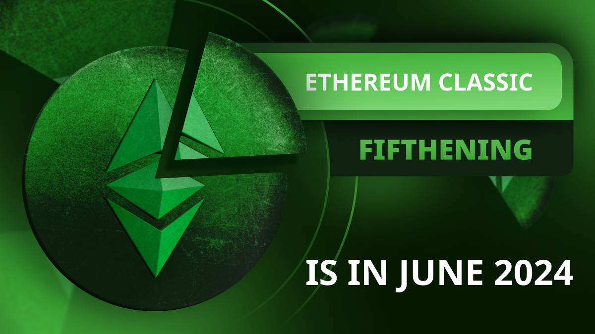
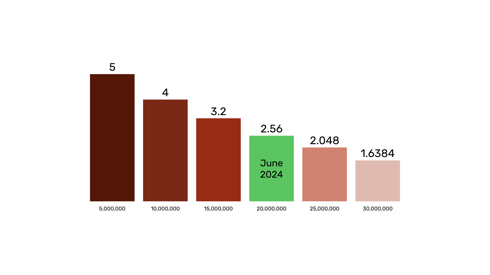

---
**收听或观看本期内容:**

<iframe width="560" height="315" src="https://www.youtube.com/embed/h4e7QYI8L8A" title="YouTube video player" frameborder="0" allow="accelerometer; autoplay; clipboard-write; encrypted-media; gyroscope; picture-in-picture; web-share" allowfullscreen></iframe>

---

正如比特币（BTC）每四年进行一次“减半”事件一样，以太坊经典（ETC）每两年进行一次“减产”事件，也被称为“fifthening”。

与比特币类似，每次进行“fifthening”对ETC的历史都是重要的事件，因为它将发行速率降低，较低的发行速率意味着更加坚硬的货币。

最近，ETC成功经历了一次非常重要的事件，即[Spiral硬分叉](https://ethereumclassic.org/blog/2024-01-16-announcement-upgrade-your-nodes-for-the-ethereum-classic-spiral-upgrade-on-block-19250000)。接下来令人期待的时刻将是fifthening的日子，预计在2024年5月27日至6月11日期间。

ETC的通货膨胀率目前为4.26%。在下一次fifthening之后，它将降至3.41%。这对ETC的投资者和储蓄者来说是个好消息。

## 什么是Fifthenning？

当Satoshi Nakamoto制定BTC的供应计划时，他确定了每210,000个区块或4年，对矿工的支付将减少50%，因此有了“减半”事件。这一支付计划将减少BTC的发行，直到达到零。这将确定BTC的总供应量为21,000,000。

类似地，当ETC社区于[2017年](https://ecips.ethereumclassic.org/ECIPs/ecip-1017)制定ETC的供应计划时，它确定了每5,000,000个区块或2年，对矿工的支付将减少20%，因此有了“fifthening”事件。这一支付计划还将减少ETC的发行，直到达到零。这将确定ETC的总供应量为210,700,000。

## 如何跟踪Fifthenning？

跟踪以太坊经典fifthenning日程表的最简单方法是访问[etcis.money](https://etcis.money/)并检查距离下一次对矿工的20%折扣还有多少天。

正如本节图片所示，在撰写本文的时间，即2024年2月20日，我们正在第19,351,247个区块，而下一次fifthening将在第20,000,000个区块发生。

由于估计第20,000,000个区块将在112天15小时内发生，因此当前日期加上112天15小时将是2024年6月11日。

[etcis.money](https://etcis.money/)网站还提供关于ETC的其他有趣数据点和信息，例如其特点以及ETC、BTC和ETH之间的比较图表。

## 如何计算Fifthenning？

从历史上看，ETC的区块时间在13到15秒之间，因此下面将介绍使用13和15秒估算剩余天数到下一次fifthening的过程。

为了估算下一次ETC fifthening将发生的时间，我们需要知道距离下一次fifthening还有多少个区块。

然后，我们需要将该区块数乘以网络的平均区块时间（我们将使用13和15秒）。

这将给出距离下一次fifthening的剩余秒数。如果将该金额转换为天数，然后将结果加到当前日期，我们将能够确定下一次fifthening将在何时发生。

如何计算Fifthenning？

### 遵循上述逻辑，使用15秒，我们将执行以下计算：

当前ETC区块在撰写本文时：19,351,247

下一个fifthening区块编号：20,000,000

距离下一次fifthening的剩余区块数：20,000,000 - 19,351,247 = 648,753

距离下一次fifthening的剩余秒数：648,753 x 15 = 9,731,295

距离下一次fifthening的剩余天数：9,731,295 / 60 / 60 / 24 = 112.63

在撰写本文的时间，即2024年2月20日的当前日期：

**当前日期 + 112.63天 = 2024年6月11日**

### 现在，我们将使用13秒：

当前ETC区块在撰写本文时：19,351,247

下一个fifthening区块编号：20,000,000

距离下一次fifthening的剩余区块数：20,000,000 - 19,351,247 = 648,753

距离下一次fifthening的剩余秒数：648,753 x 13 = 8,433,789

距离下一次fifthening的剩余天数：8,433,789 / 60 / 60 / 24 = 97.61

在撰写本文的时间，即2024年2月20日的当前日期：

**当前日期 + 97.61天 = 2024年5月27日**

上述估算意味着下一次ETC fifthening将在2024年5月27日至6月11日之间发生。

## ETC是可编程数字黄金

区块链的最重要目标是最小化信任和建立健全的货币体系。对于ETC而言，它是具有智能合约的健全货币，使其成为可编程的健全货币。

由于ETC在本文中解释的具有固定货币政策，它是硬通货，因为其新的发行将继续减少，直到通货膨胀达到零。

ETC不仅因为其固定供应而是硬通货，而且它还是一条工作量证明（POW）区块链。

POW确保创建硬币的成本与创建区块的成本相同。

这使ETC具有与Satoshi Nakamoto赋予比特币的同样无法伪造的成本性，使其成为数字黄金。而且，由于ETC支持智能合约，因此它是可编程的数字黄金。

---

**感谢您阅读本文！**

要了解更多关于ETC的信息，请访问：https://ethereumclassic.org
