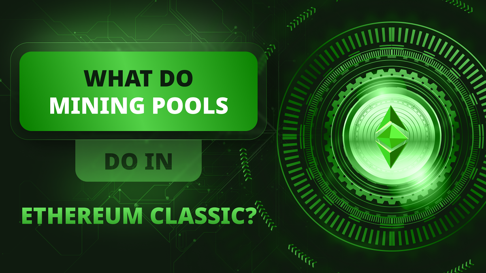

---
**You can listen to or watch this video here:**

<iframe width="560" height="315" src="https://www.youtube.com/embed/wGSVY_Vb3_c" title="YouTube video player" frameborder="0" allow="accelerometer; autoplay; clipboard-write; encrypted-media; gyroscope; picture-in-picture; web-share" allowfullscreen></iframe>

---

A blockchain such as Ethereum Classic (ETC) is a network of computers around the world that constantly receive new transactions from users.

The purpose of the network is to execute these transactions and keep track of accounts and balances in a ledger or database called a blockchain.

ETC also hosts what are called smart contracts, which are software programs that become decentralized when they are stored in the network.

All nodes of the system hold an identical copy of all transactions, accounts, balances, and smart contracts. This is the key of the decentralization of the system.  

## What Do Nodes Do?

Of all the machines participating in the network, a subgroup are what are called “nodes”.

Nodes are the ones that receive the new transactions all the time, they resend them to all other nodes, they store the replicated blockchain, and verify that transactions and blocks are correct before including them in the database.

“Blocks” are batches of transactions built and sent to the nodes by what are called “miners”.

## What Do Miners Do?

Miners are the other subgroup of computers in the system.

As said in the previous section, miners accumulate new transactions in batches, they seal them with what is called a hash or cryptographic stamp, and then send them as “blocks” to the nodes of the network for verification.

To seal these transactions, miners have to do a lot of computational work in a process called “proof of work” that creates these hashes or seals. This process requires enormous amounts of power and consequently cost a lot of money.

This work and investment by miners is critical to secure blockchains such as ETC while making their coins hard money, thus digital gold.

## What Are the Economics of Miners?

The economics of miners are based on their capacity to produce the computational work to seal blocks. It is a competitive lottery system, where one miner wins each round. Consequently, each isolated miner’s economics are determined by the following variables:

**Block rewards:** Each time a miner wins a round, meaning that they sealed a block first and the nodes accepted it, it gets paid in ETC. The current payment is 2.56 ETC per block. As ETC produces around 6,646 blocks per day, it pays miners a total of 17,013 ETC per day.

**Market price:** The market price of ETC determines the revenues in fiat money for the miners. If a miner wins a round and gets paid 2.56 ETC and the market price of the coin is $25, then he earned $64 for that round.

**Hash rate:** The hash rate is the capacity to do computations per second by the miner. The more computations per second it can do, the higher the probability that it will win a round. Consequently, miners seek to accumulate as much hash rate as possible. 

**Capital investment:** To accumulate as much hash rate as possible, miners need to buy as many machines with as much hash power as possible. This is the core of the capital investment by miners.

**Electricity costs:** Once miners have their mining computers running, these use enormous amounts of electricity to compute the trillions of hashes per second they need to compete to win a round. On average it is estimated that more than 50% of the costs of miners is electricity.

**Operational expenses:** Although it may be a minor part of the total costs, operational expenses are an additional cost to take into account. These may range from data center setup, plant, and installations, to personnel taking care of the mining gear and operations.

## What Are Mining Pools?

Given the economics of mining, it can be a very dry, isolated, and financially demanding effort to work with a standalone mining operation.

To facilitate the aggregation of miners, especially those with lower hash rates, such as home or office miners, mining pools are services that help aggregate the hash power of many mining machines worldwide so that they may operate as a single and larger miner operation.

## How Do Mining Pools Work?

The way pools work is that they function as node operators, they have no mining capacity, but they receive all the transactions as a regular node, and then they prepare with them a template of the next block, just as a stand alone miner would do, and pre-produce the template so that the aggregated miners of the pool may work on it each round.

When Pools create the template for the next block, they send it to their participating mining machines. When these receive it, they immediately start producing trillions of hashes per second for that template and checking if they hit a target set by the pool.

If they didn’t hit the target, then they keep producing more hashes. If a miner hits the target given, they send the information to the pool operator.

When the pool operator receives the information, they verify whether the hash hit the protocol target, and if it did, they prepare and send the new block to the rest of the network for approval.

If no miner hit the target and a block for the round was won by another pool or solo miner elsewhere, then the pool immediately prepares a new template for the next round and sends it to the participating miners so they can discard the previous template and start working on the new one.

## What Are the Economic Benefits of Pools to Miners?

Mining pools usually charge a fee that may hover around 1% to run their operations and aggregate miners worldwide efficiently.

The economic benefits to miners of using mining pools is that when operating alone, they depend completely on the randomness of the revenues. This is that, if they have a small fraction of the hash power of all the network, then it may take days to win even one round of 2.56 ETC. 

However, when participating in a pool, the pool operator smooths out the revenues by wining many more blocks, perhaps many per day, and then distributing those revenues evenly among all the participating machines on a daily basis based on their contributed hashrate.

For example, in the image in this section is the daily revenue table of a miner who has only 0.0035% of the hashing power of ETC, but receives around 0.60 ETC on a daily basis due to the effects of pooling the hashrate with others.

## List of Top Mining Pools

For anyone looking to mine ETC who wishes to join a mining pool, in this section we show the top 10 mining pools in ETC as per the website [Mining Pool Stats](https://miningpoolstats.stream/ethereumclassic).

To join any of the pools, miners need to go to their website, then register and associate their mining machines to the pool by using the URLs provided by them and configuring their miners.

---

**Thank you for reading this article!**

To learn more about ETC please go to: https://ethereumclassic.org
