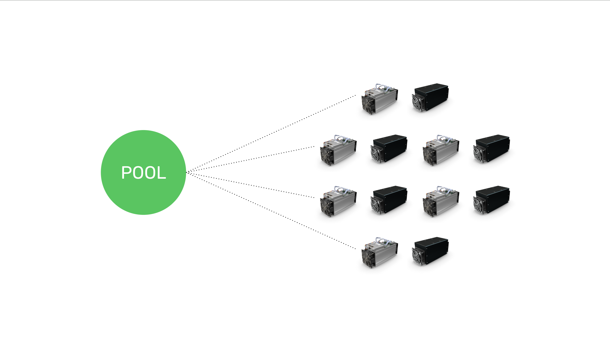
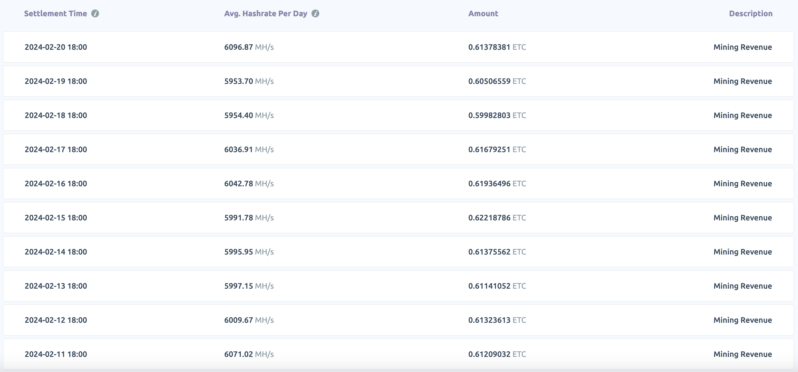
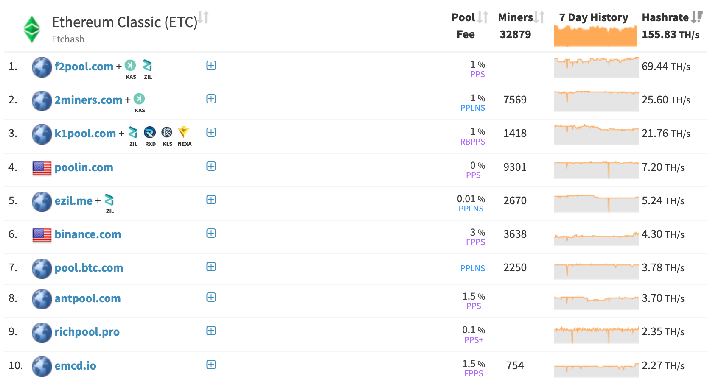

---
**由此收听或观看视频:**

<iframe width="560" height="315" src="https://www.youtube.com/embed/wGSVY_Vb3_c" title="YouTube video player" frameborder="0" allow="accelerometer; autoplay; clipboard-write; encrypted-media; gyroscope; picture-in-picture; web-share" allowfullscreen></iframe>

---

区块链，如以太坊经典（ETC），是全球计算机网络，不断接收来自用户的新交易。

网络的目的是执行这些交易，并在称为区块链的分类账或数据库中跟踪账户和余额。

ETC还托管所谓的智能合约，这是一种存储在网络中时变得分散的软件程序。

系统的所有节点都持有所有交易、账户、余额和智能合约的相同副本。这是系统分散化的关键。

## 节点的作用是什么？

在参与网络的所有计算机中，有一组称为“节点”的子集。

节点是那些始终接收新交易的计算机，它们将其转发给所有其他节点，存储复制的区块链，并在将交易和区块包含在数据库之前验证它们的正确性。

“区块”是由称为“矿工”的计算机构建并发送到节点的交易批次。

## 矿工的作用是什么？

矿工是系统中的另一组计算机。

如前所述，矿工将新交易累积成批次，用称为哈希或密码印章密封它们，然后将它们作为“区块”发送到网络的节点进行验证。

为了密封这些交易，矿工必须在称为“工作证明”的过程中进行大量计算工作，以创建这些哈希或印章。这个过程需要巨大的计算能力，因此成本很高。

矿工的这种工作和投资对于保护诸如ETC之类的区块链以及使它们的硬币成为坚实货币，即数字黄金，至关重要。

## 矿工的经济学是什么？

矿工的经济学是基于他们产生计算工作密封区块的能力。这是一个竞争性的抽奖系统，每轮都有一个矿工获胜。因此，每个孤立的矿工的经济学取决于以下变量：

**区块奖励：** 每当矿工赢得一轮，即密封了一个区块并且节点接受了它，它会得到以ETC支付的报酬。当前支付是每个区块2.56 ETC。由于ETC每天产生大约6,646个区块，它每天向矿工支付总计17,013 ETC。

**市场价格：** ETC的市场价格决定了矿工的法定货币收入。如果矿工赢得一轮并获得2.56 ETC的支付，而硬币的市场价格为25美元，那么他在该轮赚了64美元。

**哈希率：** 哈希率是矿工每秒执行的计算量。它每秒执行的计算越多，它赢得一轮的概率就越高。因此，矿工努力积累尽可能多的哈希率。

**资本投资：** 为了积累尽可能多的哈希率，矿工需要购买尽可能多的拥有尽可能多哈希功率的机器。这是矿工的核心资本投资。

**电力成本：** 一旦矿工的挖矿计算机运行，它们使用大量电力来计算每秒需要数万亿次的哈希，以竞争赢得一轮。平均估计超过50%的矿工成本是电费。

**运营费用：** 尽管可能是总成本的一小部分，但运营费用是一个需要考虑的额外成本。这可能涉及从数据中心设置、设备和设施到负责挖矿设备和运营的人员。

## 什么是矿池？

考虑到挖矿的经济学，与独立的挖矿操作相比，使用独立的挖矿操作可能是一项非常干燥、孤立和经济负担较大的工作。

为了便于聚合矿工，尤其是那些哈希率较低的矿工，如家庭或办公矿工，矿池是一种服务，可以帮助有效地聚合全球许多挖矿机的哈希功率，以便它们可以作为单一而较大的挖矿操作运行。

## 矿池是如何工作的？

矿池的工作方式是它们作为节点操作员，它们没有挖矿能力，但它们像常规节点一样接收所有交易，然后与它们一起准备下一个区块的模板，就像独立矿工一样，然后预先制作模板，以便矿池的聚合矿工可以每轮工作在上面。

当矿池为下一个区块创建模板时，它将其发送到参与的挖矿机。当这些机器收到它时，它们立即开始为该模板生成数万亿次的哈希，并检查它们是否击中矿池设定的目标。

如果没有击中目标，那么它们会继续生成更多的哈希。如果矿工击中了给定的目标，它们将信息发送给矿池操作员。

当矿池操作员收到信息时，他们验证哈希是否达到协议目标，如果达到，他们准备并发送新的区块给网络的其余部分以供批准。

如果没有矿工击中目标，而该轮的区块被其他矿池或独立矿工赢得，那么矿池立即为下一轮准备新的模板，并将其发送给参与的矿工，以便他们可以丢弃先前的模板并开始处理新的模板。

## 矿池对矿工的经济利益是什么？

矿池通常收取约1%的费用来运行他们的操作并有效地聚合全球矿工。

矿工使用矿池的经济利益在于，当独自运行时，他们完全依赖于收入的随机性。也就是说，如果他们的哈希功率仅占网络总体的一小部分，那么可能需要数天才能赢得一轮2.56 ETC。

然而，当参与矿池时，矿池操作员通过赢得更多的区块（可能是每天多个），然后根据其贡献的哈希率在所有参与机器之间均匀分配这些收入，从而平滑了收入。

例如，在本节的图像中是一名矿工的每日收入表，该矿工仅拥有ETC哈希率的0.0035%，但由于合并哈希率的效果，每天收到约0.60 ETC。

## 矿池的前十名列表

对于希望参与矿池的任何希望挖掘ETC的人，我们在本节展示了根据[挖矿池统计](https://miningpoolstats.stream/ethereumclassic)网站的前10个ETC挖矿池。

要加入任何矿池，矿工需要访问其网站，然后注册并通过使用由它们提供的URL配置矿工，将他们的挖矿机与矿池关联起来。

---

**感谢您阅读本文！**

要了解有关ETC的更多信息，请访问：https://ethereumclassic.org
