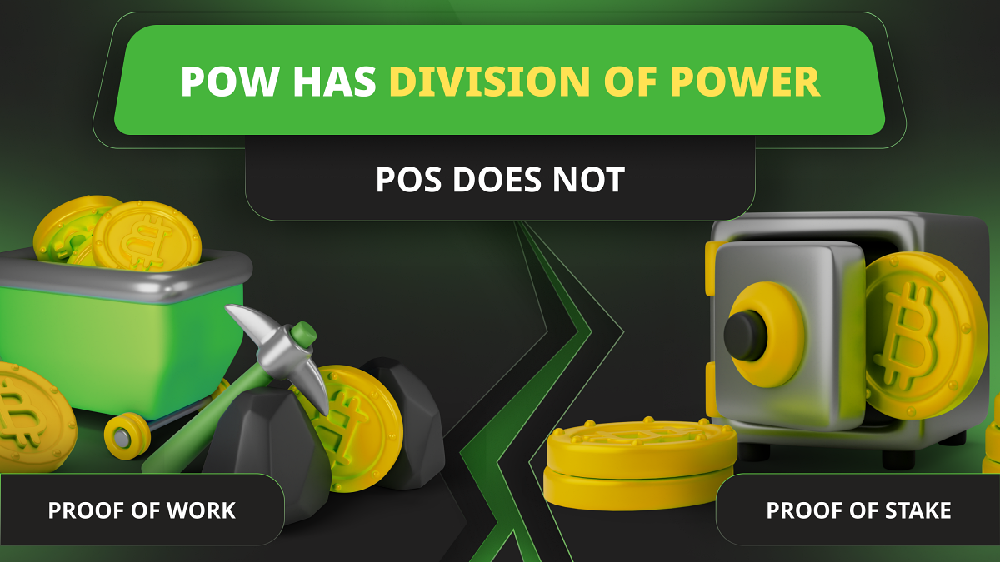

---
**You can listen to or watch this video here:**

<iframe width="560" height="315" src="https://www.youtube.com/embed/7jla4AEdvBo" title="YouTube video player" frameborder="0" allow="accelerometer; autoplay; clipboard-write; encrypted-media; gyroscope; picture-in-picture; web-share" allowfullscreen></iframe>

---

In the previous class, 16, we explained the three pillars of ETC; Proof of Work (POW), a fixed supply, and smart contracts; and why they enable the true concepts of “Code Is Law” and “Unstoppability”.

We saw how POW secures the system and provides the basis for a truly decentralized network.

In this class, 17, we will present another feature of POW blockchains that enhances security and decentralization in networks such as Ethereum Classic (ETC). 

This is that, in the case that miners may behave irresponsibly, like it happened [in Bitcoin in 2017](https://www.bitstamp.net/learn/crypto-101/what-was-the-blocksize-war/), node operators have a very important recourse to defend the network.

## The Right to Split

One of the main protection forms that POW blockchains as ETC have is that whenever new rules or arbitrary changes are introduced or proposed to the system, any group of nodes or participants may choose not to follow those rules and split from the network.

POW is very particular in this because anyone who wishes to be part of the network can do it without any need of permission or the risk of censorship.

This level of freedom is very powerful and enables all participants to basically follow the set of rules that is most valuable to them with no central governments or special interest dictating their obligatory mandates.

## The Example of the Ethereum Classic Split Against Ethereum 

ETC’s [rebellion](https://ethereumclassic.org/blog/2023-01-26-ethereum-classic-course-6-ethereum-classic-is-the-original-chain) against the arbitrary irregular state change of TheDAO in 2016 is an excellent example of this.

What happened was that the Ethereum (ETH) community at the time decided to confiscate the money from a hacker to return it to the original owners. The intervention occurred on block 1,920,000.

Approximately 95% of the Ethereum community went with the proposed irregular network change, but 5% continued with the unaltered Ethereum network, which became to be known as “Ethereum Classic”.

By executing the fork and the confiscation of funds, Ethereum broke its original immutability ethos. This is when Ethereum Classic decided to follow a "Code Is Law" ethos by effectively splitting and continuing with the original untampered chain.

## The Importance of Verifying Nodes and Miners

This is all possible because, in proof of work, the roles in the network are divided between verifiers and miners. 

Miners produce blocks and verifiers check that they are correct.

Miners are external to the network and use a lot of electricity to transform it into a hashed block that then they send to the rest of the nodes for verification. 

If the blocks are rejected because of flaws or dishonest practices, then miners do not get paid for their enormous investment in their operations.

Herein lies the fundamental feature of division of power in POW blockchains. That if miners don’t mine, then there are no blocks, but if verifiers don’t verify the blocks, then there is no pay to the miners!

## The Supposed Long Term Threat of Miners

For a long time people have feared the “power of miners” as it is an industry that tends to concentration, albeit much less than with stakers in proof of stake (POS).

What happened in 2017 in Bitcoin is a case in point. 

As Bitcoin was considered “unscalable” beyond 7 transactions per second, a group of miners decided to arbitrarily increase the block size of Bitcoin by changing its rules.

Because the rest of the network believed that larger blocks presented a risk of centralization, then they rejected those new rules and miners had to comply.

One of the threats to miners by the node operators was that if miners continued with their attitude, that they would be fired.

## How Verifying Nodes Can Fire Miners

The rest of the network could make this threat realistically because, in proof of work blockchains, node operators may choose to change the mining algorithm, effectively firing miners if they aggressively misbehave.

This is because miners invest enormous amounts of capital in their installed capacity by buying hundreds of thousands of specialized mining machines called [ASICs](https://www.investopedia.com/terms/a/asic.asp).

ASICs only work for a specific mining algorithm. If the algorithm is changed, then the miners become useless immediately losing their capital.

This was how, by proposing a change in the mining algorithm, that node operators in Bitcoin could have effectively fired the miners, which mitigated the threat they were posing at the time.

## In Proof of Stake Splitting From Stakers Is Not Possible

Staking basically involves making a deposit of the native cryptocurrency of the system in exchange for the right to build blocks.

This means that in proof of stake, the stakers are inside the ledger, therefore it is impossible to fire them because, even if you split from the chain, however many times you wish, the stakers will be replicated in every split. 

This is because the accounts and balances of stakers are on the blockchain ledger, therefore splitting carries them to the new copies.

Because of this reason, “verification” in POS is a mirage and all participants are essentially slaves of the staking elites who can change things or manipulate the system at their will, suffering no consequences.

## POW Is Much More Secure Than POS

All of the things explained above lead us to the conclusion that POW has division of power and POS does not.

In POW node operators cannot mine, but they have the power to stop blocks from miners or to change the rules to effectively fire them. This, in itself, is a magnificent deterrent for potential bad behavior.

In POS it is impossible to control what stakers do. As stakers are the ones who build the blocks, and the blocks are built according to a set of protocol rules, this means that the staking elites can get together and make the changes they wish, whenever they wish, and there will be no deterrence at all.

Even the supposed penalties and slashing that the protocol may impose stakers are useless to control them because they can reverse the effects of those things anyway.

Because of these reasons, POW is much more secure than POS.

---

**Thank you for reading this article!**

To learn more about ETC please go to: https://ethereumclassic.org
