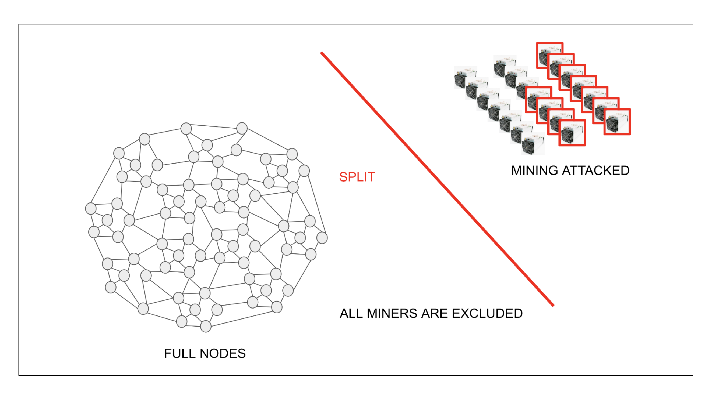
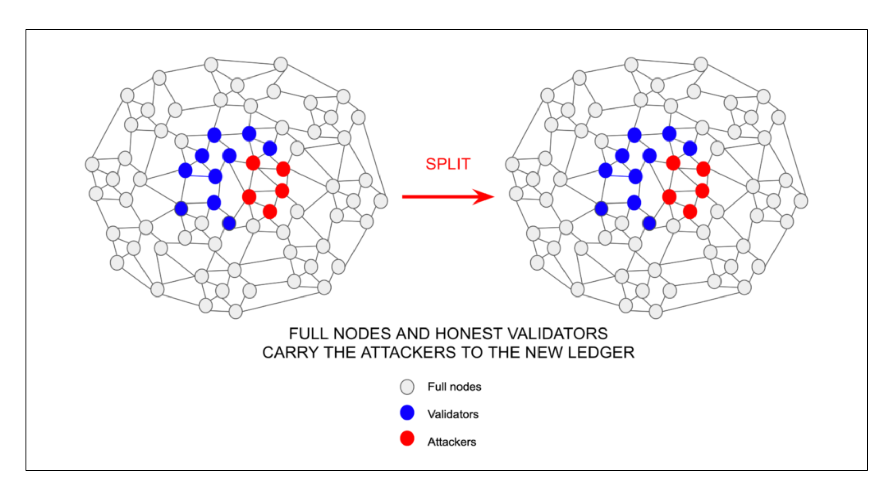

---
**由此收听或观看本期内容:**

<iframe width="560" height="315" src="https://www.youtube.com/embed/7jla4AEdvBo" title="YouTube video player" frameborder="0" allow="accelerometer; autoplay; clipboard-write; encrypted-media; gyroscope; picture-in-picture; web-share" allowfullscreen></iframe>

---

在上一节16中，我们解释了ETC的三个支柱；工作证明（POW），固定供应和智能合约；以及它们为何使“代码即法律”和“不可阻挡”等真实概念成为可能。

我们看到了POW如何保护系统并为一个真正分散的网络提供基础。

在这一节17中，我们将介绍POW区块链的另一个特性，该特性增强了网络（如以太坊经典ETC）的安全性和分散性。

在矿工可能表现不负责任的情况下，例如在[2017年比特币中发生的情况](https://www.bitstamp.net/learn/crypto-101/what-was-the-blocksize-war/)，节点操作员有一个非常重要的手段来保卫网络。

## 分割的权利

POW区块链（如ETC）的主要保护形式之一是，每当向系统引入或提出新规则或任意更改时，任何节点组或参与者都可以选择不遵循这些规则并从网络中分割出去。

POW在这方面非常特殊，因为任何希望成为网络一部分的人都可以在无需许可或面临审查风险的情况下加入。

这种自由程度非常强大，使所有参与者基本上可以遵循对他们最有价值的规则集，而没有中央政府或特殊利益规定他们的强制法令。

## 以太坊经典对抗以太坊的分裂案例

ETC对抗2016年TheDAO的任意不规则状态更改是一个很好的例子。

当时，以太坊（ETH）社区决定没收黑客的资金以返还给原始所有者。这次干预发生在第1,920,000块。

大约95%的以太坊社区同意提出的不规则网络更改，但有5%继续使用未更改的以太坊网络，后者被称为“以太坊经典”。

通过执行分叉和没收资金，以太坊违反了其最初的不可变性理念。这就是以太坊经典决定遵循“代码即法律”理念的方式，通过有效地分裂并继续使用原始未篡改的链条。

## 验证节点和矿工的重要性

这一切都是可能的，因为在工作证明中，网络中的角色分为验证者和矿工。

矿工产生区块，验证者检查它们是否正确。

矿工是外部于网络的，他们使用大量电力将其转化为散列块，然后将其发送到其余节点进行验证。

如果由于缺陷或不诚实的做法而拒绝了这些区块，矿工将无法获得他们在运营中的巨额投资的支付。

在这里，POW区块链的权力分割基本上是在于，如果矿工不挖矿，那么就没有区块，但如果验证者不验证区块，那么就没有支付给矿工！

## 矿工的所谓长期威胁

很长一段时间以来，人们一直担心“矿工的权力”，因为这是一个趋向集中的行业，尽管远不及权益证明（POS）中的质押者。

比特币在2017年发生的事情就是一个例证。

由于比特币被认为“不可扩展”，无法超过每秒7笔交易，一组矿工决定通过更改规则来任意增加比特币的区块大小。

由于网络的其余部分认为更大的区块存在集中化的风险，因此他们拒绝了那些新规则，矿工不得不遵守。

节点操作员对矿工的威胁之一是，如果矿工继续保持他们的态度，他们将被解雇。

## 验证节点如何解雇矿工

网络的其余部分之所以可以实现这一威胁，是因为在工作证明区块链中，节点操作员可以选择更改挖矿算法，从而在矿工行为不端时实际上解雇矿工。

这是因为矿工通过购买数十万台称为[ASIC](https://www.investopedia.com/terms/a/asic.asp)的专业挖矿机器而投入了巨额资本。

ASIC仅适用于特定的挖矿算法。如果算法更改，那么矿工立即变得无用，立即失去了他们的资本。

这就是在比特币中通过提出挖矿算法的变更，节点操作员可以有效解雇矿工，从而减轻当时他们所构成的威胁的方式。

## 在权益证明中，从质押者那里分裂是不可能的

质押基本上涉及向系统的本地加密货币进行存款，以换取建立区块的权利。

这意味着在权益证明中，质押者在账簿内部，因此不可能解雇他们，因为即使您无论多少次从链条中分裂，质押者都会在每个分裂中复制。

这是因为质押者的账户和余额在区块链账簿上，因此分裂将它们带到新副本中。

由于这个原因，在POS中，“验证”是一个幻觉，所有参与者基本上都是质押精英的奴隶，他们可以在他们的意愿下进行更改或操纵系统，而不会受到任何后果。

## POW比POS安全得多

以上所述的所有因素都导致我们的结论，即POW具有权力分割，而POS则没有。

在POW中，节点操作员无法挖矿，但他们有权阻止矿工的区块或更改规则以有效解雇他们。这本身就是一种对潜在不良行为的杰出威慑。

在POS中，无法控制质押者的行为。由于质押者是构建区块的人，而区块是根据一组协议规则构建的，这意味着质押精英可以汇聚在一起，并在他们愿意的任何时候进行更改，而没有任何威慑。

即使协议可能对质押者施加的所谓的惩罚和削减对于控制他们是无用的，因为他们可以反转这些事物的影响。

由于这些原因，POW比POS更安全。

---

**感谢您阅读本文！**

要了解有关ETC的更多信息，请访问：https://ethereumclassic.org
