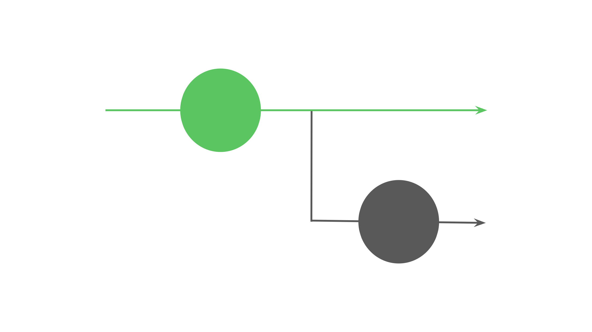
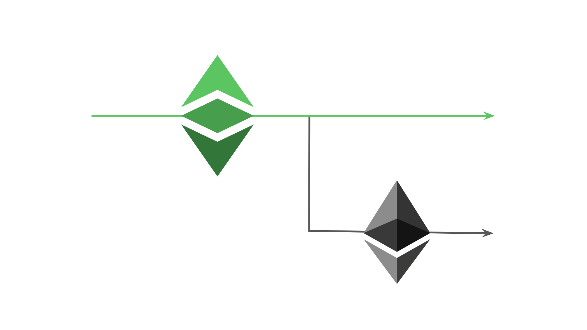

---
**You can listen to or watch this video here:**

<iframe width="560" height="315" src="https://www.youtube.com/embed/5hPEbBgMyVk" title="YouTube video player" frameborder="0" allow="accelerometer; autoplay; clipboard-write; encrypted-media; gyroscope; picture-in-picture; web-share" allowfullscreen></iframe>

---

To understand what is a blockchain split, first we need to understand what is a blockchain.

A blockchain is a peer-to-peer network of computers around the world that constantly receive new transactions, they replicate these transactions in all participating nodes of the system, and they store them in a ledger with accounts and balances called a “blockchain”.

All the node machines in the network are called “peers” because all run the software of the system and store the same exact replicated data with the accounts and balances.

In the case of Ethereum Classic (ETC), it stores not only accounts and balances, but also what are called smart contracts, which are applications to manage that money.

## How Do Blockchains Work?

The way blockchains work is that, as said in the introduction, they receive new transactions to move money all the time, but a subgroup of the participating machines do what is called “proof of work” to seal batches of these transactions, also known as “blocks”.

The subset of the computers that does this work, producing the blocks, are known as “miners”. Miners use a lot of computational power and spend enormous amounts of electricity creating what are called “cryptographic hashes”, which are like mathematical stamps to seal these blocks.

When they build each block doing all this work, then they send it to the rest of the network for verification. 

Once the rest of the network of computers verify the blocks, they add them to the database.

This is why the database is called a “chain of blocks” or “blockchain”, for short.

## Blockchains Are Sets of Rules

If a blockchain is a network of computers around the world; owned by diverse peoples in different continents, in different countries, speaking different languages, with different religions, and cultures; they all agree on the same exact database every ten minutes in the case of Bitcoin or every thirteen seconds in the case of ETC; and all are equal peers in the system with no hierarchy; then a lot of coordination must be needed!

To accomplish this amazing feat, all computers have to follow a very strict set of rules called a “blockchain protocol”.

These rules determine things such as how transactions must be written and sent to the network, how they must be distributed among all nodes, how miners must build the blocks, how they must be verified by the rest of the nodes, and how much the miners get paid for this work.

## The Software Clients Contain The Rules

All the rules of the blockchain protocol are contained in what are called the software clients that must be run to participate by the computers of the network.

The most popular software client in Bitcoin is called “[Bitcoin Core](https://bitcoin.org/en/bitcoin-core/)” and the most popular in ETC is called “[Core Geth](https://ethereumclassic.org/blog/2022-12-27-core-geth-explained)”.

If all the nodes run the corresponding client for a blockchain, and all contain the same exact blockchain protocol, then all the machines in the network can share the information and be in absolute synchronicity in a totally decentralized way. 

This decentralization is the main goal of blockchains such as Bitcoin and ETC.

If any or a group of nodes have even a slight difference in the set of rules they follow in the protocol because the software client was changed, or it has bug, then they would separate, or “split”, from the network.

## How Are Rules Changed in a Blockchain

If even the slightest modification in the rules may cause a computer or group of computers to split from the chain, then every time that the software or the rules of the network are upgraded, the process must be handled in a very delicate manner.

This is because thousands of people around the world, who don’t even know each other, in a decentralized way, must upgrade their nodes at the same time, with the same exact set of rules, in a fully coordinated fashion to be able to stay synchronized with the main network on a global scale.

For this, blockchains such as Bitcoin or ETC have public processes, with debates and technical discussions, that serve as tools to facilitate this coordination.

In the case of Bitcoin the process is called the [Bitcoin Improvement Proposal process or “BIP”](https://github.com/bitcoin/bips/blob/master/bip-0002.mediawiki), and in the case of ETC it is called the [Ethereum Classic Improvement Proposal process or “ECIP”](https://github.com/ethereumclassic/ECIPs/blob/master/_specs/ecip-1000.md).

## The Right to Split

However, in these debates and technical discussions, many times there is no agreement or even strong controversies may arise on the future changes of the protocol.

If things get very extreme, then it sometimes happens that some nodes of the system may decide to follow a different path and separate from the network.

This is what may be called “the right to split”, which is a very critical security feature of truly decentralized blockchains.

The right to split ensures all participants that they can separate from the main blockchain if, for any reason, they perceive that rules are being changed in a way that is detrimental to the network or themselves.

## The Example of How Ethereum Split From Ethereum Classic

A very famous example of a large blockchain split happened when the Ethereum community decided to manually hack the network to fix what they saw as a problem.

Ethereum and Ethereum Classic were one single chain originally, but in 2016 there was an exploit of a smart contract in the system, so a large constituency of participants decided to reverse the chain to return the funds to the original owners.

However, the rest of the community was against this “reverse hack” because it violated the central ethos of immutability of the system, which is a key security principle in proof of work blockchains.

Due to this disagreement, it came the time of adopting the new rules, and the Ethereum network split from the original untampered chain, ETC, creating two blockchains out of one as of that moment. 

## The Problem of Liquidity

There are other examples of large blockchain splits. For example “Bitcoin Cash” is a split of Bitcoin that was caused by a big controversy that [happened in 2017](https://www.bitstamp.net/learn/crypto-101/what-was-the-blocksize-war/).

However, it is not that easy to just say “let’s split” and separate from a blockchain.

There is something called liquidity that is critical to the long term survival of these systems, especially small splits with small communities.

Liquidity means that there must be a minimal critical mass of participants, activity, and value in the blockchain for the new offshoot to be sustainable.

If these minimal levels of sustainability are not met then the splits suffer the fates of failed systems such as other known Bitcoin splits like Bitcoin Classic, Bitcoin SV, and Bitcoin XT.

---

**Thank you for reading this article!**

To learn more about ETC please go to: https://ethereumclassic.org

What Is a Blockchain Split?
