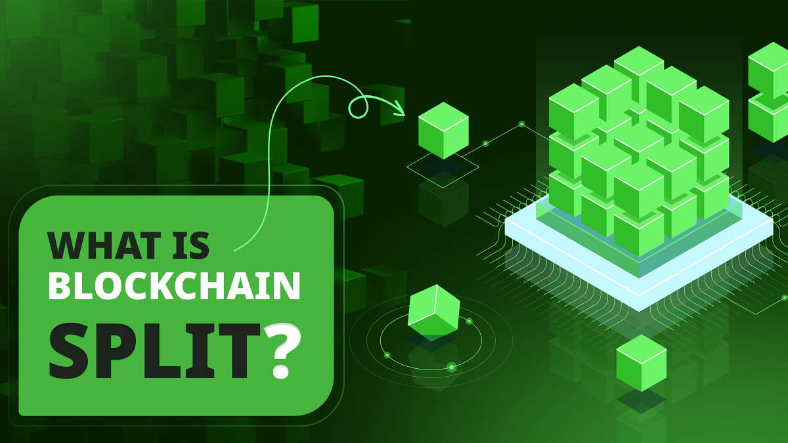

---
**由此收听或观看本期内容:**

<iframe width="560" height="315" src="https://www.youtube.com/embed/5hPEbBgMyVk" title="YouTube video player" frameborder="0" allow="accelerometer; autoplay; clipboard-write; encrypted-media; gyroscope; picture-in-picture; web-share" allowfullscreen></iframe>

---

理解什么是区块链分叉，首先我们需要了解什么是区块链。

区块链是一个全球范围的点对点计算机网络，不断接收新的交易，它们在系统的所有参与节点中复制这些交易，并将它们存储在一个带有账户和余额的分类帐中，称为“区块链”。

网络中的所有节点机器都被称为“节点”，因为它们都运行系统的软件并存储具有相同的账户和余额的完全复制数据。

在以太坊经典（ETC）的情况下，它不仅存储账户和余额，还存储所谓的智能合约，这些是用于管理资金的应用程序。

## 区块链如何工作？

区块链的工作方式是，正如在介绍中所述，它们不断接收新的交易以转移资金，但参与机器的子组会进行所谓的“工作证明”来封存这些交易的批次，也称为“块”。

执行此工作、生成块的计算机子集被称为“矿工”。矿工使用大量计算能力，并花费大量电力创建所谓的“密码散列”，这类似于数学印章，用于封存这些块。

当他们构建每个块并完成所有这些工作时，然后将其发送到网络的其余部分进行验证。

一旦计算机网络的其余部分验证了这些块，它们将其添加到数据库中。

这就是为什么数据库被称为“区块链”或“链”简称。

## 区块链是一组规则

如果区块链是全球范围内拥有不同大陆、不同国家、说不同语言、信仰不同宗教和文化的各种人拥有的计算机网络；它们在比特币的情况下是每十分钟一次，以太坊经典的情况下是每十三秒一次，所有这些都同意使用相同的数据库；并且在系统中没有等级制度，所有都是平等的节点，那么一定需要很多协调！

为了完成这一令人惊异的壮举，所有计算机都必须遵循一个被称为“区块链协议”的非常严格的规则集。

这些规则确定诸如交易必须如何编写和发送到网络，它们必须在所有节点之间如何分发，矿工必须如何构建块，它们必须如何被其他节点验证，以及矿工为此工作获得多少报酬等事项。

## 软件客户端包含规则

所有区块链协议的规则都包含在所谓的软件客户端中，这些客户端必须由网络中的计算机运行以参与。

比特币中最流行的软件客户端称为“[比特币核心](https://bitcoin.org/en/bitcoin-core/)”，而ETC中最流行的软件客户端称为“[Core Geth](https://ethereumclassic.org/blog/2022-12-27-core-geth-explained)” 。

如果所有节点运行相应的区块链客户端，并且所有包含相同的区块链协议，那么网络中的所有计算机都可以共享信息，并以完全去中心化的方式在全球范围内保持绝对同步。

这种去中心化是比特币和ETC等区块链的主要目标。

如果任何节点或一组节点在协议中遵循的规则集中有一点点差异，因为软件客户端已更改或存在错误，那么它们将分离或“分叉”出网络。

## 如何更改区块链的规则

如果在规则中的最小修改可能导致计算机或计算机组从链中分离，那么每次升级软件或网络规则的过程都必须以非常谨慎的方式进行处理。

这是因为全球范围内的数千人，他们甚至不互相认识，以去中心化的方式必须同时升级他们的节点，具有相同的规则集，以完全协调的方式与主网络保持同步。

为此，比特币或ETC等区块链具有公开的流程，包括辩论和技术讨论，用作促进此协调的工具。

在比特币的情况下，该过程被称为“[比特币改进提案过程或“BIP”](https://github.com/bitcoin/bips/blob/master/bip-0002.mediawiki)” ，在ETC的情况下被称为“[以太坊经典改进提案过程或“ECIP”](https://github.com/ethereumclassic/ECIPs/blob/master/_specs/ecip-1000.md)” 。

## 分裂的权利

然而，在这些辩论和技术讨论中，很多时候可能没有一致意见，甚至可能在协议的未来变更上引发严重争议。

如果情况变得非常极端，有时系统的一些节点可能决定走一条不同的道路并与网络分开。

这就是所谓的“分裂权利”，这是真正去中心化区块链的非常关键的安全特性。

分裂权利确保所有参与者，如果出于任何原因他们认为规则的变更对网络或他们自己有害，他们可以从主区块链中分离出来。

## 以太坊如何从以太坊经典中分裂的例子

一个非常著名的大型区块链分裂的例子发生在以太坊社区决定手动入侵网络以修复他们看到的问题。

以太坊和以太坊经典最初是同一链，但在2016年，系统中的智能合约存在漏洞，因此大多数参与者决定反转链以将资金退还给原始所有者。

然而，社区的其余部分反对这种“反向黑客”，因为它违反了系统不可变性的核心原则，这是工作证明区块链的关键安全原则。

由于这一分歧，采纳新规则的时刻到来，以太坊网络与未受篡改的原始链ETC分离，从而从那一刻起形成了两个区块链。

## 流动性的问题

还有其他大型区块链分裂的例子。例如，“比特币现金”是比特币的一个分裂，是由[2017年发生的一场大争论](https://www.bitstamp.net/learn/crypto-101/what-was-the-blocksize-war/)引起的。

然而，仅仅说“我们分裂”并从区块链中分离并不那么容易。

有一种称为流动性的东西对于这些系统的长期生存至关重要，尤其是对于具有较小社区的小型分裂。

流动性意味着新分支在可持续性方面必须有一个最低临界质量的参与者、活动和价值。

如果不满足这些最低的可持续性水平，那么分裂就会遭受失败系统的命运，例如其他众所周知的比特币分裂，如比特币经典，比特币SV和比特币XT。

---

**感谢阅读本文！**

要了解有关ETC的更多信息，请访问：https://ethereumclassic.org
