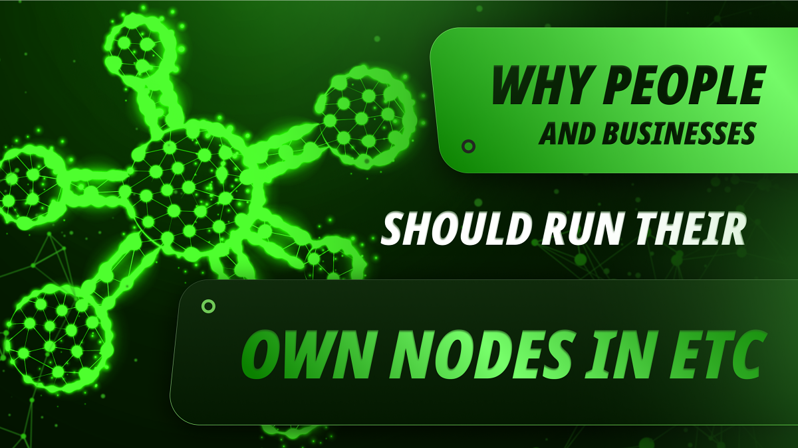

---
**You can listen to or watch this video here:**

<iframe width="560" height="315" src="https://www.youtube.com/embed/z-pdoA_T40U" title="YouTube video player" frameborder="0" allow="accelerometer; autoplay; clipboard-write; encrypted-media; gyroscope; picture-in-picture; web-share" allowfullscreen></iframe>

---

## The Paradigm Change From Banking to Blockchain

In the last 600 years man has gotten accustomed to having trusted third parties holding custody of their assets.

The banking system is a system where the trusted third parties hold the owners’ wealth, and they give permissioned and limited access to it.

However, the blockchain industry, through the principle of decentralization, has turned this around. In the blockchain industry, owners have direct access and control of their wealth whenever they wish with no permission necessary.

Where in banking people’s wealth is the liability of trusted third parties, in the blockchain industry people’s wealth are true assets with full possession and control.

## Control of Addresses With Private Keys

In Ethereum Classic (ETC), the way this works is by having total control of the addresses under which the assets are held inside the blockchain through private keys.

Private keys are like passwords held only by the owners of wealth in ETC, and only with those passwords can the assets be moved or exchanged.

By putting together in one system a proof of work based peer-to-peer blockchain network as ETC and having users control their assets through their private keys, the influence of trusted third parties has been significantly reduced and the only way to sign for valid transactions is by using the secret keys only held by end users.

## Mechanics of ETC Transactions

Nevertheless, holding the private keys alone is not the complete security model.

The way transactions are signed and sent to the ETC network involves an app on the end user side where they specify the transaction details; such as the address where the funds are going and the amount to be transferred or exchanged; and then the signing of the transaction using the private key.

When a transaction is signed and sent, then it needs to reach an ETC blockchain node so that it may be retransmitted to the whole network for full replication and to be included in a block by the miners.

Once included in a block that becomes verified and accepted by the network of nodes, then the transaction is executed and finalized. 

## Mechanics of ETC Queries

Queries in ETC work in a similar way, but don’t need the private keys.

To query the blockchain, to check their balances and other information about their assets and transactions, users need to use the same kind of apps as in the previous section.

When they open their apps to check their information on the ETC blockchain, the app consults with remote ETC nodes to retrieve the relevant data from the blockchain associated with their addresses.

The great majority of users in ETC send transactions and do their queries using third party nodes.

## The Risks of Third Party Nodes

In a way, a blockchain is a kind of trusted third party, but the fact the network is decentralized, and the data is replicated in all nodes globally, minimizes the influence of these trusted third parties to a sufficient degree that the security to users’ is very high.

However, even if one uses their own private keys and addresses, if the sending of transactions and querying of the blockchain is done through remote trusted third party nodes, then a significant part of the security to users is diminished.

This is because the dependency on third party nodes means that the nodes may not be accessible in certain circumstances, or that the nodes may be corrupted, so they could be processing transactions and queries fraudulently providing the wrong information to users or directing transactions and queries to alternative fraudulent chains.

## The Most Secure Setup

For these reasons, for users such as people and businesses who value their holdings in ETC or with significant assets, the most secure setup is to actually run their own ETC nodes so they can be part of the blockchain directly.

This configuration ensures that transactions will always be sent to the right blockchain and that the queries will always be truthful.

In a way, seen from the traditional paradigm of banking, the combination of holding the private keys to the addresses and running their own nodes makes users full custodians of their own wealth and assets because they not only have exclusive ability to sign transactions but they also have personal and physical control of the information of the network.

## How Can Users Run Their Own ETC Nodes?

To start running your own nodes and to connect your wallets to them so you can have your direct and complete access and custody of your ETC wealth, there are three options currently in the market:

**The ETC [Core Geth](https://github.com/etclabscore/core-geth/releases) node:** This is the core software client that is used by the great majority of node operators in ETC. It is the standard ETC community node that may be run on normal computers.

**The [ETCMC](https://etcmc.org/etcmc-etc-node) hardware node:** This is a hardware ETC node that is part of a greater community with token compensation and various sources of revenues for participating in the system.

**The [DappNode](https://dappnode.com/en-us/collections/all) hardware node:** DappNode is a plain vanilla hardware node and may be used to run ETC mainnet nodes as well as the ETC Mordor testnet, and even clients of other blockchains.

---

**Thank you for reading this article!**

To learn more about ETC please go to: https://ethereumclassic.org
