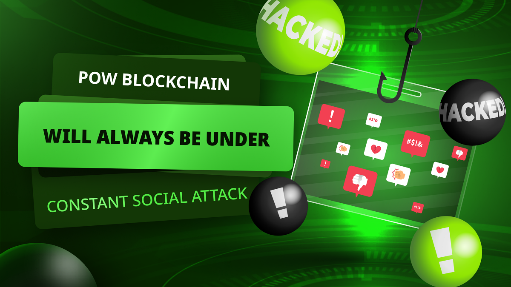

---
**由此收听或观看本期内容:**

<iframe width="560" height="315" src="https://www.youtube.com/embed/nPUiAJzR5q0" title="YouTube video player" frameborder="0" allow="accelerometer; autoplay; clipboard-write; encrypted-media; gyroscope; picture-in-picture; web-share" allowfullscreen></iframe>

---

在上一节（第17节）中，我们解释了工作证明（POW）区块链，如比特币和以太坊经典（ETC）具有权力分配，而权益证明（POS）链则没有。

我们看到在引入恶意规则或争议的情况下，“分裂权”或分离给予这些系统更高水平的安全性。

在相关主题中，在本节（第18节）中，我们将了解为什么POW区块链将始终受到持续的社会攻击，因为在真正去中心化的系统中，没有更高的权威来强加秩序。

在技术讨论或升级争议中，每个派别必须为他们期望的结果而战。

此外，真正的去中心化对精英和政府是不受欢迎的。因此，毒性和极端主义是捍卫这些系统原则的必要立场。

## 真正去中心化的系统永远不会集中

工作证明是唯一使真正去中心化成为可能的信号系统。

在社会群体中，如果可以在不退化系统的情况下实现去中心化，那么自由参与者将始终选择去中心化。

集中不是期望的状态。

“投票”、“民主”和“共和国”并不是理想的系统，它们只是我们能做到的最差的选择。

但在工作证明系统中，不能有暴君、国王、宪法、总统或国会。

这是因为参与者永远不会选择它们，因为它们是不必要的，他们总是更愿意分裂。

## 工作证明的无治理

实际上，工作证明区块链在没有治理的情况下运作得更好。

在这些系统中，“宪法”本身就是区块链协议。

例如，在比特币中，矿工通过按照规则构建区块而赚取BTC的事实是一个组织原则，推动了整个行业的发展，这在全球范围内完全是去中心化的。

在以太坊经典中，它是可编程和无许可的，这指导全球开发者在其上构建应用程序，遵循分布式EVM设计，并自然激励他们保卫它。

这就是为什么在POW区块链中没有领导人或管理员来强加其意愿的原因。是系统的价值和激励引导全球生态系统走向去中心化。

## 真正的去中心化意味着没有权威

在真正去中心化的背景下，没有仲裁者或当局来强加秩序。

如果在区块链中没有父母或管理员来强加秩序，那么在改变规则或实施升级时，各派别必须为他们期望的结果而战。

因此，在这些情况下不可能进行“文明的辩论”。

这有点像儿童是否与父母在一起。如果父母在场，那么他们会表现得更好，但是当父母离开时，他们可能会为糖果而争吵，或者兄弟姐妹可能互相拉扯头发。

真正的去中心化意味着没有权威，没有权威意味着蛮力争论成为游戏规则。

## 没有权威必须导致毒性

如果蛮力争论成为捍卫这些系统原则的游戏规则，那么所谓的“毒性”必须是必要的。

因此，所有批评毒性因为它伤害感情的人都是错误的。

毒性和极端主义实际上是去中心化系统中理性的博弈论和进化稳定行为。

如果在和平时期毒性缺失，派别似乎解散，这并不是因为它们失败了。这是因为它们暂时不需要。

但是当新的威胁再次出现，这是不可避免的，那么毒性极端主义者也将重新出现，并将被视为英雄。

毒性对POW区块链是有益的。

## 权益证明非毒性谬论

因为权益证明（POS）是集中的，所以对它没有社会攻击。

事实上，在POS中，参与者甚至无法分裂！因此，除了向当局屈服外，没有其他争论。

这就是为什么很多人发现POS“社区”如此愉快，因为它们似乎友好而受人欢迎。

但这是因为他们追求你的钱并欺骗你。

尽管它们在表面上看起来是非毒性的，但系统中的邪恶是它们的集中。

他们控制你，他们屈从于你，你除了顺从别无选择。

这种颠倒是比POW中无害的“毒性”恶劣得多。

## 如何中和黑石（BlackRock）

许多人对全球资产管理巨头黑石参与比特币生态系统表示欢迎。

很快，这家全球主义和充满激情的“环境、社会和治理”巨头还将进入其他网络，如以太坊，最终是ETC。

由于黑石是精英哲学和政府权力的忠实代表，他们将不可避免地试图改变这些系统的规则以实现集中。

然而，由于本节和前几节中解释的原因，POW区块链已经做好了在面对这些威胁时捍卫其原则和完整性的准备。

毒性肯定会抵制他们的攻击，而“分裂权”和是POW的保护屏障也将保卫它们。

---

**感谢阅读本文！**

要了解有关ETC的更多信息，请访问：https://ethereumclassic.org
