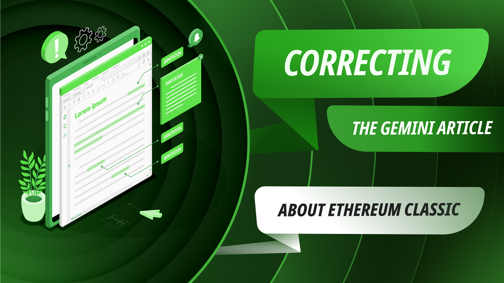
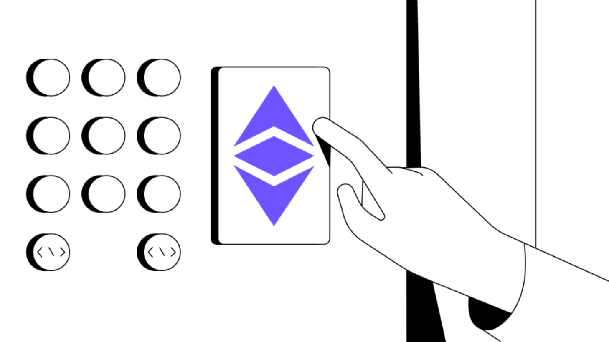

Gemini交易所有一篇关于以太坊经典（ETC）的文章，链接如下：“A Rift in the Blockchain Community”：

https://www.gemini.com/cryptopedia/ethereum-classic-etc-vs-eth

这篇文章有5个部分，其中一些关于ETC的信息存在错误或误解。

在以下部分，我们将审查Gemini的陈述，提出修改的短语，并为每个更正添加我们的理由。

## 部分：摘要

**Gemini的说法：**

以太坊经典（ETC）源于以太坊社区的意识形态和伦理分歧，至今仍在引发争议。2016年，在以太坊（ETH）区块链上运行的第三方应用程序遭受重大黑客攻击，导致窃取了数百万美元的以太币（ETH）。作为回应，以太坊区块链经历了硬分叉，从官方账本中基本上撤销了黑客攻击，并将被盗的ETH退还给其原始所有者。

相比之下，分叉的另一支保留了官方账本，其中包括黑客攻击，未更改 —— 目标是保留100%不可变的账本。换句话说，两个结果不同的区块链只有一个区别：一个仍包含黑客攻击和被盗ETH的记录，而另一个基本上将时钟倒回，就好像黑客攻击从未发生过。编辑过的区块链保留了以太坊的名字，而原始/未更改的区块链则被称为以太坊经典。

**我们的更正：**

以太坊经典（ETC）和以太坊（ETH）最初是2015年ETH创建时的一个区块链，但在2016年的意识形态和伦理分歧时分开，至今仍在引发争议。2016年，在以太坊（ETH）区块链上运行的第三方应用程序遭受重大黑客攻击，导致窃取了数百万美元的以太币，或ETH。作为回应，以太坊区块链经历了硬分叉，从原始账本中基本上撤销了黑客攻击，并将被盗的ETH退还给其原始所有者。

相比之下，分叉的另一支保留了原始未更改的账本，其中包括黑客攻击，旨在保留100%不可变的账本。换句话说，两个结果不同的区块链有两个区别：一个仍包含黑客攻击和被盗ETH的记录，而另一个基本上将时钟倒回，就好像黑客攻击从未发生过；以及ETH将其不可变性哲学更改为“社会共识”，而ETC保持其“法则即代码”的哲学至今。编辑过的区块链保留了以太坊的名字，而原始/未更改的区块链则被称为以太坊经典。

**理由：**

这个摘要部分大体上是正确的，但ETC并不是从另一个项目或区块链发展而来的，它是由Vitalik Buterin于2015年创建的原始未更改的区块链。因此，最好将ETC描绘为开始时与ETH相同的链，以便人们不会将其定位为后来的创建，这在行业中一直存在着持久的误解。

术语“官方账本”在真正去中心化的区块链中是不正确的。官方的事物是由人创造的。具有工作证明的去中心化区块链是按照协议进行的，遵循“最多工作量”规则，参与者甚至可能从中分裂，就像ETH从ETC分裂出去一样！

ETC和ETH的区别不仅仅在于数据库的内容，例如是否撤销了黑客攻击，而且也许最重要的分歧是它们的哲学，ETH变为“社会共识”，而ETC保持其“法则即代码”的哲学至今。这种哲学分歧解释了为什么ETH转向了股权证明，而ETC将永远是一个工作证明区块链。

## 部分：以太坊经典的起源

**Gemini的说法：**

区块链经历硬分叉并分为两个独立的区块链的原因有很多。有时，分叉是技术升级的结果。其他分叉则是由于对拟议的协议更改存在深刻分歧的社区，最终将项目及其支持者分裂成无法调和的派别。这样的协议更改可能是为了改进现有功能，也可能是为了应对由于漏洞和黑客造成的损害而产生的反应。后一种情况导致了以太坊的分叉，从而导致了以太坊经典（ETC）区块链的诞生。

2016年，在以太坊区块链上的一个应用程序（称为DAO）遭到黑客攻击，导致窃取了约360万以太币（ETH） —— 在2016年价值约5000万美元，随后上升至数十亿美元。为了进一步说明此次黑客攻击的严重性，当时流通的以太币约为7200万，因此黑客窃取了所有以太币的约5%。

为了从以太坊的账本中抹去这次黑客攻击并将资金退还给原始所有者，以太坊核心开发人员选择实施硬分叉。新创建的账本逆转了黑客攻击并将被窃的以太币退还，成为“主”以太坊区块链，而原始账本被重命名为以太坊经典，作为一个与新主分支不兼容的平行网络。大多数用户，尤其是黑客攻击的受害者，更喜欢删除黑客攻击的以太坊版本。然而，一些视不可变性为至关重要的用户选择继续支持原始账本，即以太坊经典。

**我们的更正：**

区块链之所以经历硬分叉并分裂成独立的区块链，有许多原因。有时，分叉是技术升级的结果。其他分叉则是由于对拟议的协议更改存在深刻分歧的社区，最终将项目及其支持者分裂成无法调和的派别。这样的协议更改可能是为了改进现有功能，也可能是为了应对由于协议漏洞和黑客攻击造成的损害而产生的反应。

在ETH和ETC分裂的情况下，分叉并非由于这些原因之一，而是由于链中一个应用程序或智能合约的漏洞。基础协议本身没有任何漏洞或问题。这使得手动撤销、违反不可变性的行为对ETC社区来说更加令人不满。

事实是，在2016年，以太坊区块链上的一个应用程序（称为DAO）遭到黑客攻击，导致窃取了约360万以太币（ETH） —— 在2016年价值约5000万美元，随后上升至数十亿美元。为了进一步说明此次黑客攻击的严重性，当时流通的以太币约为7200万，因此黑客窃取了所有以太币的约5%。

为了从以太坊的账本中抹去这次黑客攻击并将资金退还给原始所有者，以太坊核心开发人员选择实施硬分叉。新创建的账本逆转了黑客攻击并将被窃的以太币退还，成为“主”以太坊区块链，而原始账本被重命名为以太坊经典，作为一个与新主分支不兼容的平行网络。大多数用户，尤其是黑客攻击的受害者，更喜欢删除黑客攻击的以太坊版本。然而，一些视不可变性为至关重要的用户选择继续支持原始账本，即以太坊经典。

**理由：**

重要的是要注意，原始的以太坊区块链（现在称为以太坊经典）从未遭受过黑客攻击或漏洞。这只是链中一个智能合约的漏洞，而智能合约甚至不是协议的一部分，它们是托管在区块链中的软件程序，但它们并不是区块链本身。

本节中的其他段落写得很好。

# 部分: 以太坊 vs. 以太坊经典

**Gemini的说法：**

以太坊和以太坊经典之间的争议分歧归结为一场哲学辩论，权衡了两种不同选择：

1. 一个修订过的分布式账本的区块链，以一种方式进行了更改，以抹去一次成功的网络入侵。

2. 一个真正不可变的区块链，记录了网络整个历史，包括一次成功的网络入侵。

以太坊比它未经编辑的对应物更受欢迎，显示出大多数加密社区在这场备受争议的问题上的立场。此外，

以太坊得到了Vitalik Buterin的支持，他是以太坊项目的主要创始人，在整个以太坊社区和整个区块链行业中被广泛认为是最有声望和有影响力的人物之一。

然而，以太坊经典的支持者认为，ETC硬分叉是对区块链技术旨在防止的主观人为操纵的一种虚伪使然。因此，许多理想主义者支持以太坊经典及其关联的加密货币ETC。尽管经过编辑的ETH分支的良好意图，ETC的支持者坚决反对首次硬分叉的推理。这些个体中的许多人认为，对区块链账本的任何更改（即使是出于善意的更改）都违反了许多人最初与区块链相关联的“代码至上”的理念。以太坊经典的支持者认为，不可变交易是区块链技术的不可辩驳的原则，使其不同于许多人对传统全球金融体系内操纵的抱怨，坚称在任何情况下都不应该妥协不可变性。

其他加密货币，包括比特币（BTC），也经历过类似的辩论。2017年比特币现金（BCH）硬分叉比特币引起了激烈的争论。更直接地与ETH vs. ETC争议相比，2019年黑客从币安加密交易所窃取了超过7000 BTC（当时价值约4100万美元）。该交易所创始人赵长鹏建议比特币社区回滚比特币区块链，就像以太坊在2016年所做的那样。然而，在这种情况下，建议并没有转化为社区行动 —— 或许部分原因是（与以太坊的创始人Vitalik不同）比特币的匿名创始人中本聪在2011年停止了对该项目的任何公共参与，并且其身份是未知的。换句话说，由于中本聪的缺席，比特币的领导层可以认为天然地更加分散，而不像以太坊那样。

**我们的更正：**

以太坊和以太坊经典之间的争议实际上归结为对直接影响区块链安全性和有用性的重要原则。

一方面，是一个已成为由一群人主观管理的系统的分布式账本，就像传统系统一样。另一方面，是一个真正客观且不可变的区块链，为世界上任何人提供了最初的安全性和去中心化保证。

以太坊比它未经编辑的对应物更受欢迎，显示出大多数加密社区在这场备受争议的问题上的立场。此外，以太坊得到了Vitalik Buterin的支持，他是以太坊项目的主要创始人。

然而，以太坊经典的支持者认为，ETC硬分叉是对区块链技术旨在防止的主观人为操纵的一种虚伪使然。因此，许多ETC支持者支持以太坊经典及其关联的加密货币ETC。尽管经过编辑的ETH分支的良好意图，ETC的支持者坚决反对首次硬分叉的推理。这些个体中的许多人认为，对区块链账本的任何更改（即使是出于善意的更改）都违反了许多人最初与区块链相关联的“法则即代码”哲学。以太坊经典的支持者认为，不可变交易是区块链技术的不可辩驳的原则，使其不同于许多人对传统全球金融体系内操纵的抱怨，坚称在任何情况下都不应该妥协不可变性。

其他加密货币，包括比特币（BTC），也经历过类似的辩论。2017年比特币现金（BCH）硬分叉比特币引起了激烈的争论。更直接地与ETH vs. ETC争议相比，2019年黑客从币安加密交易所窃取了超过7000 BTC（当时价值约4100万美元）。该交易所创始人赵长鹏建议比特币社区回滚比特币区块链，就像以太坊在2016年所做的那样。然而，在这种情况下，建议并没有转化为社区行动 —— 或许部分原因是（与以太坊的创始人Vitalik不同）比特币的匿名创始人中本聪在2011年停止了对该项目的任何公共参与，并且其身份是未知的。换句话说，由于中本聪的缺席，比特币的领导层可以认为天然地更加分散，而不像以太坊那样。

**理由:**

以太坊（ETH）和以太坊经典（ETC）之间的分歧不仅仅是“哲学上”的分歧，这可能只是一个抽象的主题，没有现实中的影响。这是关于第一原则的严肃而实质性的差异，实际上对链的运作产生重大影响，使它们在很大程度上偏离了彼此。以太坊是一个完全由社区中自任开发者控制的主观管理系统，他们认为自己足够出色，有责任担负这一责任。而以太坊经典是一个分散的机械系统，将始终根据协议规则工作，永远不会对人类之间的是非做出决策，这些应该留给律师、法院和法律体系，而不是C++开发者。

Vitalik Buterin在那些对行业了解较少、对他持有偏见的人或行业新手中很受欢迎，并且有良好的声誉，但在真正了解的行业参与者和OG（原始的）人中，他的声望相对较低。

ETC的支持者不是“理想主义者”，也没有“心态”。这些词似乎是贬义词，使他们看起来像是追求没有重要性的理论事物的与现实脱节的人。然而，事实恰恰相反。

比特币之所以没有在币安创始人的催促下被撤销，并不是因为中本聪缺席，而是因为比特币的支持者了解这些系统的原则和目的，而不仅仅是因为中本聪缺席。

## 章节：以太坊经典的结构

**Gemini的说法:**

以太坊经典协议本质上是原始以太坊协议的克隆。以太坊经典和以太坊都是智能合约平台，允许用户在各自的区块链上构建去中心化应用程序（dApps），从一般的功能角度来看，它们保持相似，尽管以太坊随着时间的推移逐渐发展出更广泛的功能。这两个链在区块1,920,000之前是相同的（攻击发生的地方）。只有在这个区块之后它们才分道扬镳。因此，此后对以太坊协议的重大更新（包括以太坊2.0）在以太坊经典协议中没有体现，反之亦然。

**我们的更正:**

以太坊经典协议遵循通用的以太坊虚拟机（EVM）标准，因此它与以太坊协议非常接近，除了关键差异，如工作量证明与权益证明共识算法，以及ETC没有实施燃烧费用的EIP-1559。以太坊经典和以太坊都是智能合约平台，允许开发人员在各自的区块链上构建去中心化应用程序（dApps），从一般的功能角度来看，它们保持相似。这两个链在区块1,920,000之前是相同的（攻击发生的地方）。只有在这个区块之后它们才分道扬镳。ETH和ETC在设计和功能上是相同的，尽管它们现在有不同的交易历史和账本。

**理由:**

ETC不是ETH的克隆。再次强调，分裂的是以太坊，ETC是原始链。ETC确实遵循通用的EVM标准，就像许多其他链一样，因此它集成了以太坊发生的大多数变化。这最新的例子是[Spital硬分叉](https://ethereumclassic.org/blog/2023-12-09-spiral-fork-announcement)在ETC中。然而，ETC并未实施以太坊的所有更改，这是因为ETH具有“社会共识”哲学，已经放弃了真正去中心化和不可变性的目标。这意味着ETC必须拒绝ETH中的一些升级，例如迁移到权益证明和燃烧费用的EIP-1559，从而改变货币政策。

用户不构建dapps，是开发人员构建dapps。

在智能合约和dapps方面，以太坊和以太坊经典在实际功能上几乎是相同的。

ETH和ETC实际上是相同的，但具有不同的共识算法和货币政策。它们在2016年分裂以后的交易历史上有所不同。

## 章节：以太坊经典的未来

**Gemini的说法:**

预示着态度的改变，以太坊经典最近进行了几次协议升级，旨在使协议与以太坊协议更具互操作性。以太坊经典协议的两次最近升级——Atlantis（2019年）和Agharta（2020年）——表明了以太坊经典社区意图在以太坊经典与其他社区之间建立技术桥梁，包括以太坊。这些更新是通过强制性硬分叉实施的，这要求以太坊经典用户升级其软件，以遵守以太坊经典网络的更新规则。这些更新可能标志着这两个区块链之间更大程度的互操作性的持续转变。虽然一些人强烈反对整个以太坊生态系统中的各种分裂和分叉，但其他人认为“分叉就是自由”，它们允许两个区块链根据各自社区的意愿进行自由发展。

**我们的更正:**

以太坊经典[将始终是](https://ethereumclassic.org/blog/2023-04-04-ethereum-classic-will-always-be-state-of-the-art-technology)先进技术，因为它将始终遵循前面提到的EVM标准。它不断地在以太坊的升级之后升级网络，通常是在大约6个月后，但只实施符合其不可变性哲学并实现尽可能与EVM标准一致的变更。

以太坊经典的[协议升级历史](https://ethereumclassic.org/knowledge/history)包括：

- Gas repricing（2016）
- Gotham（2017）
- Atlantis（2019年）
- Agharta（2020年）
- Phoenix（2020年）
- MESS（2020年）
- Thanos（2020年）
- Magneto（2021年）
- Mystique（2022年）
- Spiral（2024年）

ETC的工作表明以太坊经典社区打算在以太坊经典与其他社区，包括以太坊之间建立

技术桥梁。这些更新是通过自愿硬分叉进行的，这要求以太坊经典用户升级其软件，以遵守以太坊经典网络的更新规则。这些更新可能标志着这两个区块链之间更大程度的互操作性的持续转变。虽然一些人强烈反对整个以太坊生态系统中的各种分裂和分叉，但其他人认为“分叉就是自由”，它们允许两个区块链根据各自社区的意愿自由发展。

**理由:**

ETC并没有“改变态度”！正如前面所说，它始终遵循EVM标准，将始终是先进技术。

ETC有着不断升级的悠久历史，以保持与EVM标准的同步。

升级是自愿的，而不是强制的，否则就不会有分裂。

真正去中心化的区块链开发是自由的，而不是“民主的”。在区块链中不存在“投票”这种事情。

---

**感谢您阅读本期文章!**

了解更多有关ETC: https://ethereumclassic.org
