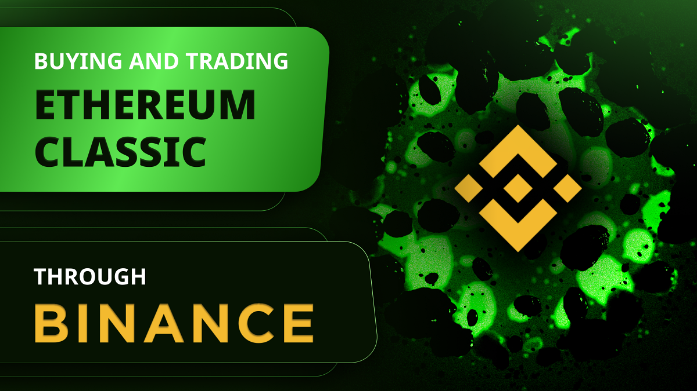
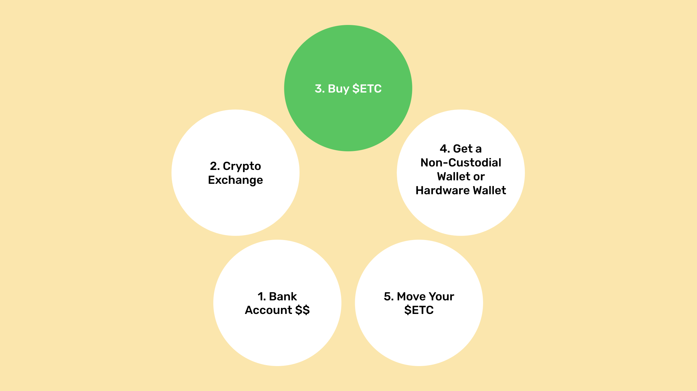
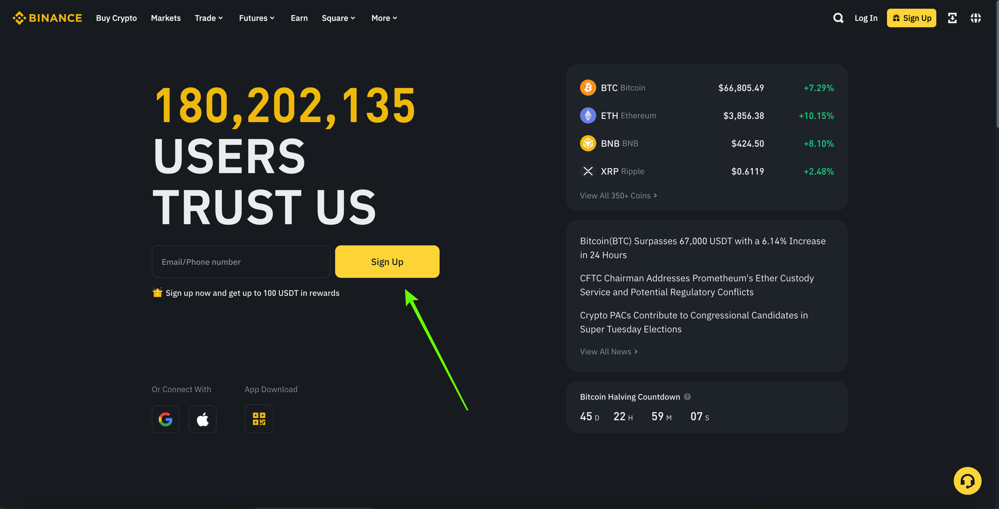
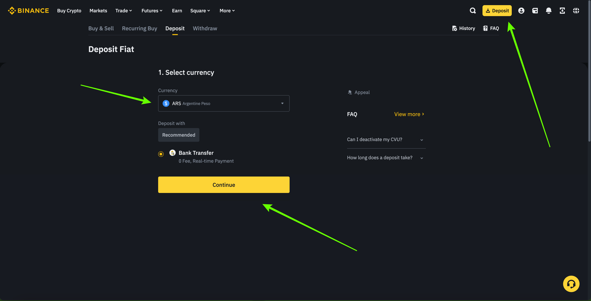
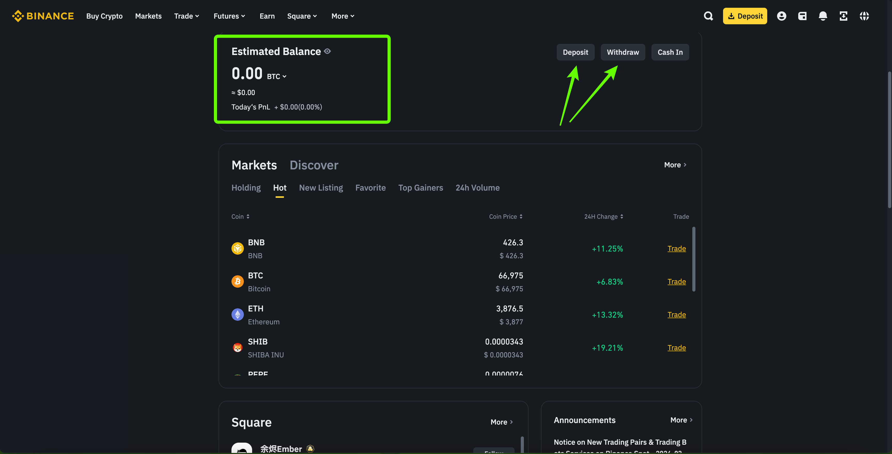
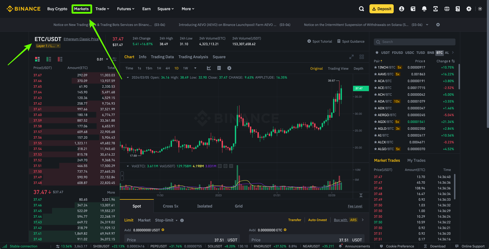
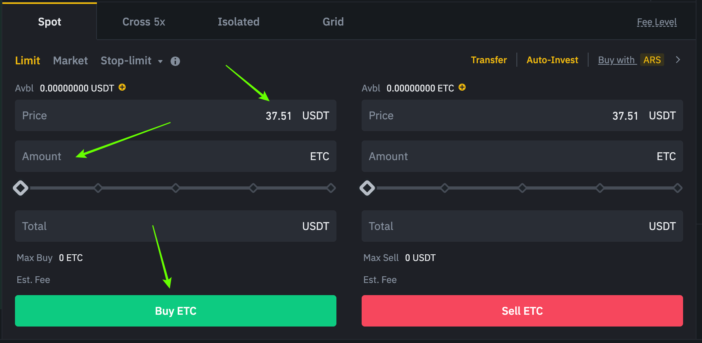
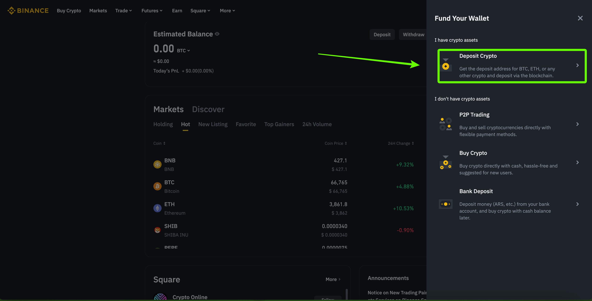
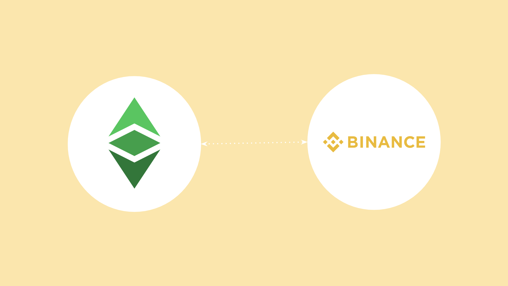

---
**You can listen to or watch this video here:**

<iframe width="560" height="315" src="https://www.youtube.com/embed/_SNCiwFpYZM" title="YouTube video player" frameborder="0" allow="accelerometer; autoplay; clipboard-write; encrypted-media; gyroscope; picture-in-picture; web-share" allowfullscreen></iframe>

---

Binance is a centralized cryptocurrency exchange.

A centralized cryptocurrency exchange (CEX) is a virtual location on the internet that serves as a meeting point for trading crypto assets such as Bitcoin (BTC) and Ethereum Classic (ETC).

Binance provides its servers over the internet for its customers to open accounts, send money, and start exchanging BTC, ETC, Ethereum (ETH), and other tokens.

CEXs must follow regulations, so they may be very restrictive, demanding customers to present evidence of identity and residence, performing background checks, and asking what is the source of their funds.

Among the risks of centralized exchanges is that they may go bankrupt and customers may lose their deposits and assets.

Binance in particular is one of the largest cryptocurrency exchanges in the world, it started operations in China in July of 2017, then it moved to Malta, and now has an international presence in more than 100 countries.

## Moving Your ETC to Non-Custodial Wallets

Although you may be using a centralized cryptocurrency exchange for buying and trading in Ethereum Classic, the best way to [manage your ETC](https://ethereumclassic.org/blog/2023-05-31-how-to-start-using-etc-from-scratch) is to buy them in the centralized exchanges but then moving them to [non-custodial wallets](https://ethereumclassic.org/blog/2023-05-04-ethereum-classic-course-20-what-are-custodial-and-non-custodial-wallets) that you control.

The steps are as follows:

1. You start with your cash in your bank account
2. You move your cash to the crypto exchange
3. You buy ETC at the crypto exchange
4. You get a non-custodial wallet or hardware wallet
5. You move all your ETC to your non-custodial wallet

The above method is the most secure method because you end up with your ETC on the blockchain directly, under your own control with your private keys, rather than at the centralized exchange, under their control.

In other words, it is more trust minimized.

## Opening a Binance Account

The first step to create your account on Binance will be to go to [Binance.com](https://binance.com), then press on the “Sign up” button, and proceed with the next steps.

The next steps will involve a process of verification. Binance uses this system to comply with “Know Your Customer”, “Anti-Money Laundering”, and other laws in various countries.

The first thing Binance will ask you for is your personal information. If you live in the United States, Binance.com will reject your application as it only operates outside the US, but they may refer you to Binace.us. For this post, we will show how Binance works out of Argentina to provide a generic international account demonstration.

The next thing Binance will ask for is your government identification document. For this you will need to take photos of it and upload it.

The last step in the verification process is to make a “liveness test” which will ask you to use your mobile phone to show your face, open your mouth, and blink your eyes.

After this process, Binance will send you an email, which may take up to 72 hours, to confirm your account is open. 

## Connecting a Bank Account and Depositing Money

After creating your account on Binance, you can connect a bank account to your Binance profile. This is to move fiat money to your Binance account and then be able to buy ETC.

The methods available in Binance to deposit or trade crypto are to deposit crypto, to buy crypto in a P2P way from local dealers by paying with local methods available in your country, by using the simple Binance “Buy Crypto” method, or by sending fiat to your account by linking a bank account.

In our example, we will press on the “Deposit” button on the top right corner, then select Argentinian Peso as the currency, and then press the “Continue” button.

Finish connecting your account by following all the steps.

## Binance as a Wallet

Many people around the world use Binance as their main wallet. This is not the best for securing your crypto as we explained above, but for keeping some of your crypto for trading or to make payments it is acceptable.

It is always best to keep at least 80% of your crypto secure in self custody wallets or hardware wallets.

Nevertheless, Binance does have easy “deposit” and “withdraw” features for either fiat or crypto in your country.

By using the Binance website or their mobile app, you may keep track of your holdings.

The Binace wallet is called “dashboard” on their website.

## Buying ETC on Binance

Once you are all set with the Binance account and you connected your bank account where you hold your local fiat money, then you will be able to move money to Binance and start buying ETC.

However, to buy ETC, BTC, and other coins your may need to buy USDT first using the Binance “Buy Crypto” service.

This is because global crypto markets don’t trade in all the currencies of the world, but in a few reserve currencies, or against other major cryptocurrencies. However, most trade against the stablecoin that tracks the US dollar called “Tether” of which its symbol is ”USDT”.

If you move your local currency to USDT using the “Buy Crypto” service, then you will be ready to purchase ETC!

To trade USDT for ETC go to the “Markets” link on the top horizontal menu, select “ETC” from the search field, and click on the ETC/USDT result to go to the ETC charts and trading page.

When you are on the ETC/USDT trading page, you will see the chart of ETC, you can analyze the markets, or you can use the trading ticket to purchase ETC with your USDT balance.

To see the ETC/USDT trading ticket form, scroll down and you will see a green “Buy ETC” section to the left and a red “Sell ETC” section to the right.

On the green section, enter the price you want to buy ETC at or select the “Market” option to buy at the market. 

Then, enter the amount of ETC you wish to buy, or slide the bar provided for other quantities.

Once you completed your ticket press on the “Buy ETC” button.

Congratulations! You just entered an order to buy ETC on Binance!

When you purchase your ETC they will show on your Balance on your Binance wallet or dashboard.

## Sending ETC

When you buy ETC on Binance they will probably become available to withdraw after a few days so you will be able to send them to your non-custodial wallet or other destinations.

It may take a few days because your cash from the bank actually takes several days to move from your bank to Binance. However, if you live in a jurisdiction that has instant bank transfers or other fast money transfer systems, you may have your purchased ETC available for withdrawal sooner.

The way to send your ETC to your non-custodial wallet or to any other destination is by clicking on the “Withdraw” link on your Binance dashboard.

In the next step, select ETC as the coin to send, put the ETC address you wish to send it to, then select the ETC network (this is important because ETC exists in other networks as a [wrapped coin](https://ethereumclassic.org/blog/2023-04-06-ethereum-classic-course-16-what-is-wetc)), enter the amount you wish to send, and finally press the “Withdraw” button at the bottom of the form.

## Receiving ETC

To receive ETC, you need to go again to your Binance dashboard or wallet and press on the “Deposit” button, or just click on the “Deposit” button on the top right corner of the Binance website.

After this, select the “Deposit Crypto” option on the side panel menu.

In the next page select ETC as the coin you wish to deposit, then select the network you will use (this is important because ETC exists in other networks as a [wrapped coin](https://ethereumclassic.org/blog/2023-04-06-ethereum-classic-course-16-what-is-wetc)), then select the “Spot Wallet” option, and finally copy the ETC address provided to use it to send ETC to your Binance account or to give it to others to send you ETC.

## Who Uses Binance for Buying and Selling ETC?

**Investors:** ETC is an excellent long term investment alternative. This has attracted many investors who use exchanges such as Binance to transfer their fiat money to exchange it for Ethereum Classic. However, these ETC buyers should think of moving their holdings to non-custodial wallets as explained before, so their assets may be more secure.

**Miners:** A segment that uses exchanges frequently to trade ETC are miners. Ethereum Classic miners earn an average of 17,000 ETC per day at the time of this writing, but they have to pay for their operations, which include payroll, data center costs, and electricity costs. For this they usually liquidate some of their daily earnings on exchanges such as Binance to transform them into cash to pay for their bills.

**Speculators:** Trading volumes on ETC are high globally and much of this is by speculators who trade daily on exchanges such as Binance. These participants are beneficial to the ecosystem as they provide liquidity to all other buyers and sellers.

**Merchants:** Although still small, the use of ETC for buying and selling things in the broader economy is growing. Merchants who let their customers purchase items with ETC will use centralized exchanges such as Binance to liquidate their holdings for paying for their business expenses.

---

**Thank you for reading this article!**

To learn more about ETC please go to: https://ethereumclassic.org
