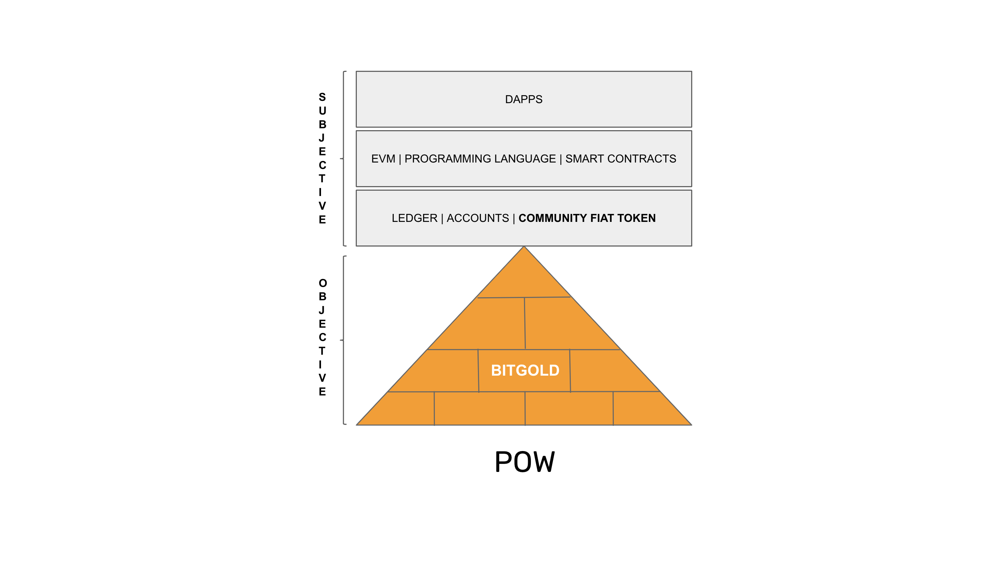
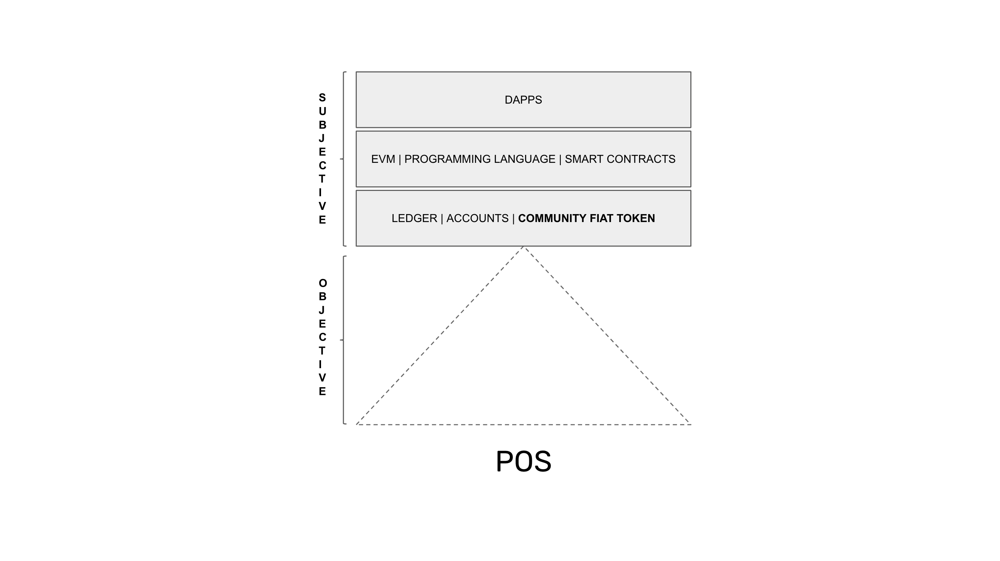

---
**You can listen to or watch this video here:**

<iframe width="560" height="315" src="https://www.youtube.com/embed/zpf2hH6zC5U" title="YouTube video player" frameborder="0" allow="accelerometer; autoplay; clipboard-write; encrypted-media; gyroscope; picture-in-picture; web-share" allowfullscreen></iframe>

---

In the previous class, 18, we explained why POW blockchains such as Bitcoin (BTC) and Ethereum Classic (ETC) will always be under constant social attack because in truly decentralized systems there are no higher authorities to impose order.

In this class, 19, we will switch topics to focus on the function of hard money of proof of work (POW) blockchains and contrast that with proof of stake (POS) coins which are just soft community money.

We will explain the truth of these tokens which are all “community fiat money” as we define them.

The difference is that POW has an objective physical base, while POS eliminated that base and replaced it with a “social consensus” model that basically imitates how traditional systems work!

## All Blockchains Are Community Fiat Money

Few people may know this, but all current cryptocurrencies are community fiat money. 

Yes, even Bitcoin and Ethereum Classic are just community fiat tokens!

Why is this? 

Because the proof of work cryptographic stamps or hashes in proof of work are the result of the work, and that is the “digital gold”. But then, these networks just print tokens to pay rewards for the work, but those tokens, namely BTC and ETC, are not true gold. They are just arbitrary units created to pay for the work.

The digital gold, also called “Bit Gold” is buried in the blockchains in the form of the block hashes. 

## What Is Bit Gold

The original idea of Bit Gold was proposed by Nick Szabo in early 1998. 

When he saw the design of a technology called “HashCash” created by Adam Back he realized that the hashes or stamps built by the computational work were analogous to gold in the real world.

In other worlds, if an ounce of gold is proof that gold miners in the real world spent a lot of energy and capital extracting that gold from nature, then a POW hash represents the energy and capital that computer miners spent creating them, hence “Bit Gold”.

The idea of the Bit Gold network was to have miners create the Bit Gold and then have the rest of participants use those hashes to bundle them together to issue coins backed by them.

## POW Has an Objective Base

However, the Bit Gold network design was not possible yet at the time, so a separate token had to be created to pay for the miners’ work. This is how the Bitcoin token was eventually created in 2009.

As said before, POW blockchain coins are community fiat tokens anchored on top of an objective base called Bit Gold, which is the POW done to create the hashes, therefore to create the coins.

They are digital gold because, like gold, these tokens can only be created after a lot of work has been done, thus guaranteeing their unforgeability and scarcity.

This means that, even if BTC and ETC are arbitrarily issued tokens, they are still digital gold because they will only be created after a lot of work by miners is done.

## POS Has no Objective Base

Because POS eliminates the objective POW base, then they are left with a just a community fiat token.

Few people in the industry realize this, but proof of stake systems can be manually changed at the will of the centralized groups and special interests that govern them. POS are centralized precisely because they don’t use POW, which guarantees the participation of computers in the network globally without any permission or possibility of censorship.

In POS systems, participants and users cannot split from the staking elites and large token owners because they are inside the chain.

This creates a system where these elites can change the states of accounts and balances, or even the monetary policy, whenever they wish without proving any work and by having the rest of the ecosystem captured to the system.

## POW Is Digital Gold and POS Is Not

In summary, even if all coins are community fiat tokens, POW coins in particular are still digital gold because at least they depend on the work of miners to be created.

POS coins inexplicably eliminated this anchor in their systems. This gives the controlling elites in these centralized systems the ability to not only change the rules of the system, censor participants, confiscate funds, freeze accounts, and control dapps, but they also may change the monetary policies whenever they wish.

As history has shown, it is only a matter of time until the groups with these privileges start abusing them.

---

**Thank you for reading this article!**

To learn more about ETC please go to: https://ethereumclassic.org
