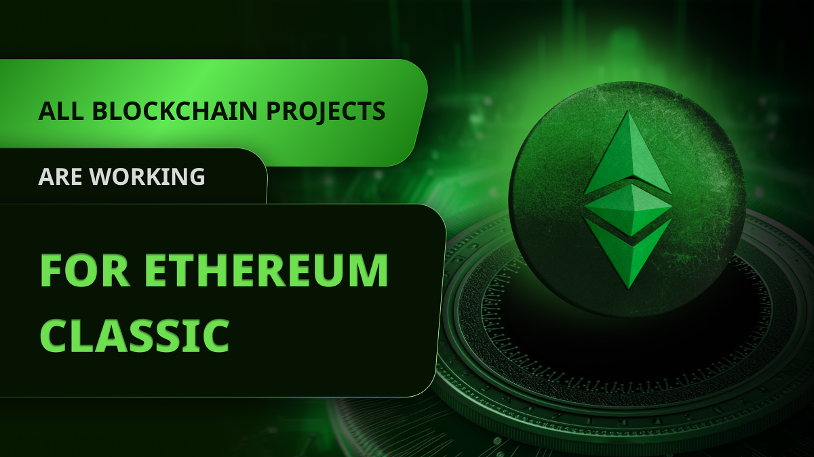
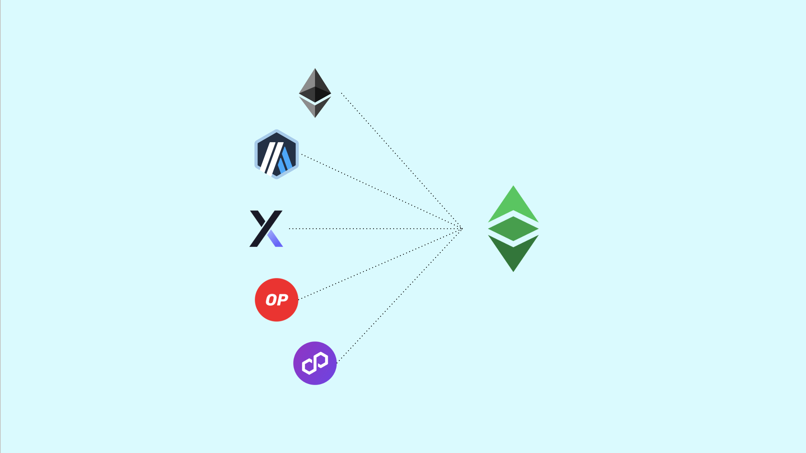

---
**由此收听或观看本期内容:**

<iframe width="560" height="315" src="https://www.youtube.com/embed/KdIyGkCvzXQ" title="YouTube video player" frameborder="0" allow="accelerometer; autoplay; clipboard-write; encrypted-media; gyroscope; picture-in-picture; web-share" allowfullscreen></iframe>

---

在最近一次与以太经典（Ethereum Classic，ETC）[Discord服务器](https://ethereumclassic.org/discord)的互动中，我写信给重要的ETC社区成员@DontPanicBurns，内容如下：

“从某种意义上说，所有其他项目都在为ETC工作（这是我本周将要写的一个主题！）。”

对此，他回答道：

“如果以太坊（ETH）的权益证明（POS）是以太坊，Polygon是以太坊，Optimism是以太坊，以及……L2是以太坊；那么以太经典也是以太坊。ETC的区块空间只是未经审查并由中本聪共识保护的，这是一个毫无疑问的价值主张。”

这就是这篇文章的主题：所有其他项目都在开发最终将迁移到ETC的技术。在接下来的章节中，我将解释为什么。

## ETC就像比特币，但具有智能合约

区块链行业中最重要的发明是基于工作量证明（POW）的[Nakamoto共识](https://ethereumclassic.org/blog/2023-11-30-etc-roof-of-work-course-4-why-pow-based-nakamoto-consensus-is-secure-and-complete)。这就是比特币（BTC）解决互联网货币问题并成为数字黄金的方式。

行业中第二个最重要的发明是使数字黄金具有可编程性的智能合约，或称去中心化应用（dapps）。

ETC基本上是一个类似比特币的POW区块链，因此是数字黄金，但增加了智能合约。因此，ETC是可编程的数字黄金。

从某种意义上说，ETC是BTC哲学与ETH技术的结合。换句话说，是两全其美。

## 权益证明不安全

以太坊和以太经典最初是一个使用POW作为共识机制的网络，但在2016年[它们分裂了](https://ethereumclassic.org/blog/2023-01-26-ethereum-classic-course-6-ethereum-classic-is-the-original-chain)，因为一款名为TheDAO的dapp中发生了一场危机。

自那时起，以太坊采用了“社会共识”哲学来管理其系统，但ETC仍然坚持其保守的“法律即代码”哲学，着重于不可变性和客观性。

由于ETH采取了更宽松的方法，他们已经转向了不太安全且可审查的权益证明共识机制。

这是因为他们相信区块链中的任何错误都可以通过生态系统中的社会共识，或者通过改回2016年的方式来解决。

他们没有意识到的是，让社区做出这些决定正是真正去中心化的区块链试图解决的问题！

## 工作量证明安全但不可扩展

然而，像比特币和ETC这样的POW区块链更安全，但同样也是真实的，为了保证这种安全性，它们必须不太可扩展。

这是因为为了使所有数据完全复制且在所有区块链节点上保持单一，区块大小必须保持较小，而较小的区块大小意味着每秒交易数较少。

由于这些结构性限制但高安全性保证，POW区块链注定成为行业多组件模型的基础组件之一。

## 区块链行业的分层未来

事实上，这些组件将成为行业的构建块，并且这些构建块将组织在不同的层中。

在堆栈的最底层，我们将找到像比特币和ETC这样高度安全的区块链，而在这些区块链之上将有一组第二层（L2）解决方案，这些解决方案将为这些网络带来可扩展性。

在这些可扩展性解决方案之上，开发人员将构建去中心化应用和整个Web3概念的去中心化技术产品和服务。

最终，我们将找到钱包和网络应用等用户界面，用于使用所有这些技术产品和服务。

## 为以太坊建立了许多第二层系统

然而，该行业存在一个谬误，即权益证明系统安全、去中心化和抗审查。

这与事实完全相反，但由于这是该领域普遍接受的知识状态，因此大多数正在建设L2解决方案的项目，如Arbitrum、dYdX、Optimism和Polygon，都在以太坊权益证明区块链上开展工作。

其他项目正在以太坊竞争对手上工作，例如币安智能链、Polkadot、Cardano、Avalanche和Cosmos。

所有这些项目的好处是，它们在设计上非常相似，并且许多这些系统使用以太坊虚拟机（EVM）标准或格式。

## 但所有系统最终将迁移到以太经典

EVM标准或格式是这些虚拟机网络的组件和操作码的基本设计。所有使用诸如GAS系统、账户系统、状态、编程语言等组件。

ETC实际上是最初的未经审查的EVM区块链。因此，它与所有这些解决方案完全兼容。这正是Burns先生在这篇文章开头评论的精髓所在。

当世界最终意识到POS是中心化和可审查的时候，将只需要对所有这些技术进行一些微调，就可以迁移到以太经典，寻求真正的去中心化和未经审查的区块空间。

## 因此所有项目都在为ETC工作

因此，如果绝大多数项目都在以太坊上构建，但以太坊不安全；而ETC是一个完全兼容但安全的区块链；并且将所有解决方案迁移到以太经典只是小事一桩；那么所有项目，从某种意义上说，都在为ETC工作。

以太坊实际上是一个已经停止发展的项目。它是一个中心化的网络，因此它内部已经死亡。只是目前还没有人意识到这一点。就像枯死的树上可能还有一些绿叶使其看起来还活着一样。

比特币就像一个口袋计算器，它除了将BTC从一个地址转移到另一个地址外，并没有其他功能。而且，BTC并不比ETC更好的数字黄金。它们是相同的，因为两者都是工作量证明。

ETC比以太坊更好，因为它是真正的去中心化的。

ETC比比特币更好，因为它是可编程的数字黄金，而比特币只是数字黄金，因此在与dapps一起使用时安全性较低。

我写这篇文章时，ETC价值比以太坊低92倍，比比特币低285倍的原因是人们还没有意识到我在这篇文章中写的内容。

我们只需等待很长时间，直到人们睁开眼睛看到这些事情。

---

**感谢您阅读本期文章!**

了解更多有关ETC，欢迎访问: https://ethereumclassic.org
