---
**由此收听或观看本期内容:**

<iframe width="560" height="315" src="https://www.youtube.com/embed/xhcDobiwrYk" title="YouTube video player" frameborder="0" allow="accelerometer; autoplay; clipboard-write; encrypted-media; gyroscope; picture-in-picture; web-share" allowfullscreen></iframe>

---

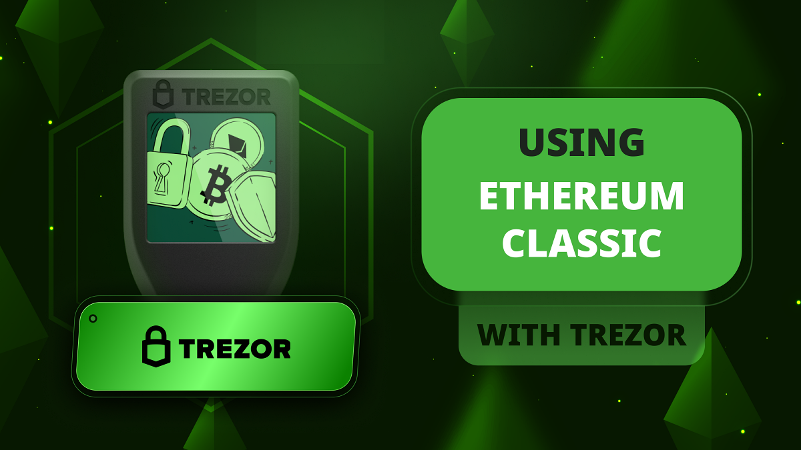

这篇文章中，我们将解释如何使用Trezor Safe 3硬件钱包和桌面应用程序来使用Ethereum Classic (ETC)；如何将ETC币添加到其中，并查看您的第一个ETC地址。

## Trezor硬件和软件组件

Trezor Safe 3是一个硬件钱包，因此要使用它，您需要拥有Trezor Safe 3设备，并在计算机上安装Trezor Suite应用程序。您还需要一张卡来写下您的秘密密码，稍后将对此进行解释。

在本教程中，我们将解释如何设置您的Trezor Safe 3并将Ethereum Classic添加到其中以及在您的计算机上。

我们将在适当的时候展示您的Trezor Safe 3和计算机上的并行操作。

## 1. 在计算机上安装Trezor Suite应用程序

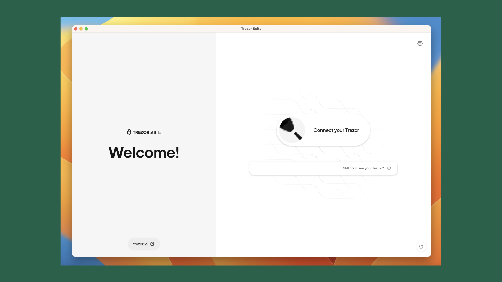

一切都始于硬件钱包和计算机上的Trezor Suite应用程序。要下载该应用程序，您需要转到：

https://trezor.io/start

然后，在您的计算机上打开它。

## 2. 连接您的Trezor Safe 3

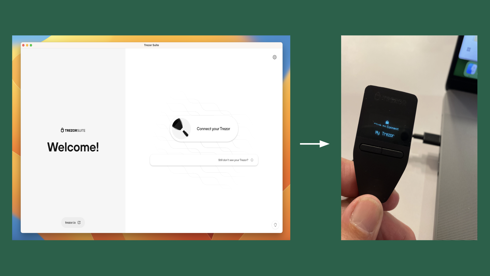

Trezor Suite应用程序将要求您将Trezor Safe 3连接到计算机上。要做到这一点，将提供的电缆连接到设备，然后连接到计算机。当您这样做时，您将看到设备启动，屏幕上将显示“我的Trezor”标语。

## 3. 设备安全检查并设置“我的Trezor”

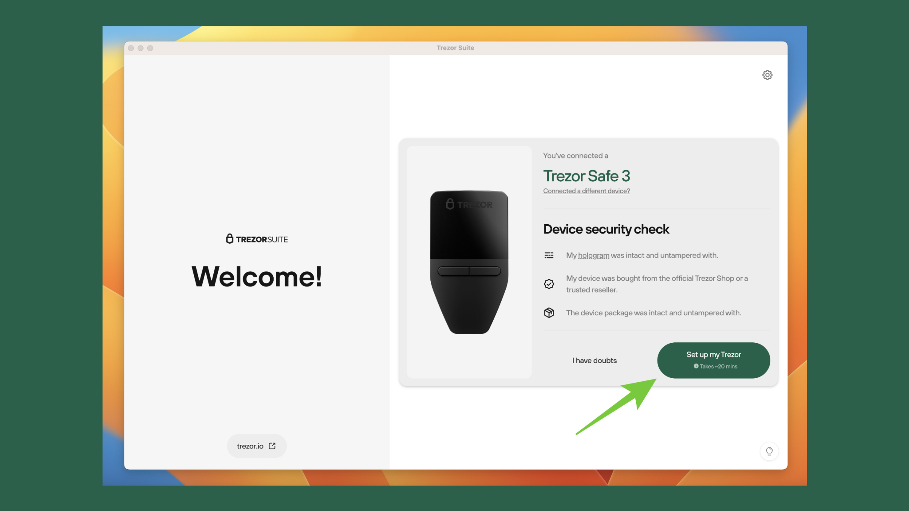

在接下来的屏幕上，Trezor将要求您检查您的设备是否安全。为此，您需要确认您的设备是否带有完整的全息胶带，您是直接从Trezor购买的还是从可信的经销商购买的，并且在您收到设备时设备包装是否完整。

如果您确认了所有这些事项，则点击“设置我的Trezor”按钮继续流程。

## 4. 安装固件

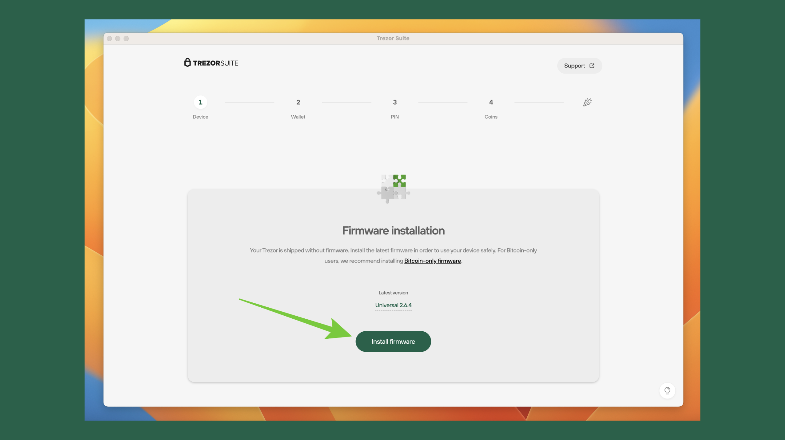

在继续之前，Trezor Suite将要求您将固件安装到Trezor Safe 3中。出于安全原因，它实际上是没有固件的，固件是管理设备的软件。

要安装固件，请按“安装固件”。

## 5. 设备检查

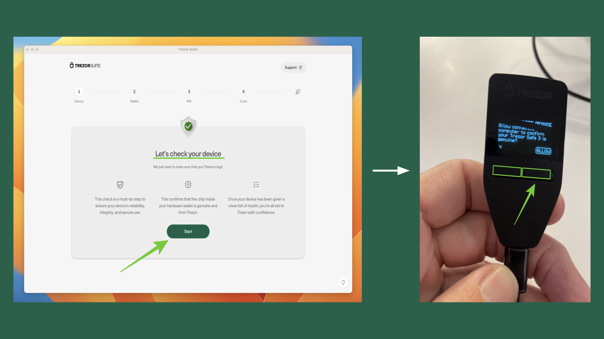

在这个时刻，Trezor将对您的Trezor Safe 3进行另一次安全检查。这一次不是检查您是否完整地收到了设备，以及它是否安全地交付。这一次是为了检查您连接的和安装的设备是否设置良好并运行正常，并且里面的芯片是真正的Trezor原装部件。

按“开始”执行此安全检查。然后，在您的设备上按下“允许”选项下面的按钮，如本节中的突出显示图像所示。

## 6. 创建新钱包

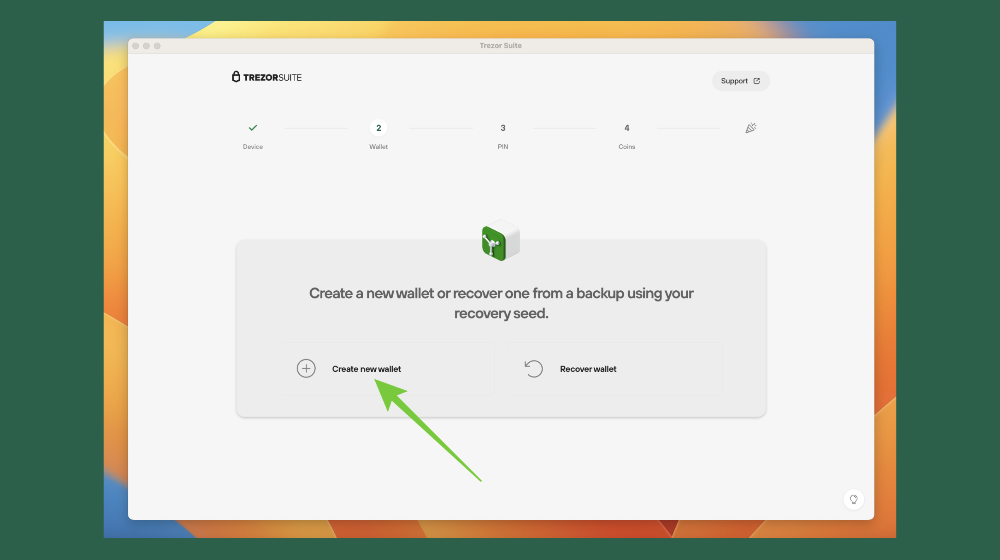

安全检查完成后，Trezor Suite将要求您创建新钱包或使用您的恢复种子恢复现有钱包。

对于本教程，我们将选择“创建新钱包”路径。

## 7. 标准种子备份

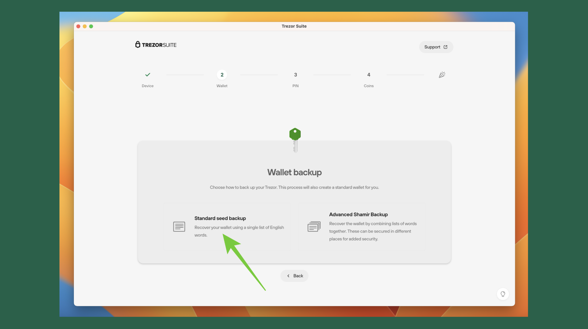

在Trezor Safe 3上创建新钱包的选项是创建标准密码或种子短语或高级的Shamir种子。在Shamir选项中，您会得到可以安全存放在不同地方的单独单词组，并且然后将它们组合在一起以恢复您的钱包。

对于本教程，我们选择了“标准种子备份”方法。

## 8. 同意在Trezor设备上创建钱包备份

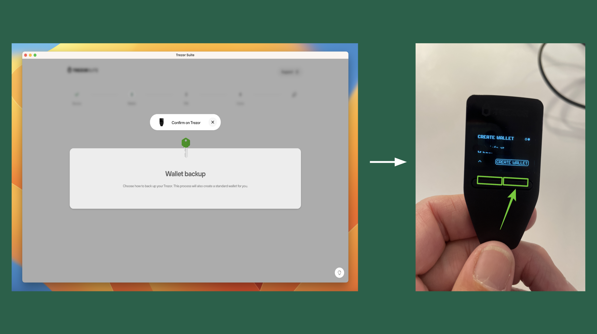

接下来，Trezor Safe 3将要求您同意在您的设备上创建新钱包种子短语。为此，请按照设备上突出显示的图像中的“创建钱包”按钮。

## 9. 创建备份

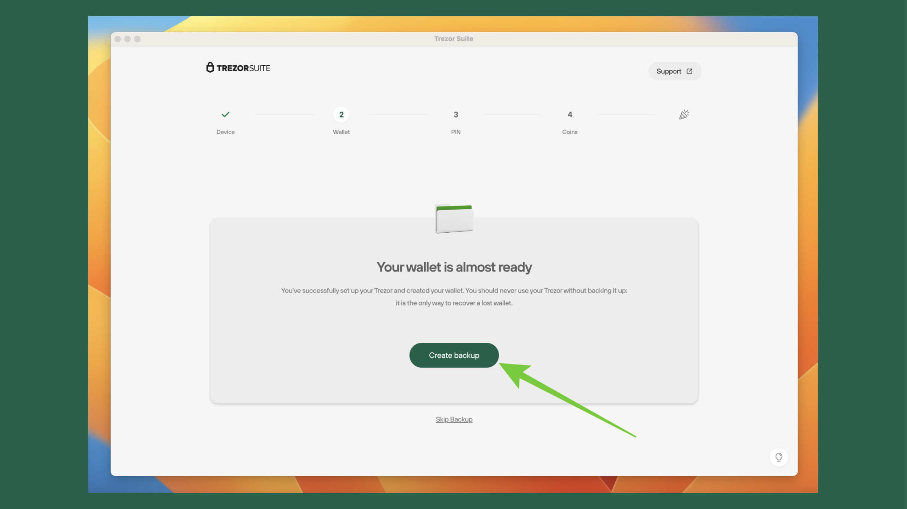

现在，Trezor准备创建用于备份您的钱包的种子短语。

在您的计算机上按“创建备份”。

## 10. 开始备份

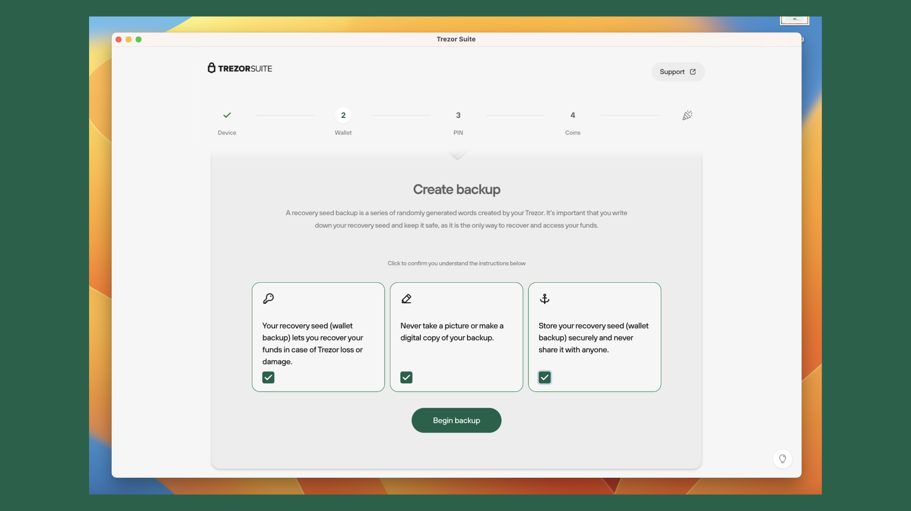

但是！还有更多的安全问题！

现在，您要创建用于备份您的钱包的12个单词种子短语，Trezor只是想确保您理解这个过程的工作原理。他们将要求您确认您理解与种子短语备份过程相关的三个声明。

当您阅读了这些声明并选中了复选框后，然后按“开始备份”。

## 11. 同意，理解，并显示单词

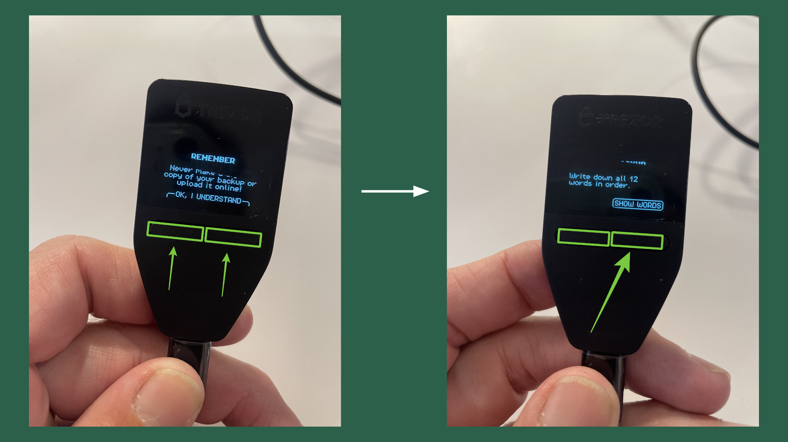

在下一步中，您需要转到您的Trezor Safe 3并同意如何保护您的12个单词。为此，请按照本节中突出显示的图像中的两个按钮上的“OK，我明白”来按下设备上的两个按钮。

接下来，Trezor Safe 3将要求您是否要显示这些单词。按“显示单词”开始该过程。

## 12. 滚动单词，写下它们，并确认

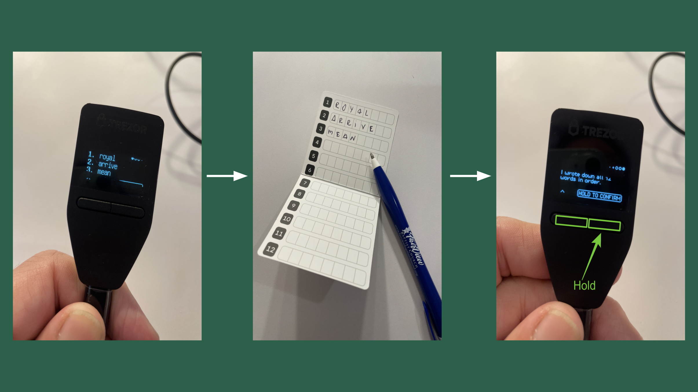

现在，您需要在Trezor Safe 3设备上查看您的单词，将它们写在提供的卡片上，并向Trezor确认您已执行这些步骤。

完成该过程后，请在设备上按“按住确认”以进入下一步。

## 13. 设置PIN

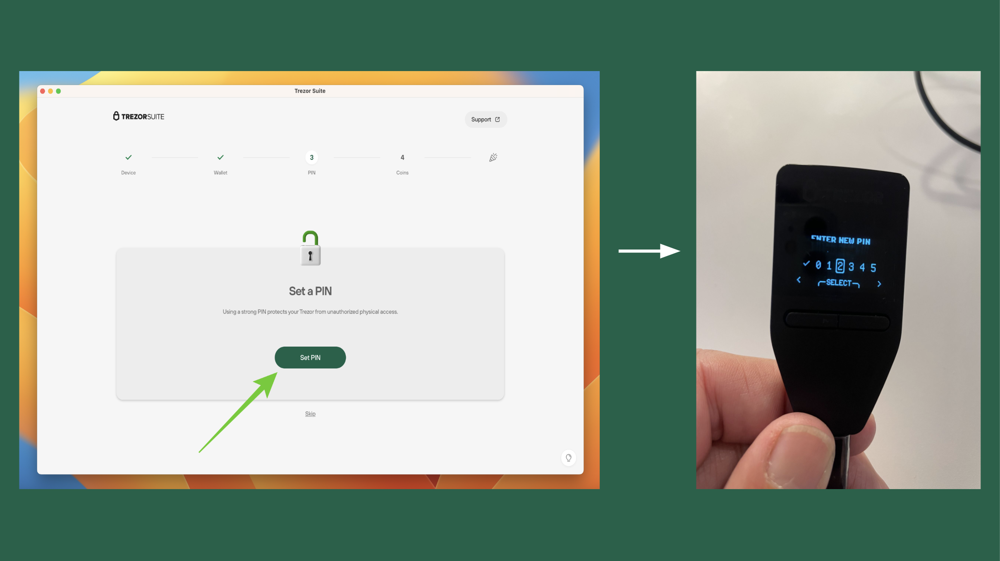

在下一步中，您需要设置PIN码以从现在开始使用您的Trezor Safe 3。此PIN码用于每次您要发送或接收ETC或其他加密货币时打开设备并签署交易的操作。

在您的计算机上的Trezor Suite应用程序中，点击“设置PIN码”，然后在您的设备上选择一个PIN码，如指示所示。

## 14. 激活ETC！

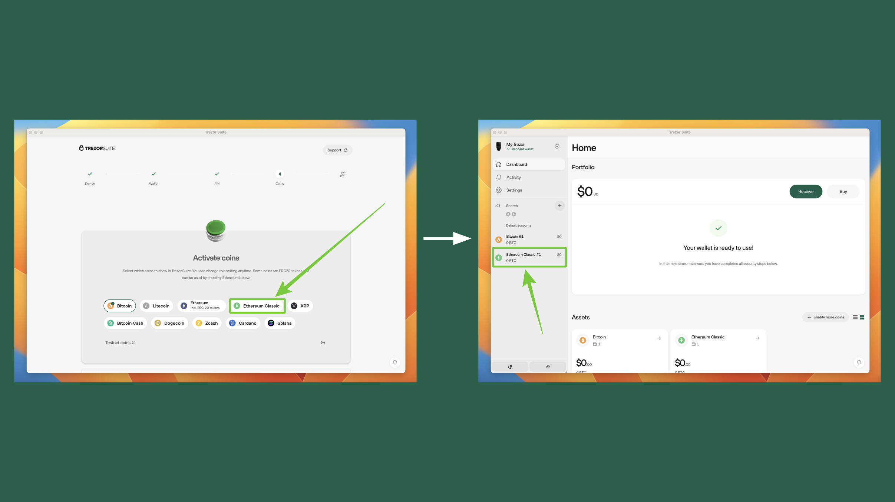

最后，一旦您的Trezor Safe 3和Trezor Suite设置并同步完成，那么就是将ETC作为一种币添加到您的设备的时候了。要做到这一点，请转到您的计算机上的Trezor Suite应用程序，并从可能的币种列表中选择ETC。

在下一个屏幕上，您将看到比特币作为默认币种，下面是ETC。恭喜！您现在拥有一个配置为使用ETC的Trezor Safe 3！当您点击ETC资产时，您将在下一页中看到您的ETC地址。

在未来的指南中，我们将解释如何在您的Trezor上发送和接收ETC，以及其他有用的功能。

---

**感谢您阅读本文！**

要了解更多关于ETC的信息，请访问：https://ethereumclassic.org
