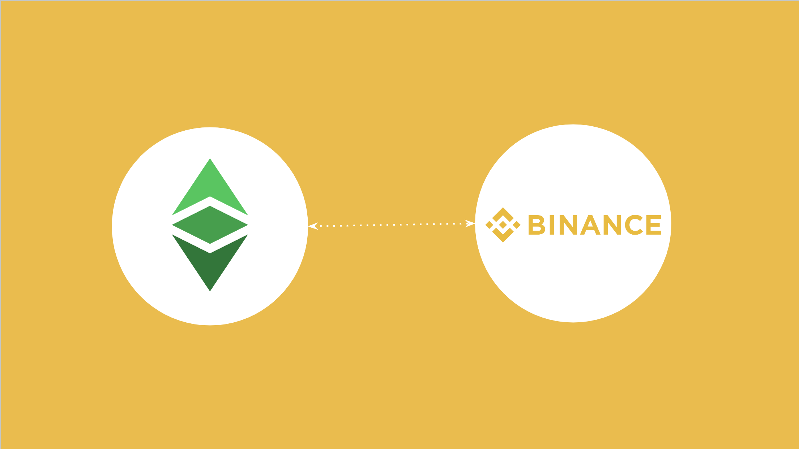
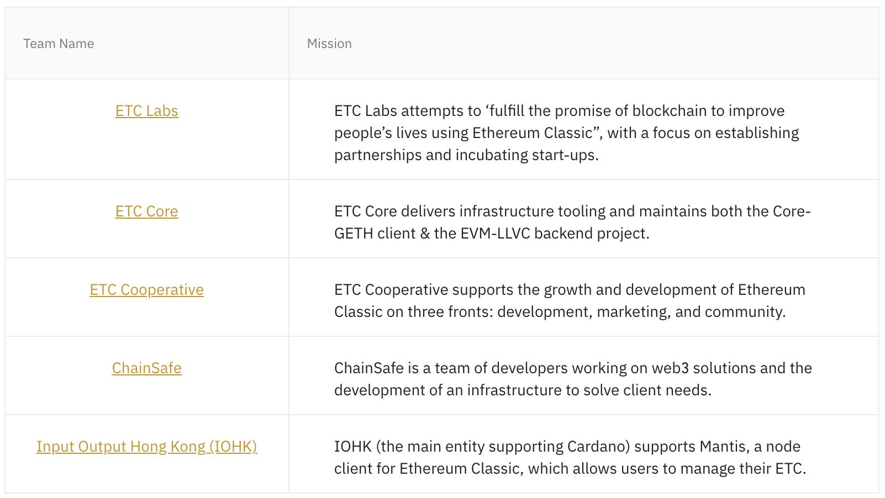

币安交易所发布了一篇关于以太经典（Ethereum Classic）的文章，标题和标签为“以太经典（ETC），下一代智能合约和去中心化应用平台”，链接如下：

https://www.binance.com/en/research/projects/ethereum-classic

这篇文章首先介绍了ETC的概述，然后分为5个部分。

令我们高兴的是，大部分文章都经过了良好的研究，但是有些部分存在错误或常见误解，我们希望对此进行澄清。

在接下来的部分中，我们将对币安的观点进行讨论，提出更正的短语，并为每个更正添加我们的理由。

## 部分：概述

**币安观点：**

- 以太经典是一个支持智能合约的去中心化网络。它由Vitalik Buterin于2013年创建。在2016年DAO黑客事件之后，以太坊社区的一些成员拒绝了通过硬分叉来撤销交易（并将资金退还给DAO参与者）的想法，导致了以太坊和以太经典之间的分裂。
- 以太经典在区块1,920,000（2016年7月20日）时与以太坊分道扬镳，保留了网络的原始版本，加强了区块链的不可变性核心特征。自2015年ICO以来，以太坊一直依赖于工作证明（PoW）；以太经典与其共享早期历史，首个（通用）区块于2015年7月挖掘。
- 像以太坊一样，该网络由一种名为以太（经典）的加密货币提供支持。它包括一个开源的、全球化的去中心化计算基础设施，执行称为智能合约的程序。
- 同样，以太经典基于账户模型记录状态变化。它依赖于以太坊虚拟机（EVM），具有两种类型的地址：外部拥有地址（EOAs）和部署在EVM上的合约地址。
- 截至2020年3月，以太经典的哈希率远低于以太坊的，链上活动水平也低于以太坊。随着以太坊计划放弃工作证明（引入ETH 2.0的PoS），以太经典计划作为不可变的工作证明版本的以太坊持续存在。

**我们的更正：**

- 以太经典是一个支持智能合约的去中心化网络。它由Vitalik Buterin于2013年创建。在2016年DAO黑客事件之后，以太坊社区的一些成员拒绝了通过硬分叉来撤销交易（并将资金退还给DAO参与者）的想法，导致了以太坊和以太经典之间的分裂。
- 以太坊（ETH）在区块1,920,000（2016年7月20日）时与以太经典（ETC）分道扬镳，将资金退还给原始所有者，而ETC决定保留网络的原始版本，加强了区块链的不可变性核心特征。自2015年启动以来，以太经典一直依赖于工作证明（PoW），而以太坊则迁移到了权益证明（PoS）；ETC和ETH共享早期历史，首个（通用）区块于2015年7月挖掘。
- 像以太坊一样，该网络由一种名为以太（经典）的加密货币提供支持。它包括一个开源的、全球化的去中心化计算基础设施，执行称为智能合约的程序。
- 同样，以太经典基于账户模型记录状态变化。它依赖于以太坊虚拟机（EVM），具有两种类型的地址：外部拥有地址（EOAs）和部署在EVM上的合约地址。
- 截至2024年3月，以太经典的哈希率在以太坊迁移到权益证明（POS）后增加了10倍，而链上活动水平低于以太坊。

**理由：**

币安这一部分的第一个要点是正确的。

我们更改了第二个要点，以显示以太坊是与以太经典分道扬镳的，而不是相反的情况。

以太经典是原始未篡改的区块链，其账户和智能合约自始至终未经触碰且不可变。那个通过手动修改账户和余额从主网中分离出来的是以太坊。

我们还将ICO一词替换为“启动”，因为以太坊和以太经典并未进行ICO，而是原始统一系统就像任何网络一样启动，只需运行一些初始节点。

混淆之处在于Vitalik Buterin确实在前一年进行了一次众筹，用于资助以太坊的开发，但这并不是ICO，ICO是在2017年由以太坊区块链及其ERC-20代币标准精确创建并广泛使用的。

以太经典至今仍然是一个工作证明（POW）的区块链，并将在可预见的未来继续存在。以太坊已经迁移到了权益证明（POS），这种方式明显不够安全。

截至2024年3月，以太经典的哈希率在以太坊迁移到POS后增加了10倍，而链上活动水平低于以太坊。

## 第1节：以太经典是什么（ETC）？

**币安声明：**

自2016年分叉以来，以太经典和以太坊有许多相似之处：

- 以太经典是一个开源的、全球化的去中心化计算基础设施，执行被称为智能合约的程序。
- 以太经典的供应是预挖的（7200万）。其中，6000万在2015年的首次代币发行（ICO）中出售。
- 它的工作证明（PoW）算法是Ethash，最初设计用于防止ASIC挖矿。区块时间目标为约15秒（最大区块大小为150万gas）。挖矿奖励以固定速率支付4个ETC（与以太坊的2个ETH相比），但将来会降至3.2个ETC（在第1000万个区块时）。
- 以太经典是（准）图灵完备的，但每个交易都需要gas，价格波动基于实时带宽使用情况。因此，交易费用是存储需求、带宽使用和计算复杂性的函数。Gas用于防止程序的无限执行；它引入了一个与交易的最大费用相等的执行停止器。

**我们的更正：**

自2016年分叉以来，以太经典和以太坊有一些相似之处，但自从以太坊的“合并”后，某些部分有显著的不同：

- 以太坊和以太经典是开源的、全球化的去中心化计算基础设施，执行被称为智能合约的程序。
- 由于它们最初是同一网络，因此以太坊和以太经典的供应都是预挖的，都是7200万ETH和ETC。在这些预挖的代币中，6000万在2014年的一次众筹中出售。
- 以太经典的PoW算法是ETCHash，最初设计用于防止ASIC挖矿。区块时间目标为约13秒（默认区块大小为800万gas）。以太坊的共识机制于2022年9月15日从PoW更改为PoS。
- 以太经典的挖矿奖励以固定速率支付2.56个ETC，但每500万个区块减少20%。
- 以太经典是（准）图灵完备的，但每个交易都需要gas，价格波动基于实时带宽使用情况。因此，交易费用是区块空间需求、带宽使用和计算复杂性的函数。Gas用于防止程序的无限执行和垃圾信息；它引入了一个与交易的最大费用相等的执行停止器。

**理由：**

自2016年分叉以来，以太坊和以太经典都是EVM链，因此非常相似，但自从迁移到PoS以后，ETH在某些方面与众不同。

由于它们最初是同一链，因此ETH和ETC的预挖是相同的，都是7200万，因为它们最初是同一条链。

以太坊和以太经典在2014年进行了众筹，而不是2015年进行的ICO。然后，在2015年网络启动时，6000万以太分配给了众筹投资者。

ETC的挖矿算法已更改为ETCHash，这对原始Ethash进行了一些微小的更改，使其独特并保护ETC免受51%攻击。

ETC的区块时间目标为13秒，而不是15秒。

ETC的GAS限制目前默认为800万，而不是150万。

以太坊的共识机制于2022年9月15日从PoW更改为PoS。

ETC的挖矿奖励为每个区块支付2.56个ETC，但这会每2年减少20%。

ETH和ETC都使用GAS来防止程序的无限执行和垃圾信息。

## 第2节：以太经典的核心特点

本节中解释的技术细节对于以太经典是正确的，因为以太坊和以太经典共享相同的机械设计，即EVM格式。

然而，以太坊迁移到了权益证明，这个解释应该添加到关于ETC的币安文章中。

也许这句话“这些核心特点与以太坊相似。点击这里阅读关于以太坊的完整报告”应该删除。

除此之外，本节内容都是正确的！

## 第3节：经济学和供应分配

**币安声明：**

以太经典的经济学完全依赖于工作证明，这是在2015年的原始ICO之后进行的。

以太坊的ICO是在2015年上半年进行的，售出了6000万个以太（用比特币收集）。

区块挖掘基于Ethash函数，它本身依赖于Keccak。Ethash旨在防止ASIC参与，因为它具有内存硬度等特征。然而，它被操纵了，区块大多数被ASIC设备挖掘了几年。

与以太坊不同，以太经典的总供应量是有上限的，并且通货膨胀率随时间递减。其总最大供应量将是约210-230百万个ETC。

**我们的更正：**

以太经典的经济学完全依赖于工作证明，这是在2015年的原始发布之后进行的。

当它们是同一链时，以太坊和以太经典的发布是在2015年，其中包括了7200万ETH和ETC的预挖，其中6000万对应于在前一年参与了众筹活动的投资者。

区块挖掘基于ETCHash函数，它本身依赖于Keccak。ETCHash旨在防止ASIC参与，因为它具有内存硬度等特征。然而，它被操纵了，区块大多数被ASIC设备挖掘了几年。

与以太坊不同，以太经典的总供应量是有上限的，并且通货膨胀率将每两年或500万个区块递减20%。其总最大供应量将是约210,700,000个ETC。

**理由：**

ETH和ETC没有进行ICO，而是在2014年进行了众筹活动，网络的发布是在2015年。这次发布包括了对应于原始众筹活动的6000万ETH和ETC。

ETC自2020年11月以来使用ETCHash挖矿算法。

ETC的通货膨胀率将每500万个区块递减20%。其总最大供应量将是约210,700,000个ETC。

## 第4节：项目团队

以太经典的项目团队现在是ETC合作社。其职能描述是正确的。

查看ETC合作社团队的链接是这个：

[https://etccooperative.org/people](https://etccooperative.org/people)

## 第5节：附加资源和参考资料

这个带有参考文献的部分可以保持不变，因为本文提出的更改的所有信息都可以在 [https://ethereumclassic.org](https://ethereumclassic.org) 网站找到。

---

**感谢您阅读本文！**

要了解更多关于ETC的信息，请访问：[https://ethereumclassic.org](https://ethereumclassic.org)
