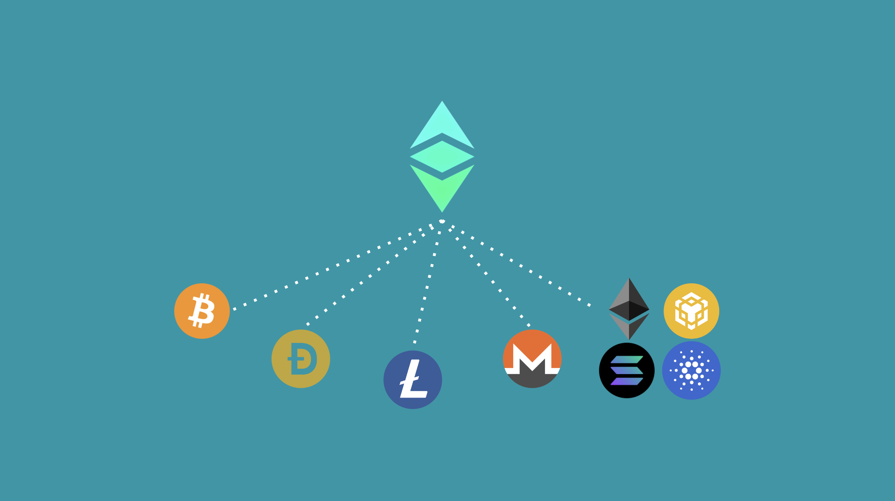

---
**You can listen to or watch this video here:**

<iframe width="560" height="315" src="https://www.youtube.com/embed/BWb6gd924iA" title="YouTube video player" frameborder="0" allow="accelerometer; autoplay; clipboard-write; encrypted-media; gyroscope; picture-in-picture; web-share" allowfullscreen></iframe>

---

## 1. Ethereum and Ethereum Classic Were Originally One Proof of Work Blockchain

When Bitcoin (BTC) was created it was meant to have smart contracts inside its proof of work (POW) environment.

In 2013, Vitalik Buterin came up with the idea of how to integrate smart contracts to a POW blockchain but it was not possible in Bitcoin because of its technical design.

This is how Ethereum (ETH) was originated. Mr. Buterin put together a team, they did a crowdsale to finance development, and they built a blockchain from scratch that was launched in 2015.

At this time, there was no “Ethereum and Ethereum Classic (ETC)” as the whole community was united in one project and there was only one smart contracts blockchain.

## 2. Then Ethereum Separated From Ethereum Classic

In 2016, there was a controversy in the ETH community due to a hack to a dapp called The DAO. 

At that moment ETH decided to reverse the hack, while a small group of the community decided to continue the original untampered chain, which was subsequently called Ethereum Classic with the ticker symbol ETC.

There is a common misconception in the market that ETC is a fork of ETH, but the truth is the opposite: ETH is a fork of ETC as they changed the rules of the network and reversed the funds of the hack, breaking immutability. But, ETC did no changes, thus remaining as the original untampered chain.

## 3. Code Is Law vs Social Consensus

Ever since the separation between Ethereum and Ethereum Classic a wide gap between them has emerged.

ETC adopted a “Code Is Law” philosophy and ETH a “Social Consensus” one.

Social Consensus means exactly what they did in 2016: That whenever there is a controversy or problem in the chain, then the community, which is supposed to be all knowing, ethical, and good, will correct such problems.

But, this is exactly the opposite of what blockchains are supposed to be! This is why ETC adopted a philosophy that it will be as objective as possible and that anything inside the blockchain will be immutable. Any problems between humans must be solved in the legal system, not by tampering with the chain.  

## 4. Proof of Stake and Saving the Trees

Later in 2016, Vitalik Buterin [wrote an essay](https://medium.com/@VitalikButerin/a-proof-of-stake-design-philosophy-506585978d51) where he explained that he liked proof of stake (POS) rather than POW because:

- POW killed trees
- POW had a symmetrical 1:1 attacker to defender ratio

Well, the truth is that POW is very difficult to attack, and the only possible attack is double spending which is increasingly difficult as users can protect themselves by waiting more confirmations, and the transparency of blockchains deters attackers from doing so as they may get caught very easily.

This leaves POS with no advantages other than saving trees, which is a fallacy in itself, because by not being POW, POS networks actually stop contributing to the migration of electricity production to renewable energy, [as POW does](https://pubs.acs.org/doi/10.1021/acssuschemeng.2c06077#)!

## 5. Proof of Stake Is Not Even Scalable

Another great advantage that the Ethereum Foundation promoted about POS was that it would provide much more scalability because its design supposedly enabled the fragmentation of the database, therefore the processing in parallel of a much greater number of transactions.

Ethereum could process between 10 and 20 transactions per second at the time, but the Ethereum Foundation talked about processing thousands of transaction per second if they used POS.

The truth is that now Ethereum is a POS chain, and may only process between 20 to 30 transactions per second!

This means POS is not even scalable. 

## 6. The Ethereum Migration to Proof of Stake

Because of its “Social Consensus” philosophy; that assumes that the community will solve any controversies that may arise in the system rather than keeping it immutable and having people solve their disputes elsewhere; and due to the abstract objectives that the ETH community had of saving the trees, achieving scalability, and reducing the issuance of ETH; Ethereum migrated to POS in September 15 2022.

At the time, Ethereum was the second largest blockchain in the world and all other smart contract blockchains of relevance in the rankings were already POS as they were seeking to frontrun Ethereum by supposedly becoming scalable and environmentally friendly first.

## 7. Ethereum Classic Became the Largest In the World

When Ethereum migrated to POS, ETC had a hashrate of around 20 TH/s but after the migration it jumped to more than 200 TH/s, and subsequently stabilizing, at the time of this writing, at around 166 TH/s.

Nevertheless, just by remaining as a POW coin, ETC became the largest smart contracts blockchain in the world. All the other programmable chains above in the rankings are POS, [therefore centralized and insecure](https://ethereumclassic.org/blog/2023-12-27-ethereum-classic-at-scale-is-decentralized-ethereum-is-centralized). It is just a matter of time until the market realizes this, and ETC will dominate the segment.

## 8. Applications in ETC Are the Most Secure Apps in the World

Ethereum Classic is the environment where the most secure applications in the world will exist because it is a proof of work blockchain, it has a fixed monetary policy, it is programmable, fully replicated, composable, and is the largest one in the world [with this combined design](https://ethereumclassic.org/blog/2023-12-05-the-7-keys-to-ethereum-classic-success).

These attributes in the same integrated system provide the highest level of decentralization, thus trust minimization, thus security to any application hosted in it.

---

**Thank you for reading this article!**

To learn more about ETC please go to: https://ethereumclassic.org
