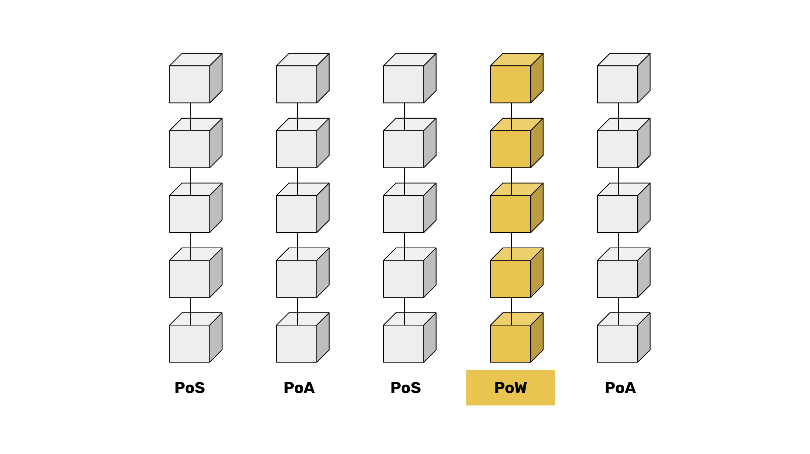

---
**You can listen to or watch this video here:**

<iframe width="560" height="315" src="https://www.youtube.com/embed/0ZxM_i6vLT0" title="YouTube video player" frameborder="0" allow="accelerometer; autoplay; clipboard-write; encrypted-media; gyroscope; picture-in-picture; web-share" allowfullscreen></iframe>

---

In the previous class, 20, we talked about integrating Bit Gold into Ethereum Classic (ETC) to dispel any doubts that the money is sound.

Bit Gold was the original idea that eventually gave rise to Bitcoin. Bit Gold are the block hashes buried in the blocks that are not used as money but as a protection wall.

In this class, 21, we will explain that if a cryptocurrency network is not proof of work (POW), then it is not a blockchain.

A batch of data that is hashed with no work is insecure. A batch of data that is hashed with POW is secure.

Proof of Stake (POS) and Proof of Authority (POA) networks are made of cardboard. POW blockchains are made of Bit Gold.

## A Data Batch

In computer science, a selection of records from a set of data is called a "batch". A batch is simply information and, in the internet, information is easy to produce, replicate, and modify.

In traditional systems batches of data are protected from unwanted production, replication, and modification by isolating them, keeping them in proprietary servers, and making access by intruders difficult with cryptography.

However, in decentralized public blockchains, where the ledger is unencrypted, transparent, and accessible by anyone, there is nothing protecting the batches of data that contain new transactions and smart contracts.

This is why POW was used on blockchains to protect these batches.

## A Data Block

When a batch of transactions in a proof of work blockchain is grouped and then sealed with a proof of work stamp or hash, then it may be called a "block". 

This is because now the batch of data is secure.

The way this works is that miners in POW blockchains constantly receive new transactions and group them in batches. When they do this, they add to the batches the cryptographic stamp of the previous block, a timestamp, and a random number called a nonce. When they have this packet of information ready, then they do a lot of computational work to produce the hash or stamp for that packet or batch of data. When this hash or stamp is produced and added to the packet of data, then that batch is a block proper.

So now, the question is why is a POW block secure?

## Block Security Features

If a batch of data is not sealed with POW, then it remains just an unprotected batch of transactions.

It is more or less like having a pallet of apples in a port laid on the concrete waiting to be loaded into a container. The pallet of apples is like a batch of data, it is exposed to people and the environment, and the apples will go bad or be stolen unless they are moved into a container and secured with a strong lock.

In the same way, sealed blocks with cryptographic stamps or hashes are protected because the only way to modify them is by re-doing all the work again.

This is the key to data security in blockchains, that even if all the blocks of data are exposed to the public, they are extremely difficult to tamper with because the only way of modifying them is by accumulating an enormous computing base, while spending an enormous amount of money in electricity to do so.

## Proof of Stake and Proof of Authority Blocks Are Made of Cardboard

Batches of data that are not sealed and that required no work to be built can easily be re-hashed with no effort.

We call these types of “blocks” as if made with cardboard.

In POS and POA networks, the stakers or node operators can get the data and change it as they will, very easily. They can go to the genesis block and re-do the whole blockchain with very little effort.

This is a very vulnerable position for a blockchain. 

As these kinds of networks have staking elites or trusted nodes, such as banks in the case of some POA systems, they can easily be captured by governments or interest groups and be managed as traditional systems, with censorship, KYC and AML controls, and restrictions based on politics.

## Proof of Work Blocks Are Made of Bit Gold

As we said before, the blocks made with work are very costly to re-hash or tamper with because all the work must be done all over again. The stamps require a lot of work, very much as gold requires a lot of work to be extracted from nature.

This is why we say that blocks made with work are made of [Bit Gold](https://ethereumclassic.org/blog/2024-03-28-etc-proof-of-work-course-20-integrating-bit-gold-in-ethereum-classic). This makes them extremely difficult to falsify. 

Both are batches of data, but "blocks" are the ones that were hashed with extra work so it would be very costly to change them arbitrarily.

## “Blockchains” Are Only Those That Use Proof of Work

The person to name the batches of data “blocks” in the first cryptocurrency network was the creator of Bitcoin and inventor of the whole system, Satoshi Nakamoto.

In the [Bitcoin white paper](https://bitcoin.org/bitcoin.pdf) he made an analogy of blocks of information stamped in a timestamp server with blocks of information hashed with proof of work, and he named them “blocks”.

To our knowledge, this was the first time this kind of data batches were named “blocks”.

It is possible that Mr. Nakamoto used this term because, similar to a block of concrete, or just because of its strong sound onomatopoeically, it fit the description he wanted to give to the POW stamped blocks in Bitcoin.

All other systems that do not use POW are not blockchains because their batches of information are not secured by work (and their technologies are truly archaic).

---

**Thank you for reading this article!**

To learn more about ETC please go to: https://ethereumclassic.org
